# API 参考

## 目录
1. [简介](#简介)
2. [项目结构](#项目结构)
3. [核心组件](#核心组件)
4. [架构总览](#架构总览)
5. [详细组件分析](#详细组件分析)
6. [依赖关系分析](#依赖关系分析)
7. [性能考量](#性能考量)
8. [故障排查指南](#故障排查指南)
9. [结论](#结论)
10. [附录](#附录)

## 简介
本文件为 OpenClaw 的完整 API 参考，覆盖以下方面：
- WebSocket API 规范：连接握手、消息帧格式、事件类型与实时交互模式
- HTTP API 接口：REST 风格端点、URL 模式、请求/响应模式与认证方法
- CLI 命令参考：可用命令、参数选项与使用示例
- 配置参数参考：配置键、默认值与示例配置
- 协议特定示例、错误处理策略、安全与速率限制
- 常见用例、客户端实现指南与性能优化技巧
- 调试工具与监控方法
- 已弃用功能的迁移指南与向后兼容性说明

## 项目结构
OpenClaw 的 API 相关能力主要由以下模块构成：
- 网关协议与服务端：定义 WebSocket 帧、方法与事件，提供服务端处理逻辑
- 客户端 SDK：封装连接、认证、事件回调与关闭码描述
- 浏览器路由分发：基于路径与方法的路由注册与分发
- 插件 HTTP 注册：插件可动态注册 HTTP 路由
- CLI 参数解析：命令行参数提取与校验
- 配置系统：认证配置、默认值与运行时覆盖
- 文档与代码生成：TypeBox 作为协议单源真相，驱动验证、导出与 Swift 代码生成

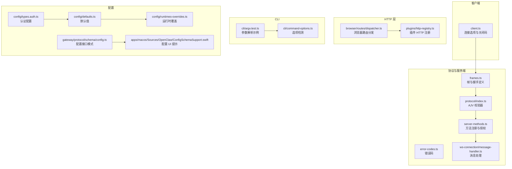

## 核心组件
- WebSocket 协议与帧模型：定义连接握手参数、握手成功响应、请求/响应/事件三类帧，以及错误形状与协议版本策略
- 服务端方法注册与授权：聚合核心方法处理器，按客户端权限进行授权检查
- 客户端 SDK：提供连接选项、事件回调、关闭码语义化提示
- HTTP 路由与插件注册：支持浏览器路由分发与插件动态注册 HTTP 路由
- CLI 参数解析：提供参数提取、正整数校验与显式来源判断
- 配置系统：认证配置、默认值注入、运行时覆盖与配置模式导出

## 架构总览
下图展示从客户端到服务端的典型交互流程，包括握手、心跳事件与方法调用。

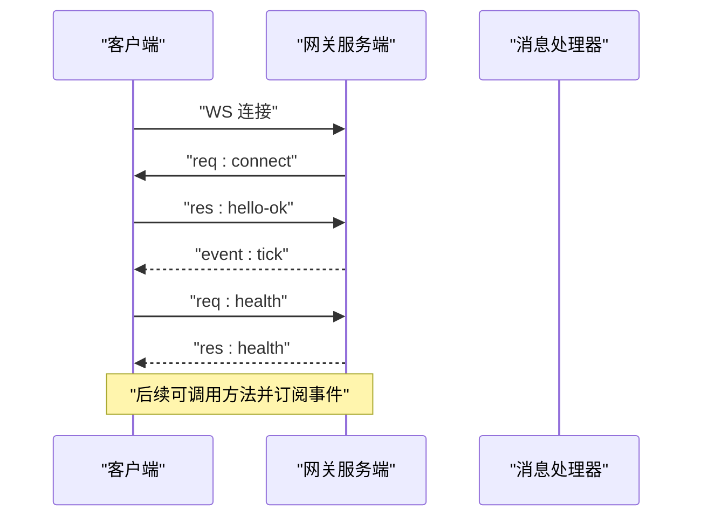

## 详细组件分析

### WebSocket API 规范
- 连接处理
  - 客户端必须先发送连接请求帧，包含最小/最大协议版本、客户端标识、设备与权限等信息
  - 服务端返回握手成功响应，包含协议版本、服务器信息、特性列表、快照、策略与可选认证令牌
  - 握手成功后，服务端推送心跳事件，周期由策略中的心跳间隔决定
- 消息格式
  - 请求帧：包含类型、唯一 ID、方法名与可选参数
  - 响应帧：包含类型、对应请求 ID、布尔结果、成功载荷或错误形状
  - 事件帧：包含类型、事件名、可选序列号与状态版本
- 错误形状
  - 包含错误码、消息、细节、是否可重试与重试等待时间
- 实时交互模式
  - 心跳事件用于保活与同步
  - 事件帧可携带状态版本，便于客户端增量更新

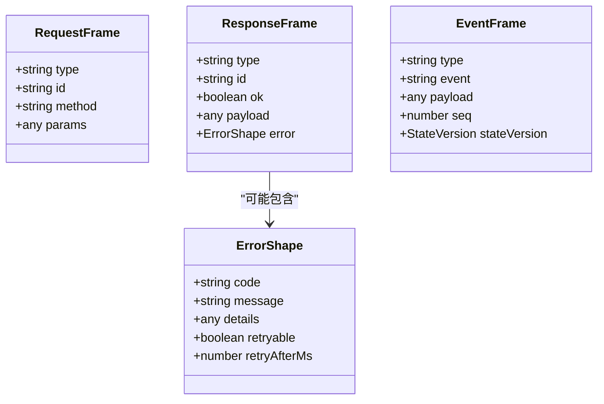

### HTTP API 接口
- 浏览器路由分发
  - 支持 GET/POST/DELETE 方法注册，路径编译为正则匹配，参数名提取用于路由参数绑定
  - 未匹配到路由时返回 404 与错误体
- 插件 HTTP 注册
  - 插件可注册自定义 HTTP 路由，支持规范化路径与重复注册检测
  - 返回注销函数以便动态移除路由

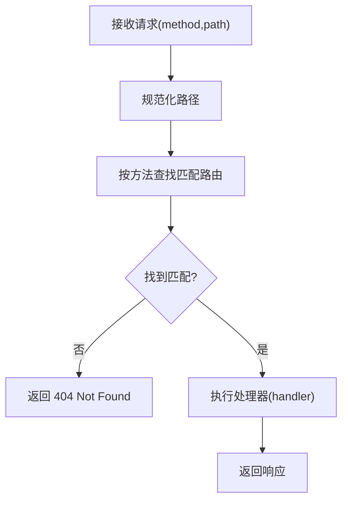

### CLI 命令参考
- 参数解析与校验
  - 支持带等号与缺失值的标志解析
  - 支持详细级别标志（如 `--verbose`/`--debug`）
  - 正整数标志值解析，非法值返回未定义
- 选项来源检测
  - 判断选项是否来自 CLI 显式传入，便于区分默认值与用户覆盖

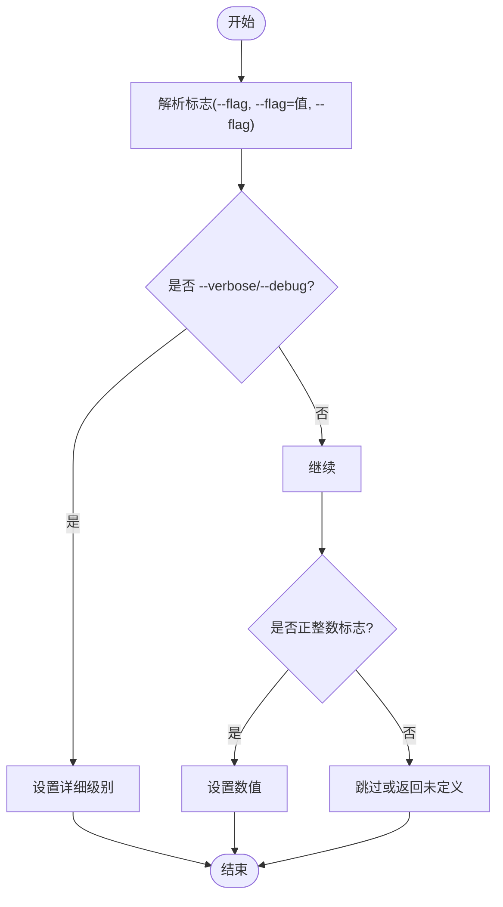

### 配置参数参考
- 认证配置
  - 支持多种凭证模式：静态 API Key、可刷新 OAuth 凭证、静态 Bearer Token
  - 支持冷却策略：默认与按提供商的计费回退小时数、上限与失败窗口
- 默认值注入
  - 对代理并发与子代理并发等字段进行默认值注入，确保配置完整性
- 运行时覆盖
  - 支持通过路径定位覆盖配置项，提供移除覆盖的能力
- 配置模式导出
  - 导出配置模式与 UI 提示，包含标签、帮助、分组、顺序、敏感性与占位符等
- macOS 配置 UI 提示
  - 支持配置路径段、UI 提示结构与排序、高级设置标记与敏感字段

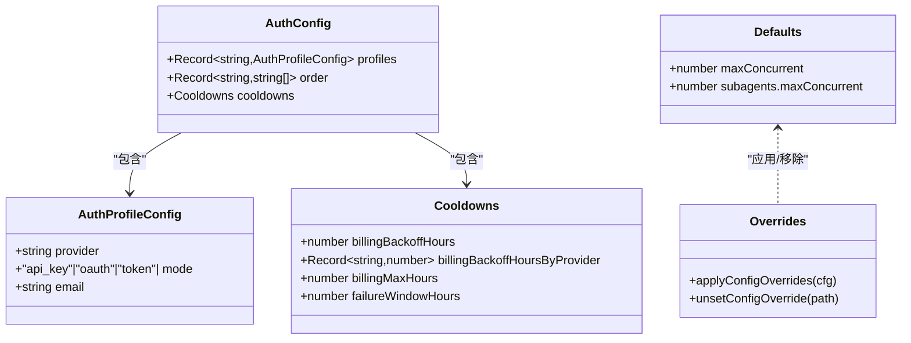

### 方法与事件（服务端）
- 方法注册与授权
  - 核心方法处理器集中注册，按客户端权限进行授权检查
  - 未知方法返回无效请求错误
- 常见方法类别
  - 健康检查、聊天、会话、节点、技能、定时任务、设备、日志、系统、更新、向量唤醒等
- 事件类型
  - 心跳事件、关机事件、代理事件、聊天事件等

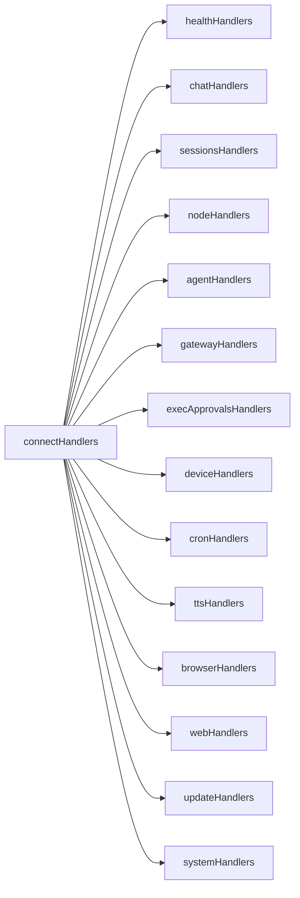

### 客户端实现要点
- 连接选项
  - 支持指定网关地址、令牌、密码、实例 ID、客户端元数据、平台、模式、角色、作用域、能力、命令、权限、路径环境变量、设备身份、协议范围、TLS 指纹等
- 事件与回调
  - 支持握手完成、事件、断开、缺口检测等回调
- 关闭码语义
  - 提供常见关闭码的语义化提示，便于诊断

### 协议版本与兼容性
- 单一真相：TypeBox 模式作为协议单源真相，驱动运行时验证、JSON Schema 导出与 Swift 代码生成
- 版本策略：客户端声明最小/最大协议版本，服务端拒绝不匹配
- 前向兼容：Swift 模型保留未知帧类型，避免破坏旧客户端

## 依赖关系分析
- 协议层依赖
  - 协议模式导出 AJV 校验器，统一参数验证
  - 服务端方法注册依赖协议模式与错误码
- 客户端依赖
  - 客户端 SDK 依赖协议模式与错误码
- HTTP 层依赖
  - 浏览器路由分发依赖路径编译与参数提取
  - 插件 HTTP 注册依赖规范化路径与注册表
- 配置层依赖
  - 认证配置与默认值注入依赖运行时覆盖机制
  - 配置模式导出依赖 UI 提示结构

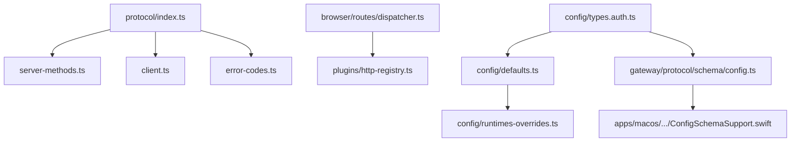

## 性能考量
- 心跳与保活
  - 使用心跳事件维持连接活性，合理设置心跳间隔以平衡保活与网络负载
- 负载与缓冲
  - 依据策略中的最大载荷与缓冲字节限制，控制消息大小与队列长度
- 并发与限流
  - 代理与子代理并发默认值注入，避免过度并发导致资源争用
- 日志与可观测性
  - 使用日志尾部接口进行实时日志追踪，结合事件序列号与状态版本进行增量更新

[本节为通用指导，无需具体文件来源]

## 故障排查指南
- 关闭码语义
  - 常见关闭码含义（如正常关闭、异常关闭、策略违规、服务重启）有助于快速定位问题
- 错误码与错误形状
  - 使用标准错误码与错误形状，包含可重试标记与重试等待时间，便于客户端实现退避策略
- 认证与令牌
  - 通过钩子令牌提取逻辑，支持头部、查询参数与请求头等多种方式获取令牌
- 参数验证
  - 统一使用 AJV 校验器与格式化错误信息，便于定位参数问题

## 结论
OpenClaw 的 API 体系以 TypeBox 为协议单源真相，通过严格的帧模型、方法注册与授权、HTTP 路由与插件扩展、CLI 参数解析与配置系统，构建了高一致性与可维护性的通信框架。配合明确的错误处理与关闭码语义，能够支撑从桌面到移动端与插件生态的广泛场景。

[本节为总结，无需具体文件来源]

## 附录

### WebSocket 连接与消息处理流程
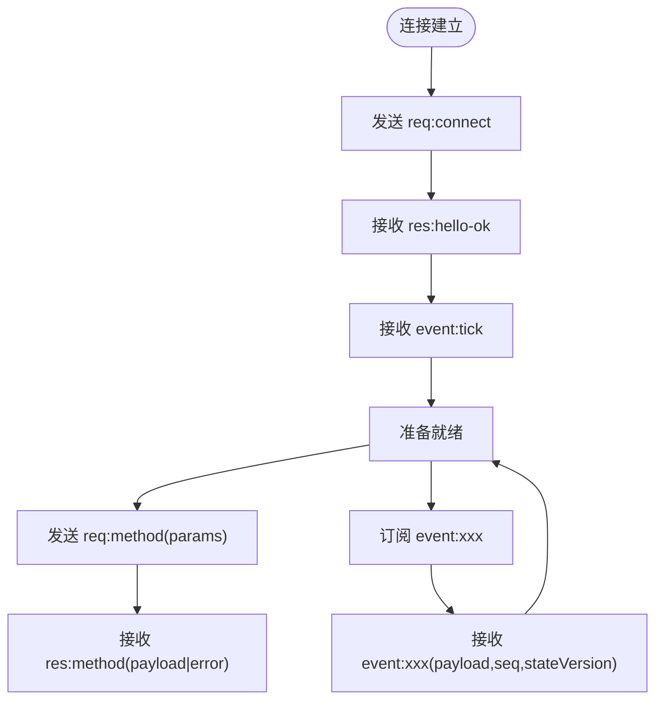

### HTTP 路由注册与分发
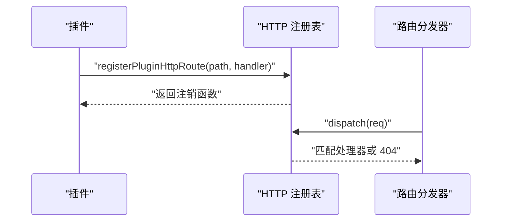

### 配置覆盖与导出
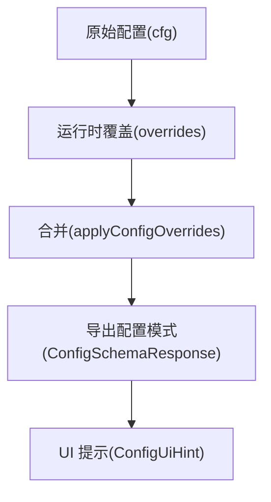