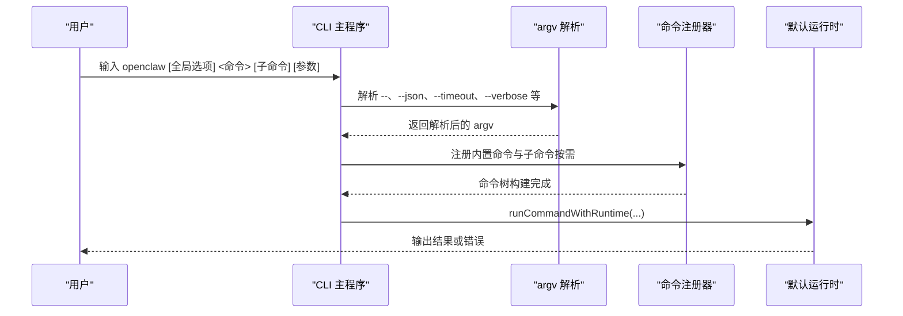

# CLI 命令参考

## 目录
1. [简介](#简介)
2. [项目结构](#项目结构)
3. [核心组件](#核心组件)
4. [架构总览](#架构总览)
5. [详细组件分析](#详细组件分析)
6. [依赖关系分析](#依赖关系分析)
7. [性能与可扩展性](#性能与可扩展性)
8. [故障排除指南](#故障排除指南)
9. [结论](#结论)
10. [附录](#附录)

## 简介
本文件为 OpenClaw CLI 的完整命令参考，覆盖主命令、子命令组（gateway、agent、channels、models、skills 等）、全局选项（如 --verbose、--json）、输出样式与颜色、自动补全与别名、以及配置与诊断流程。文档同时提供命令组合使用场景与最佳实践建议，帮助用户高效完成安装、配置、运行、维护与排障。

## 项目结构
OpenClaw CLI 采用“主程序 + 子命令注册器”的组织方式：主程序负责解析全局选项与路由；各功能域通过注册器按需加载，支持延迟注册与全量生成补全脚本。

```mermaid
graph TB
subgraph "CLI 主程序"
P["program.ts<br/>注册命令入口"]
CR["command-registry.ts<br/>内置命令注册"]
RS["register.subclis.ts<br/>子命令延迟注册"]
end
subgraph "内置命令"
SETUP["register.setup.ts"]
ONBOARD["register.onboard.ts"]
CONFIG["register.configure.ts"]
MAINT["register.maintenance.ts"]
STAT["register.status-health-sessions.ts"]
MSG["register.message.ts"]
AGT["register.agent.ts"]
end
subgraph "子命令组"
GW["gateway-cli.js"]
LOGS["logs-cli.js"]
SYS["system-cli.js"]
MODELS["models-cli.js"]
NODES["nodes-cli.js"]
DEVICES["devices-cli.js"]
NODE["node-cli.js"]
SANDBOX["sandbox-cli.js"]
TUI["tui-cli.js"]
CRON["cron-cli.js"]
DNS["dns-cli.js"]
DOCS["docs-cli.js"]
HOOKS["hooks-cli.js"]
WEBHOOKS["webhooks-cli.js"]
PAIR["pairing-cli.js"]
PLUG["plugins-cli.js"]
CH["channels-cli.js"]
DIR["directory-cli.js"]
SEC["security-cli.js"]
SK["skills-cli.js"]
UPD["update-cli.js"]
COMP["completion-cli.ts"]
end
P --> CR
P --> RS
CR --> SETUP
CR --> ONBOARD
CR --> CONFIG
CR --> MAINT
CR --> STAT
CR --> MSG
CR --> AGT
RS --> GW
RS --> LOGS
RS --> SYS
RS --> MODELS
RS --> NODES
RS --> DEVICES
RS --> NODE
RS --> SANDBOX
RS --> TUI
RS --> CRON
RS --> DNS
RS --> DOCS
RS --> HOOKS
RS --> WEBHOOKS
RS --> PAIR
RS --> PLUG
RS --> CH
RS --> DIR
RS --> SEC
RS --> SK
RS --> UPD
RS --> COMP
```



## 核心组件
- 全局选项与输出样式
  - 全局标志：--dev、--profile、--no-color、--update、-V/--version/-v
  - 输出样式：TTY 渲染彩色与进度条；--json/--plain 禁用样式；--no-color 或 NO_COLOR=1 关闭 ANSI
- 路由与延迟注册
  - 内置命令（setup、onboard、configure、config、maintenance、status/health/sessions、message、agent）直接注册
  - 子命令组（gateway、logs、system、models、nodes、devices、node、sandbox、tui、cron、dns、docs、hooks、webhooks、pairing、plugins、channels、directory、security、skills、update、completion）按需延迟注册
- 参数解析与路径推断
  - argv 工具提供 --、--json、--timeout、--verbose 等通用解析逻辑
  - 路由器根据命令路径匹配内置命令的快捷执行

## 架构总览
下图展示 CLI 启动到命令执行的关键流程：参数解析 → 路由匹配 → 延迟注册 → 执行器调用。



## 详细组件分析

### 全局选项与输出样式
- 全局标志
  - `--dev`：隔离状态至 `~/.openclaw-dev`，切换默认端口
  - `--profile <name>`：隔离状态至 `~/.openclaw-<name>`
  - `--no-color`：禁用 ANSI 颜色
  - `--update`：等价于 `openclaw update`（源码安装）
  - `-V/--version/-v`：打印版本并退出
- 输出样式
  - TTY：彩色与进度指示；OSC-8 超链接渲染为可点击链接
  - `--json/--plain`：禁用样式，便于机器消费
  - `--no-color` 或 `NO_COLOR=1`：关闭 ANSI 样式
  - 长任务显示进度指示（支持 OSC 9）

### setup（初始化与向导）
- 功能：初始化配置与工作区；可选运行 onboard 向导
- 选项
  - `--workspace <dir>`：代理工作区目录（默认 `~/.openclaw/workspace`）
  - `--wizard`：运行交互式向导
  - `--non-interactive`：无提示运行向导
  - `--mode <local|remote>`：向导模式
  - `--remote-url <url>`、`--remote-token <token>`：远程网关地址与令牌
- 行为：当存在任何向导相关标志时，自动进入 onboard 流程

### onboard（交互式向导）
- 功能：设置网关、工作区与技能；支持本地/远程模式
- 重要选项（节选）
  - --workspace、--reset、--non-interactive、--accept-risk、--flow、--mode
  - --auth-choice 及多提供商密钥（Anthropic、OpenAI、OpenRouter、AI Gateway、Moonshot、Kimi、Gemini、Z.AI、Xiaomi、MiniMax、Synthetic、Venice、OpenCode Zen 等）
  - --gateway-*、--remote-*、--tailscale、--install-daemon/--no-install-daemon/--skip-daemon、--daemon-runtime
  - --skip-channels、--skip-skills、--skip-health、--skip-ui、--node-manager
  - --json：输出 JSON 摘要
- 注意：--skip-daemon 优先级高于 --install-daemon

### configure（非交互配置）
- 功能：交互式配置（模型、通道、技能、网关），可限定分段
- 选项
  - `--section <section>`：重复项，限定配置分段（如 credentials、devices、agents、models、channels、gateway 等）
- 行为：未指定分段时进入完整向导；指定无效分段会报错并退出

### config（配置读写）
- 功能：非交互式配置助手（get/set/unset）
- 子命令
  - `config get <path>`：打印配置值（点/中括号路径）
  - `config set <path> <value>`：设置值（JSON5 或原始字符串）
  - `config unset <path>`：移除值
- 行为：不带子命令时启动向导

### doctor（健康检查与快速修复）
- 功能：网关与通道的健康检查与快速修复
- 选项
  - `--no-workspace-suggestions`：禁用工作区内存提示
  - `--yes`：接受默认无需确认
  - `--repair`/`--fix`：应用推荐修复（`--fix` 为 `--repair` 别名）
  - `--force`：强制修复（可能覆盖自定义服务配置）
  - `--non-interactive`：仅安全迁移，跳过提示
  - `--generate-gateway-token`：生成并配置网关令牌
  - `--deep`：扫描系统服务发现额外网关实例
- 最佳实践：先 `--deep` 扫描，再按提示逐项修复；`--force` 用于极端情况

### dashboard（控制面板）
- 功能：打开控制 UI（带当前令牌）
- 选项
  - `--no-open`：仅打印 URL 不自动打开浏览器

### reset（重置本地状态）
- 功能：重置本地配置/凭据/会话（保留 CLI）
- 选项
  - `--scope <config|config+creds+sessions|full>`
  - `--yes`：跳过确认
  - `--non-interactive`：禁用提示（需配合 `--yes` 与明确作用域）
  - `--dry-run`：预演不删除文件

### uninstall（卸载）
- 功能：卸载网关服务 + 本地数据（CLI 保留）
- 选项
  - `--service`、`--state`、`--workspace`、`--app`、`--all`
  - `--yes`、`--non-interactive`、`--dry-run`

### status / health / sessions（状态与会话）
- status
  - 选项：`--json`、`--all`、`--usage`、`--deep`、`--timeout <ms>`、`--verbose`/`--debug`
  - 行为：显示通道健康与最近会话收件人；`--usage` 展示模型提供商用量快照
- health
  - 选项：`--json`、`--timeout <ms>`、`--verbose`/`--debug`
  - 行为：从运行中的网关获取健康状态
- sessions
  - 选项：`--json`、`--verbose`、`--store <path>`、`--active <minutes>`
  - 行为：列出存储的对话会话；支持按活跃度筛选

### message（消息与频道动作）
- 功能：统一的出站消息与频道动作（发送、轮询、反应、阅读/编辑/删除、贴图、权限、搜索、线程、表情包、事件等）
- 示例（节选）
  - `openclaw message send --target +15555550123 --message "Hi"`
  - `openclaw message poll --channel discord --target channel:123 --poll-question "Snack?" --poll-option Pizza --poll-option Sushi`
  - `openclaw message react --channel discord --target 123 --message-id 456 --emoji "✅"`

### agent / agents（单次代理回合与代理管理）
- agent
  - 必选：`--message <text>`
  - 选项：`--to`、`--session-id`、`--agent`、`--thinking`、`--verbose`、`--channel`、`--reply-*`、`--local`、`--deliver`、`--json`、`--timeout`
  - 示例：启动新会话、在指定会话中追问、启用思考级别、开启交付回发、跨频道回复
- agents
  - `agents list`：`--json`、`--bindings`
  - `agents add [name]`：`--workspace`、`--model`、`--agent-dir`、`--bind <channel[:accountId]>`（可重复）、`--non-interactive`、`--json`
  - `agents set-identity`：`--agent`、`--workspace`、`--identity-file`、`--from-identity`、`--name`、`--theme`、`--emoji`、`--avatar`、`--json`
  - `agents delete <name>`：`--force`、`--json`

### gateway（网关控制与 RPC）
- 运行网关
  - 选项：`--port`、`--bind`、`--token`、`--auth`、`--password`、`--tailscale`、`--tailscale-reset-on-exit`、`--allow-unconfigured`、`--dev`、`--reset`、`--force`、`--verbose`、`--claude-cli-logs`、`--ws-log`、`--raw-stream`、`--raw-stream-path`
- 网关服务
  - `gateway status/install/uninstall/start/stop/restart`：支持 `--json`；`status` 支持 `--no-probe`、`--deep`
- RPC 辅助
  - `gateway call <method> [--params <json>]`
  - `gateway health/status/probe/discover/install/uninstall/start/stop/restart/run`
  - 常见 RPC：`config.apply`、`config.patch`、`update.run`

### channels（频道管理）
- 子命令：`list`、`status`、`logs`、`add`、`remove`、`login`、`logout`、`info`
- 通用选项：`--channel <name>`、`--account <id>`、`--name <label>`、`--json`、`--timeout <ms>`
- 常见用法：添加 Telegram/Discord 机器人账号、删除配置、登录/登出 WhatsApp Web、探测通道健康

### models（模型配置）
- 别名：`openclaw models` 等价于 `models status`
- 子命令与选项（节选）
  - `models list`：`--all`、`--local`、`--provider`、`--json`、`--plain`
  - `models status`：`--json`、`--plain`、`--check`、`--probe`、`--probe-provider`、`--probe-profile`、`--probe-timeout`、`--probe-concurrency`、`--probe-max-tokens`
  - `models set <model>`、`models set-image <model>`
  - `models aliases`：`list`/`add`/`remove`
  - `models fallbacks`/`image-fallbacks`：`list`/`add`/`remove`/`clear`
  - `models scan`：`--min-params`、`--max-age-days`、`--provider`、`--max-candidates`、`--timeout`、`--concurrency`、`--no-probe`、`--yes`、`--no-input`、`--set-default`、`--set-image`、`--json`
  - `models auth`：`add`、`setup-token`、`paste-token`
  - `models auth order`：`get`/`set`/`clear`

### skills（技能管理）
- 子命令：`list`、`info <name>`、`check`
- 选项：`--eligible`、`--json`、`-v`/`--verbose`
- 提示：使用 `npx clawhub` 搜索、安装与同步技能

### 子命令组（按需注册）
以下命令组通过 `register.subclis.ts` 延迟注册，支持 `--url`、`--token`、`--timeout`、`--json` 等通用 RPC 选项（具体以各子命令文档为准）：
- `gateway`、`logs`、`system`、`models`、`nodes`、`devices`、`node`、`sandbox`、`tui`、`cron`、`dns`、`docs`、`hooks`、`webhooks`、`pairing`、`plugins`、`channels`、`directory`、`security`、`skills`、`update`、`completion`

### 自动补全与别名（completion）
- 生成补全脚本
  - `openclaw completion [-s, --shell <zsh|bash|powershell|fish>] [-i, --install] [-y, --yes]`
  - 安装：自动写入用户 shell 配置文件（若不存在则创建）
- 行为：为 zsh/bash/fish/PowerShell 生成对应补全；安装前可先 `--yes` 非交互
- 注意：安装会追加注释行，避免重复

## 依赖关系分析
- 组件耦合
  - 主程序与注册器：低耦合，通过 CommandRegistry 与 SubCli 注册表解耦
  - 子命令组：按需延迟加载，减少启动时间与内存占用
  - 路由器：对内置命令提供快捷执行，避免不必要的注册
- 外部依赖
  - commander：命令与选项解析
  - 运行时：统一的错误处理与退出机制
- 循环依赖风险
  - 子命令注册中对插件的依赖已通过“先注册插件命令，再注册 pairing CLI”规避

```mermaid
graph LR
CMD["command-registry.ts"] --> REG["register.subclis.ts"]
REG --> GW["gateway-cli.js"]
REG --> LOGS["logs-cli.js"]
REG --> SYS["system-cli.js"]
REG --> MODELS["models-cli.js"]
REG --> NODES["nodes-cli.js"]
REG --> DEVICES["devices-cli.js"]
REG --> NODE["node-cli.js"]
REG --> SANDBOX["sandbox-cli.js"]
REG --> TUI["tui-cli.js"]
REG --> CRON["cron-cli.js"]
REG --> DNS["dns-cl