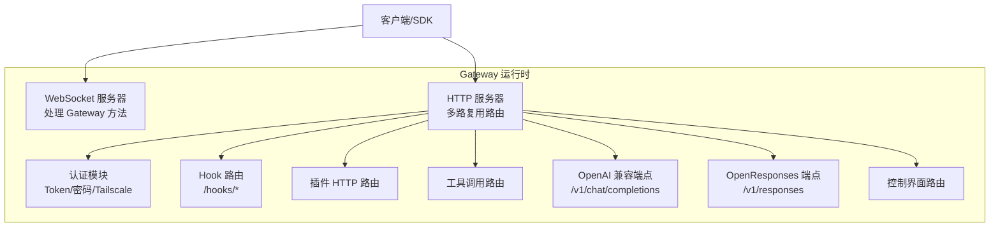
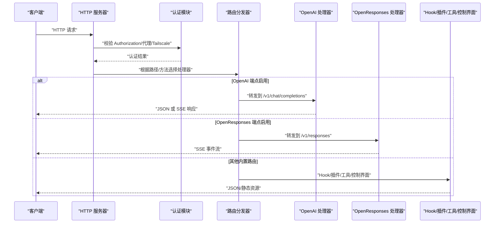
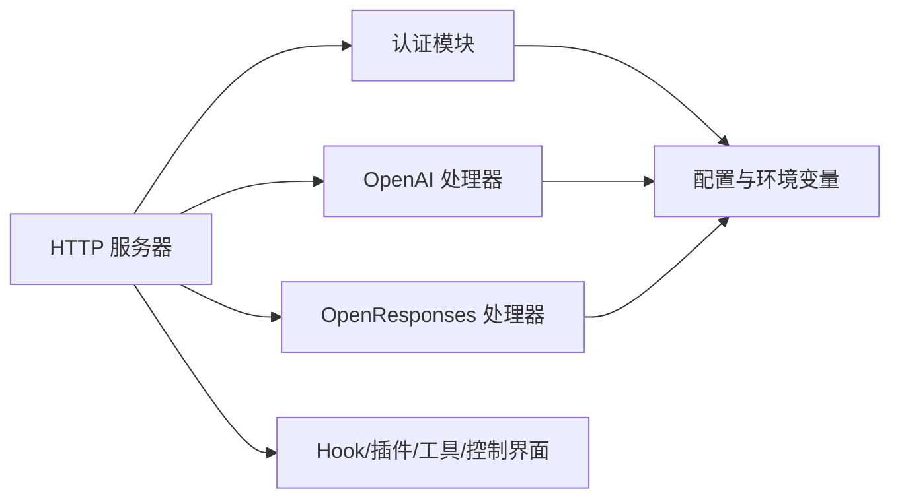

# HTTP API

## 目录
1. [简介](#简介)
2. [项目结构](#项目结构)
3. [核心组件](#核心组件)
4. [架构总览](#架构总览)
5. [详细组件分析](#详细组件分析)
6. [依赖关系分析](#依赖关系分析)
7. [性能考量](#性能考量)
8. [故障排查指南](#故障排查指南)
9. [结论](#结论)
10. [附录](#附录)

## 简介
本文件为 OpenClaw Gateway 的 HTTP API 完整文档，覆盖以下内容：
- OpenAI 兼容 API（/v1/chat/completions）
- OpenResponses 兼容 API（/v1/responses）
- 自定义 HTTP 端点与插件扩展机制
- 认证方式（Bearer Token、设备令牌、Tailscale 代理用户）
- 请求/响应格式、错误码与示例
- 速率限制、CORS 与安全建议
- 客户端 SDK 使用指南与最佳实践
- API 版本管理与迁移策略

## 项目结构
OpenClaw Gateway 在同一端口上通过 HTTP 多路复用同时提供多种服务：
- WebSocket 控制通道（用于 Gateway 方法调用）
- HTTP 服务（OpenAI/OpenResponses 兼容端点、插件路由、Hook、工具调用、控制界面等）

## 核心组件
- HTTP 服务器与多路复用路由：统一处理 Hook、工具调用、OpenAI/OpenResponses、Canvas/A2UI、控制界面等。
- 认证模块：支持 Bearer Token、密码模式、Tailscale 代理用户校验。
- OpenAI 兼容端点：/v1/chat/completions，支持 SSE 流式输出。
- OpenResponses 兼容端点：/v1/responses，支持 item-based 输入、工具调用、SSE 事件流。
- 插件扩展：注册 HTTP 路由与通用处理器，按优先级匹配。

## 架构总览
下图展示 HTTP 请求从进入 Gateway 到被具体处理器消费的流程，以及认证与路由决策的关键节点。

## 详细组件分析

### OpenAI 兼容 API（/v1/chat/completions）
- 端点：POST /v1/chat/completions
- 端口：与 Gateway 相同（HTTP 多路复用）
- 启用方式：通过配置项开启
- 认证：Bearer Token（Authorization: Bearer `<token>`），支持 token/password 模式
- 请求头：
  - Authorization: Bearer `<token>`
  - Content-Type: application/json
  - 可选：x-openclaw-agent-id、x-openclaw-session-key
- 请求体字段（部分）：
  - model: "openclaw:`<agentId>`" 或 "agent:`<agentId>`"
  - messages: 数组（role/content）
  - stream: true/false
  - user: 用于稳定会话键
- 响应：
  - 非流式：JSON 对象
  - 流式：SSE，Content-Type: text/event-stream，事件以 data: 行表示
- 错误码：
  - 401 缺失/无效认证
  - 400 请求体无效
  - 405 方法不被允许
  - 413 请求体过大
  - 500 内部错误

### OpenResponses 兼容 API（/v1/responses）
- 端点：POST /v1/responses
- 端口：与 Gateway 相同（HTTP 多路复用）
- 启用方式：通过配置项开启
- 认证：Bearer Token（Authorization: Bearer `<token>`），支持 token/password 模式
- 请求头：
  - Authorization: Bearer `<token>`
  - Content-Type: application/json
  - 可选：x-openclaw-agent-id、x-openclaw-session-key
- 请求体字段（支持）：
  - input: 字符串或 item 对象数组
  - instructions: 合并到系统提示
  - tools: 客户端函数工具定义
  - tool_choice: 工具筛选/强制
  - stream: 开启 SSE
  - max_output_tokens: 输出上限（尽力而为）
  - user: 稳定会话路由
- 支持的 item 类型：
  - message（roles: system/developer/user/assistant）
  - function_call_output（工具返回）
  - reasoning/item_reference（兼容但忽略）
- 文件与图片输入：
  - 支持 base64/URL 来源
  - MIME 白名单与大小限制可配置
- 响应：
  - 非流式：JSON 对象（含 usage）
  - 流式：SSE，事件类型包括 response.created、response.in_progress、response.output_item.added、response.content_part.added、response.output_text.delta、response.output_text.done、response.content_part.done、response.output_item.done、response.completed、response.failed
- 错误码：
  - 401 缺失/无效认证
  - 400 请求体无效
  - 405 方法不被允许
  - 413 请求体过大
  - 500 内部错误

### 认证与授权
- 支持模式：
  - Token 模式：配置 gateway.auth.token 或环境变量 OPENCLAW_GATEWAY_TOKEN
  - 密码模式：配置 gateway.auth.password 或环境变量 OPENCLAW_GATEWAY_PASSWORD
  - Tailscale 代理用户：当 allowTailscale 启用且满足条件时，可通过代理头进行用户识别
- 设备令牌：
  - 通过 Gateway 方法管理设备令牌（轮换/吊销），可用于特定角色访问
- 授权范围：
  - 不同 Gateway 方法需要不同角色与作用域（如 operator.read/write/approvals/pairing 等）
- Hook 令牌：
  - 支持 Authorization: Bearer、X-OpenClaw-Token 头或查询参数 token（不推荐）

### 插件 HTTP 扩展
- 插件可注册两类：
  - HTTP 路由：精确路径匹配优先
  - 通用 HTTP 处理器：在未命中路由后继续尝试
- 插件处理器按注册顺序执行，首个返回已处理的处理器生效
- 插件可与内置路由共存，互不冲突

### 工具调用 HTTP（工具执行）
- 提供独立的 HTTP 路由用于触发工具执行
- 需要与 Gateway 认证一致（Bearer Token）
- 适用于外部系统直接调用工具

### Hook HTTP（外部触发）
- 路径：/hooks/`<token>`（token 来自配置）
- 方法：POST
- 支持 wake 与 agent 两种子路径
- 映射：可配置 hook 映射规则，将请求映射为唤醒或代理运行
- 安全建议：避免在查询参数中传递 token；优先使用 Authorization: Bearer 或 X-OpenClaw-Token

### 控制界面与媒体
- 控制界面路由：在启用时提供前端页面与资源
- 媒体路由：/media/:id（受 TTL 与大小限制约束）

## 依赖关系分析
- HTTP 服务器依赖认证模块进行请求校验
- OpenAI/OpenResponses 处理器依赖认证配置与可信代理设置
- 插件注册影响路由优先级与处理链
- Gateway 方法列表决定可用的 WebSocket 方法集，与 HTTP 端点无直接耦合

## 性能考量
- 流式输出：OpenAI 与 OpenResponses 均支持 SSE，减少单次响应体积与延迟
- 限流与超时：OpenResponses 支持请求体大小、文件/图片上传的大小与 MIME 限制，以及 PDF 解析参数
- 并发与会话：默认无状态（每次请求生成新会话键），可通过 user 或显式 session key 控制会话复用
- TLS：可启用 HTTPS，提升传输安全性

## 故障排查指南
- 401 未授权
  - 检查 Authorization 头是否为 Bearer `<token>`
  - 确认 gateway.auth.mode 与配置/环境变量
- 405 方法不允许
  - 确保使用 POST 方法
- 413 请求体过大
  - 减少请求体大小或调整相关配置（如 OpenResponses 的 maxBodyBytes）
- 404 未找到
  - 确认端点路径正确（/v1/chat/completions 或 /v1/responses）
  - 检查端点是否已启用
- 500 内部错误
  - 查看 Gateway 日志，确认配置有效与插件加载正常

## 结论
OpenClaw Gateway 提供了与主流模型服务兼容的 HTTP API，同时保留了强大的插件生态与灵活的认证机制。通过 OpenAI 与 OpenResponses 兼容端点，开发者可以快速对接现有工具链；通过 Hook 与插件扩展，可构建更丰富的集成方案。建议在生产环境中启用 HTTPS、合理配置限流与会话策略，并采用 Bearer Token 进行认证。

## 附录

### API 端点一览与规范
- OpenAI 兼容（/v1/chat/completions）
  - 方法：POST
  - 路径：/v1/chat/completions
  - 认证：Bearer Token
  - 流式：SSE（text/event-stream）
  - 示例：见文档中的 curl 示例
- OpenResponses 兼容（/v1/responses）
  - 方法：POST
  - 路径：/v1/responses
  - 认证：Bearer Token
  - 流式：SSE（多种事件类型）
  - 示例：见文档中的 curl 示例

### 认证与令牌管理
- Bearer Token
  - 通过 Authorization: Bearer `<token>` 发送
  - 支持 token/password 模式
- 设备令牌
  - 通过 Gateway 方法轮换/吊销
- OAuth
  - 支持刷新与过期处理
  - CLI 凭据解析支持 OAuth 与短期 token

### CORS 与安全建议
- CORS：HTTP 服务器未内置 CORS 中间件，若需跨域，请在反向代理层配置
- 安全建议：
  - 优先使用 Authorization: Bearer 头传递 token，避免在 URL 查询参数中携带
  - 启用 HTTPS
  - 限制可信代理与来源
  - 合理设置 OpenResponses 的文件/图片上传白名单与大小限制

### 客户端 SDK 使用指南与最佳实践
- 选择端点
  - 若已有 OpenAI 生态工具，优先使用 /v1/chat/completions
  - 若需要更强的工具调用与事件流，使用 /v1/responses
- 会话控制
  - 使用 user 字段或 x-openclaw-session-key 实现稳定会话
- 流式处理
  - 设置 stream=true 获取 SSE，逐行解析 data: 行
- 错误处理
  - 统一解析 4xx/5xx 错误，重试与降级策略需结合业务场景设计
- 版本与迁移
  - OpenAI 端点作为兼容层保留，建议逐步迁移到 OpenResponses 以获得更好的工具与事件模型

### API 版本管理与迁移策略
- 当前状态
  - OpenAI Chat Completions 作为兼容层存在
  - OpenResponses /v1/responses 作为新的标准端点
- 迁移建议
  - 新项目优先采用 OpenResponses
  - 旧项目逐步替换调用方，先在侧边启用 OpenResponses 并进行对比测试
  - 关闭兼容层前确保所有集成完成切换