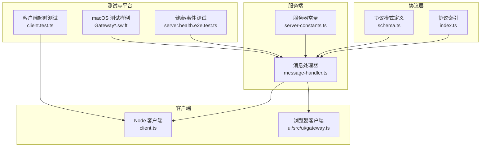
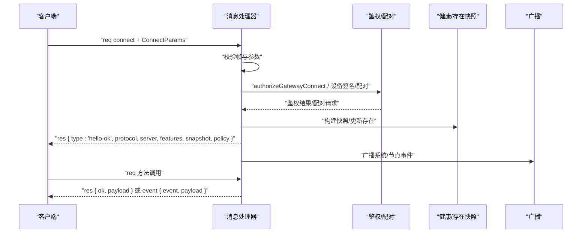
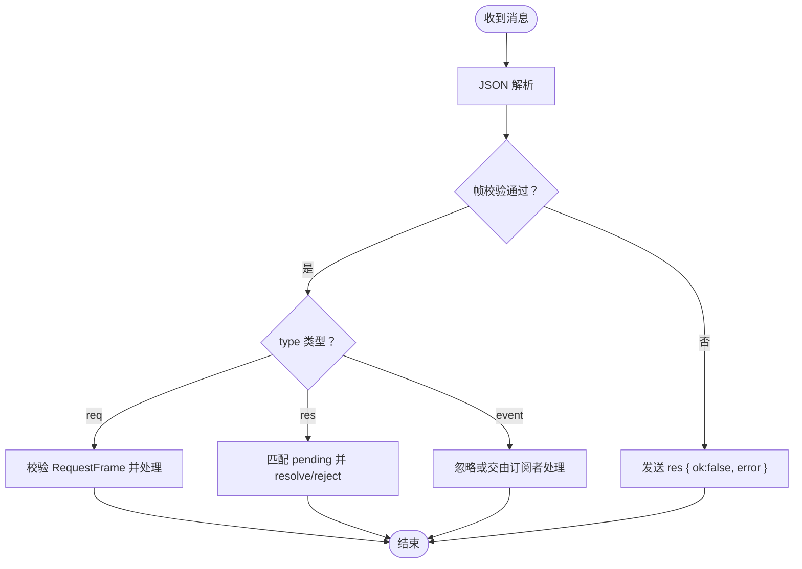
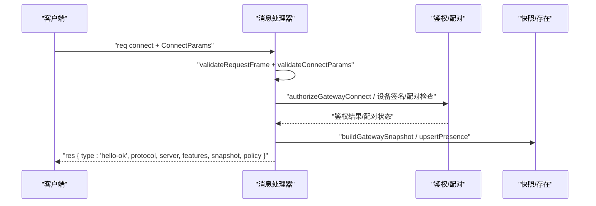
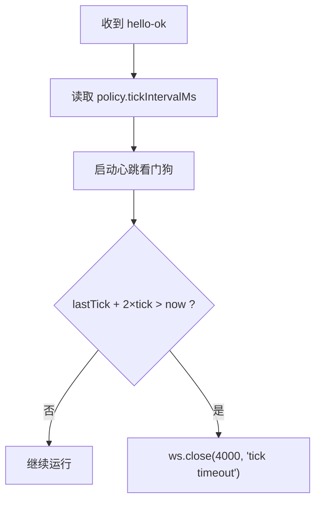
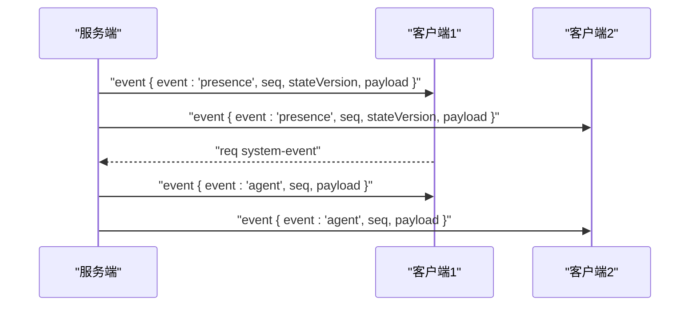
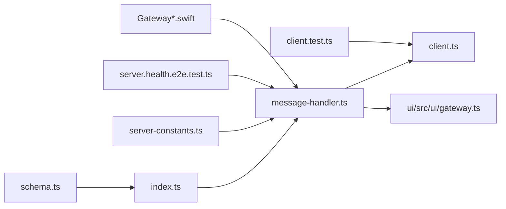

# WebSocket API

## 目录
1. [简介](#简介)
2. [项目结构](#项目结构)
3. [核心组件](#核心组件)
4. [架构总览](#架构总览)
5. [详细组件分析](#详细组件分析)
6. [依赖关系分析](#依赖关系分析)
7. [性能考量](#性能考量)
8. [故障排查指南](#故障排查指南)
9. [结论](#结论)
10. [附录](#附录)

## 简介
本文件为 OpenClaw 的 WebSocket API 详细文档，覆盖连接建立、握手协商、消息帧格式、事件广播、心跳与断线重连策略、客户端实现要点以及性能与监控建议。文档面向开发者与集成者，既提供高层概览也包含可追溯到源码的细节来源。

## 项目结构
OpenClaw 的 WebSocket API 主要由以下模块构成：
- 协议与帧定义：位于协议层，统一定义请求/响应/事件帧、连接参数、错误码与校验器
- 服务端连接处理器：负责握手、鉴权、配对、状态快照、广播与请求分发
- 客户端实现：Node.js 与浏览器两端的客户端封装，含重连、心跳看门狗与事件回调
- 健康与事件测试：端到端测试验证心跳、事件序列号、状态版本等行为
- 平台测试样例：macOS Swift 测试中包含 `hello-ok` 帧示例数据，用于验证协议字段

## 核心组件
- 协议与帧模型
  - 请求帧、响应帧、事件帧、连接参数、错误码与校验器均在协议层集中管理，采用 JSON Schema 校验与统一错误格式
- 服务端消息处理器
  - 负责解析消息、校验握手帧、执行鉴权与设备配对、生成 `hello-ok` 快照并广播事件
- 客户端
  - 统一封装连接、发送请求、接收事件、心跳看门狗与指数退避重连
- 常量与策略
  - 最大载荷、缓冲上限、握手超时、心跳间隔、重复去重窗口等

## 架构总览
下图展示从客户端发起连接到服务端完成握手、鉴权、配对与事件广播的整体流程。

## 详细组件分析

### 消息帧与协议版本
- 帧类型
  - 请求帧：`type="req"`，包含 `method` 与可选 `params`
  - 响应帧：`type="res"`，包含 `id`、`ok`、`payload` 或 `error`
  - 事件帧：`type="event"`，包含 `event` 与 `payload`
- 连接参数
  - `ConnectParams` 中包含 `client` 信息、`role`、`scopes`、`auth`（`token`/`password`）、`device`（公钥、签名、时间戳、`nonce`）等
- 协议版本
  - 通过 `minProtocol`/`maxProtocol` 与 `PROTOCOL_VERSION` 协商，不匹配将拒绝握手
- 错误码与错误形状
  - 统一的 `ErrorCodes` 与 `errorShape`，便于客户端一致化处理

### 握手与连接建立
- 首帧必须是 `{ type:"req", method:"connect", params:ConnectParams }`
- 校验 `min`/`maxProtocol` 与 `PROTOCOL_VERSION`，不兼容则关闭连接
- 角色与作用域默认化：`role`/`operator` 默认 `scopes=operator.admin`；`node` 默认空
- 鉴权与设备身份
  - 支持 `token`/`password` 共享鉴权，或设备签名鉴权
  - 设备签名需匹配公钥、时间戳偏差限制、`nonce`（非本地时必需）
  - 控制 UI 在非安全上下文（非 HTTPS/`localhost`）下可能被拒绝
- 配对与权限
  - 未配对设备会触发配对请求；角色/作用域升级会要求重新配对
  - 更新配对元数据（显示名、平台、`clientId`、`role`、`scopes`、远端 IP）
- `hello-ok` 帧
  - 包含 `protocol`、`server`（版本/主机/连接ID）、`features`（`methods`/`events`）、`snapshot`（`presence`/`health`/`stateVersion`）、`policy`（最大载荷/缓冲/心跳间隔）

### 认证流程
- 共享密钥认证（`token`/`password`）
  - 若客户端提供 `token`/`password` 且服务端允许，可绕过设备签名（但控制 UI 受安全上下文限制）
- 设备签名认证
  - 校验公钥、签名、时间戳偏差、`nonce`（远程连接必须提供）
  - 支持 `v1`/`v2` 签名版本，`v1` 仅限本地回环
- 控制 UI 安全上下文
  - 非 HTTPS/`localhost` 将被拒绝握手（除非配置允许）

### 心跳机制与断线重连
- 心跳策略
  - 服务端在 `hello-ok` 中下发 `policy.tickIntervalMs`
  - 客户端启动心跳看门狗：若超过 2 倍心跳间隔未收到心跳，主动关闭（`code=4000`）
- 断线重连
  - 客户端指数退避（最小 800ms，上限 30s），连接失败或握手超时触发
  - 关闭码提示：1000 正常、1006 异常断开、1008 策略违规、1012 服务重启
- 浏览器端
  - 使用自定义关闭码 `CONNECT_FAILED_CLOSE_CODE` 表达“连接失败”语义

### 事件类型与广播
- 事件帧
  - `type="event"`，`event` 字段标识事件类型，`payload` 为事件负载
- 常见事件
  - `heartbeat`：心跳事件，携带状态、目标、预览、时长等
  - `presence`：在线存在列表与状态版本
  - `agent`：智能体运行生命周期事件流
  - `shutdown`：服务端关闭广播
- 序列号与状态版本
  - 事件帧包含 `seq`（事件序号）与 `stateVersion`（状态版本），用于客户端一致性与快照同步

### 客户端实现指南（Node.js 与浏览器）
- Node.js 客户端
  - 选项：`url`、`token`/`password`、`clientName`/`displayName`/`version`、`platform`、`mode`、`role`/`scopes`、`caps`、`commands`、`permissions`、`deviceIdentity`、`min`/`maxProtocol`、TLS指纹、回调（`onEvent`/`onHelloOk`/`onConnectError`/`onClose`/`onGap`）
  - 发送：构造 `{ type:"req", id, method, params }` 并发送
  - 接收：解析 `{ type:"res"/"event" }`，按 `id` 匹配 `pending`，成功 `resolve`，失败 `reject`
  - 心跳看门狗：根据 `policy.tickIntervalMs` 自动检测超时并关闭
  - 重连：指数退避，支持 `onGap` 回调
- 浏览器客户端
  - 选项：`url`/`token`/`password`、`clientName`/`version`/`platform`/`mode`/`instanceId`、回调（`onHello`/`onEvent`/`onClose`/`onGap`）
  - 连接：`start()` 启动，`stop()` 停止并清理 `pending`
  - 关闭码：`CONNECT_FAILED_CLOSE_CODE` 用于表达连接失败

### 方法与参数（概览）
- 方法分类
  - 系统与健康：`health`、`status`、`system-presence`、`channels.status`、`last-heartbeat`、`set-heartbeats`
  - 会话与聊天：`sessions.*`、`chat.*`（发送/注入/历史/中止）
  - 配置与设置：`config.*`（`get`/`set`/`apply`/`patch`/`schema`）
  - 节点与技能：`nodes.*`、`skills.*`、`cron.*`
  - 设备与配对：`devices.*`、`device.pair.*`
  - 执行审批：`exec-approvals.*`
  - 向导与向导步骤：`wizard.*`
- 参数与返回
  - 所有方法参数与返回值均有对应的 Schema 校验器，统一通过 `validateXxxParams` 编译并使用
  - 返回统一为 `{ ok, payload }` 或 `{ ok, error }` 结构

### 向后兼容性
- 协议版本协商
  - 客户端声明 `min`/`maxProtocol`，服务端以 `PROTOCOL_VERSION` 对齐，不兼容则拒绝
- 版本差异
  - 服务端在 `hello-ok` 中返回 `protocol` 与 `server.version`/`commit`/`host`/`connId`
- 兼容策略
  - 低版本客户端可通过降低 `maxProtocol` 适配；高版本服务端保留旧字段以维持兼容

### 客户端实现要点（连接、发送、接收、错误处理）
- 连接建立
  - 发送 `{ type:"req", method:"connect", params }`，等待 `res { type:"hello-ok" }`
- 发送请求
  - 生成唯一 `id`，发送 `{ type:"req", id, method, params }`
- 接收与处理
  - `res`：按 `id` 匹配 `pending`，`ok` 则 `resolve(payload)`，否则 `reject(error)`
  - `event`：按 `event` 分发给 `onEvent` 回调
- 错误处理
  - 1008 策略违规（如握手失败/鉴权失败/配对要求）
  - 4000 心跳超时（客户端主动关闭）
  - 1012 服务重启（需重连）
  - `CONNECT_FAILED_CLOSE_CODE`（浏览器连接失败）

## 依赖关系分析
- 协议层
  - `index.ts` 导出校验器、错误码、`PROTOCOL_VERSION` 与各类 Schema
  - `schema.ts` 汇总各子模块 Schema
- 服务端
  - `message-handler.ts` 依赖协议校验、鉴权、配对、健康快照与日志
  - `server-constants.ts` 提供全局策略常量
- 客户端
  - `client.ts` 与 `ui/gateway.ts` 依赖协议常量与事件模型
- 测试
  - `server.health.e2e.test.ts` 验证事件、心跳、状态版本
  - `client.test.ts` 验证心跳超时与关闭码
  - macOS 测试样例包含 `hello-ok` 示例数据，验证字段完整性

## 性能考量
- 帧大小与缓冲
  - 最大载荷：`MAX_PAYLOAD_BYTES`，默认 512KB
  - 每连接发送缓冲上限：`MAX_BUFFERED_BYTES`，默认 ~1.5MB
- 心跳与健康刷新
  - 心跳间隔：`TICK_INTERVAL_MS`，默认 30 秒
  - 健康刷新：`HEALTH_REFRESH_INTERVAL_MS`，默认 60 秒
- 去重与容量
  - 事件去重 TTL：`DEDUPE_TTL_MS`，默认 5 分钟
  - 去重最大条目：`DEDUPE_MAX`，默认 1000
- 聊天历史字节上限
  - 可通过内部接口调整以满足不同场景

## 故障排查指南
- 常见关闭码与原因
  - 1008：策略违规（握手失败/鉴权失败/配对要求/协议不兼容）
  - 4000：心跳超时（客户端看门狗触发）
  - 1012：服务重启（需重连）
  - 1000/1006：正常/异常断开
- 定位步骤
  - 查看 `hello-ok` 中的 `protocol`/`server.features`/`snapshot.policy`
  - 检查握手阶段是否出现 `INVALID_REQUEST`/`NOT_PAIRED`/`UNAUTHORIZED`
  - 确认心跳是否按时到达，`last-heartbeat` 是否可用
  - 核对设备签名时间戳、`nonce` 与本地/远程环境
- 平台测试参考
  - macOS 测试样例中的 `hello-ok` 数据可用于比对字段完整性

## 结论
OpenClaw 的 WebSocket API 以协议层 Schema 为核心，结合严格的握手、鉴权与配对流程，提供稳定的心跳与事件广播能力。客户端实现遵循统一的帧模型与错误处理规范，配合心跳看门狗与指数退避重连策略，确保在复杂网络环境下保持可靠通信。通过合理的性能参数与监控指标，可进一步提升系统稳定性与可观测性。

## 附录

### API 方法清单与使用指引
- 系统与健康
  - `health`/`status`/`system-presence`/`channels.status`/`last-heartbeat`/`set-heartbeats`
- 会话与聊天
  - `sessions.*`、`chat.*`（发送/注入/历史/中止）
- 配置与设置
  - `config.*`（`get`/`set`/`apply`/`patch`/`schema`）
- 节点与技能
  - `nodes.*`、`skills.*`、`cron.*`
- 设备与配对
  - `dev