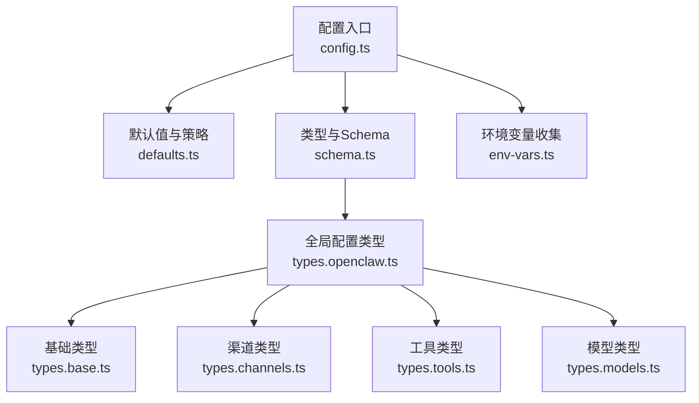
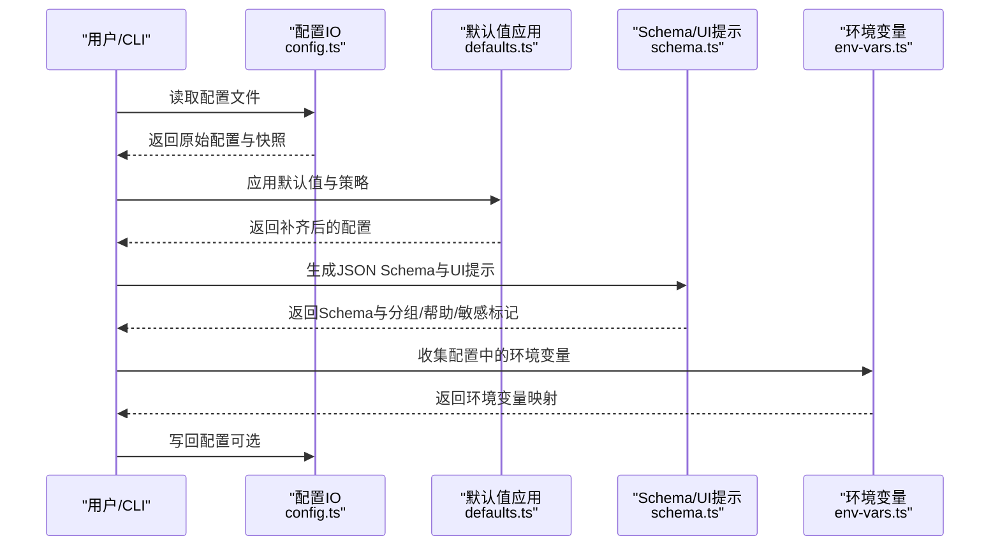
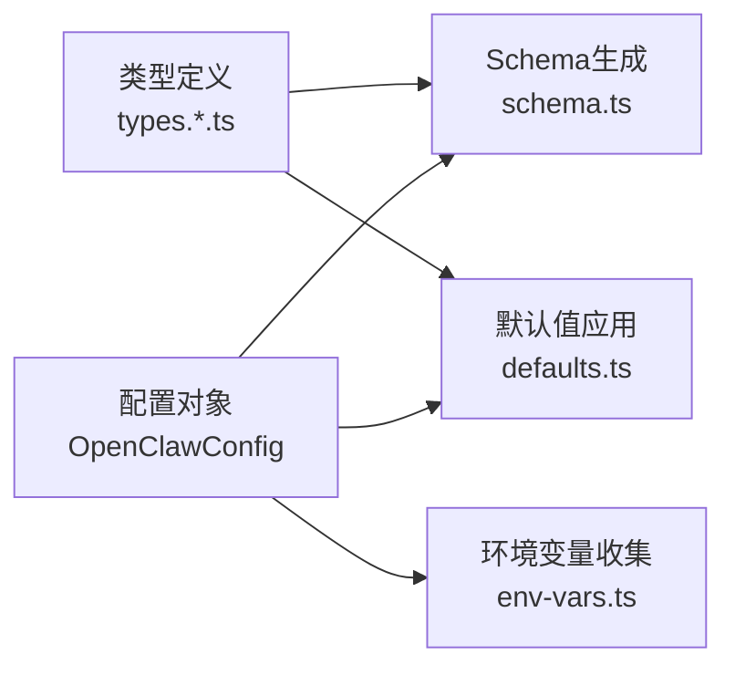

# 配置参数参考

## 简介
本参考文档面向 OpenClaw 的配置系统，系统化梳理全局配置、代理配置、渠道配置与工具配置的键名、数据类型、默认值与取值范围，并给出最小配置集、高级配置示例、配置文件格式与继承规则、环境变量与命令行覆盖机制、配置验证与错误处理、配置迁移与版本兼容性、性能调优与安全建议。内容基于源码中的类型定义、默认值推导与 UI 提示构建，确保可追溯到具体实现。

## 项目结构
OpenClaw 的配置系统由以下关键模块组成：
- 配置入口与导出：集中导出加载、写入、校验、模式解析等能力
- 默认值与策略：按模型、会话、代理、日志、上下文修剪等维度应用默认值
- 类型与 Schema：统一的类型定义与 UI 提示生成，用于生成配置表单与校验
- 环境变量收集：从配置中提取环境变量并注入运行时
- 渠道与工具类型：细化各子系统的配置结构与约束

## 核心组件
- 配置加载与写入：提供读取、解析、快照、哈希计算与写回能力
- 配置校验：基于 Zod Schema 生成 JSON Schema 与 UI 提示，支持插件与渠道扩展
- 默认值应用：按模型、代理、会话、日志、上下文修剪等维度自动补全
- 环境变量注入：从配置中收集并注入进程环境
- 运行时覆盖：支持通过命令行或运行时参数覆盖部分配置

## 架构总览
配置系统围绕“类型定义 → Schema 生成 → 默认值应用 → 校验与提示 → 写入与快照”的闭环工作。全局配置对象 `OpenClawConfig` 聚合各子系统配置，类型文件提供严格的字段约束，Schema 文件负责 UI 分组、标签、帮助文本与敏感字段标记，`defaults.ts` 在加载后对缺失字段进行补齐与优化。

## 详细组件分析

### 全局配置（OpenClawConfig）
- 结构概览：包含元信息、认证、环境、向导、诊断、日志、更新、浏览器、UI、技能、插件、模型、节点主机、代理、工具、绑定、广播、音频、消息、命令、审批、会话、Web、渠道、定时任务、钩子、发现、画布主机、Talk、网关等子配置段。
- 关键字段
  - `meta`：记录最后写入版本与时间戳
  - `update`：更新通道与启动检查
  - `logging`：日志级别、输出位置、控制台样式与敏感信息脱敏策略
  - `browser`/`ui`：浏览器行为与界面配色
  - `skills`/`plugins`：技能与插件启用、安装记录与槽位
  - `models`：模型提供方、兼容性与 Bedrock 发现
  - `gateway`/`nodeHost`：远程网关、节点代理、HTTP 端点、重载策略
  - `session`/`messages`/`commands`/`approvals`：会话作用域、消息确认、命令策略、审批
  - `channels`：各渠道默认策略与具体配置
  - `tools`：工具策略、媒体理解、链接理解、Web 搜索/抓取、消息跨上下文、广播、代理间通信、执行工具、沙箱与提升权限
  - `cron`/`hooks`/`discovery`/`canvasHost`/`talk`/`web`：自动化、钩子、发现、画布主机、TTS、Web 表面

### 基础配置（`types.base.ts`）
- 会话与消息
  - 会话作用域、DM 作用域、身份映射、重置策略、发送策略、代理间消息往返上限
  - 消息确认反应、去抖动窗口、打字指示器模式
- 日志与诊断
  - 日志级别、文件路径、控制台样式、敏感信息脱敏策略与正则
  - OpenTelemetry 配置、缓存追踪
- Web 与心跳
  - Web Provider 启用、心跳周期、断线重连指数退避
- 身份与允许列表
  - 代理提升权限来源允许列表、身份头像与主题

### 渠道配置（`types.channels.ts`）
- 渠道默认策略：群组策略、心跳可见性
- 渠道子配置：WhatsApp、Telegram、Discord、Google Chat、Slack、Signal、iMessage、MS Teams 等，均支持令牌、策略、重试、超时、网络与功能开关等

### 工具配置（`types.tools.ts`）
- 工具策略：基础配置档、允许/拒绝清单、按提供方覆盖、代理级提升与沙箱策略
- 媒体理解：图像/音频/视频理解的模型、并发、附件选择、提示、语言、超时、提供商选项
- 链接理解：最大链接数、超时、模型
- Web 工具：搜索（Brave/Perplexity/OpenRouter）、抓取（Readability/Firecrawl）、缓存与重定向限制
- 消息工具：跨上下文发送、广播、来源标记
- 代理间通信：启用、白名单
- 执行工具：宿主路由、安全模式、询问策略、节点绑定、PATH 前缀、安全二进制、后台/超时/通知、`apply_patch` 子工具
- 沙箱与提升：工具允许/拒绝清单、提升权限来源

### 模型配置（`types.models.ts`）
- 模型 API 类型、兼容性配置、鉴权模式
- 模型定义：标识、名称、API、推理开关、输入类型、成本、上下文窗口、最大输出、头部、兼容性
- 模型提供方：基础 URL、API Key、鉴权模式、API 类型、头部、鉴权头、模型列表
- Bedrock 发现：启用、区域、过滤器、刷新间隔、默认上下文与最大输出

### 默认值与策略（`defaults.ts`）
- 会话默认：强制 `main` 会话键、主会话键警告
- 模型默认：推理开关、输入类型、成本、上下文窗口、最大输出、别名映射
- 代理默认：并发限制、子代理并发、模型别名补全
- 日志默认：敏感信息脱敏策略
- 上下文修剪与心跳：根据认证模式设置 TTL 与心跳周期
- Compaction 默认：安全防护模式
- Talk API Key：从环境自动填充

### 环境变量收集（`env-vars.ts`）
- 从配置 `env` 段收集内联变量与字符串字段，忽略空值；支持 `shellEnv` 注入与 `vars` 映射

### Schema 与 UI 提示（`schema.ts`）
- 生成 JSON Schema 与 UI 提示，包含分组标签、字段标签、帮助文本、占位符、敏感标记
- 支持插件与渠道的 Schema 扩展
- 版本与生成时间标注

## 依赖关系分析
- 类型到 Schema：`OpenClawConfig` 及其子类型驱动 Schema 生成
- 默认值到配置：`defaults.ts` 在加载后对缺失字段进行补齐
- 环境变量到运行时：`env-vars.ts` 将配置中的环境变量注入进程
- 验证与提示：`schema.ts` 提供 UI 分组与帮助，配合校验函数使用

## 性能考虑
- 媒体理解并发与超时：合理设置并发与超时，避免阻塞
- Web 抓取缓存：利用 `cacheTtlMinutes` 缓解外部服务压力
- 模型上下文窗口与最大输出：依据模型能力设置，避免过度 token 使用
- 会话重置策略：按类型与通道设置重置边界，减少历史累积
- 诊断与日志：在生产环境降低日志级别与脱敏策略，避免 I/O 开销

## 故障排查指南
- 配置校验失败：根据返回的路径与消息定位字段，结合 Schema 的帮助文本修正
- 环境变量未生效：检查 `env` 段是否正确、`shellEnv` 是否启用、`vars` 是否覆盖
- 渠道连接异常：核对令牌、重试与超时设置，关注平台特定限制
- 工具策略冲突：优先级为 `deny` > `byProvider` > `profile` > `allow`/`deny`，必要时使用 `alsoAllow` 增量补充
- 代理并发与会话：调整 `agents.defaults.maxConcurrent` 与子代理并发，避免资源争用

## 结论
OpenClaw 的配置系统以强类型与 Schema 驱动，辅以默认值策略与环境变量注入，形成可维护、可扩展且易诊断的配置生态。遵循本文的键名、类型、默认值与最佳实践，可在不同部署场景下快速搭建稳定可靠的运行环境。

## 附录

### 配置文件格式与继承规则
- 文件格式：支持 JSON（含注释风格）与 YAML（如需转换，请先标准化为 JSON）
- 继承与合并：全局配置作为基线，各子系统配置段独立生效；工具策略支持按提供方覆盖与 `alsoAllow` 增量补充

### 最小配置集示例
- 全局最小：至少指定主模型与工作空间
- 渠道最小：为所选渠道提供必要的令牌或凭据
- 工具最小：启用所需工具（如 `web.search` 或 `web.fetch`），并按需提供 API Key

### 高级配置示例
- 远程网关与 SSH 隧道、控制 UI 基路径、HTTP 端点
- 插件槽位与安装记录、技能加载监视
- 会话重置策略、消息确认与跨上下文发送
- 媒体理解模型列表、Web 搜索/抓取提供商与缓存策略
- 执行工具的安全模式与节点绑定

### 环境变量与命令行覆盖机制
- 环境变量：从配置 `env` 段收集并注入进程环境；部分敏感字段在 UI 中标记为敏感
- 命令行覆盖：通过运行时参数覆盖部分配置（具体覆盖键以实现为准）

### 配置验证规则与错误处理
- 校验：基于 Zod Schema 生成 JSON Schema，提供 UI 分组、标签、帮助与敏感标记
- 错误处理：返回包含路径与消息的验证问题列表，支持遗留配置迁移与兼容性提示

### 配置迁移与版本兼容性
- 版本标注：`meta.lastTouchedVersion` 记录最后一次写入版本
- 迁移：提供遗留配置迁移流程，逐步将旧键映射到新结构

### 安全相关配置与建议
- 工具执行：默认拒绝（`deny`），仅在必要时启用 `allowlist`/`full`；使用 `alsoAllow` 增量补充
- 提升权限：严格限定 `allowFrom`，避免全局放行
- 敏感信息脱敏：日志默认对工具摘要进行敏感信息脱敏
- 远程访问：远程网关与 Tailscale 暴露需配合 TLS 指纹与密码认证