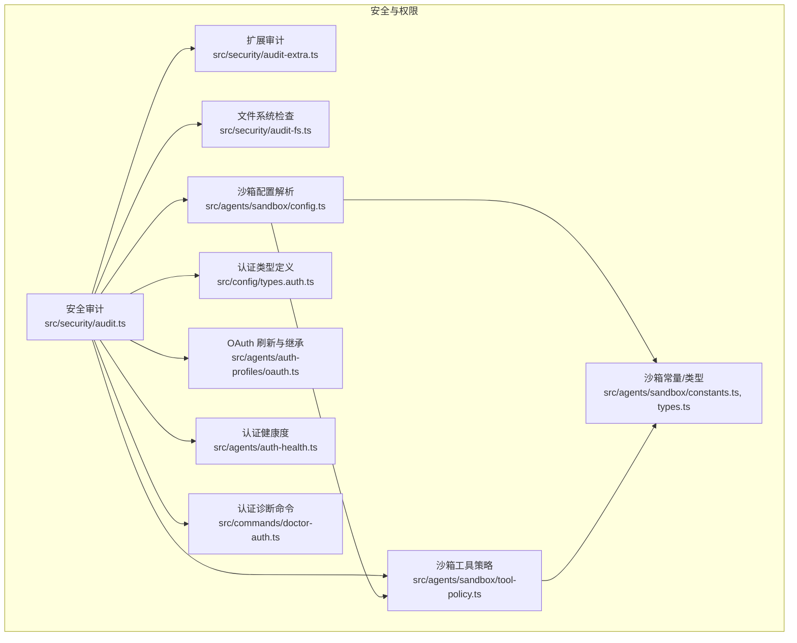
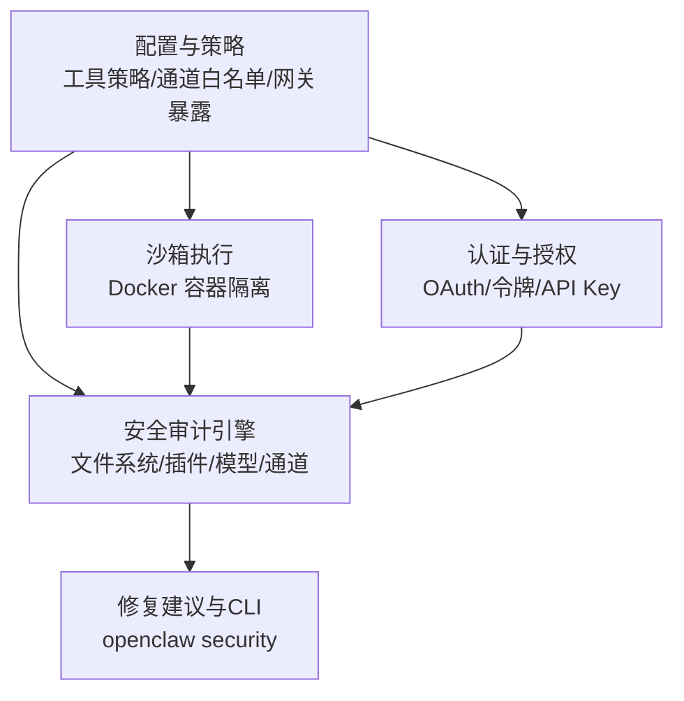
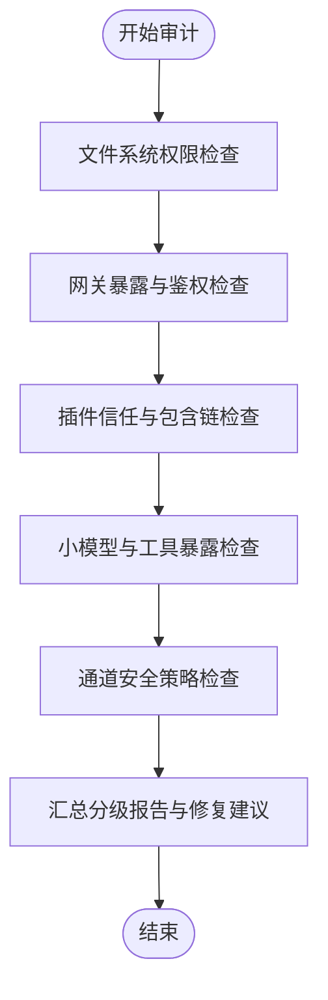
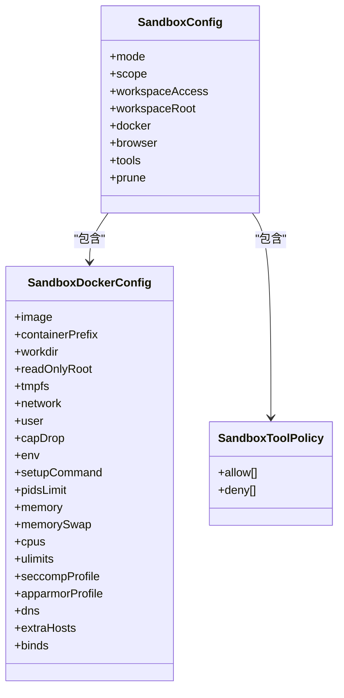
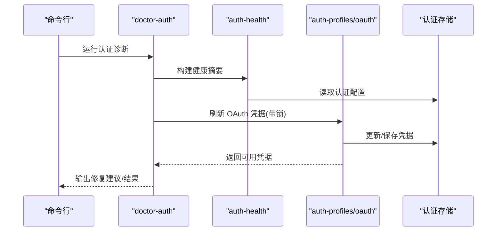
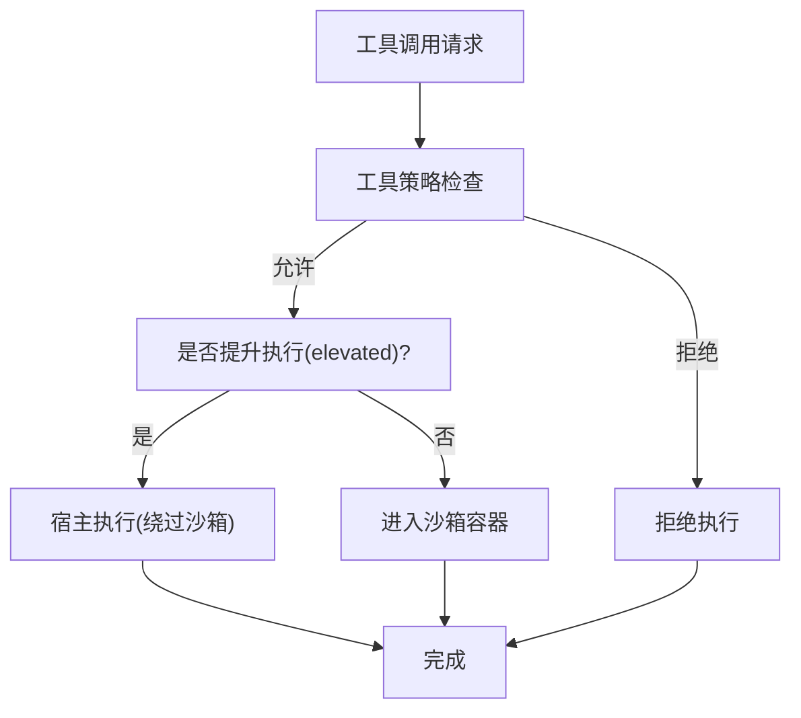
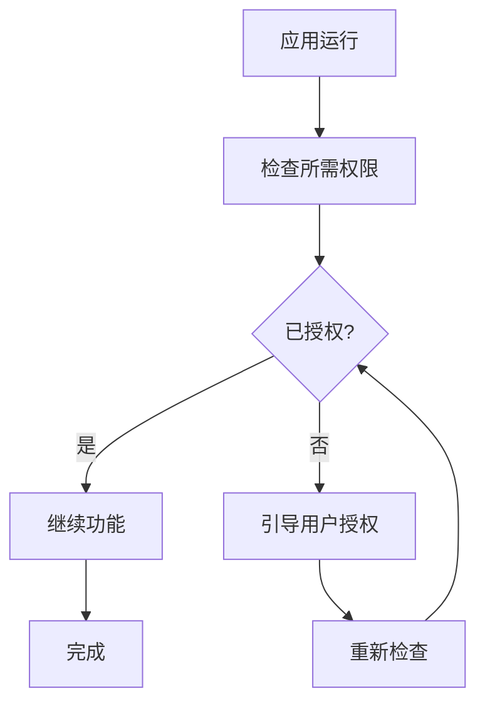
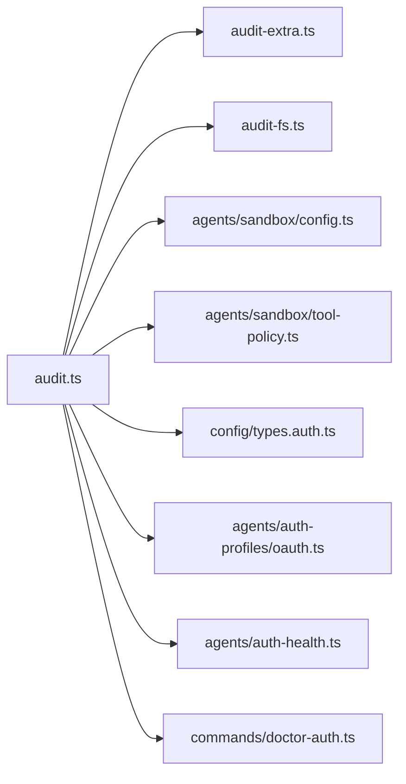

# 安全与权限

## 目录
1. [简介](#简介)
2. [项目结构](#项目结构)
3. [核心组件](#核心组件)
4. [架构总览](#架构总览)
5. [详细组件分析](#详细组件分析)
6. [依赖关系分析](#依赖关系分析)
7. [性能考量](#性能考量)
8. [故障排除指南](#故障排除指南)
9. [结论](#结论)
10. [附录](#附录)

## 简介
本文件面向 OpenClaw 的安全与权限体系，系统性梳理安全架构、认证与授权、权限白名单与工具策略、沙箱执行模型、容器化安全、执行审批与权限提升、安全审计与合规建议，并结合平台特性（macOS TCC、iOS/Android 权限模型）给出最佳实践与运维指南。

## 项目结构
围绕安全与权限的关键目录与文件：
- 安全审计与合规：`src/security/*`
- 沙箱与工具策略：`src/agents/sandbox/*`
- 认证与授权：`src/config/types.auth.ts`、`src/agents/auth-profiles/oauth.ts`、`src/agents/auth-health.ts`、`src/commands/doctor-auth.ts`
- 平台权限：`docs/platforms/mac/permissions.md`、`apps/macos/Sources/OpenClaw/PermissionManager.swift`
- 文档与参考：`docs/gateway/sandboxing.md`、`docs/cli/security.md`

## 核心组件
- 安全审计引擎：收集文件系统权限、网关暴露面、插件信任、小模型风险、浏览器控制等多类安全发现，输出分级报告与修复建议。
- 沙箱执行模型：通过 Docker 容器隔离工具执行，支持模式（`off`/`non-main`/`all`）、作用域（`session`/`agent`/`shared`）、工作区访问（`none`/`ro`/`rw`）、工具策略（`allow`/`deny`）与浏览器沙箱。
- 认证与授权：统一的认证配置类型，OAuth 凭据刷新与继承、健康度检测与诊断命令，支持令牌与 API Key 等多种凭证形态。
- 平台权限：macOS TCC 权限持久化与恢复清单；移动端平台权限模型与交互。

## 架构总览
OpenClaw 的安全由“策略—执行—审计—修复”闭环构成：
- 策略层：工具策略（全局/代理/沙箱）、通道白名单、网关暴露策略、浏览器控制策略。
- 执行层：沙箱容器隔离工具执行；非沙箱模式下工具直接在宿主执行；“提升执行”（`elevated`）绕过沙箱在宿主执行。
- 审计层：文件系统权限、配置包含链、插件信任、小模型风险、通道安全策略等自动扫描。
- 修复层：提供可选修复建议（如权限修正、策略收紧），并配套 CLI 命令。

## 详细组件分析

### 安全审计引擎
- 文件系统与配置权限检查：检测状态目录、配置文件是否对其他用户可写/可读，提供修复命令。
- 网关暴露与鉴权：校验 `gateway.bind` 与 `auth` 配置组合，识别公网暴露风险与弱口令。
- 插件信任与包含链：扫描 `extensions` 目录与配置包含链，识别未允许列表扩展带来的风险。
- 小模型与工具暴露：当小参数规模模型配合 `web_search`/`web_fetch`/`browser` 工具且未沙箱时，标记高风险。
- 通道安全策略：针对 Discord/Slack/Telegram 等通道的 DM 政策与允许列表进行一致性检查与风险提示。

### 沙箱执行模型
- 模式与作用域：`off`/`non-main`/`all`；`session`/`agent`/`shared`。
- 工作区访问：`none`/`ro`/`rw`；支持只读挂载与读写挂载。
- Docker 安全基线：默认只读根文件系统、丢弃能力、禁用网络、限制资源与 PID 数。
- 工具策略：沙箱工具策略与全局/代理工具策略合并，保留图像工具默认放行，严格 `deny` 列表。
- 浏览器沙箱：可选的 CDP/VNC/noVNC 控制，支持主机控制白名单与自动启动超时。
- 多代理覆盖：每个代理可独立覆盖沙箱与工具策略。

### 认证与授权
- 认证配置类型：支持 `api_key`、`oauth`、`token` 三种模式，以及冷却与回退窗口。
- OAuth 刷新与继承：带锁刷新、过期判断、主代理凭据继承、错误回退与医生提示。
- 认证健康度：按 `provider`/`email` 分类，区分 `expired`/`expiring`/`ok` 状态，结合刷新令牌决定告警。
- 诊断命令：列出过期/将过期/缺失的 OAuth 配置，支持一键修复。

### 执行审批与权限提升
- 提升执行（`elevated`）：明确的逃逸通道，绕过沙箱在宿主执行，仅对授权发送者生效，且按会话持久。
- 工具策略优先级：工具策略（`deny`/`allow`）先于沙箱规则生效；若被全局/代理策略拒绝，沙箱无法恢复。
- 通道白名单：`tools.elevated.allowFrom` 对各通道的允许主体进行约束，支持通配与数量阈值告警。

### 平台特定权限
- macOS TCC 权限：权限授予与签名、Bundle ID、磁盘路径强关联；变更任一要素可能导致权限丢失；提供恢复清单与 `tccutil` 重置示例。
- macOS 应用权限管理：Swift 实现的权限检查与交互式授权流程，涵盖位置、屏幕录制、Apple Events 等能力。

## 依赖关系分析
- 安全审计依赖：配置解析、通道插件、浏览器控制、文件系统权限检查、网关探测、OAuth 存储。
- 沙箱配置依赖：全局与代理配置合并、工具策略展开、默认工具白名单/黑名单。
- 认证健康度依赖：OAuth 凭据存储、时间阈值、刷新令牌存在性。

## 性能考量
- 沙箱模式选择：`all` 模式提供更强隔离但带来容器生命周期开销；`non-main` 适合日常对话，减少不必要的容器创建。
- 作用域与工作区：`shared` 作用域可降低容器数量，但需谨慎处理共享状态；`ro` 挂载可减少写放大带来的同步成本。
- 工具策略：`deny` 列表越精确，命中率越高，减少策略匹配成本。
- 审计范围：深度审计包含网关探测与文件系统遍历，建议在维护窗口执行。

## 故障排除指南
- OAuth 刷新失败：检查凭据有效期、刷新令牌是否存在、网络可达性；必要时重新授权；利用诊断命令查看健康摘要并按提示修复。
- 网关暴露风险：若绑定到非本地地址而未配置鉴权，应启用 `token`/`password` 或改为 `loopback`；Tailscale Funnel 模式应谨慎使用。
- 小模型与工具暴露：对 ≤300B 参数模型，建议启用沙箱并禁用 `web_search`/`web_fetch`/`browser` 工具。
- 插件信任：若存在扩展但未配置 `plugins.allow`，应明确允许列表，避免未受信插件加载。
- 文件系统权限：状态目录与配置文件不应对其他用户可写/可读，按修复建议调整权限或迁移到本地卷。
- macOS 权限：若权限提示消失，按恢复清单清理旧条目并重新授权；确保签名与 Bundle ID 稳定。

## 结论
OpenClaw 的安全体系以“最小权限、纵深防御、可观测修复”为核心原则：通过严格的工具策略与沙箱隔离降低执行面，借助 OAuth 健康度与诊断命令保障凭据可用性，以自动化安全审计与修复建议提升整体安全基线。平台特定权限（尤其是 macOS TCC）需配合稳定的签名与 Bundle ID 策略，确保权限持久化与可恢复性。

## 附录
- 安全审计 CLI：`openclaw security audit [--deep] [--fix]`，用于快速扫描与修复常见安全问题。
- 沙箱配置参考：`agents.defaults.sandbox` 模式、作用域、工作区访问、Docker 安全基线与工具策略。
- OAuth 最佳实践：定期刷新、避免明文存储、使用环境变量、主代理凭据继承与回退策略。