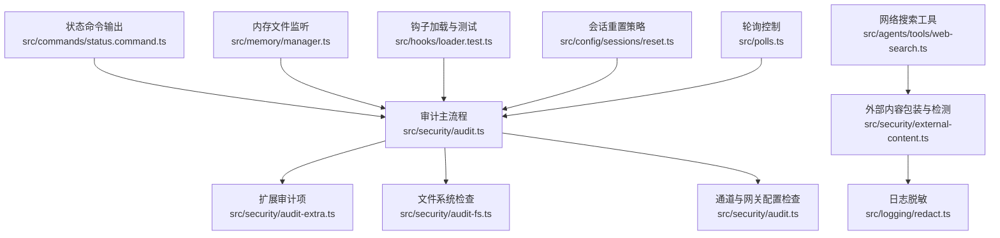
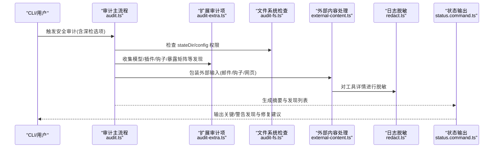
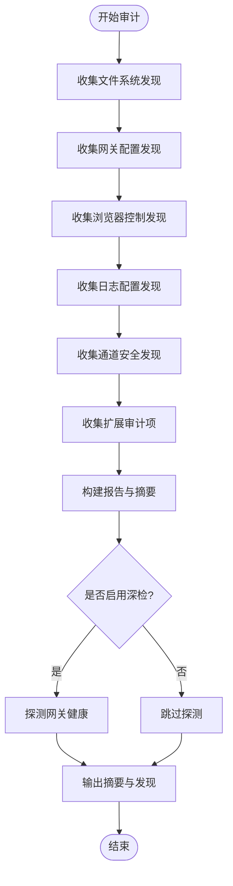
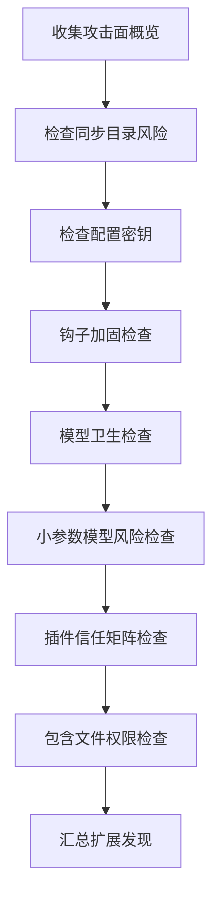
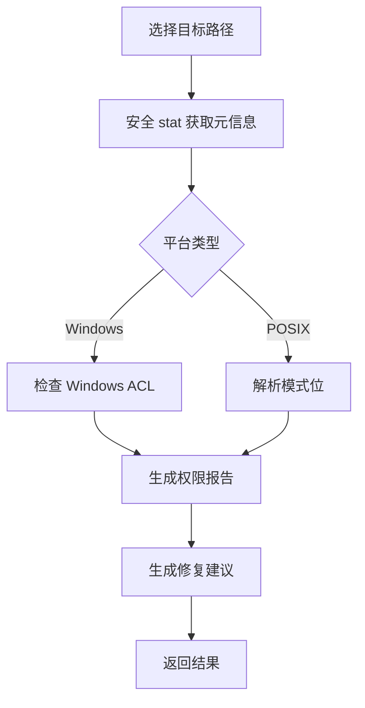
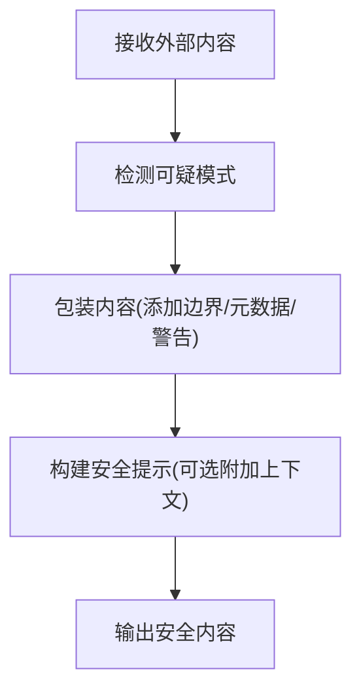
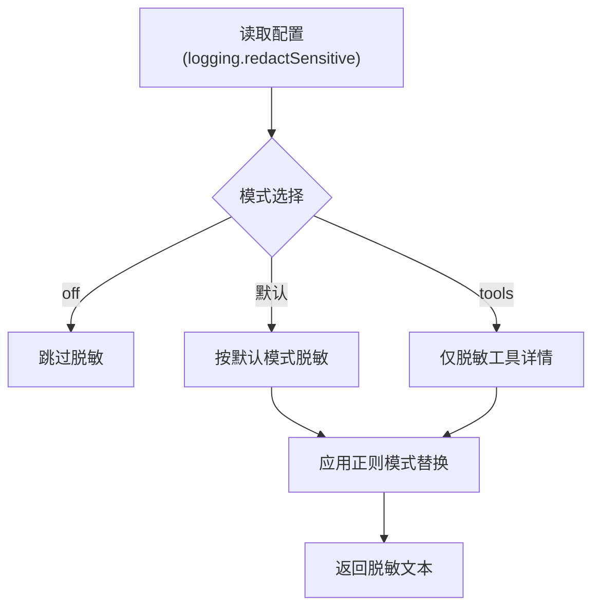
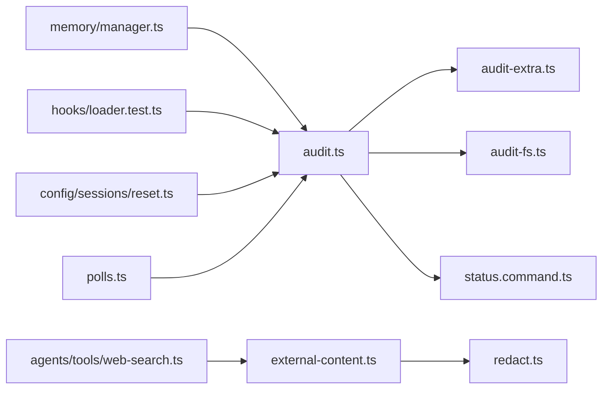

# 安全审计

## 目录
1. [引言](#引言)
2. [项目结构](#项目结构)
3. [核心组件](#核心组件)
4. [架构总览](#架构总览)
5. [详细组件分析](#详细组件分析)
6. [依赖关系分析](#依赖关系分析)
7. [性能考量](#性能考量)
8. [故障排查指南](#故障排查指南)
9. [结论](#结论)
10. [附录](#附录)

## 引言
本文件面向 OpenClaw 的安全审计系统，系统性梳理安全事件审计、文件系统监控与外部内容检查机制，明确审计日志格式、事件分类与存储策略，阐述安全扫描工具、漏洞检测与异常行为识别方法，并给出审计数据采集、分析与报告生成流程、配置示例、告警规则与响应流程，以及隐私保护、数据保留与合规建议。同时提供问题定位与性能优化建议，帮助工程团队在保障安全的同时提升可观测性与可维护性。

## 项目结构
OpenClaw 将安全审计能力分布在多个模块中：
- 审计主流程与报告：`src/security/audit.ts`
- 扩展审计项（模型、插件、权限等）：`src/security/audit-extra.ts`
- 文件系统权限检查与修复建议：`src/security/audit-fs.ts`
- 外部内容包装与注入检测：`src/security/external-content.ts`
- 日志敏感信息脱敏：`src/logging/redact.ts`
- CLI 状态展示与摘要输出：`src/commands/status.command.ts`
- 内存文件变更监听（辅助审计）：`src/memory/manager.ts`
- 钩子加载与测试（影响审计面）：`src/hooks/loader.test.ts`
- 工具链与外部接口（如网络搜索）：`src/agents/tools/web-search.ts`
- 会话重置策略（影响审计窗口）：`src/config/sessions/reset.ts`
- 轮询与周期控制（影响审计频率）：`src/polls.ts`

## 核心组件
- 审计主流程与报告
  - 定义审计严重级别、发现项与报告结构；汇总统计并输出摘要。
  - 支持深检（deep）模式探测网关连通性与健康状态。
- 扩展审计项
  - 攻击面概览、同步目录风险、配置中的密钥、钩子加固、模型卫生与小参数模型风险、插件信任矩阵、包含文件权限等。
- 文件系统检查
  - 统一跨平台权限检查（POSIX 模式位与 Windows ACL），提供修复建议与命令模板。
- 外部内容处理
  - 包装未受信外部输入，附加安全警告与边界标记；检测可疑注入模式；区分多种来源类型。
- 日志脱敏
  - 基于配置的敏感信息脱敏策略，支持工具详情脱敏与默认模式。
- CLI 状态输出
  - 在命令行中展示审计摘要、关键与警告发现，并限制显示数量以提升可读性。
- 内存文件监听
  - 监控 MEMORY.md/MEMORY 目录与额外路径变更，触发内存同步，间接支撑审计上下文一致性。
- 钩子与工具链
  - 钩子加载与触发流程对审计面有直接影响；网络搜索工具作为外部输入来源之一参与审计。

## 架构总览
下图展示了从配置到审计执行、再到报告与输出的整体流程，以及与外部内容处理、文件系统检查、日志脱敏的关系。

## 详细组件分析

### 审计主流程与报告
- 数据结构
  - 发现项包含唯一 `checkId`、严重级别、标题、详细描述与可选修复建议。
  - 报告包含时间戳、摘要（按严重级别计数）与发现列表；深检模式包含网关探测结果。
- 控制流
  - 合并文件系统、网关、浏览器控制、日志、通道安全、模型与插件等多源发现。
  - 深检模式调用网关探测函数，记录尝试、URL、结果与错误。
- 输出
  - CLI 中仅展示前若干条高优先级发现，避免信息过载。

### 扩展审计项（模型、插件、钩子、暴露矩阵）
- 攻击面概览：统计各通道组策略分布与工具/钩子/浏览器启用状态。
- 同步目录风险：若 `stateDir` 或 `configPath` 指向 iCloud/Dropbox/OneDrive/Google Drive 等，提示潜在泄露风险。
- 配置中的密钥：检测 `gateway.auth.password` 与 `hooks.token` 是否直接写入配置文件。
- 钩子加固：校验 `hooks.token` 长度、与网关 token 是否重复、基础路径是否为根路径。
- 模型卫生：识别老旧或弱模型族，建议使用更现代、更强健的模型。
- 小参数模型风险：针对小于阈值参数量的模型，若允许 `web_search`/`web_fetch`/`browser` 等不受控输入工具，则判定为高风险。
- 插件信任矩阵：当存在扩展但未设置 `plugins.allow` 时，若已启用原生技能命令，判定为高风险。
- 包含文件权限：递归解析 `include` 路径，检查其权限，防止被他人写入导致配置污染。

### 文件系统权限检查与修复建议
- 跨平台统一检查
  - POSIX：解析八进制模式位，判断世界/组可读写。
  - Windows：通过 ACL 解析，识别不受信主体的读写权限。
- 输出与修复
  - 提供详细权限描述与修复命令（`chmod` 或 `iCACLS` 重置命令）。
  - 对符号链接、软硬权限不一致等情况给出警告。

### 外部内容包装与注入检测
- 安全边界与警告
  - 使用固定边界标记包裹外部内容，并附加安全警告，强调不可将其视为系统指令。
- 注入检测
  - 预定义可疑模式集合，用于监控与记录，但内容仍会被安全包装处理。
- 来源识别与简化包装
  - 通过会话键识别钩子来源类型（邮件/Webhook/通用），提供针对网页搜索/抓取的简化包装函数。

### 日志脱敏策略
- 模式与规则
  - 支持关闭、工具详情两类模式；默认保留一组通用敏感模式。
  - 可自定义正则模式，支持全局匹配与分组替换。
- 应用范围
  - 工具详情脱敏仅在“tools”模式下生效，避免过度脱敏影响调试。
- 性能
  - 正则匹配按顺序执行，建议精简自定义模式以降低开销。

### CLI 状态输出与摘要展示
- 摘要格式化与优先级排序
  - 按严重级别计数，高危优先展示；限制显示数量，避免刷屏。
- 修复建议
  - 对关键发现提供修复建议，便于快速处置。

### 内存文件监听与审计上下文
- 监听范围
  - 监控 MEMORY.md/MEMORY 目录及额外路径，忽略符号链接，去抖后触发同步。
- 与审计关系
  - 保证审计所依赖的上下文文件保持最新，减少因文件延迟导致的误判。

### 钩子加载与测试
- 加载流程
  - 通过配置注册内部钩子处理器，支持事件触发与调用。
- 审计影响
  - 钩子的存在与加载状态会影响审计面（例如外部输入来源），需确保只加载可信钩子。

### 网络搜索工具与外部输入
- 输入规范化
  - 对新鲜度、日期范围等参数进行校验，确保请求合法。
- 审计关联
  - 网页搜索/抓取作为外部输入来源之一，应配合外部内容包装与注入检测。

### 会话重置策略与审计窗口
- 策略决定
  - 根据配置与类型重置策略，确定重置模式（如空闲）、时刻与分钟数。
- 审计意义
  - 合理的重置策略有助于缩短审计窗口，降低长期会话带来的累积风险。

### 轮询与周期控制
- 范围约束
  - 对轮询周期进行最小/最大限制，避免过短或过长导致资源浪费或漏检。
- 审计意义
  - 影响审计任务的触发频率与资源占用，需结合业务负载调整。

## 依赖关系分析
- 组件耦合
  - 审计主流程依赖扩展审计项与文件系统检查；外部内容处理依赖日志脱敏；CLI 输出依赖审计结果。
- 外部依赖
  - Windows 平台通过 ACL 工具进行权限检查；POSIX 平台通过文件系统权限 API。
- 循环依赖
  - 当前模块间无明显循环依赖，职责清晰。

## 性能考量
- 权限检查
  - Windows 平台 ACL 查询可能较慢，建议批量检查并缓存结果；POSIX 平台避免重复 stat。
- 正则匹配
  - 自定义脱敏模式应尽量简洁，避免全局贪婪匹配；优先使用锚定与限定范围的表达式。
- 外部输入处理
  - 包装外部内容时避免大文本重复拼接；必要时分块处理并尽早释放中间变量。
- 审计频率
  - 结合轮询与会话重置策略，避免过于频繁的深检；对大体量状态目录采用增量扫描。
- I/O 与监听
  - 内存文件监听开启 awaitWriteFinish 并设置合理抖动阈值，减少频繁触发。

## 故障排查指南
- 权限检查失败
  - 现象：无法获取目标路径权限信息。
  - 排查：确认路径存在且具备访问权限；Windows 平台检查 ACL 工具可用性。
  - 参考
    - `audit-fs.ts` (L30-L60)
    - `audit-fs.ts` (L62-L81)
- 深检网关失败
  - 现象：深检模式探测失败或超时。
  - 排查：检查网关绑定与认证配置、代理与 TLS 设置；确认网络可达性。
  - 参考
    - `audit.ts` (L256-L363)
- 外部内容注入风险
  - 现象：检测到可疑模式但内容仍被处理。
  - 排查：确认外部内容已通过包装函数处理；检查来源类型识别逻辑。
  - 参考
    - `external-content.ts` (L15-L64)
    - `external-content.ts` (L245-L280)
- 日志脱敏无效
  - 现象：敏感信息未被脱敏。
  - 排查：确认 `logging.redactSensitive` 模式设置；核对自定义正则是否正确。
  - 参考
    - `redact.ts` (L108-L149)
- 钩子加载异常
  - 现象：内部钩子未被触发或报错。
  - 排查：检查钩子模块路径与导出；确认事件键与处理器注册。
  - 参考
    - `loader.test.ts` (L230-L274)
- 内存文件未更新
  - 现象：审计上下文未随文件变化而刷新。
  - 排查：确认监听路径与符号链接排除逻辑；检查去抖参数设置。
  - 参考
    - `manager.ts` (L848-L882)

## 结论
OpenClaw 的安全审计体系通过“主流程 + 扩展项 + 文件系统 + 外部内容 + 日志脱敏”的组合，实现了对配置、通道、模型、插件与运行环境的全面审视。结合 CLI 摘要输出与修复建议，能够有效降低风险暴露面。建议在生产环境中启用深检与严格权限策略，强化外部输入的包装与注入检测，并根据业务负载合理设置审计频率与会话重置策略。

## 附录

### 审计日志格式与事件分类
- 日志字段
  - 时间戳、严重级别、检查标识、标题、详细描述、可选修复建议。
- 分类
  - 信息（info）：一般性提示，如攻击面概览。
  - 警告（warn）：中等风险，如权限宽松、大名单白名单、短令牌。
  - 严重（critical）：高风险，如世界可写、公开 DM、小参数模型允许不受控输入工具。
- 存储策略
  - 建议将报告持久化至受控位置，定期清理旧报告；对包含敏感信息的报告进行加密存储与访问控制。

### 审计配置示例与告警规则
- 配置要点
  - 网关绑定与认证：仅本地回环或严格认证；反向代理需配置受信代理。
  - 日志脱敏：推荐 tools 模式；必要时自定义正则。
  - 工具与钩子：最小授权原则；钩子 token 独立且足够随机。
  - 模型选择：优先现代强健模型；小参数模型禁止允许不受控输入工具。
  - 插件信任：设置 `plugins.allow` 明确白名单。
- 告警规则
  - 关键：出现“世界可写/公开 DM/小参数模型+允许不受控输入工具”即触发。
  - 警告：出现“组可写/大名单/短令牌/同步目录”即触发。
  - 信息：定期汇总“攻击面概览”。

### 响应流程
- 即时响应
  - 修复权限（`chmod`/ACL 重置）、收紧通道策略、更换短令牌、禁用不受控输入工具。
- 长期治理
  - 建立插件白名单与模型升级计划；定期执行深检与外部内容注入检测；完善日志脱敏策略。

### 隐私保护、数据保留与合规
- 隐私保护
  - 外部内容必须包装与脱敏；日志脱敏遵循最小披露原则；避免在公共渠道分享审计报告。
- 数据保留
  - 审计报告与原始日志按组织政策保留；到期后安全销毁。
- 合规
  - 参考项目安全策略与版本要求，确保 Node.js 与容器运行时满足安全基线。