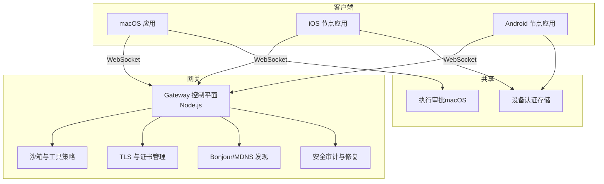
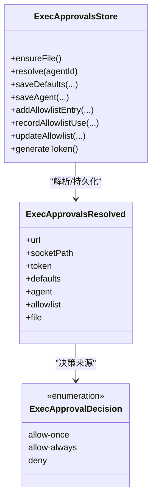
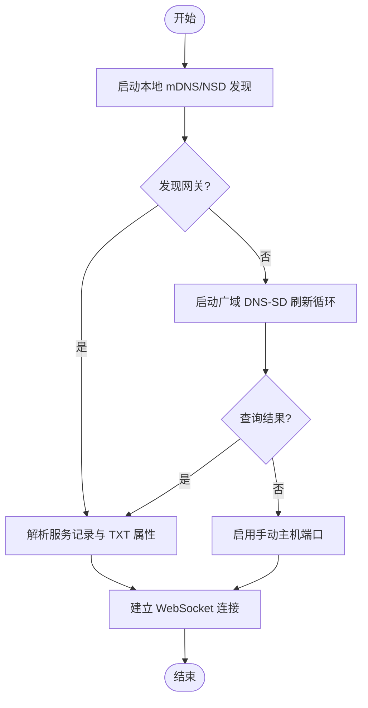
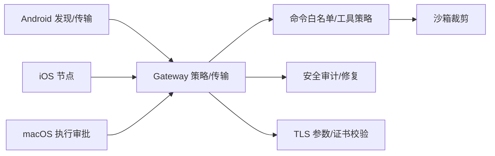

# 平台安全

## 目录
1. [简介](#简介)
2. [项目结构](#项目结构)
3. [核心组件](#核心组件)
4. [架构总览](#架构总览)
5. [详细组件分析](#详细组件分析)
6. [依赖关系分析](#依赖关系分析)
7. [性能考量](#性能考量)
8. [故障排查指南](#故障排查指南)
9. [结论](#结论)
10. [附录](#附录)

## 简介
本文件面向 OpenClaw 的平台安全机制，围绕以下目标展开：macOS TCC 权限与系统 API 沙箱、iOS 设备权限与节点模式、Android 权限与网络发现、TLS 加密通信与证书管理、Bonjour 服务发现的安全配置与隐私控制、平台特定安全约束与合规实践，并提供安全配置指南、权限请求流程、用户授权管理、平台兼容性检查、安全更新与漏洞修复流程。

## 项目结构
OpenClaw 在多平台（macOS、iOS、Android）上通过“网关（Gateway）+ 节点（Node）”架构实现本地能力与远程控制的分离。安全相关的关键位置包括：
- 客户端侧（macOS/iOS/Android）负责权限请求、节点能力暴露、本地执行审批与网络发现。
- 网关侧（Node.js）负责命令白名单、沙箱策略、TLS 配置、安全审计与修复工具。
- 共享层（Swift/Java/Kotlin）负责设备身份与凭据存储、TLS 参数构建与 Bonjour 发现。



## 核心组件
- 执行审批（macOS）
  - 通过本地 JSON 文件维护默认策略、代理策略、允许列表与令牌；支持按会话与代理维度解析与持久化。
- 设备认证存储（跨平台）
  - 统一的设备级凭据存储，支持角色归一化、作用域去重与文件权限保护。
- TLS 与证书校验（Android）
  - 支持可选的严格指纹校验、TOFU（信任你的第一印象）与稳定标识符，保障连接完整性。
- Bonjour/MDNS 发现（Android）
  - 基于 NSD 的本地发现与基于 DNS-SD 的广域发现，支持 VPN 优先与错误容忍。
- 命令白名单与沙箱策略（网关）
  - 平台默认命令集合、节点声明校验、工具策略（允许/拒绝）、沙箱裁剪与清理。
- 安全审计与修复（网关）
  - 攻击面汇总、权限修正建议与自动化修复动作。

## 架构总览
下图展示从客户端到网关的握手、权限与执行审批链路，以及安全策略在不同层级的落地方式。

```mermaid
sequenceDiagram
participant AND as "Android 节点"
participant GW as "Gateway"
participant MAC as "macOS 应用"
participant IOS as "iOS 节点"
AND->>GW : "Bonjour/MDNS 发现并建立 WS 连接"
GW-->>AND : "节点描述与能力清单"
AND->>GW : "发起配对请求"
GW-->>AND : "返回待批准请求"
AND->>GW : "批准后建立受控通道"
MAC->>GW : "system.run 请求"
GW->>MAC : "执行审批决策策略/允许列表/提示"
MAC-->>GW : "执行结果与输出"
IOS->>GW : "Canvas/相机/屏幕录制等调用"
GW-->>IOS : "命令白名单校验与节点声明匹配"
```

## 详细组件分析

### macOS TCC 权限与系统 API 沙箱
- 权限状态展示与刷新：提供权限状态列表视图，支持一键刷新与交互式请求。
- 深链接与确认流程：深链接触发时进行二次确认，避免未授权执行。
- 执行审批（`system.run`）：
  - 策略维度：安全级别（禁止/白名单/始终允许）、是否总是询问、询问回退策略。
  - 允许列表：支持路径/通配模式，记录最近使用与解析路径。
  - 令牌与本地文件：生成随机令牌，文件采用严格权限（仅属主可读写）。
  - 解析与匹配：命令解析、`PATH` 搜索、正则匹配与路径规范化。



### iOS 设备权限与节点模式
- 节点能力：Canvas、屏幕截图、相机、定位、语音唤醒、通话模式。
- 发现路径：本地 mDNS/Bonjour、跨网络尾流（Tailnet）DNS-SD、手动主机端口。
- 安全注意：后台音频可能被系统挂起，语音功能以“尽力而为”方式工作；重新安装后钥匙串配对令牌会被清除，需重新配对。

### Android 权限与网络发现
- 连接路径：NSD/mDNS（本地）、DNS-SD 广域（跨网络）、手动主机端口。
- 发现流程：本地服务发现与广域刷新循环，支持首选 VPN 网络与错误容忍。
- TLS 参数：支持指纹校验、可选 TOFU 与稳定标识符，便于跨平台一致性。



### TLS 加密通信与证书管理
- Android 端参数：
  - 可配置指纹校验、TOFU 行为与稳定标识符，用于跨设备一致的身份验证。
- macOS 端执行审批：
  - 本地文件权限严格控制，令牌随机生成并隐藏敏感字段快照。

### Bonjour 服务发现的安全配置与隐私控制
- 本地发现：通过 NSD 启动服务发现，监听服务丢失事件并更新本地缓存。
- 广域发现：基于 DNS-SD 的 PTR/SRV/TXT 查询，支持首选 VPN 网络与系统 DNS 回退。
- 隐私控制：状态文本聚合显示本地与广域结果，便于用户感知发现范围与成功率。

### 平台特定安全约束与系统 API 访问权限
- 命令白名单与节点声明校验：确保命令来自已声明节点，防止越权调用。
- 平台默认命令集：iOS/Android/macOS/Linux/Windows 分别定义基础能力集合，网关可追加或拒绝。

### 沙箱与工具策略
- 工具策略解析：支持全局/代理/默认优先级，允许/拒绝列表合并与去重。
- 沙箱配置解析：按会话/代理粒度裁剪，支持清理策略与覆盖。
- 测试与解释：提供策略命中解释与修复建议，便于诊断非主会话模式下的阻断原因。

### 设备认证与用户授权管理
- 设备级凭据存储：统一 JSON 结构，版本化、角色归一化、作用域去重与文件权限保护。
- 授权流程：节点配对请求经网关批准后建立受控通道；macOS 深链接支持带密钥的免打扰运行。

### 安全审计、平台兼容性检查与漏洞修复
- 攻击面汇总：统计渠道组策略分布、提升工具启用状态、浏览器与钩子开关等。
- 自动修复：针对配置文件与权限进行修复建议与动作执行，降低误配风险。
- 运行时要求：Node.js 版本与安全补丁清单，容器安全建议（只读根文件系统、丢弃多余能力）。

## 依赖关系分析
- 客户端到网关：Bonjour/NSD 与 DNS-SD 作为发现层，WebSocket 作为传输层；Android 提供 TLS 参数构建，macOS 提供执行审批与权限映射。
- 策略与执行：网关侧命令白名单与工具策略决定可用能力；macOS 执行审批决定系统命令是否允许。
- 安全工具：审计与修复脚本贯穿配置与权限层面，形成闭环。



## 性能考量
- 发现轮询与错误容忍：Android 广域刷新采用固定间隔与异常吞吐，避免阻塞 UI。
- 命令白名单与策略解析：采用集合运算与预编译模式，减少每次调用的开销。
- 执行审批：本地文件读写采用原子写入与最小化 IO，避免频繁落盘。

## 故障排查指南
- macOS
  - 深链接未授权：检查密钥参数与确认流程；必要时在设置中调整执行审批策略。
  - 权限未生效：通过权限监控界面刷新状态，或在引导页重新请求。
- Android
  - 发现失败：确认 mDNS 是否被防火墙阻断，启用广域 DNS-SD 或手动主机端口。
  - TLS 校验失败：核对指纹与 TOFU 设置，确保稳定标识符一致。
- 网关
  - 命令被拒绝：检查命令白名单与节点声明；查看沙箱解释输出以定位阻断原因。
  - 安全风险：运行安全审计与修复脚本，修正权限与配置问题。

## 结论
OpenClaw 在多平台实现了“发现—传输—策略—执行”的分层安全设计：客户端负责权限与节点能力暴露，网关负责命令与工具策略、沙箱裁剪与 TLS 校验，配套审计与修复工具保障配置正确性。通过严格的执行审批、指纹校验与权限最小化，平台在保证易用性的同时兼顾安全性与合规性。

## 附录
- 安全配置指南
  - macOS：在“设置 → 执行审批”中配置安全级别、询问策略与允许列表；深链接运行前进行确认。
  - iOS：确保在“设置”中启用所需能力；跨网络使用 Tailnet 与 DNS-SD。
  - Android：启用本地发现或广域 DNS-SD；在 TLS 配置中选择合适的指纹校验策略。
- 平台兼容性检查
  - 使用网关 CLI 的 `discover` 与 `doctor` 命令检查发现路径与配置健康度。
- 安全更新与漏洞修复
  - 定期升级 Node.js 至最新 LTS；运行安全审计与修复脚本，修正权限与配置问题。