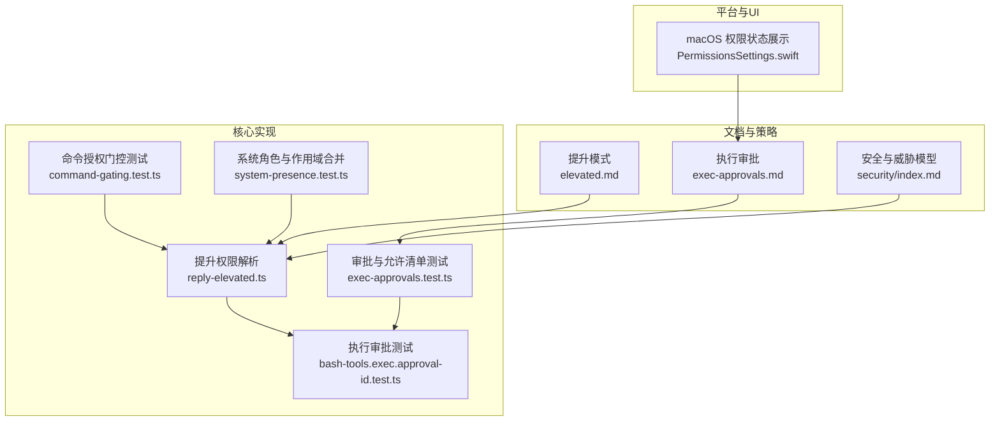
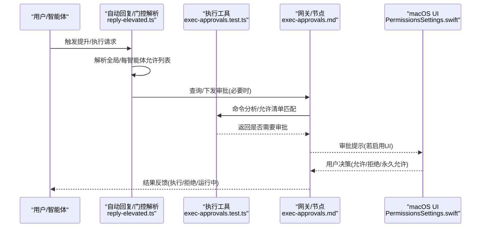
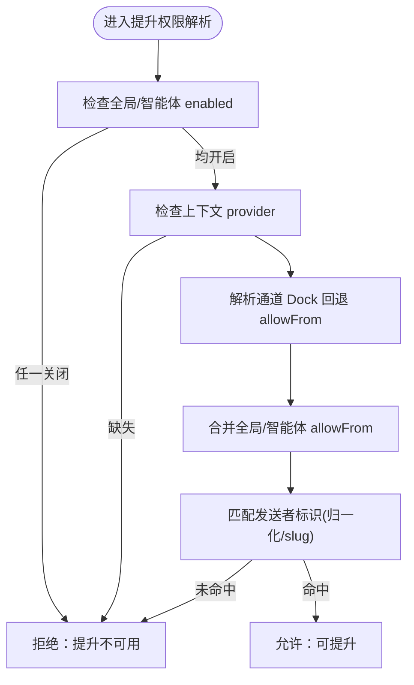
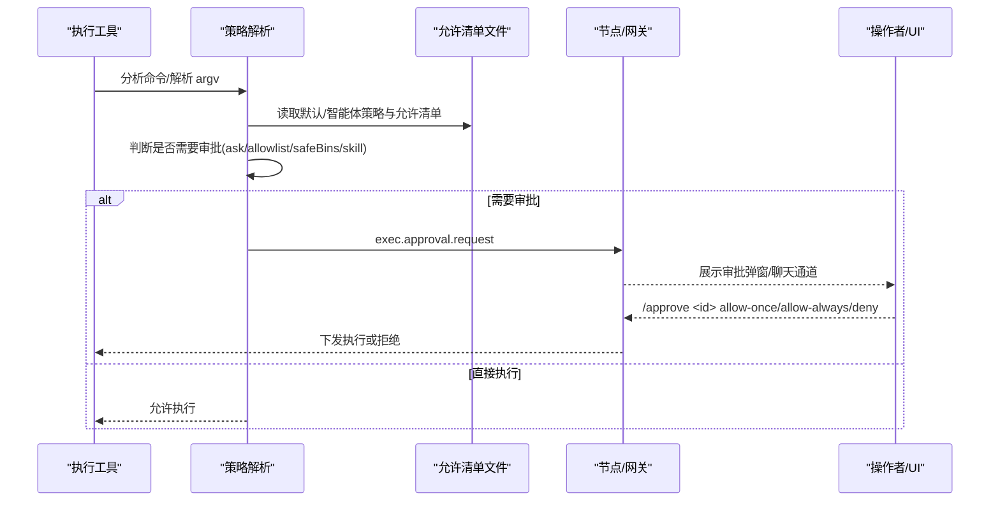
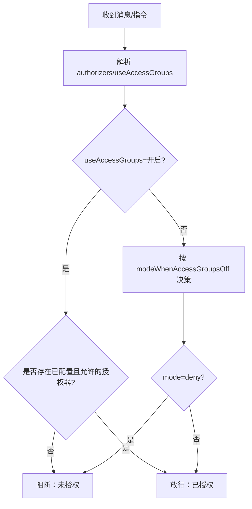
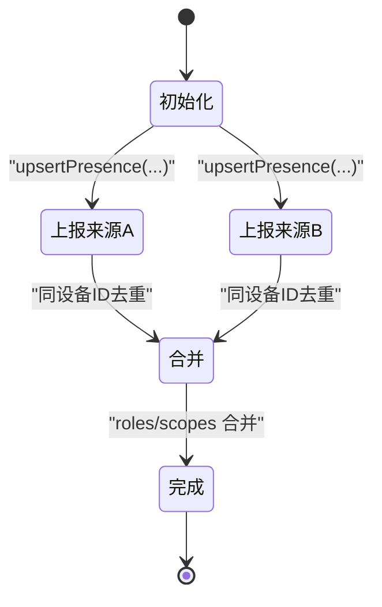
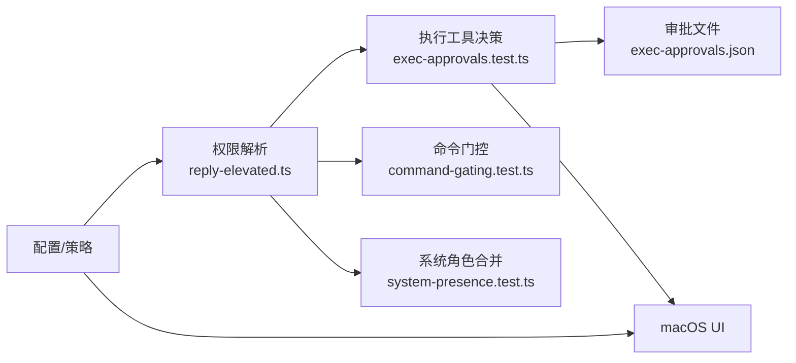

# 权限管理

## 目录
1. [简介](#简介)
2. [项目结构](#项目结构)
3. [核心组件](#核心组件)
4. [架构总览](#架构总览)
5. [详细组件分析](#详细组件分析)
6. [依赖关系分析](#依赖关系分析)
7. [性能考量](#性能考量)
8. [故障排查指南](#故障排查指南)
9. [结论](#结论)
10. [附录](#附录)

## 简介
本文件系统化梳理 OpenClaw 的权限管理体系，围绕“执行审批机制、权限提升流程与访问控制策略”，给出从策略定义、生命周期、实现细节到运维实践的完整技术文档。重点覆盖：
- 权限申请、审批与撤销的全生命周期
- 不同类型权限级别（普通、管理员、系统）与组合规则
- 权限继承、角色分配与权限组合
- 权限配置示例、批量管理工具与审计日志
- 权限冲突解决、权限缓存与权限验证机制
- 常见问题与安全风险治理

## 项目结构
OpenClaw 的权限管理由“策略文档 + 核心实现 + 平台 UI + 测试校验”四部分协同构成：
- 文档层：提供策略规范与用户指引（如提升模式、执行审批）
- 实现层：在自动回复、工具执行、通道授权等模块中落地策略
- 平台层：macOS 应用提供权限状态展示与交互
- 测试层：覆盖审批决策、允许清单匹配、命令解析与安全边界

## 核心组件
- 提升模式与允许列表：通过全局与每智能体的 `allowFrom` 配置，结合通道 Dock 回退策略，决定是否允许提升执行与审批豁免。
- 执行审批：在网关主机或节点主机侧，依据安全级别、询问策略与允许清单进行决策，并支持 UI 或聊天通道审批转发。
- 命令授权门控：根据通道授权列表与访问组策略，判定斜杠命令与指令是否生效。
- 系统角色与作用域：跨来源合并设备的角色与作用域，形成统一的系统存在状态。

## 架构总览
OpenClaw 的权限架构以“策略文档 + 门控解析 + 执行审批 + 平台交互”为主线，形成“策略-解析-执行-审计”的闭环。

## 详细组件分析

### 组件A：提升模式与权限继承
- 功能要点
  - 提升模式支持 on/off/ask/full 四态，其中 full 跳过审批，ask/on 保留审批。
  - 全局与每智能体的 `allowFrom` 双重门控，均需满足；支持通道 Dock 回退策略。
  - 仅在沙箱环境下改变执行位置与审批行为；非沙箱直接在主机执行。
- 生命周期
  - 会话级状态：通过指令设置当前会话默认提升级别。
  - 消息级指令：消息内指令仅对该条消息生效。
  - 全局默认：配置中的 `agents.defaults.elevatedDefault`。
- 允许列表匹配
  - 支持多字段归一化与 slug 化，匹配发送者名称、账号、标签、号码等。
  - 支持通配符与回退策略（如 Discord 未配置时回退到 DM 允许列表）。

### 组件B：执行审批与允许清单
- 策略与存储
  - 审批配置位于执行主机的本地 JSON 文件，包含默认策略、每智能体覆盖与允许清单。
  - 支持安全级别（deny/allowlist/full）、询问策略（off/on-miss/always）与回退策略。
- 命令解析与允许清单
  - 对 shell 命令进行分段解析，支持管道与链式命令；拒绝命令替换、反引号等高危语法。
  - 允许清单支持路径精确匹配与 `**` 通配；basename-only 条目会被忽略。
  - 支持“安全二进制”（stdin-only）与技能自动放行。
- 审批流程
  - 当 ask=always 或 on-miss 且未命中允许清单时触发审批；UI 或聊天通道均可审批。
  - 审批 ID 与执行 `runId` 关联，便于系统事件追踪。

### 组件C：命令授权门控与访问控制
- 命令授权模型
  - 斜杠命令与指令仅对已授权发送者生效；授权来源于通道允许列表/配对与访问组策略。
  - 当 `useAccessGroups` 开启且无授权器配置时，默认拒绝；可通过 `modeWhenAccessGroupsOff` 控制宽松/严格。
- 控制命令门控
  - 若未授权且存在控制类命令，应阻断；当文本命令开关关闭时，不阻断。

### 组件D：系统角色与作用域合并
- 设备角色与作用域
  - 多源存在信息按设备维度去重与合并，确保 operator/node 等角色与 system.run 等作用域正确聚合。
- 场景意义
  - 为系统级权限（如远程节点执行）提供统一的权限视图，避免重复或遗漏。

### 组件E：平台权限状态展示与交互
- macOS 应用提供权限状态列表，支持逐项授权与刷新。
- 与执行审批配合：当 UI 可用时，审批弹窗在应用内展示；UI 不可用时采用 ask 回退策略。

## 依赖关系分析
- 策略依赖
  - 提升模式依赖全局与每智能体 `allowFrom` 配置，以及通道 Dock 回退策略。
  - 执行审批依赖策略文件与命令解析结果，二者共同决定是否需要 UI/聊天通道审批。
- 模块耦合
  - 自动回复模块负责权限解析与失败原因格式化；执行模块负责命令分析与允许清单匹配；UI 模块负责审批交互。
- 外部集成
  - 节点主机通过本地 IPC 与 UI 协作；macOS 应用提供系统级权限与审批界面。

## 性能考量
- 命令解析与允许清单匹配
  - 采用分段解析与路径匹配，避免对未知命令进行昂贵的外部调用；允许清单命中后可直接放行，减少 UI 交互成本。
- 缓存与回退
  - 允许清单与策略文件按需加载；UI 不可用时采用 ask 回退策略，避免长时间等待。
- 并发与超时
  - 审批超时按策略配置，超时即拒绝，保障系统响应性。

## 故障排查指南
- 提升不可用
  - 检查全局与每智能体的 enabled 与 `allowFrom` 是否满足；查看失败门控键值定位问题。
  - 使用 CLI `sandbox explain` 查看会话沙箱与权限状态。
- 审批未触发或误触发
  - 核对 ask 与 security 策略；确认命令解析是否通过（链式命令、引号处理）；检查允许清单与安全二进制配置。
- 命令被拒绝
  - 检查通道授权列表与访问组策略；确认 `useAccessGroups` 与 `modeWhenAccessGroupsOff` 配置。
- 系统角色缺失
  - 检查多源存在上报是否合并成功；确认设备 ID 一致与去重逻辑。

## 结论
OpenClaw 的权限管理以“策略明确、门控清晰、执行可控、审计可循”为核心，通过提升模式、执行审批与命令门控三道防线，结合平台 UI 与系统角色合并，构建了可配置、可观测、可恢复的权限体系。建议在生产环境中：
- 优先使用 allowlist 与 ask-on-miss，严格限制允许清单；
- 明确每智能体的提升权限与通道 Dock 回退策略；
- 启用系统事件与审计日志，定期进行安全审计；
- 对高风险命令与节点执行实施更严格的门控与审批。

## 附录
- 权限级别与组合规则
  - 普通权限：受限于工具策略与沙箱；执行命令需满足 allowlist 或安全二进制。
  - 管理员权限：通过系统角色与作用域合并体现，具备 operator/admin 等能力。
  - 系统权限：system.run 等系统级操作需节点配对与 UI 审批。
- 权限配置示例
  - 提升模式：`tools.elevated.enabled` 与 `allowFrom.`；每智能体可进一步限制。
  - 执行审批：`exec.security`、`exec.ask`、`askFallback`、`autoAllowSkills`、`allowlist`。
- 批量管理工具
  - 通过 Control UI 与 CLI（`openclaw approvals`）编辑默认与每智能体策略；支持目标选择（Gateway/Node）。
- 审计日志
  - 系统事件包括 Exec running/finished/denied；审批 ID 与 `runId` 关联，便于追踪。