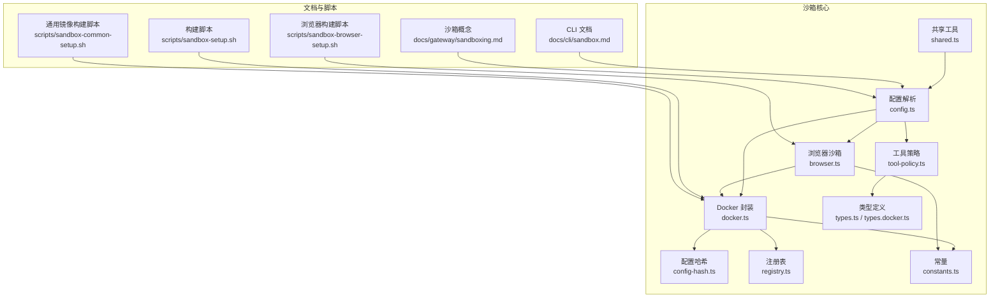
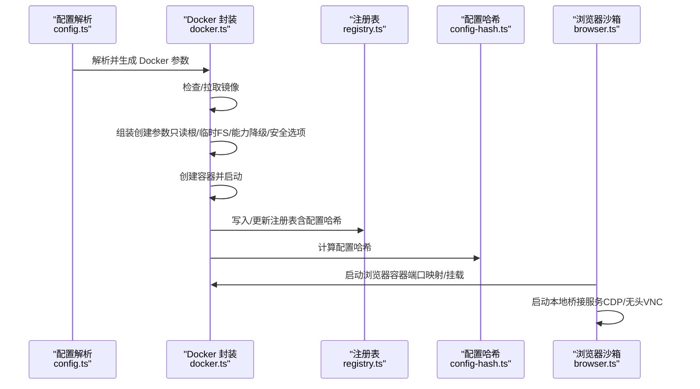
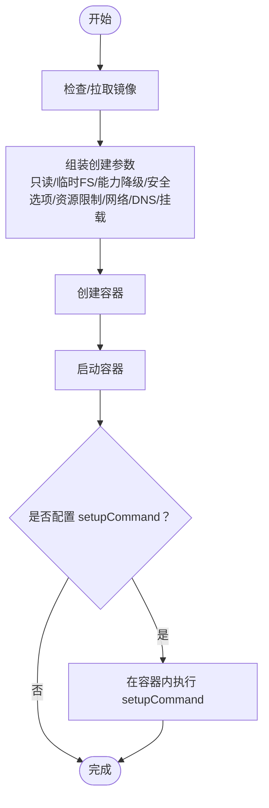
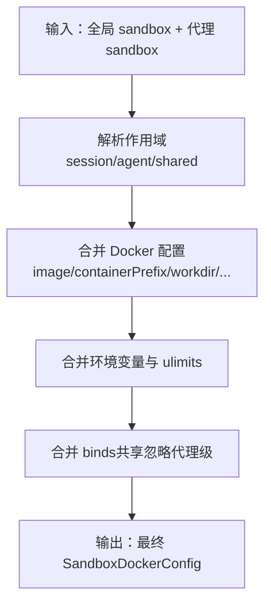
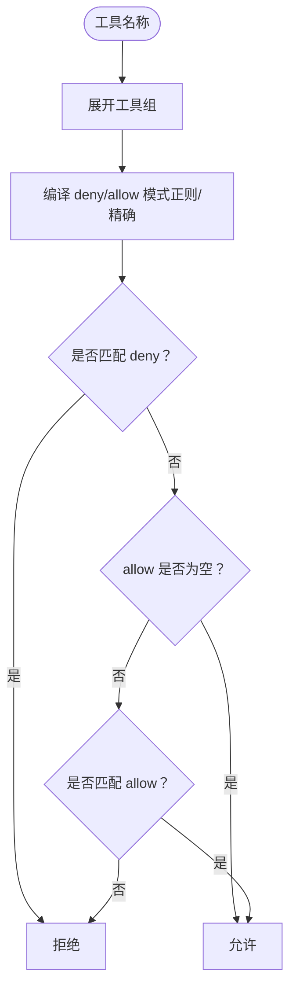
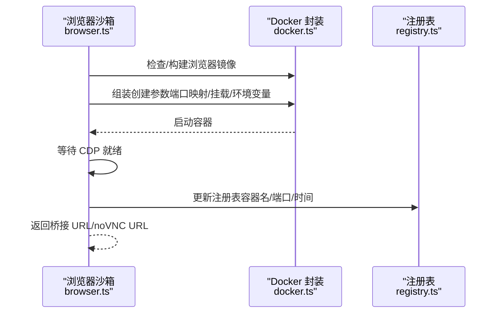
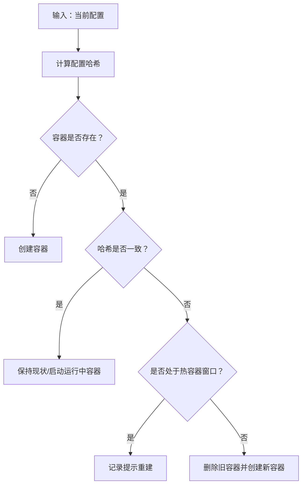
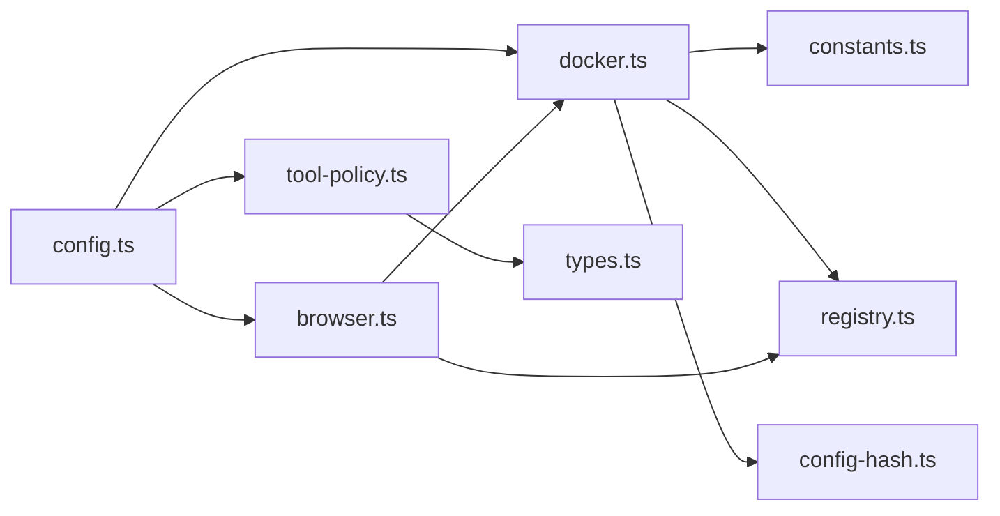

# 沙箱安全

## 目录
1. [简介](#简介)
2. [项目结构](#项目结构)
3. [核心组件](#核心组件)
4. [架构总览](#架构总览)
5. [详细组件分析](#详细组件分析)
6. [依赖关系分析](#依赖关系分析)
7. [性能考量](#性能考量)
8. [故障排除指南](#故障排除指南)
9. [结论](#结论)
10. [附录](#附录)

## 简介
本文件面向 OpenClaw 的沙箱安全系统，聚焦于基于 Docker 的容器化执行环境、进程隔离与资源限制、配置管理与权限白名单、访问控制策略、代理工具执行边界、文件系统隔离与网络访问控制、沙箱启动流程、镜像管理与安全扫描建议、配置示例、性能优化与故障排除，以及安全审计、入侵检测与异常行为监控的实践建议。

## 项目结构
围绕沙箱功能的关键代码位于 `src/agents/sandbox` 下，涵盖 Docker 集成、配置解析、工具策略、浏览器桥接、注册表与哈希校验等模块；配套文档位于 `docs/cli` 与 `docs/gateway`；镜像构建脚本位于 `scripts`。

## 核心组件
- Docker 容器生命周期与参数生成：负责镜像检查、容器创建/启动、挂载与安全选项注入、资源限制、标签与配置哈希写入。
- 配置解析与合并：按作用域（会话/代理/共享）合并全局与代理级沙箱配置，计算最终 Docker 参数。
- 工具策略：基于允许/拒绝模式匹配，支持通配符与组展开，确保在沙箱内仍可使用必要工具。
- 浏览器沙箱：通过专用镜像与端口映射，提供 CDP/无头 VNC 访问，并与本地桥接服务交互。
- 注册表与哈希：持久化容器元数据与配置哈希，用于变更检测与热容器窗口提示。
- 常量与共享工具：默认镜像、前缀、工作目录、默认工具白名单/黑名单、路径与命名规则。

## 架构总览
下图展示从配置到容器运行、再到工具策略与浏览器桥接的整体流程。

## 详细组件分析

### Docker 容器化执行与安全参数
- 镜像管理：自动检查默认镜像是否存在，不存在则拉取基础镜像并打标签；其他镜像需显式存在。
- 安全强化：默认启用 no-new-privileges；可选 seccomp/AppArmor 策略；能力集降级（cap-drop）；只读根文件系统；tmpfs 临时目录。
- 资源限制：支持 pids-limit、memory/memory-swap、cpus、ulimits（软硬限制）。
- 网络与 DNS：默认无网络，可通过 network、dns、extraHosts 控制；浏览器容器额外暴露 CDP/VNC 端口。
- 挂载策略：主工作区与代理工作区挂载，支持只读；自定义 binds 合并（全局+代理），注意敏感路径仅读。
- 启动命令：容器以 sleep infinity 运行，便于后续 exec；可选 setupCommand 在首次创建后执行。

### 配置管理与作用域
- 作用域：session（每会话）、agent（每代理）、shared（共享）。容器名由前缀+作用域键生成，支持会话键 slug 化。
- 配置合并：全局 sandbox 与代理级 sandbox 合并，优先级为代理级覆盖全局；环境变量与 ulimits 合并；binds 合并（共享作用域忽略代理级）。
- 默认值：默认镜像、容器前缀、工作目录、tmpfs、网络 none、能力降级 ALL、默认工具白名单/黑名单等。
- 工作区访问：none（沙箱工作区）、ro（代理工作区只读）、rw（代理工作区读写）。

### 工具策略与访问控制
- 策略来源：代理级 > 全局 > 默认；默认允许 exec/process/read/write/edit/apply_patch/image 等；默认拒绝 browser/canvas/nodes/cron/gateway 及通道 ID。
- 模式匹配：支持精确匹配与通配符（*），内部编译为正则；支持工具组展开。
- 特殊处理：在沙箱会话中，若未显式允许/拒绝 image，则强制加入允许列表，保障多模态工作流。
- 应用顺序：先拒后允；deny 优先于 allow；未配置 allow 时默认允许。

### 浏览器沙箱与安全边界
- 启用条件：需开启 browser.enabled 且工具策略允许 browser。
- 镜像与端口：默认专用浏览器镜像；暴露 CDP（固定端口）与可选 noVNC（非无头模式）；仅绑定 127.0.0.1。
- 自动启动与可达性：可自动等待 CDP 就绪；失败则报错。
- 桥接服务：本地启动桥接服务，连接容器 CDP；复用现有桥接或重建；记录注册表信息（容器名、端口、时间戳）。
- 安全要点：仅本地回环访问；端口映射动态解析；headless/noVNC 可控；允许主机控制需显式开关。

### 配置哈希与容器重建策略
- 哈希输入：docker 配置、workspaceAccess、工作区路径（主/代理）。
- 哈希计算：对输入标准化后进行 SHA-1；容器标签与注册表均保存。
- 热容器窗口：最近使用过的容器在配置变更时给出“重建”提示而非直接删除，避免中断用户会话。
- 重建触发：当配置哈希不一致且非热容器，或容器不存在/停止时触发。

### 文件系统隔离与挂载策略
- 主工作区挂载：指向容器工作目录；根据 workspaceAccess 决定是否只读。
- 代理工作区挂载：可选择挂载到 /agent（只读/读写），禁用写类工具。
- 自定义 binds：全局与代理级合并；共享作用域忽略代理级；敏感路径建议只读。
- tmpfs：默认挂载 /tmp、/var/tmp、/run，减少持久化痕迹。

### 网络访问控制
- 默认无网络（network: none），适合最小暴露面。
- 可通过 docker.network、dns、extraHosts 调整；浏览器容器仅暴露 CDP/VNC。
- 建议：如需外网，明确指定网络与 DNS；避免开放宿主 Docker Socket 或敏感路径。

### 沙箱启动流程与镜像管理
- 构建脚本：提供一键构建默认与浏览器镜像的脚本；通用镜像脚本可安装常用工具链与包管理器。
- 镜像策略：默认镜像不含 Node，需要时通过自定义镜像或 setupCommand 安装；浏览器镜像独立构建。
- 容器命名：前缀+作用域键（会话键 slug 化），长度截断至 63 字符。

### 安全扫描与合规建议
- 镜像扫描：建议在 CI 中对默认与通用镜像执行静态扫描（漏洞与许可证），并纳入镜像签名与供应链安全流程。
- 权限最小化：默认能力降级、只读根、no-new-privileges、seccomp/AppArmor；谨慎使用自定义 binds。
- 日志与审计：结合注册表记录容器生命周期与配置哈希；在网关侧记录工具调用与沙箱上下文。
- 异常监控：对频繁重建、端口映射失败、CDP 不可达、资源限制触发等事件建立告警。

## 依赖关系分析
- 模块耦合：config.ts 作为中枢，驱动 docker.ts、tool-policy.ts、browser.ts；docker.ts 依赖 constants.ts、registry.ts、config-hash.ts；browser.ts 依赖 docker.ts 与 registry.ts。
- 外部依赖：Docker CLI；Node 子进程；文件系统（注册表 JSON）。
- 循环依赖：未见循环；各模块职责清晰。

## 性能考量
- 资源限制：合理设置 memory/memory-swap、cpus、ulimits，避免宿主资源争用。
- tmpfs 使用：大量临时文件写入 tmpfs，减少磁盘 IO 并降低持久化风险。
- 容器复用：热容器窗口避免频繁重建；注册表记录使用时间，便于清理策略。
- 网络开销：默认无网络可显著降低出站流量与连接数；按需开启网络与 DNS。
- 浏览器容器：无头模式与 noVNC 关闭可节省资源；仅在需要可视化时启用。

## 故障排除指南
- 容器无法启动/端口映射失败：检查浏览器 CDP 端口映射与可达性；确认容器已启动且 CDP 就绪。
- 配置变更未生效：使用 CLI 命令强制重建相关容器；或等待下次使用时自动重建。
- 镜像缺失：构建默认镜像或浏览器镜像；确保镜像存在后再启动。
- 工具被拒绝：检查工具策略（allow/deny）与来源（代理/全局/默认）；必要时调整策略。
- 自定义 binds 导致权限问题：确认挂载路径与模式；敏感路径仅读；避免暴露宿主 Docker Socket。
- 热容器窗口提示：根据提示执行重建，避免因配置哈希不一致导致行为异常。

## 结论
OpenClaw 的沙箱安全体系通过严格的 Docker 安全参数、细粒度的工具策略、可配置的作用域与工作区访问、以及完善的注册表与哈希校验，实现了对代理工具执行的有效隔离与控制。配合文档化的 CLI 管理与脚本化的镜像构建，既保证了安全性，也兼顾了可运维性。建议在生产环境中进一步完善镜像扫描、日志审计与异常监控，持续加固安全边界。

## 附录

### 配置示例（最小启用）
- 将 `agents.defaults.sandbox.mode` 设为 "non-main"，`scope` 设为 "session"，`workspaceAccess` 设为 "none"，即可在非主会话中启用沙箱。

### 镜像与构建
- 默认镜像：openclaw-sandbox:bookworm-slim
- 浏览器镜像：openclaw-sandbox-browser:bookworm-slim
- 通用镜像：可安装常用工具链与包管理器，便于多语言技能运行。

### 安全审计与异常监控建议
- 审计日志：记录容器创建/删除、配置哈希变化、工具调用、浏览器 CDP 访问、端口映射状态。
- 入侵检测：监控异常重建频率、失败的 CDP 探测、非预期的自定义 binds、超限资源使用。
- 异常行为：对频繁变更配置、长时间占用 CPU/内存、异常网络出站等建立阈值告警。