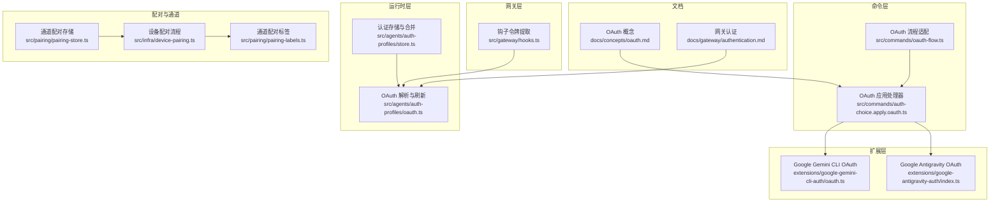
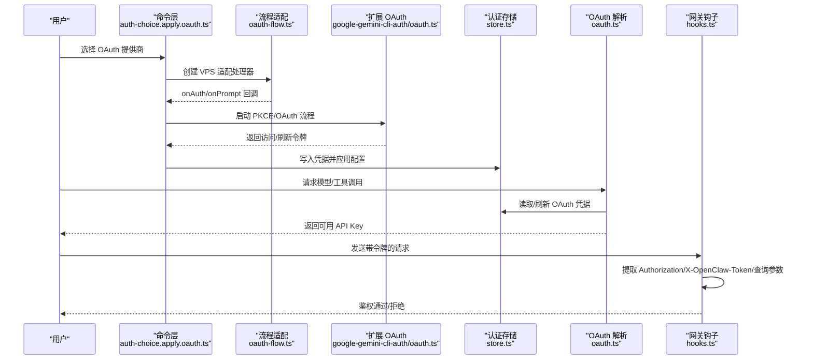
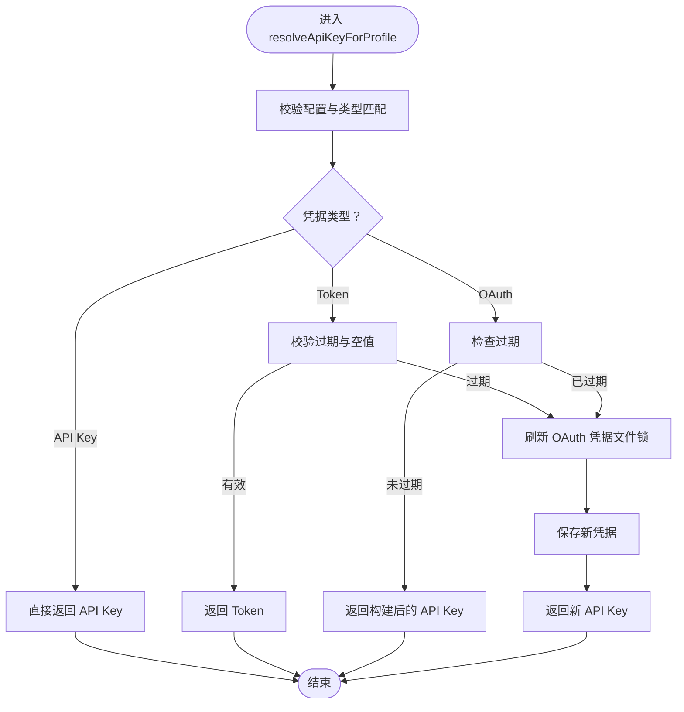
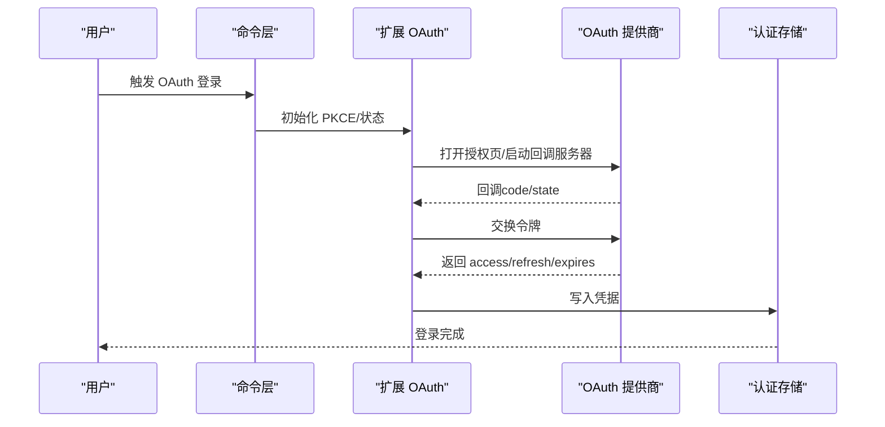
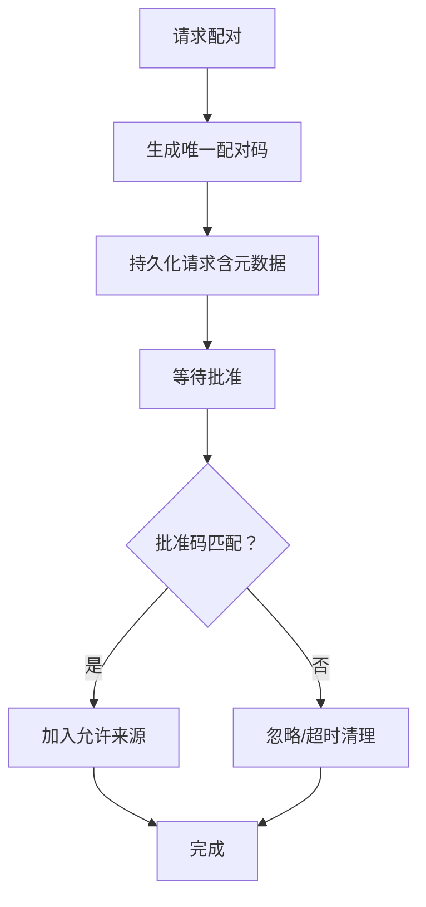
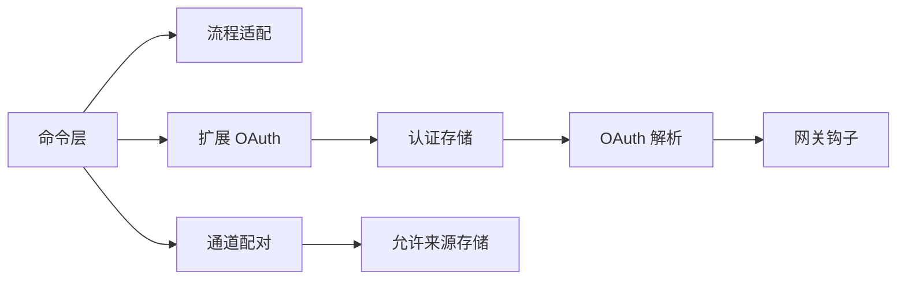

# 认证与授权

## 目录
1. [简介](#简介)
2. [项目结构](#项目结构)
3. [核心组件](#核心组件)
4. [架构总览](#架构总览)
5. [详细组件分析](#详细组件分析)
6. [依赖关系分析](#依赖关系分析)
7. [性能考量](#性能考量)
8. [故障排除指南](#故障排除指南)
9. [结论](#结论)
10. [附录](#附录)

## 简介
本文件面向 OpenClaw 的认证与授权体系，覆盖以下主题：
- OAuth 2.0 认证流程（含 PKCE、回调捕获、刷新与存储）
- API 密钥管理与多账户路由
- 设备配对与通道授权
- 第三方服务集成：GitHub Copilot、Google Gemini、Anthropic Claude 等
- 多渠道认证支持：WhatsApp、Telegram、Discord 等
- 认证中间件、令牌提取与权限边界检查
- 安全最佳实践与常见问题排查

## 项目结构
OpenClaw 将认证能力分布在多个层次：
- 文档层：提供 OAuth 流程、存储位置与多账户模式说明
- 命令层：封装 OAuth 流程、环境检测与 VPS 适配
- 扩展层：针对特定提供商的 OAuth 实现（如 Google Gemini CLI、Google Antigravity）
- 运行时层：认证存储、令牌解析与刷新
- 网关层：钩子令牌提取与权限边界
- 配对与通道层：设备配对、通道白名单与 QR 登录

## 核心组件
- OAuth 存储与解析：统一从认证存储中读取凭据，按需刷新并返回可用的 API Key；支持多账户与会话级覆盖
- OAuth 流程适配：自动判断本地/远程环境，选择浏览器自动回调或手动粘贴回调 URL
- 第三方 OAuth 扩展：内置 Google Gemini CLI 与 Antigravity 的 OAuth 实现，支持 PKCE、项目发现与用户信息获取
- 钩子令牌提取：从 Authorization 头、自定义头或查询参数中提取令牌，用于网关钩子鉴权
- 设备与通道配对：生成一次性配对码、记录允许来源、支持 QR 登录与通道标签解析

## 架构总览
下图展示从用户触发到令牌生效的关键路径，涵盖 OAuth 流程、存储与刷新、以及网关钩子令牌提取。

## 详细组件分析

### OAuth 令牌解析与刷新
- 存储位置与版本化：每个代理拥有独立的认证存储，支持从外部 CLI 同步，并在加载时进行兼容性迁移
- 刷新策略：基于过期时间判断是否需要刷新；刷新过程使用文件锁保证并发安全；失败时尝试主代理继承与回退逻辑
- 多账户路由：支持全局顺序与会话级覆盖，便于多账号隔离与轮换

### OAuth 流程适配（VPS/远程环境）
- 自动检测：根据环境判断是否需要手动粘贴回调 URL
- 浏览器打开与回调捕获：本地环境自动打开浏览器并监听回调端口；远程环境提示用户复制粘贴
- 统一回调处理：提供 `onAuth` 与 `onPrompt` 回调，供扩展实现使用

### 第三方 OAuth 扩展（Google Gemini CLI 与 Antigravity）
- Google Gemini CLI OAuth
  - 支持 PKCE、本地回调与手动模式
  - 自动发现项目 ID 并处理 VPC/SC 环境差异
  - 提取用户邮箱与构建 API Key 结构
- Google Antigravity OAuth
  - 使用内置客户端 ID/密钥与多端点探测项目 ID
  - 输出默认模型与使用提示

### 钩子令牌提取与权限边界
- 支持三种来源：Authorization 头（Bearer）、自定义头 `X-OpenClaw-Token`、查询参数 `token`
- 用于网关钩子的最小权限边界检查，避免令牌泄露与滥用

### 设备配对与通道授权
- 通道配对存储：为每个通道维护独立的配对请求与允许来源列表，支持 TTL 清理与上限裁剪
- 设备配对流程：生成请求、分配一次性配对码、批准后写入允许来源
- 通道标签解析：根据通道类型解析配对标识（如 WhatsApp 的 JID）

### 多渠道认证支持（WhatsApp、Telegram、Discord）
- WhatsApp：支持 QR 登录与连接状态监控，提供登录开始与等待结果的数据结构
- Telegram：支持机器人探测、Webhook 状态与运行状态监控
- Discord：支持机器人探测与运行状态监控

## 依赖关系分析
- 命令层依赖流程适配与扩展 OAuth 实现
- 运行时层依赖认证存储与解析模块
- 网关层依赖钩子令牌提取
- 配对层依赖通道适配器与允许来源存储

## 性能考量
- 文件锁与并发控制：认证存储与配对存储均采用文件锁，避免竞态；建议在高并发场景下减少频繁刷新
- 刷新策略：仅在过期时刷新，且使用原子写入与临时文件，降低损坏风险
- 通道配对裁剪：对过期与超额请求进行清理，保持存储规模可控

## 故障排除指南
- “无凭据”或“令牌过期/即将过期”
  - 使用状态检查命令确认当前使用的凭据与过期状态
  - 如为 OAuth，尝试重新登录或检查提供商回调
- “令牌被撤销/随机登出”
  - OpenClaw 将认证存储作为“令牌水槽”，避免同一用户/应用同时持有多个刷新令牌导致互相失效
  - 若跨设备/CLI 登录，请确保使用一致的凭据来源
- “远程/VPS 环境无法自动回调”
  - 使用手动模式：在本地浏览器完成授权后，粘贴回调 URL 或授权码
- “Google 项目 ID 缺失”
  - Gemini CLI/ Antigravity 需要明确设置项目 ID；若账户受限于 VPC/SC，需按提示调整
- “通道配对码无效/超时”
  - 检查配对请求是否过期；通道配对请求有 TTL 限制与上限裁剪

## 结论
OpenClaw 的认证与授权体系以“集中存储 + 分层刷新 + 多账户路由”为核心，结合 VPS 友好的 OAuth 流程与严格的文件锁保障，实现了稳定可靠的多提供商、多通道认证方案。通过钩子令牌提取与通道配对机制，系统在安全性与可用性之间取得平衡，适合在多种部署环境中使用。

## 附录
- 认证配置示例（参考文档）
  - OAuth 令牌交换与存储位置：参见概念文档中的 OAuth 页面
  - 网关认证与 API Key 管理：参见网关认证页面
- 安全最佳实践
  - 使用文件锁与原子写入保护认证存储
  - 在远程/VPS 环境使用手动 OAuth 模式
  - 明确设置 Google Cloud 项目 ID，避免请求失败
  - 定期检查与清理过期配对请求
- 常见问题速查
  - 令牌过期：使用状态检查命令定位并重新登录
  - 跨设备冲突：遵循“令牌水槽”设计，避免同时持有多个刷新令牌
  - 通道配对：注意配对码有效期与上限