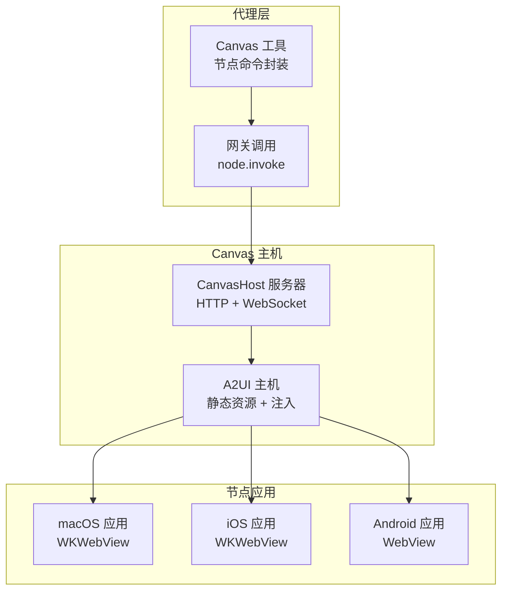
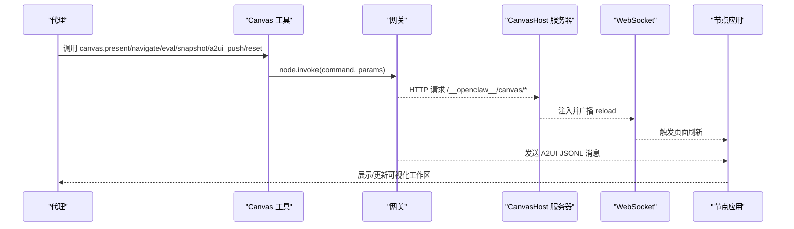
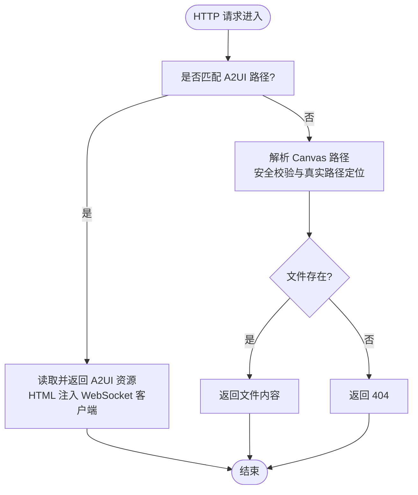
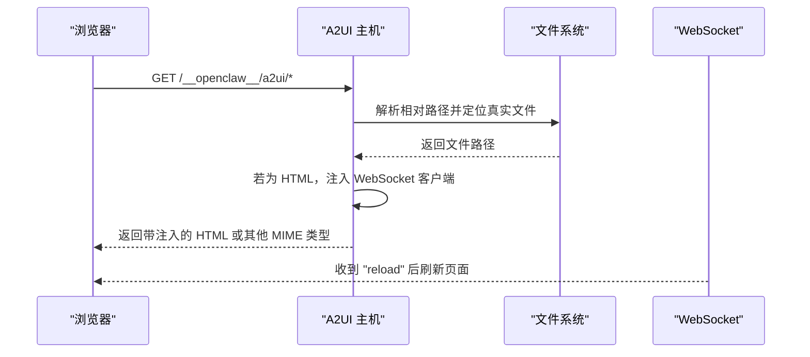
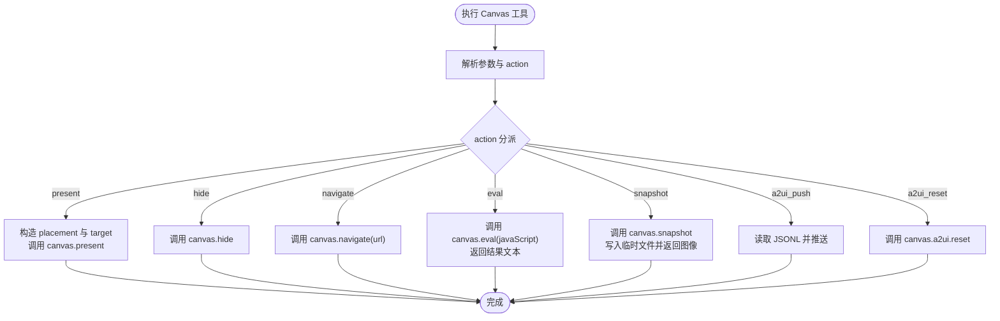
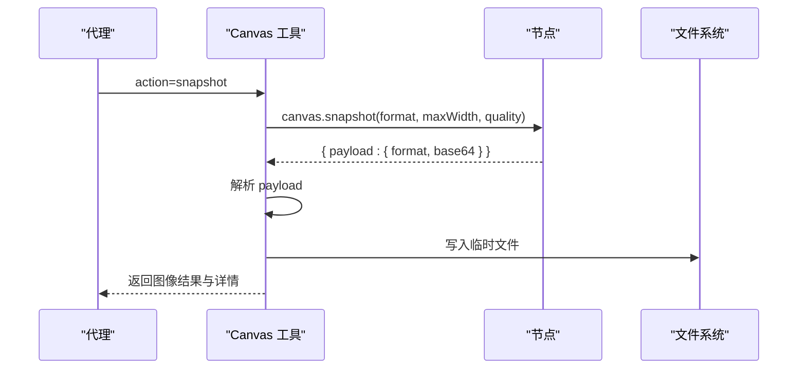
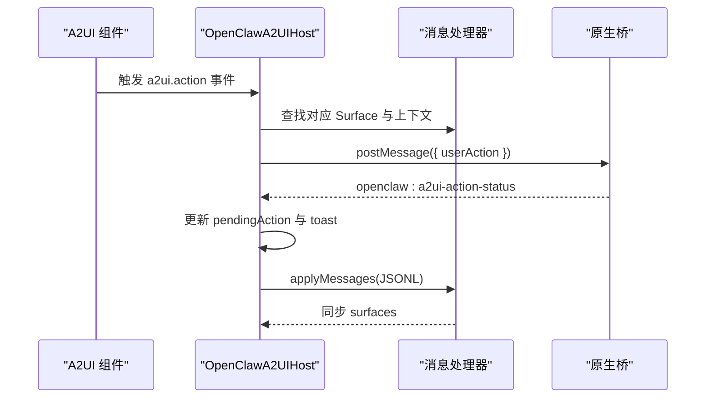
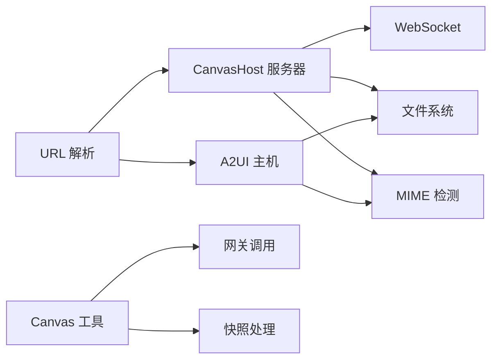

# Canvas 渲染系统

## 目录
1. [简介](#简介)
2. [项目结构](#项目结构)
3. [核心组件](#核心组件)
4. [架构总览](#架构总览)
5. [详细组件分析](#详细组件分析)
6. [依赖关系分析](#依赖关系分析)
7. [性能考虑](#性能考虑)
8. [故障排除指南](#故障排除指南)
9. [结论](#结论)
10. [附录](#附录)

## 简介
本文件为 OpenClaw Canvas 渲染系统的全面技术文档，涵盖 A2UI 主机服务器架构、Canvas 渲染管道、可视化工作区管理、代理活动控制、快照捕获与存储机制、Canvas 与浏览器集成方式、渲染优化与性能考量，以及可视化工具实现原理、用户交互处理与状态同步机制。同时提供 Canvas 工具开发指南（自定义渲染器创建、资源管理与调试技巧）、实际使用示例、最佳实践与性能调优建议。

## 项目结构
Canvas 子系统由以下关键部分组成：
- Canvas 主机服务器：基于 Node.js HTTP 服务器与 WebSocket，提供静态资源服务与实时刷新能力
- A2UI 主机：承载 A2UI v0.8 消息协议，驱动可视化工作区渲染
- 代理工具：提供 Canvas 控制命令（展示/隐藏/导航/脚本执行/截图/A2UI 推送/重置）
- 节点桥接与 URL 解析：在不同网络绑定模式下生成正确的 Canvas 访问 URL
- 平台集成：macOS 应用通过 WKWebView 承载 Canvas，支持本地文件与外部 URL

## 核心组件
- CanvasHost 服务器：负责 HTTP 静态文件服务、WebSocket 升级、文件变更监听与自动刷新注入
- A2UI 主机：解析并安全地提供 A2UI 资产目录，向 HTML 注入 WebSocket 客户端以实现热重载
- Canvas 工具：抽象节点命令，统一处理 `present`/`hide`/`navigate`/`eval`/`snapshot`/`a2ui_push`/`a2ui_reset`
- 快照处理：解析 Canvas 截图负载，生成临时文件并返回图像结果
- URL 解析：根据网关绑定策略生成 Canvas 主机访问 URL，支持 http/https 与主机名规范化

## 架构总览
Canvas 渲染系统采用“主机-桥接-节点”的三层架构：
- Canvas 主机：提供静态资源与 WebSocket 通道，支持本地文件热重载
- 节点桥接：通过网关将 Canvas URL 与 A2UI 消息推送到各平台节点
- 节点应用：在 macOS/iOS/Android 中以 WKWebView/WebView 承载 Canvas 内容

## 详细组件分析

### CanvasHost 服务器
- 功能要点
  - HTTP 服务器：处理静态资源请求，支持路径规范化与安全校验
  - WebSocket 升级：仅接受特定路径的升级请求，建立与客户端的实时通信
  - 文件监听：使用 chokidar 监控根目录变化，触发页面自动刷新
  - 默认索引：若缺失则自动生成默认 index.html
- 关键流程
  - 请求进入时优先尝试 A2UI 资源处理，再交由 CanvasHost 处理
  - WebSocket 连接建立后，向客户端广播 "reload" 指令
  - 错误处理：记录运行时错误并返回标准响应码

### A2UI 主机与注入机制
- A2UI 资产解析：多候选路径定位，确保开发与分发场景均可用
- 安全加载：禁止符号链接与越界访问，严格限制在根目录内
- 热重载注入：向 HTML 注入 WebSocket 客户端，监听 "reload" 指令自动刷新
- 平台适配：根据 UA 或参数设置数据属性，适配 Android 等平台样式差异

### Canvas 工具与代理活动控制
- 命令抽象：统一 `action` 参数，支持 `present`/`hide`/`navigate`/`eval`/`snapshot`/`a2ui_push`/`a2ui_reset`
- 参数校验：使用 TypeBox Schema 校验输入，确保必要字段存在
- 网关调用：通过 `node.invoke` 将命令转发至目标节点
- 结果处理：对 `eval` 返回文本结果，对 `snapshot` 生成临时图像文件并返回

### 快照捕获与存储机制
- 快照格式：支持 `png`/`jpg`/`jpeg`，默认 `png`
- 负载解析：从网关返回的 `payload` 中提取 `format`/`base64`
- 临时文件：生成唯一文件名，扩展名为 `.jpg` 或 `.png`，便于后续上传或展示
- 图像结果：返回图像类型与 MIME，供代理工具链使用

### Canvas 与浏览器集成
- 路径前缀：`/__openclaw__/canvas/` 作为 Canvas 资源根路径
- WebSocket：`/__openclaw__/ws` 用于热重载通知
- 平台桥接：iOS 通过 `window.webkit.messageHandlers`，Android 通过全局接口 `postMessage`
- 调试状态：可通过查询参数启用调试状态面板，显示标题与副标题

### 可视化工具实现原理与状态同步
- A2UI v0.8 协议：支持 `beginRendering`/`surfaceUpdate`/`dataModelUpdate`/`deleteSurface`
- 消息处理器：`OpenClawA2UIHost` 维护 Surface 映射，接收 JSONL 并更新 UI
- 用户动作：捕获 `a2ui.action` 事件，构造 `userAction` 并通过原生桥发送
- 状态反馈：监听 `openclaw:a2ui-action-status`，更新 `pendingAction` 与 `toast` 提示

### Canvas 工具开发指南
- 自定义渲染器创建
  - 在 Canvas 主机根目录放置 HTML/CSS/JS 文件，利用 `/__openclaw__/canvas/` 前缀访问
  - 开启 `liveReload` 以便快速迭代（默认开启）
- 资源管理
  - 使用相对路径与 `index.html` 作为入口页
  - 避免符号链接与跨目录访问，确保安全性
- 调试技巧
  - 通过 WebSocket 注入观察页面自动刷新
  - 使用调试状态面板查看标题与副标题
  - 在 macOS 文档中了解自定义 URL scheme 与会话目录结构

## 依赖关系分析
- CanvasHost 服务器依赖
  - chokidar：文件监控与热重载
  - ws：WebSocket 升级与连接管理
  - mime 检测：根据文件扩展名确定 Content-Type
- A2UI 主机依赖
  - 文件系统：安全解析与 realpath 校验
  - MIME 检测：动态设置响应头
- Canvas 工具依赖
  - 网关调用：通过 `node.invoke` 执行节点命令
  - 快照处理：解析 `payload` 并写入临时文件
- URL 解析依赖
  - HostHeader 解析与 Forwarded-Proto 判断，支持 https 推断

## 性能考虑
- 文件监控策略
  - 使用 `awaitWriteFinish` 与稳定性阈值减少抖动
  - 测试环境下启用轮询模式，避免文件系统不兼容问题
- WebSocket 连接
  - 仅在指定路径允许升级，降低无效连接开销
  - 注入的 WebSocket 仅在 HTML 页面中生效，避免不必要的广播
- 资源服务
  - 对 HTML 注入最小化脚本，避免影响渲染性能
  - 缓存控制设置为 `no-store`，确保开发期即时更新
- 平台适配
  - Android 与 iOS 的消息桥接采用平台特定优化，减少序列化成本

## 故障排除指南
- 白屏或内容未加载
  - 检查网关绑定模式与端口占用，确认使用完整主机名而非 localhost
  - 使用 curl 直接测试 URL 是否可访问
- “node required”或“node not connected”
  - 确保在命令中指定 `node` 参数，并检查节点在线状态
- 内容未更新
  - 确认 `liveReload` 已启用且文件位于 `canvas root` 目录
  - 查看日志中的 watcher 错误信息并缩小监控范围
- 快照无效
  - 确认 `payload` 包含 `format` 与 `base64` 字段，否则抛出异常

## 结论
OpenClaw Canvas 渲染系统通过清晰的三层架构实现了跨平台的可视化工作区管理。CanvasHost 服务器与 A2UI 主机提供了稳定的静态资源与消息协议支撑，代理工具统一了节点命令的调用方式，快照与热重载机制显著提升了开发效率。结合平台适配与安全策略，系统在易用性与可靠性之间取得了良好平衡。

## 附录

### 实际使用示例
- 展示本地 HTML：使用 `canvas action:present` 指定 `target` URL
- 导航到新页面：使用 `canvas action:navigate` 指定 `url`
- 执行脚本：使用 `canvas action:eval` 指定 `javaScript`
- 截图保存：使用 `canvas action:snapshot` 获取 base64 图像
- 推送 A2UI：使用 `canvas action:a2ui_push` 推送 JSONL 消息
- 重置工作区：使用 `canvas action:a2ui_reset` 清空所有 Surface

### 最佳实践
- 保持 HTML 自包含（内联 CSS/JS），提升跨平台兼容性
- 使用默认 `index.html` 作为测试页，内置桥接诊断信息
- canvas 持久化直到显式 `hide` 或导航离开
- 开发阶段启用 `liveReload`，提高迭代速度
- A2UI JSON 推送处于开发中，当前推荐使用 HTML 文件

### 性能调优建议
- 减少监控目录层级，避免大量子目录导致的文件系统压力
- 合理设置 `awaitWriteFinish` 的稳定性阈值，平衡刷新及时性与系统负载
- 在生产环境谨慎开启 `liveReload`，优先使用预构建资源
- 对于 Android 平台，尽量减少复杂 DOM 结构与重绘操作