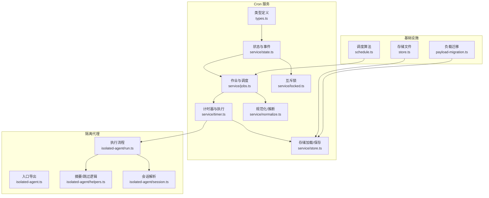
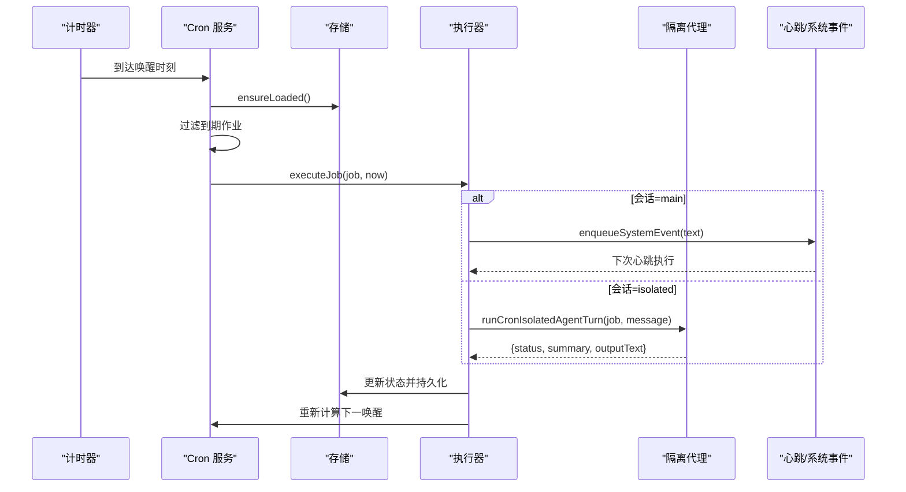
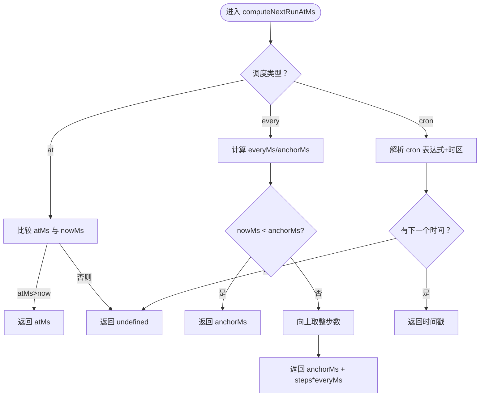
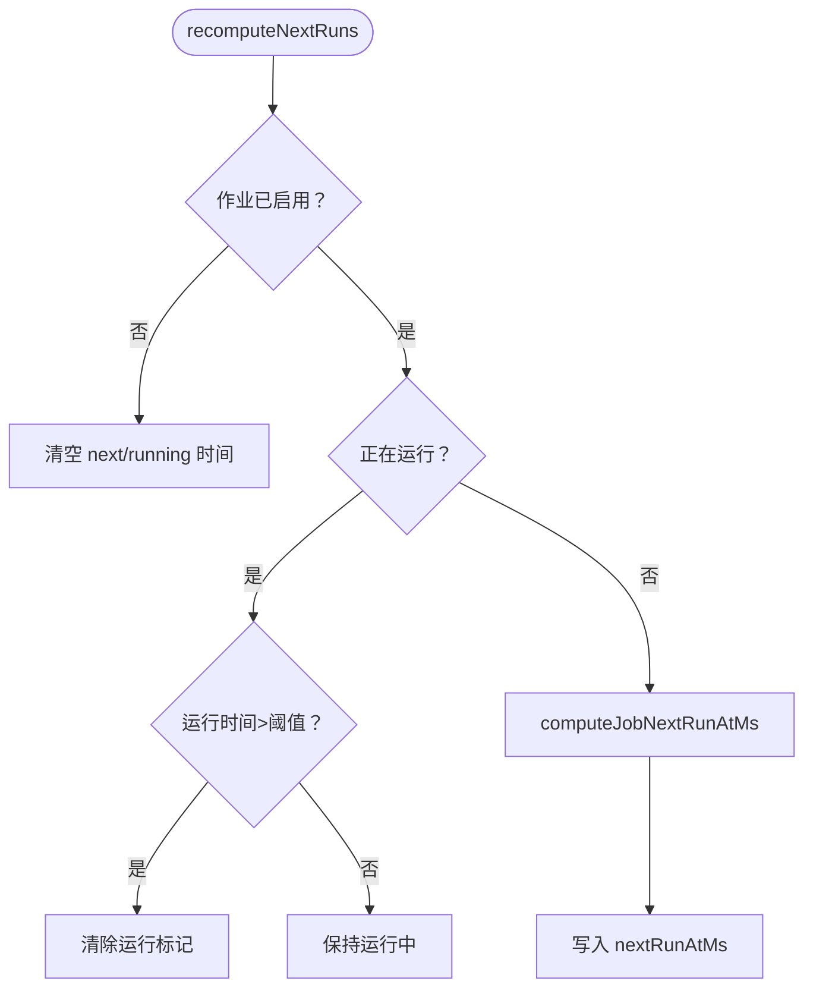
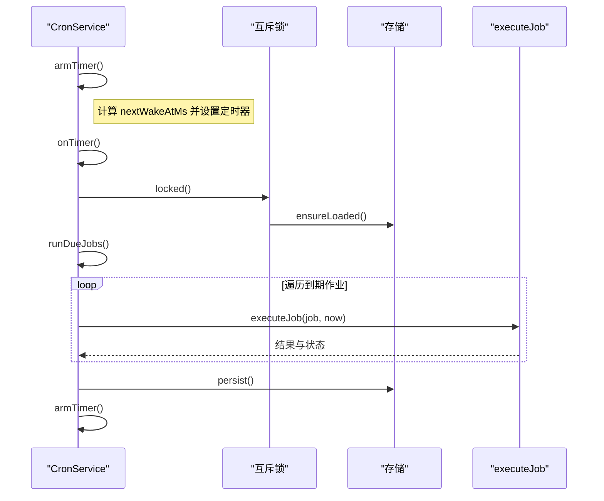
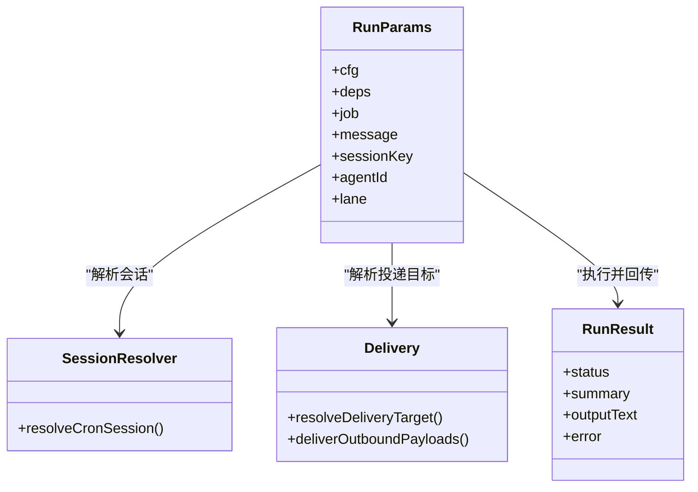
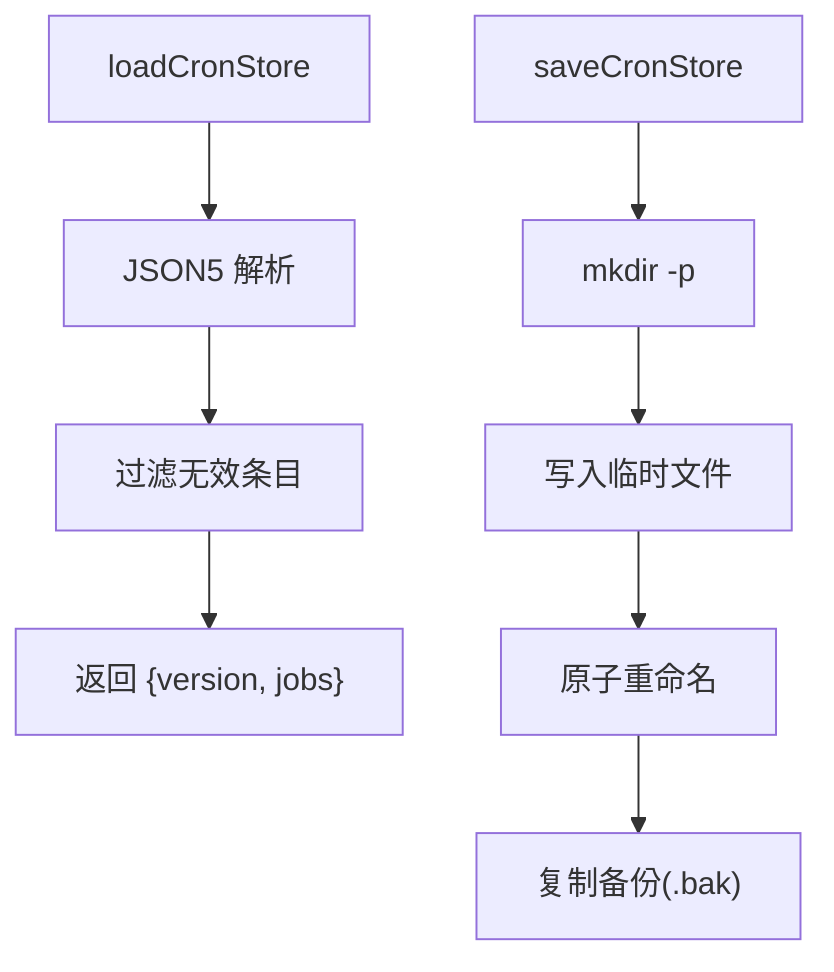
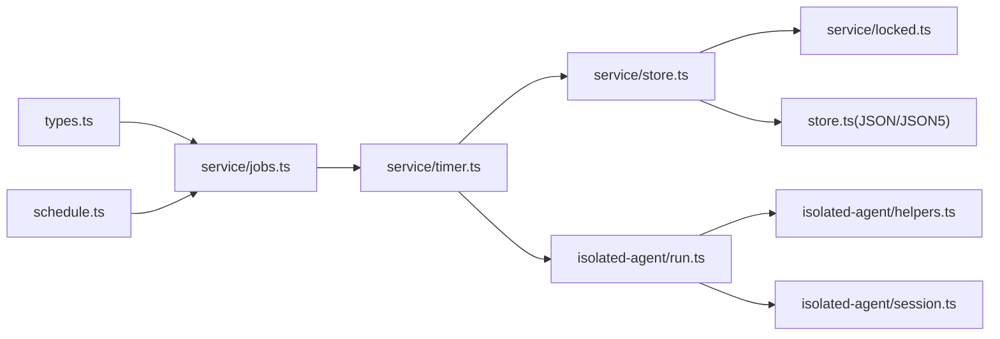

# 定时任务系统

## 目录
1. [简介](#简介)
2. [项目结构](#项目结构)
3. [核心组件](#核心组件)
4. [架构总览](#架构总览)
5. [详细组件分析](#详细组件分析)
6. [依赖关系分析](#依赖关系分析)
7. [性能考量](#性能考量)
8. [故障排查指南](#故障排查指南)
9. [结论](#结论)
10. [附录：开发与实践指南](#附录开发与实践指南)

## 简介
本文件面向 OpenClaw 的定时任务系统（Cron），系统性梳理其服务架构、调度算法、任务执行机制、隔离代理实现、状态管理与错误恢复策略，并给出配置方式、触发条件、执行上下文、日志与性能监控、资源限制以及开发实践建议。目标是帮助开发者快速理解并安全地扩展与维护定时任务能力。

## 项目结构
定时任务相关代码集中在 `src/cron` 目录下，按职责划分为：
- 类型与契约：定义任务、调度、负载、隔离等数据模型
- 服务层：状态机、计时器、作业生命周期、持久化与锁
- 隔离代理：专用会话、模型选择、思考级别、投递与回传
- 存储：本地 JSON/JSON5 文件读写与迁移
- 调度算法：at/every/cron 三种模式的下一运行时间计算

## 核心组件
- 数据模型与契约
  - 调度：at（一次性）、every（固定间隔）、cron（表达式）
  - 会话目标：main（主会话）、isolated（隔离会话）
  - 负载：systemEvent（系统事件）、agentTurn（代理回合）
  - 隔离选项：回传到主会话的摘要/全文、最大字符数等
  - 作业状态：下次运行时间、运行中时间、上次运行时间、状态、错误、耗时
- 服务状态与事件
  - 依赖注入：时间源、日志、存储路径、是否启用、系统事件入队、心跳请求、隔离执行回调、事件回调
  - 状态：存储、定时器、运行中标志、操作链路锁、禁用告警标记
  - 事件：添加/更新/删除/开始/完成
- 调度与执行
  - 计算下一运行时间（含锚点、时区）
  - 唤醒与计时器：避免超时溢出，支持“立即/下个心跳”两种唤醒模式
  - 执行：标记运行中、产出结果、更新状态、持久化、重新上锁
- 隔离代理执行
  - 专用会话键、工作区准备、模型与思考级别解析、超时、投递策略、摘要与输出提取、心跳仅响应跳过
- 存储与迁移
  - JSON/JSON5 加载/保存、备份、缓存；负载字段兼容迁移

## 架构总览
定时任务系统由“服务层 + 隔离代理 + 存储 + 调度算法”构成，核心流程如下：

## 详细组件分析

### 组件一：调度算法与下一运行时间计算
- 支持三种调度：
  - at：一次性，超过当前时间则不再触发
  - every：固定间隔，带可选锚点；若未提供锚点，默认以当前时间为锚
  - cron：标准 5 段表达式，支持 IANA 时区
- 关键行为
  - every 模式在 now 等于 anchor 时自动前进一个步长，避免无限循环
  - cron 使用外部库解析，返回下一个运行时间或 undefined

### 组件二：作业生命周期与状态管理
- 作业规范校验：main 限定 systemEvent，isolated 限定 agentTurn
- 下次运行时间重算：禁用、运行中、过期清理（长时间运行标记）
- 事件回调：添加/更新/删除/开始/完成
- 任务状态字段：nextRunAtMs、runningAtMs、lastRunAtMs、lastStatus、lastError、lastDurationMs

### 组件三：计时器与执行流程
- 上锁：通过互斥锁串行化存储操作与业务操作，保证一致性
- 唤醒：根据最近一次到期时间设置定时器，避免超时溢出
- 执行：过滤到期且未在运行中的作业，逐个执行；完成后持久化并重新计算唤醒

### 组件四：隔离代理执行（专用会话与投递）
- 会话与工作区
  - 生成专用 `sessionKey` (`cron:<jobId>`)，新建 sessionId，复用部分会话元数据
  - 准备代理工作区与技能快照，必要时重建
- 模型与思考级别
  - 解析默认/覆盖/钩子优先级，支持 xhigh 限制检查
- 执行与回传
  - 选择 CLI 或嵌入式执行路径，记录使用量与模型信息
  - 提取摘要与最后非空文本；跳过仅心跳响应
  - 投递策略：显式开启、自动（存在 `to`）或关闭；支持 best-effort
- 外部内容安全
  - 对外部钩子会话进行安全边界包装与可疑模式检测

### 组件五：存储与迁移
- 存储路径解析：支持 ~ 展开与绝对路径
- 加载：JSON5 容错解析，过滤无效条目
- 保存：临时文件 + 原子重命名 + 备份
- 兼容迁移：旧版 provider 字段迁移到 channel，统一小写

## 依赖关系分析
- 低耦合高内聚
  - 类型定义独立于实现，便于跨模块共享
  - 服务层通过依赖注入解耦具体执行细节
- 关键依赖链
  - `schedule.ts` ← `service/jobs.ts` ← `service/timer.ts`
  - `service/store.ts` ← `service/locked.ts`（串行化）
  - `isolated-agent/run.ts` 依赖会话、模型、投递、安全工具
- 外部依赖
  - cron 表达式解析依赖第三方库
  - 文件系统用于存储与备份

## 性能考量
- 计时器上限
  - 使用最大超时常量避免 Node.js 超时溢出警告，确保远期任务稳定
- 互斥锁链
  - 通过操作链与存储锁合并，串行化 IO 与业务操作，降低竞争与冲突
- 任务状态缓存
  - 存储加载后缓存，减少重复 IO
- 跳过无意义投递
  - 仅心跳响应不投递，节省通道与网络资源
- 超时与回退
  - 支持模型回退与超时控制，提升鲁棒性

## 故障排查指南
- 任务未运行
  - 检查配置开关与环境变量、主机持续运行、时区与表达式
- Telegram 投递目标不正确
  - 明确指定 topic 形式，避免歧义
- 投递失败
  - 开启 best-effort 投递以容忍失败
- 任务卡住
  - 长时间运行标记会被清理，检查日志与任务耗时

## 结论
OpenClaw 的定时任务系统以清晰的数据模型、稳健的服务层与严格的隔离执行为核心，结合 JSON/JSON5 存储与互斥锁保障一致性，提供了可靠的一次性、周期性与表达式驱动的调度能力。通过“主会话系统事件”与“隔离代理回合”的双执行路径，既能融入常规心跳上下文，也能承载高频或噪声较大的后台任务。

## 附录：开发与实践指南

### 配置方式与触发条件
- 配置项
  - 启用开关、存储路径、并发运行上限
- 触发条件
  - at：一次性，超过当前时间不再触发
  - every：固定间隔，支持锚点；now=anchor 时推进一步
  - cron：表达式与时区，解析后返回下一个时间

### 执行上下文与隔离策略
- 主会话（main）
  - systemEvent 负载；可选择“立即唤醒”或“等待下次心跳”
- 隔离会话（isolated）
  - 专用 `sessionKey` (`cron:<jobId>`)，全新 sessionId，无历史上下文
  - 可选投递到渠道，支持摘要/全文回传与最佳努力投递

### 日志记录与性能监控
- 事件回调：添加/更新/删除/开始/完成，携带状态、耗时、错误
- 运行时日志：计时器失败、禁用告警、长时间运行标记清理
- 会话与使用量：记录模型、上下文 tokens、输入/输出/总计

### 错误恢复与资源限制
- 错误恢复
  - 最佳努力投递、模型回退、失败时返回错误信息
- 资源限制
  - 超时控制、最大超时常量、心跳仅响应跳过、并发运行上限

### 自定义调度器与任务编排
- 自定义调度器
  - 基于 at/every/cron 三种模式扩展新策略，注意锚点与时区处理
- 任务编排
  - 使用 systemEvent 将后续步骤串联到心跳流；使用 isolated 执行后台任务并回传摘要
- 并发控制
  - 通过互斥锁与并发上限控制任务并发度，避免资源争用

### 实际示例与最佳实践
- 示例
  - 一次性提醒（main + 立即唤醒 + 成功后删除）
  - 每日简报（isolated + 投递到 Slack/Telegram）
- 最佳实践
  - 明确时区与时钟同步
  - 使用摘要回传而非全文，控制主会话噪音
  - 对外部钩子内容启用安全包装
  - 合理设置超时与回退策略