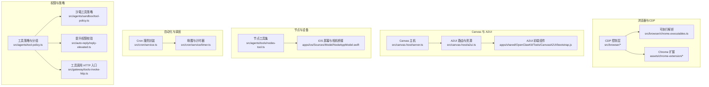
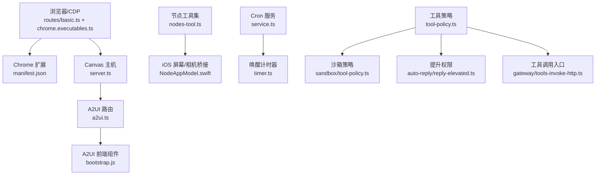
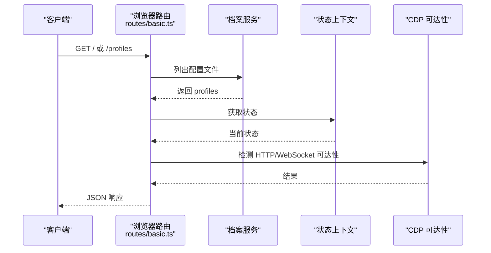
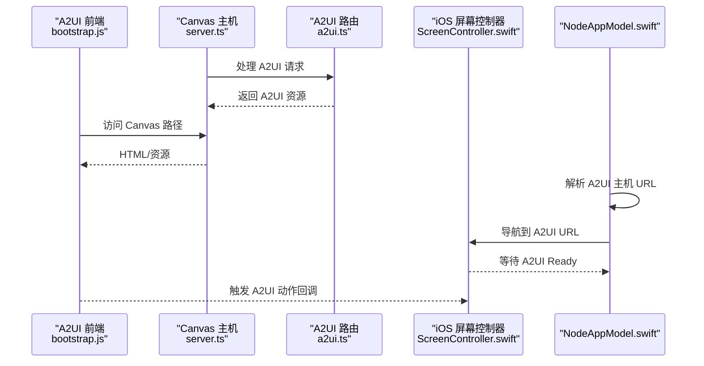
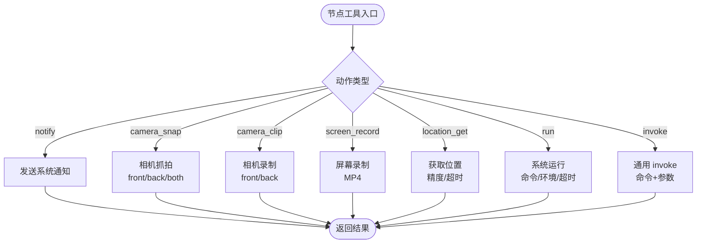
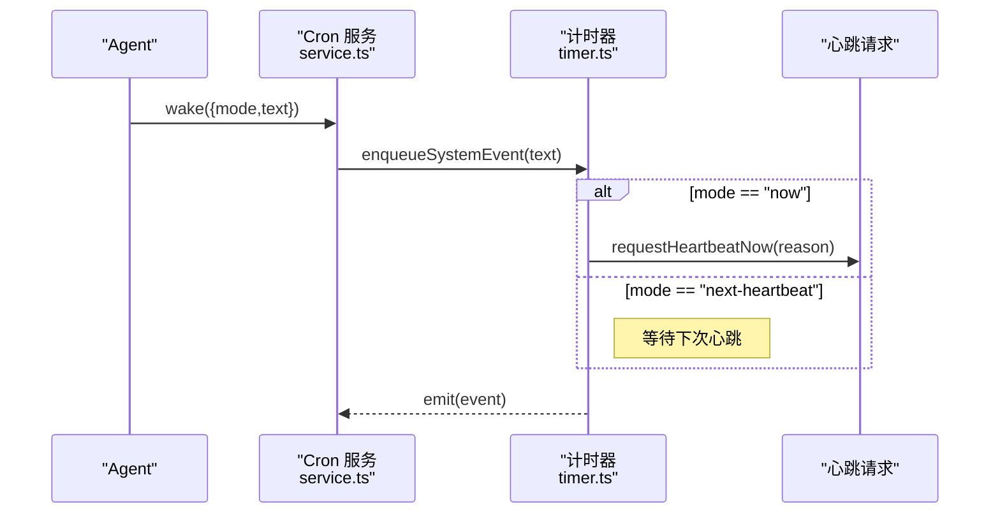
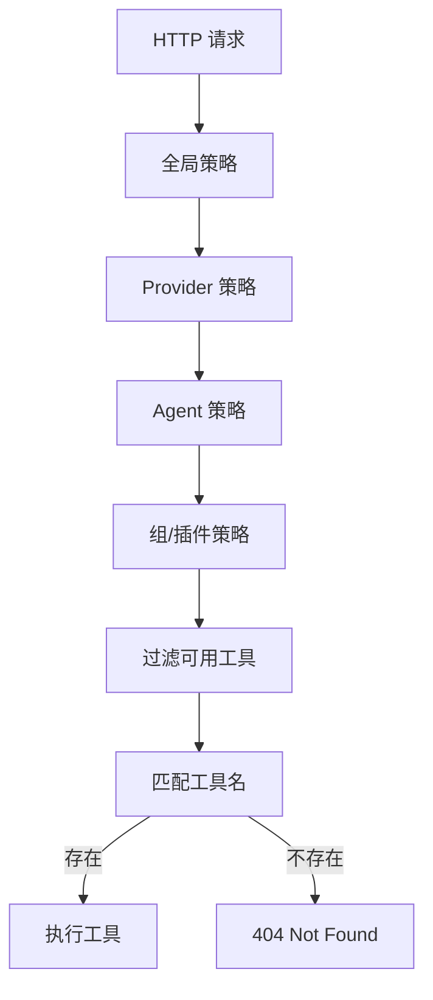
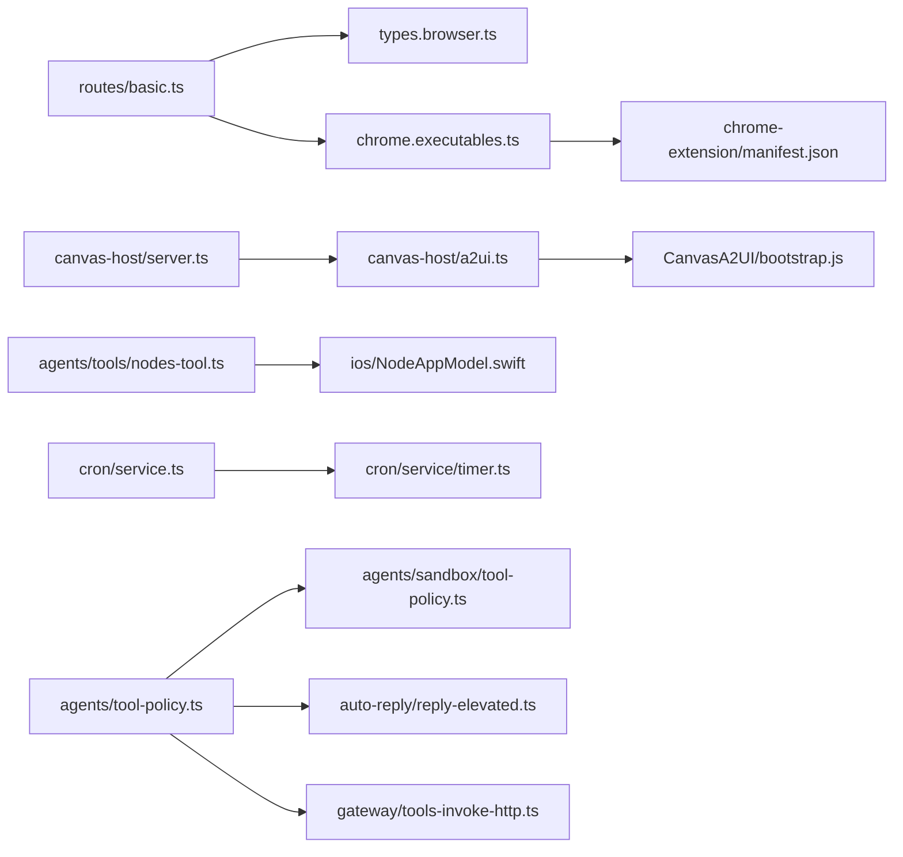

# 工具与自动化

## 目录
1. [简介](#简介)
2. [项目结构](#项目结构)
3. [核心组件](#核心组件)
4. [架构总览](#架构总览)
5. [详细组件分析](#详细组件分析)
6. [依赖关系分析](#依赖关系分析)
7. [性能考量](#性能考量)
8. [故障排除指南](#故障排除指南)
9. [结论](#结论)
10. [附录](#附录)

## 简介
本文件面向 OpenClaw 的工具与自动化系统，聚焦以下主题：
- 浏览器控制工具与 Chrome/Chromium 集成、CDP 控制机制
- Canvas 渲染系统、A2UI 主机与可视化工作区管理
- 节点操作工具：相机控制、屏幕录制、位置获取、通知系统
- 定时任务系统、Cron 作业调度与唤醒机制
- 自动化工作流程、技能系统与任务编排
- 工具开发指南：自定义工具创建、权限管理与安全考虑
- 性能优化建议、故障排除与最佳实践
- 实际工具配置示例与使用场景

## 项目结构
OpenClaw 采用多语言混合架构，核心逻辑位于 src，平台适配在 apps，浏览器扩展在 assets/chrome-extension，技能与工作流在 skills，文档在 docs。

## 核心组件
- 浏览器控制与 CDP
  - 通过路由与配置实现浏览器状态查询、CDP 可达性检测与基本操作入口。
  - 可执行解析模块自动发现并选择 Chrome/Chromium/Edge/Brave 等浏览器可执行文件。
  - Chrome 扩展提供本地 CDP 中继，便于将现有标签页接入 OpenClaw。
- Canvas 与 A2UI
  - Canvas 主机提供静态资源与热重载能力；A2UI 路由负责 A2UI 资源与消息处理。
  - iOS/Android 侧通过 WebView 桥接与 Canvas 交互，支持用户动作与系统通知。
- 节点工具集
  - 统一的节点工具接口，支持状态查询、描述、配对审批、相机抓拍/录制、屏幕录制、位置获取、系统运行与通用 `invoke`。
- 定时任务与唤醒
  - Cron 服务封装与计时器逻辑，支持“立即唤醒”和“下一次心跳”两种唤醒模式。
- 权限与策略
  - 工具策略与分组、沙箱策略、提升权限校验与 HTTP 工具调用入口，确保最小授权与安全边界。

## 架构总览
OpenClaw 的工具与自动化围绕“浏览器-Canvas-A2UI-节点-调度-权限”六大维度协同工作。浏览器通过 CDP 与本地/远程 Chrome 集成；Canvas/A2UI 提供可视化工作区；节点工具集连接物理设备与系统能力；Cron 负责周期性与即时唤醒；权限体系贯穿策略与调用链路。

## 详细组件分析

### 浏览器控制与 CDP 集成
- 路由与状态
  - 基础路由提供“列出配置文件”“获取状态（含 CDP 可达性）”等接口，结合配置上下文与档案上下文进行状态判断。
- 可执行解析
  - 跨平台解析默认 Chromium 系列可执行文件，支持 macOS/Linux/Windows，自动识别 Brave、Chrome、Edge、Chromium、Opera、Vivaldi、Yandex 等。
- Chrome 扩展
  - Manifest 声明 debugger、tabs、activeTab、storage 权限与本地 CDP 中继能力，支持点击附加/分离目标标签页。

### Canvas 渲染系统与 A2UI 主机
- Canvas 主机
  - 提供静态资源服务、路径规范化、安全打开文件、MIME 推断、热重载（WebSocket）与错误日志记录。
- A2UI 路由
  - 解析 A2UI 资源根目录候选，注入 live-reload HTML，处理 A2UI 请求。
- A2UI 前端
  - 组件渲染、状态提示、Toast 通知、表面同步与动作处理，支持空闲等待与工作态反馈。
- iOS/Android 桥接
  - iOS 侧通过 WebView 导航与 ready 状态检测，触发 A2UI 主机访问；提供深链与 A2UI 动作回调。

### 节点操作工具：相机、屏幕录制、位置与通知
- 工具能力
  - 状态/描述/待处理/批准/拒绝：节点生命周期管理。
  - 通知：标题/正文/声音/优先级/投递方式。
  - 相机：抓拍（front/back/both）、列表、录制（front/back）。
  - 屏幕录制：帧率、屏幕索引、音频开关、输出路径。
  - 位置：最大年龄、精度、超时。
  - 系统运行：命令、工作目录、环境变量、超时、是否需要屏幕录制。
  - 通用 `invoke`：自定义命令与参数。
- iOS 屏幕录制桥接
  - 通过 ScreenRecordService 录制 MP4，返回 base64 数据并编码为 JSON payload。

### 定时任务系统、Cron 调度与唤醒
- Cron 服务封装
  - 提供 start/stop/status/list/add/update/remove/run/wake 等方法。
- 唤醒机制
  - 支持“立即唤醒”和“下一次心跳”两种模式；当系统事件文本为空时会跳过并记录警告；单次任务运行后可自动禁用。
- 调试与验证
  - 单元测试覆盖了“空事件文本跳过”“下一唤醒时间报告”“立即唤醒等待心跳完成”等行为。

### 权限与安全：策略、沙箱与提升权限
- 工具策略与分组
  - 定义工具分组（如 `group:fs`、`group:runtime`、`group:nodes`），支持配置文件与代理工具的策略展开与未知条目剥离。
- 沙箱策略
  - 基于全局/代理/插件/组等多层级策略合并与过滤，最终确定可用工具集合。
- 提升权限
  - 对“提升工具”进行全局与代理级开关校验，缺失 provider 时拒绝。
- 工具调用入口
  - HTTP 入口按策略逐层过滤工具，找不到工具时返回 404。

### 工具开发指南：自定义工具与技能
- 自定义工具
  - 使用 CLI 子命令设置浏览器凭据（支持 clear、`targetId` 等参数），通过 `/set/credentials` 路由下发至 CDP 目标。
- 技能系统
  - 技能是包含 SKILL.md 的目录，可通过前端刷新或重启网关发现新技能；建议遵循“简洁指令、安全优先、本地测试”的最佳实践。
- 使用场景
  - 通过节点工具进行相机抓拍/录制、屏幕录制、位置获取与系统运行；通过 Cron 定时触发任务；通过 A2UI 构建可视化工作区。

## 依赖关系分析
- 组件耦合
  - 浏览器路由依赖配置与档案上下文；CDP 可达性检测影响状态返回。
  - Canvas 主机依赖 A2UI 路由与前端组件；iOS 侧依赖 Canvas 主机可达性。
  - 节点工具依赖网关工具调用；iOS 侧提供录制与媒体回传。
  - Cron 服务依赖计时器与心跳请求；策略体系贯穿工具调用入口。
- 外部依赖
  - Chrome/Chromium/Edge/Brave 可执行文件解析；WebSocket 热重载；HTTP 工具调用。

## 性能考量
- 浏览器与 CDP
  - 优先使用本地 CDP，避免远程延迟；合理设置超时与握手超时；在容器环境启用无沙箱选项时注意安全边界。
- Canvas 与 A2UI
  - 启用热重载时注意文件监视开销，必要时降低监听范围或关闭热重载；HTML 注入 live-reload 仅在开发环境启用。
- 节点工具
  - 相机/录制/屏幕录制涉及 I/O 与编解码，建议限制分辨率与帧率；对大文件输出使用临时路径并及时清理。
- Cron
  - 避免过于频繁的心跳；单次任务完成后自动禁用减少无效调度；对空事件文本进行早返回以节省资源。

## 故障排除指南
- 浏览器状态异常
  - 检查 CDP 可达性与 profile 状态；确认浏览器可执行文件路径正确；查看扩展权限与本地端口占用。
- Canvas/A2UI 无法加载
  - 确认 Canvas 主机已启动且根目录存在 index.html；检查热重载 WebSocket 升级；验证 A2UI 路径与资源存在。
- iOS 屏幕录制失败
  - 确认 A2UI 主机 URL 已配置且可达；等待 A2UI Ready；检查录制参数（格式/帧率/音频）与输出路径。
- Cron 任务未触发
  - 确认 cron 已启用且 Gateway 常驻；检查时区与系统时间；使用调试命令查看运行历史；关注空事件文本导致的跳过行为。
- 工具调用 404
  - 检查策略允许列表与分组展开；确认工具名称大小写与别名映射；核对插件工具归属与组名。

## 结论
OpenClaw 的工具与自动化体系以浏览器 CDP、Canvas/A2UI、节点工具集、Cron 调度与权限策略为核心，形成从可视化工作区到设备控制与任务编排的完整闭环。通过合理的配置、策略与安全约束，可在多平台上稳定运行并扩展新的工具与技能。

## 附录
- 实际使用场景示例
  - 浏览器登录与凭据设置：通过 CLI 子命令设置 HTTP 基本认证凭据并下发至指定 CDP 目标。
  - 可视化工作区：在 Canvas 主机根目录放置页面，A2UI 注入 live-reload 并通过 iOS/Android WebView 交互。
  - 节点自动化：定时任务触发节点相机抓拍/录制、屏幕录制与位置获取，结果以文件或媒体形式返回。
  - 技能开发：在工作区创建 SKILL.md，定义工具与指令，重启网关后即可被智能体使用。