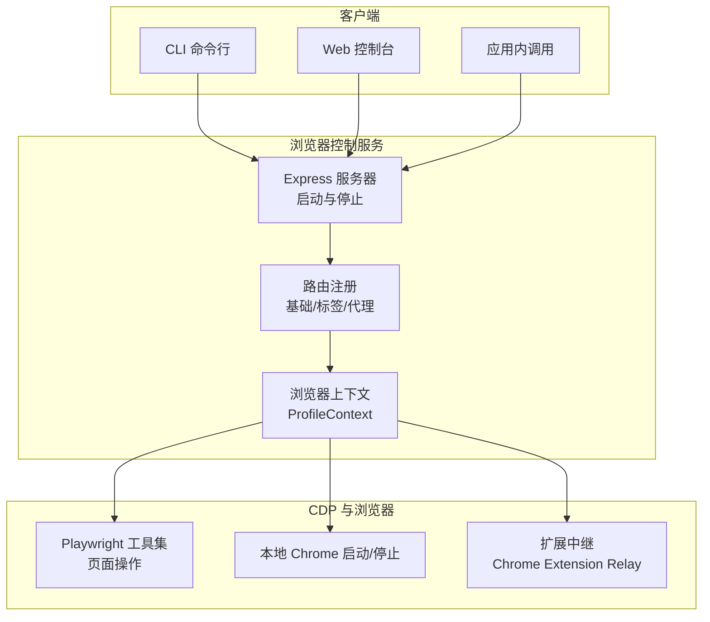
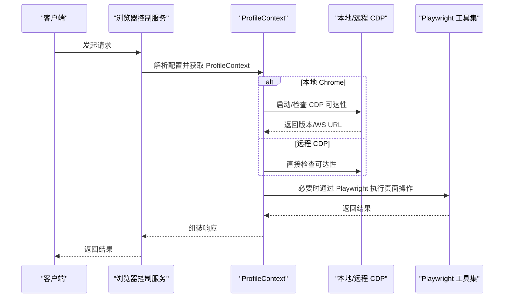
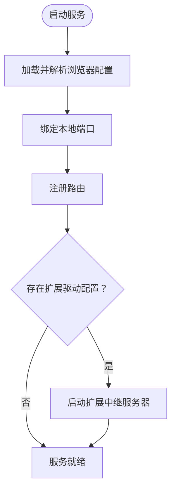
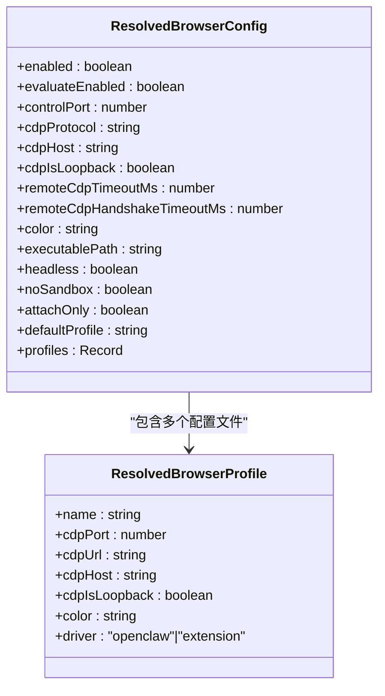
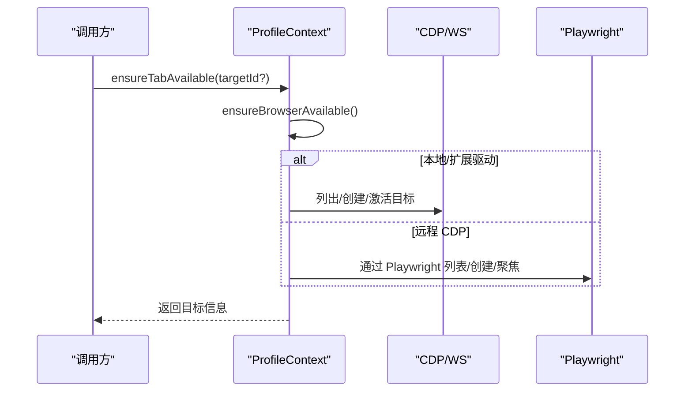
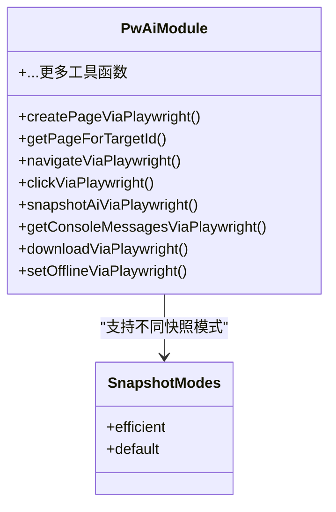
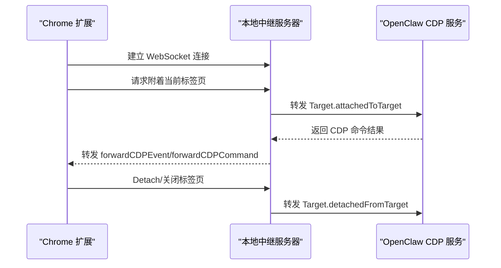
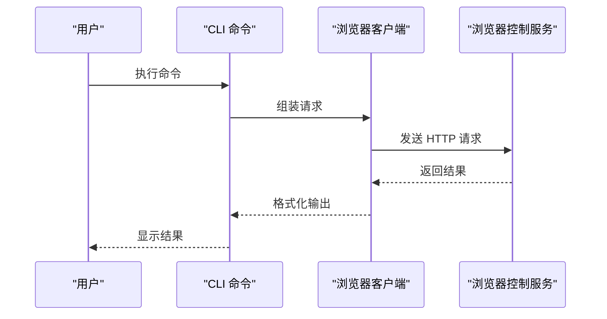
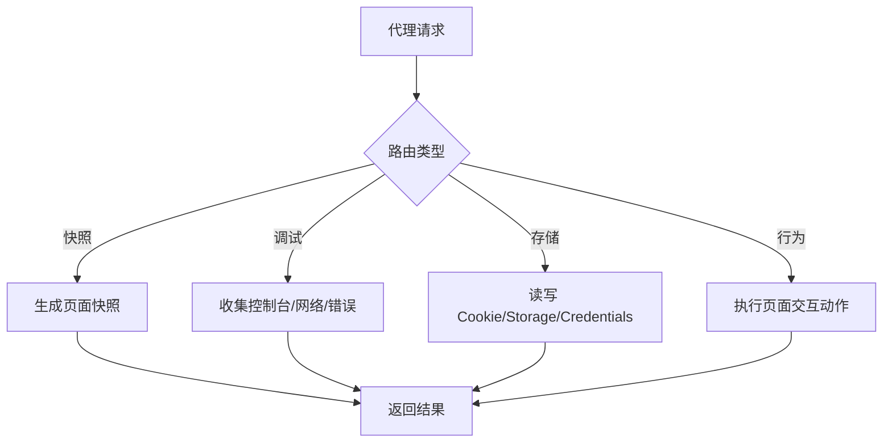
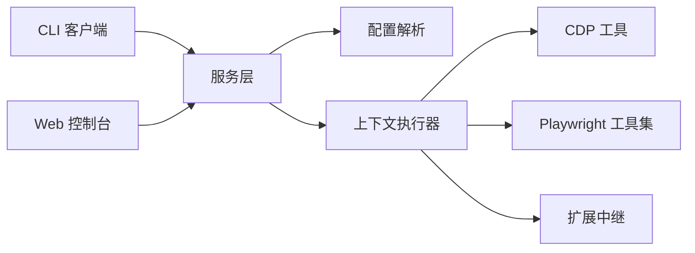

# 浏览器控制工具

## 目录
1. [简介](#简介)
2. [项目结构](#项目结构)
3. [核心组件](#核心组件)
4. [架构总览](#架构总览)
5. [详细组件分析](#详细组件分析)
6. [依赖关系分析](#依赖关系分析)
7. [性能考虑](#性能考虑)
8. [故障排除指南](#故障排除指南)
9. [结论](#结论)
10. [附录](#附录)

## 简介
本文件面向 OpenClaw 的浏览器控制工具，系统性阐述其基于 Chrome DevTools Protocol（CDP）的集成机制、浏览器实例与标签页管理、Playwright 会话与页面操作、浏览器客户端架构、代理服务器与扩展中继机制、配置与用户配置文件服务、隐私保护策略，并提供开发指南、示例、性能优化与故障排除建议。目标读者既包括需要快速上手的使用者，也包括希望深入理解实现细节的开发者。

## 项目结构
OpenClaw 的浏览器控制能力由后端服务、CDP 路由层、Playwright 工具集、CLI 客户端以及 Chrome 扩展中继共同组成。后端通过 Express 提供 REST 接口，路由层负责解析请求并调用上下文执行器；上下文执行器根据配置选择本地 Chrome 实例或远程 CDP；Playwright 模块提供高级页面操作；CLI 提供命令行工具；Chrome 扩展作为本地中继，将现有 Chrome 标签页接入 OpenClaw 的 CDP 通道。

## 核心组件
- 浏览器控制服务：启动/停止本地服务，注册路由，暴露 HTTP 接口。
- 配置解析：统一解析浏览器配置、默认端口、颜色、驱动模式等。
- 上下文执行器：按配置选择本地启动或远程连接，管理标签页生命周期。
- Playwright 工具集：封装页面导航、交互、截图、存储、网络等常用操作。
- 扩展中继：在本地运行中继服务，将 Chrome 扩展与 OpenClaw 连接。
- CLI 客户端：提供离线模式切换、响应体观察等命令行操作。

## 架构总览
OpenClaw 的浏览器控制采用“服务 + 路由 + 上下文 + 工具”的分层设计。服务层负责监听端口并注册路由；路由层将请求映射到具体操作；上下文层根据配置决定使用本地 Chrome 或远程 CDP，并提供标签页列表、打开/聚焦/关闭等能力；工具层通过 Playwright 提供高级页面操作；扩展中继用于将现有 Chrome 标签页接入本地 CDP。

## 详细组件分析

### 1) 服务与路由层
- 服务启动：加载配置，解析浏览器参数，绑定本地端口，注册路由，按需启动扩展中继。
- 路由注册：基础状态、标签页管理、代理专用路由（快照、调试、存储、行为）。
- 错误处理：统一 JSON 错误返回，区分业务错误与系统错误。

### 2) 配置与用户配置文件服务
- 配置解析：支持启用/禁用、远程 CDP 超时、握手超时、默认颜色、可执行路径、无头模式、沙箱选项、仅附加模式、默认配置文件、多配置文件等。
- 用户配置文件：自动创建默认“openclaw”与“chrome”（扩展中继）配置文件，分配端口与颜色，持久化到配置文件。
- 默认值与兼容：向后兼容旧版 CDP 端口，确保默认配置存在。

### 3) 浏览器实例与标签页管理
- 实例管理：本地启动/停止 Chrome，检查 CDP HTTP 与 WebSocket 可达性，必要时重启。
- 标签页管理：列出、打开、聚焦、关闭标签页；支持扩展驱动与远程 CDP 的差异化处理。
- 目标 ID 解析：支持前缀匹配与歧义处理，优先最近一次目标。

### 4) Playwright 会话管理与页面操作
- 会话封装：导出页面生命周期、定位器、截图、高亮、下载、网络请求/响应、控制台消息、错误收集、PDF 导出、设备模拟、视口调整、地理位置、时区、语言、离线模式等。
- AI 角色快照：提供多种快照模式（高效/完整），限制字符数与深度，便于大模型理解页面内容。
- 与上下文协作：在远程 CDP 场景下，通过 Playwright 的持久连接直接访问页面，避免逐次建立 WS。

### 5) 代理服务器与扩展中继机制
- 扩展中继：在本地启动 CDP 中继服务，Chrome 扩展通过 WebSocket 将 CDP 命令/事件转发至 OpenClaw。
- 权限与安全：扩展声明 debugger、tabs、activeTab、storage 权限，仅访问本地回环地址。
- 生命周期：中继连接断开时清理状态，提示用户重新附着。

### 6) 浏览器客户端与 CLI
- 客户端：提供状态查询、观察网络响应体、切换离线模式等能力。
- CLI：命令行工具支持离线模式切换、等待网络响应并返回响应体等。

### 7) 代理专用路由（快照/调试/存储/行为）
- 快照：支持多种快照模式，限制字符数与深度，便于大模型理解页面。
- 调试：获取控制台消息、网络请求与错误。
- 存储：读取/设置 Cookie、LocalStorage/SessionStorage，设置 HTTP 凭据。
- 行为：导航、点击、输入、滚动、截图、PDF、下载、高亮等。

## 依赖关系分析
- 服务层依赖配置解析与上下文执行器；上下文层依赖 CDP 工具与 Playwright 模块；扩展中继独立于服务但与 CDP 协议互通。
- 关键耦合点：ProfileContext 对本地/远程 CDP 的抽象、Playwright 工具集对页面操作的封装、CLI/客户端对服务接口的调用。

## 性能考虑
- 远程 CDP 超时与握手超时：根据是否本地/远程动态调整，避免长时间阻塞。
- 本地启动策略：首次启动创建默认配置文件，随后装饰并二次启动，减少重复初始化成本。
- 快照模式：提供高效模式以降低大模型处理负担，合理限制字符数与深度。
- 并发与重试：在 CLI 层对请求增加超时控制，避免长时间等待。
- 资源回收：服务停止时关闭 Playwright 连接，释放浏览器进程资源。

## 故障排除指南
- 无法启动本地 Chrome：检查端口占用、沙箱权限、平台可执行文件路径；确认已创建并装饰用户数据目录。
- CDP 不可达：区分 HTTP 可达但 WS 失败的情况，可能为端口被其他进程占用或浏览器未正确启动，必要时执行重置配置文件。
- 扩展中继问题：确认扩展图标状态、本地中继服务是否启动、是否有已附着的标签页；断开后重新附着。
- 标签页操作失败：检查目标 ID 前缀是否唯一，必要时指定精确 `targetId`；对于扩展驱动，确保至少有一个已附着标签页。
- CLI 超时：适当增大超时时间或重试；检查网络与防火墙设置。

## 结论
OpenClaw 的浏览器控制工具通过清晰的分层架构实现了对本地与远程 CDP 的统一抽象，结合 Playwright 的强大页面操作能力与 Chrome 扩展中继，提供了稳定、可扩展且易于使用的浏览器自动化能力。合理的配置与错误处理策略确保了在复杂场景下的可靠性，同时为开发者提供了丰富的 API 与 CLI 支持。

## 附录

### 开发指南：自定义动作与状态管理
- 自定义动作：在工具层新增动作函数，遵循现有命名规范与参数约定，确保与 Playwright/CDP 的一致性。
- 状态管理：利用 ProfileContext 的 `lastTargetId` 与 `ensureTabAvailable`，保持动作的上下文一致性。
- 错误处理：在路由层统一捕获异常并返回标准错误码，便于前端与 CLI 侧处理。

### 实际使用示例（步骤说明）
- 切换离线模式：通过 CLI 指定 `profile` 与 `targetId`，发送请求至 `/set/offline`。
- 观察网络响应体：通过 CLI 指定 URL 模式、超时与最大字符数，等待并返回响应体。
- 获取控制台消息：通过代理路由 `/console` 获取指定级别消息。
- 设置 HTTP 凭据：通过代理路由 `/set/credentials` 清除或设置用户名/密码。