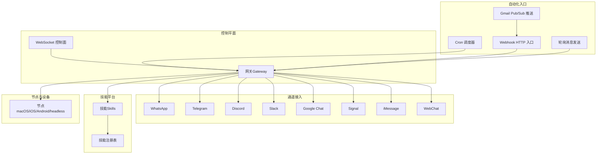
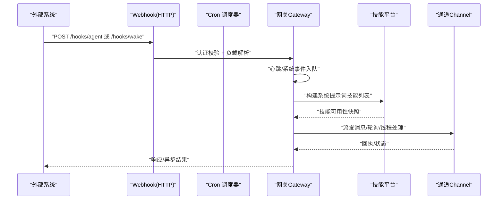
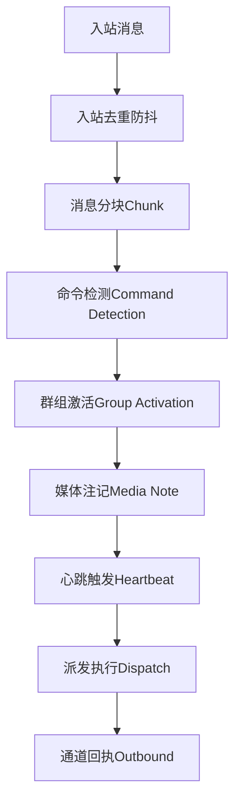
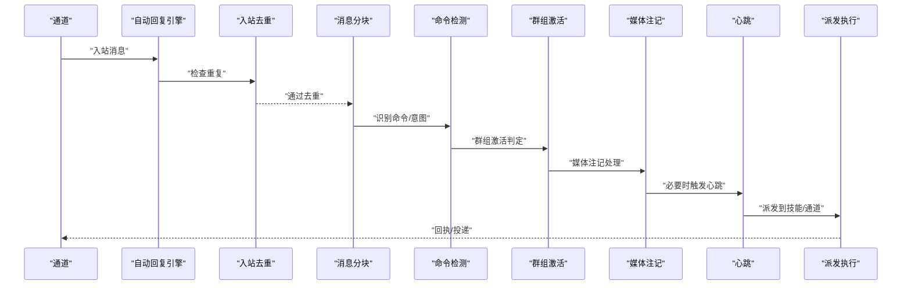
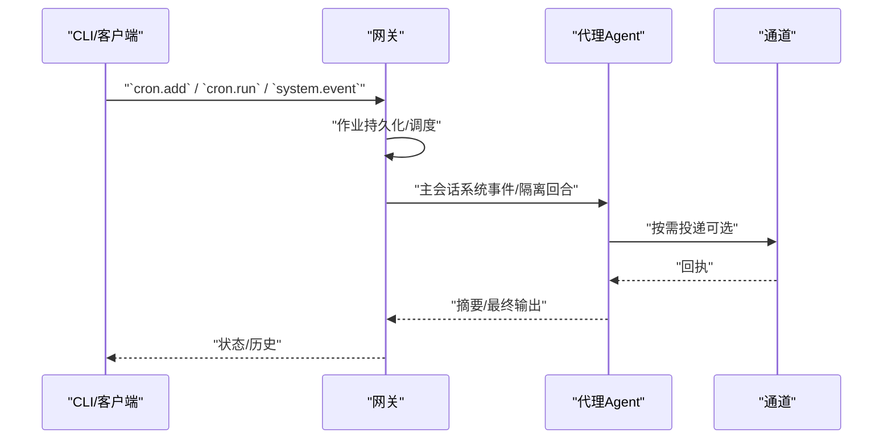
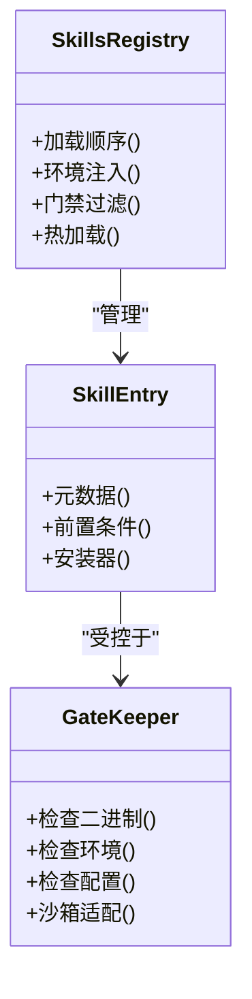
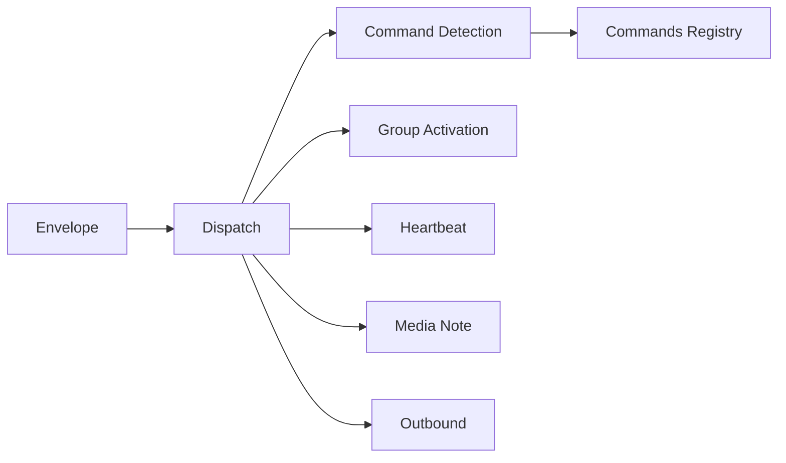

# 自动化工作流程

## 目录
1. [简介](#简介)
2. [项目结构](#项目结构)
3. [核心组件](#核心组件)
4. [架构总览](#架构总览)
5. [详细组件分析](#详细组件分析)
6. [依赖关系分析](#依赖关系分析)
7. [性能考量](#性能考量)
8. [故障排查指南](#故障排查指南)
9. [结论](#结论)
10. [附录](#附录)

## 简介
本技术文档聚焦 OpenClaw 的自动化工作流程，围绕自动回复机制、代理工具系统与技能平台架构展开，系统性阐述自动化规则配置、触发条件与执行逻辑，覆盖工作流程编排、状态管理与错误处理机制，并给出技能系统的实现原理、开发与部署流程，以及自动化工具开发指南（含自定义工具创建、权限管理与安全审计）。文档同时提供可操作的自动化示例、流程设计模式与性能优化建议，帮助读者在本地或远程环境中稳定、安全地运行 OpenClaw 的自动化能力。

## 项目结构
OpenClaw 采用“网关控制平面 + 多通道接入 + 技能平台 + 自动化调度”的分层架构。核心要点如下：
- 网关（Gateway）：通过 WebSocket 提供统一控制面，承载会话、心跳、定时任务、Webhook、通道路由等能力。
- 通道（Channels）：支持 WhatsApp、Telegram、Discord、Slack、Google Chat、Signal、iMessage、WebChat 等多渠道接入。
- 技能（Skills）：基于 AgentSkills 规范的可插拔能力集合，支持环境/二进制/配置门禁与热加载。
- 自动化（Automation）：提供 Cron 调度、Webhook 入口、轮询消息发送、Gmail Pub/Sub 推送等外部触发方式。

## 核心组件
- 自动回复（Auto-Reply）：负责入站消息的去重、分块、命令检测、群组激活、媒体注记、心跳触发与派发执行。
- 技能平台（Skills）：按优先级加载内置/托管/工作区技能，支持环境注入、二进制与配置门禁、热加载与远程节点能力探测。
- 自动化调度（Automation）：Cron 定时任务、Webhook 触发、轮询消息、Gmail Pub/Sub 推送，统一由网关编排与交付。

## 架构总览
下图展示从外部触发到网关控制面，再到通道与技能平台的整体交互路径，体现自动化工作流的端到端闭环。

## 详细组件分析

### 自动回复机制（Auto-Reply）
自动回复模块以“入站消息处理流水线”为核心，包含去重、分块、命令检测、群组激活、媒体注记、心跳触发与派发执行等环节，确保在多通道、多会话场景下的稳定与高效。

#### 自动回复执行序列

### 代理工具系统（Agent Tools）
代理工具系统通过网关暴露统一的工具调用接口，支持主会话与隔离会话两种执行模式，结合模型与思考层级覆盖、超时控制与交付策略，实现“系统事件”和“专用代理回合”的灵活编排。

### 技能平台架构（Skills）
技能平台遵循 AgentSkills 规范，支持三类来源（内置、托管、工作区），具备环境变量/二进制/配置门禁、热加载与远程节点能力探测，确保在不同运行环境下安全、可控地扩展代理能力。

### 自动化规则配置与触发条件
- Cron 作业：支持一次性/at、周期性/every、标准 cron 表达式；可选择主会话（系统事件）或隔离会话（专用代理回合），并可配置交付目标与模型/思考层级覆盖。
- Webhook：提供 `/hooks/wake` 与 `/hooks/agent` 两类入口，支持令牌认证、映射与转换、预设（如 Gmail）。
- 轮询消息：支持 WhatsApp、Discord、MS Teams 的投票/问卷消息发送。
- Gmail Pub/Sub：通过 `gogcli` 将 Gmail Watch 推送到公网，再由网关 Webhook 映射为代理回合。

### 执行逻辑与工作流程编排
- 主会话执行：将系统事件入队，按心跳周期统一处理，适合与常规“心跳”流程协同。
- 隔离会话执行：为特定作业启动独立会话，生成摘要回传主会话，适合后台任务与高频作业。
- 交付策略：可选择“仅内部”或“投递到指定通道”，并支持最佳努力交付与最后路由回退。
- 模型与思考层级：隔离作业可覆盖模型与思考层级，避免对主会话上下文产生影响。

### 状态管理与错误处理
- 状态快照：技能列表在会话开始时快照，后续回合复用，变更在新会话生效；支持技能监视器热更新。
- 错误处理：通道侧异常会记录并尝试向用户发送错误提示；网关层面对 Webhook 负载进行安全边界包裹，默认不信任外部输入。
- 去重与幂等：入站消息去重与请求幂等键保障重试安全；Cron 运行历史以 JSONL 记录并自动清理。

## 依赖关系分析
自动回复模块内部各组件职责清晰、耦合度低，通过“信封（Envelope）”协调派发，形成稳定的处理链路。

## 性能考量
- 技能提示词开销：技能列表注入到系统提示词会产生确定性字符/令牌开销，建议按需启用与精简描述，避免冗长 XML 字段。
- Cron 并发与存储：合理设置并发运行数与作业存储路径，避免磁盘争用；对高频作业使用隔离会话减少对主会话上下文的影响。
- Webhook 安全边界：默认对外部内容进行安全包裹，避免大体量原始负载进入日志；必要时可通过映射/转换降低负载大小。
- 通道投递：轮询消息与轮询卡片需要网关在线维护投票状态，注意会话生命周期与资源占用。

## 故障排查指南
- “没有任务运行”：确认 Cron 已启用、网关持续运行、主机时区与表达式一致。
- Telegram 投递位置错误：明确使用论坛主题格式（-100…:topic:…），避免歧义前缀导致解析问题。
- Webhook 认证失败：核对 Authorization 头、`x-openclaw-token` 或查询参数 `token` 是否正确。
- Gmail Pub/Sub：检查项目匹配、Pub/Sub 发布者角色、推送订阅与 OIDC 配置；使用助手命令一键配置并自动续期。
- 通道错误回执：通道侧异常会尝试向用户发送错误提示，检查网关日志定位具体原因。

## 结论
OpenClaw 的自动化工作流程以网关为中心，通过 Cron、Webhook、轮询与 Gmail Pub/Sub 等多种入口实现外部触发，结合自动回复流水线与技能平台，完成从规则配置、触发条件到执行与交付的完整闭环。其设计强调安全性（门禁、安全包裹）、可观测性（运行历史、日志）与可扩展性（技能热加载、远程节点探测），适合在本地或远程环境中稳定运行。建议在生产中严格配置认证与门禁、限制高成本模型与思考层级、合理规划 Cron 并发与交付策略，并利用 CLI 与网关健康检查工具进行持续运维。

## 附录

### 自动化示例与最佳实践
- 使用 Cron 创建一次性提醒并在成功后删除：参见“快速开始（可操作）”示例。
- 定时早安摘要并投递到 Slack：参见“计划一个重复的隔离作业并投递”示例。
- 通过 Webhook 触发代理回合并投递到 WhatsApp：参见“POST `/hooks/agent`”示例。
- Gmail 新邮件自动摘要并投递：使用“Gmail 预设 + 映射 + 交付”组合。
- 轮询消息：在 WhatsApp/Discord/MS Teams 上发送投票/问卷。

### 技能开发与部署流程
- 目录与优先级：工作区技能 > 托管/本地技能 > 内置技能；支持额外加载目录与跨机共享。
- 门禁与环境注入：通过 `metadata.openclaw.requres` 指定二进制/环境/配置依赖；运行时注入进程环境并恢复。
- 热加载与远程节点：启用技能监视器可在 `SKILL.md` 变更后热更新；远程 macOS 节点可探测系统命令可用性。
- 安装器与平台：支持 brew/npm/pnpm/yarn/bun/go/download 等安装器，按平台过滤。

### 自动化工具开发指南
- 自定义工具创建：遵循 AgentSkills 规范编写 `SKILL.md`，声明元数据与前置条件；通过 `metadata.openclaw.install` 提供安装器。
- 权限管理：在网关侧配置沙箱白名单/黑名单，限制工具访问范围；对敏感工具启用 Elevated 模式并配合会话补丁。
- 安全审计：对外部输入进行安全包裹，避免直接打印原始负载；使用专用 Hook Token，不在日志中泄露密钥。
- 流程设计模式：将高频/后台任务放入隔离会话，减少对主会话上下文的影响；对需要持续交互的任务使用固定 `sessionKey` 实现多轮对话。