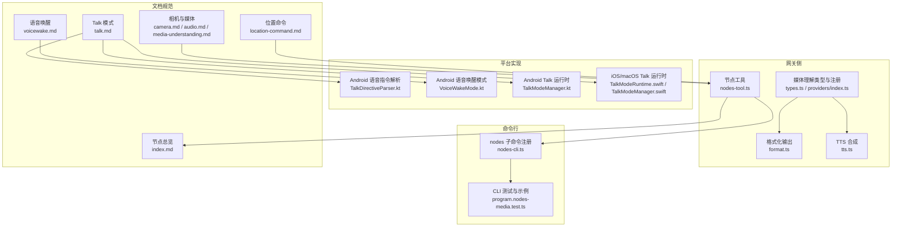
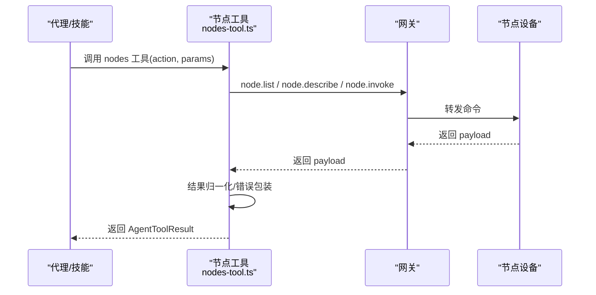
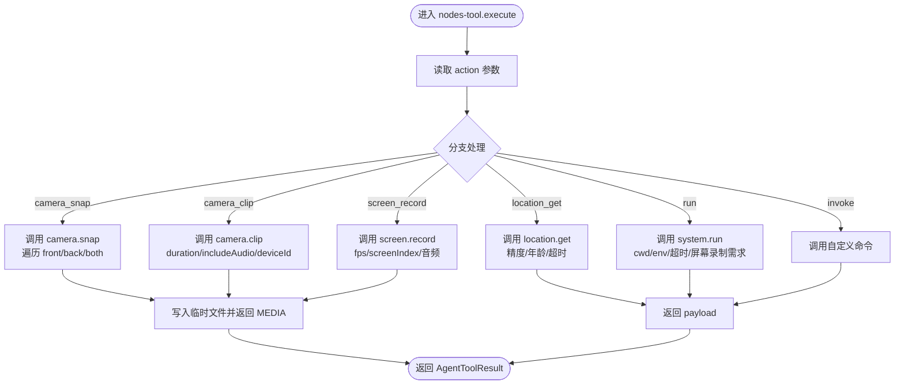
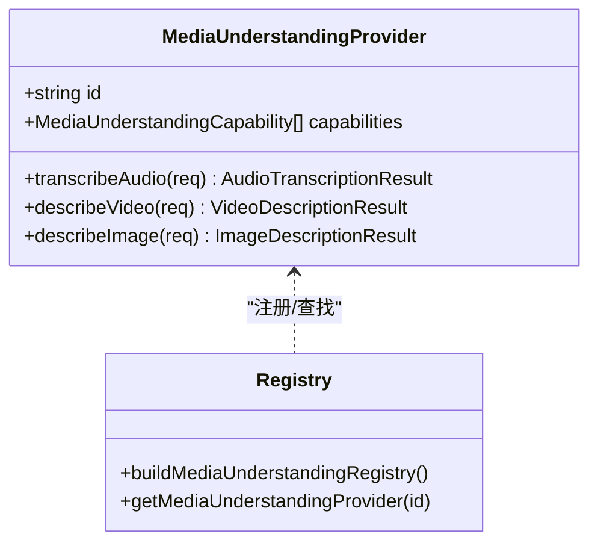
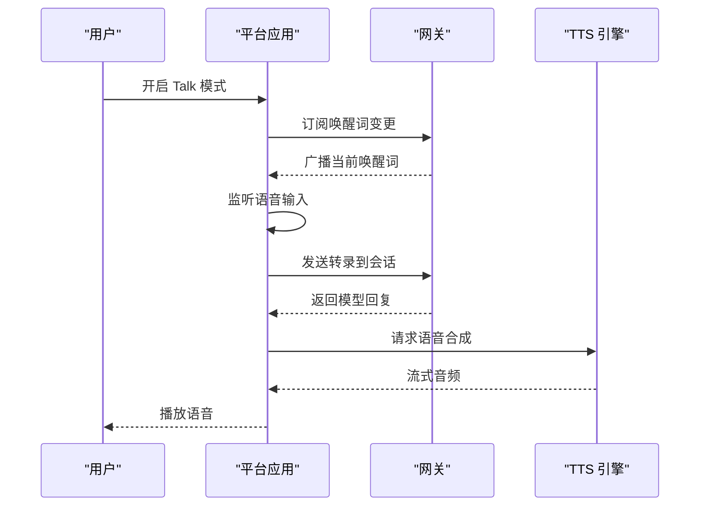
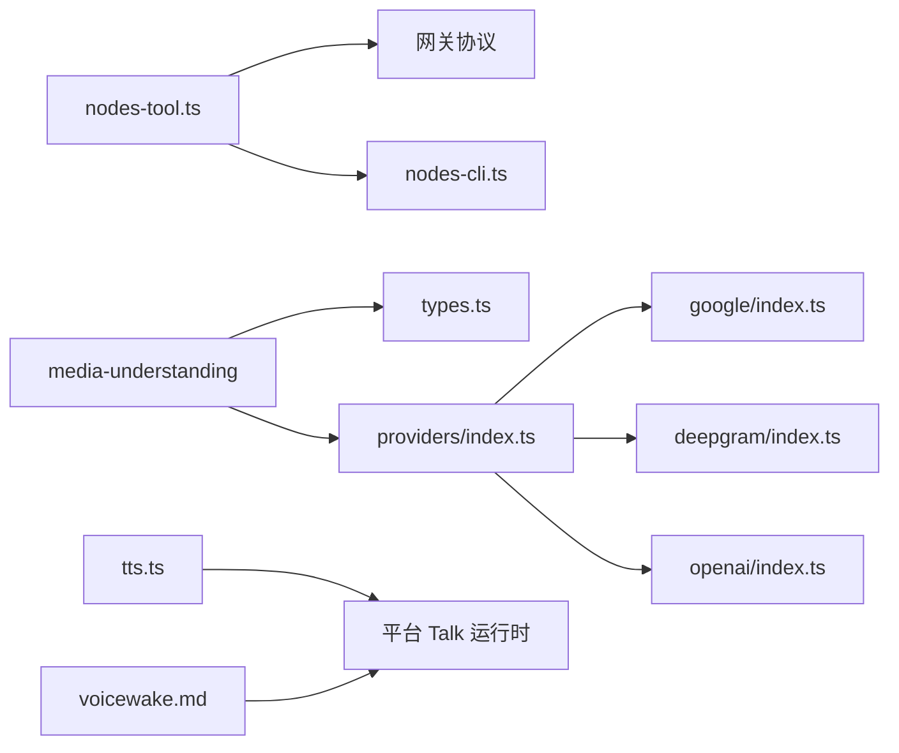

# 节点操作工具

## 目录
1. [简介](#简介)
2. [项目结构](#项目结构)
3. [核心组件](#核心组件)
4. [架构总览](#架构总览)
5. [详细组件分析](#详细组件分析)
6. [依赖关系分析](#依赖关系分析)
7. [性能考量](#性能考量)
8. [故障排除指南](#故障排除指南)
9. [结论](#结论)
10. [附录](#附录)

## 简介
本文件面向 OpenClaw 的“节点操作工具”，系统化梳理其架构设计、权限与安全策略，并深入解析音频处理、相机控制、媒体理解、位置获取、语音唤醒与 TTS 语音合成等能力。文档同时提供节点工具开发指南、自定义节点接入流程、资源访问与错误处理实践，以及性能优化与故障排除建议。

## 项目结构
OpenClaw 的节点工具由“网关侧工具 + 命令行入口 + 文档规范 + 平台侧实现”构成：
- 网关侧工具：封装节点命令调用、参数校验、结果归一化与错误包装
- 命令行入口：提供 nodes 子命令族，覆盖相机、屏幕录制、位置、系统命令、通用 invoke 等
- 文档规范：定义节点能力边界、权限映射、行为约束与配置项
- 平台侧实现：iOS/Android/macOS 应用内节点能力与 UI/UX 行为
- 媒体理解与 TTS：跨平台的媒体理解与语音合成实现

## 核心组件
- 节点工具（Agents Tool）
  - 统一封装节点命令调用，支持状态查询、描述、配对、通知、相机拍照/录像、屏幕录制、位置获取、系统命令执行与通用 invoke
  - 参数校验与错误包装，统一返回结构，便于上层工具链消费
- 命令行入口（CLI）
  - nodes 子命令族：camera、canvas、screen、location、run、invoke 等
  - 测试用例覆盖典型场景，验证参数传递、超时与输出路径
- 媒体理解（Media Understanding）
  - 支持图片/音频/视频理解，多提供商与 CLI 回退策略
  - 输出格式化与模板注入，支持多附件标签化展示
- TTS 语音合成
  - ElevenLabs/OpenAI 等提供商，支持流式播放与参数校验
  - Talk 模式下连续对话循环，支持打断与语音指令
- 语音唤醒（Voice Wake）
  - 全局唤醒词列表由网关维护，跨节点同步
  - 平台侧模式枚举与 UI 行为

## 架构总览
节点工具整体遵循“网关协议 + 工具封装 + 平台实现”的分层设计：
- 网关层：WebSocket 连接节点，暴露 `node.invoke` 命令面
- 工具层：节点工具对命令进行参数校验、幂等键生成、结果归一化
- 平台层：各端应用实现具体能力（相机、屏幕录制、位置、TTS、语音唤醒）
- 文档层：规范能力边界、权限映射与配置项

## 详细组件分析

### 节点工具（Nodes Tool）
- 功能清单
  - 状态/描述/待审批/批准/拒绝/通知
  - 相机：列表、拍照（front/back/both）、录像（含音频开关）
  - 屏幕录制：时长、帧率、屏幕索引、音频开关
  - 位置：精度、最大年龄、超时
  - 系统命令：`system.run`（带 cwd/env/超时/屏幕录制需求）
  - 通用 invoke：自定义命令与参数
- 关键特性
  - 幂等键生成，避免重复调用
  - 参数严格校验与默认值处理
  - 多媒体结果写入临时文件并返回 MEDIA/FILE 标记
  - 错误消息包含 agent、node、gateway、action 上下文

### 相机与媒体理解
- 相机能力
  - iOS/Android/macOS 节点均支持 `camera.list`、`camera.snap`、`camera.clip`
  - 前台限制：后台调用返回不可用
  - 权限要求：Android 需 CAMERA/RECORD_AUDIO
  - 安全限制：视频时长上限、照片压缩防止超大负载
- 媒体理解
  - 默认按能力启用，自动探测本地 CLI 或提供商
  - 支持 image/audio/video，可配置 per-capability 模型列表与回退
  - 输出格式化：多附件带序号标签，音频转录可注入模板变量

### 位置获取命令
- 能力与权限
  - 位置开关：Off/WhileUsing/Always；精确位置单独开关
  - 前台限制：后台仅 While Using 可用
  - 错误码：禁用、权限缺失、后台不可用、超时、不可用
- 参数与响应
  - 支持超时、最大年龄、期望精度
  - 返回经纬度、海拔、速度、方向、时间戳、精度来源等

### 语音唤醒与 Talk 模式
- 语音唤醒
  - 全局唤醒词列表由网关持有并广播，跨节点同步
  - 平台侧模式枚举（关闭/前台/始终），与系统权限交互
- Talk 模式
  - 连续对话：监听 → 思考 → 朗读 → 打断
  - 语音指令：回复首行 JSON 控制声音参数（一次性或持久生效）
  - 平台实现：Android/iOS/macOS 分别提供运行时与 UI

### 权限管理与安全
- 设备配对与节点状态
  - 节点连接需配对，批准后标记为已配对
  - 节点配对存储与 WS 握手独立
- 执行审批与沙箱
  - `system.run` 需要节点主机上的执行白名单与审批
  - 沙箱策略：允许/禁止工具集合，支持正则与全量匹配
- 节点主机与远程执行
  - 支持 headless 节点主机，执行审批本地强制
  - 远程模式下通过 SSH 隧道连接网关

## 依赖关系分析
- 节点工具依赖网关协议与节点命令面，负责参数校验与结果归一化
- 媒体理解模块通过提供商注册表选择合适实现，支持 CLI 回退
- TTS 模块对接 ElevenLabs/OpenAI，平台侧 Talk 运行时负责流式播放与参数校验
- 语音唤醒与 Talk 模式在平台侧实现，网关负责全局状态同步

## 性能考量
- 媒体理解
  - 限制每类媒体最大字节数与字符数，避免超大负载
  - 并发度控制，默认并发能力数为 2
  - CLI 与提供商回退策略减少失败重试成本
- 相机与屏幕录制
  - 视频时长上限与照片压缩，降低 base64 负载
  - 前台限制减少后台无效调用
- TTS
  - 流式播放与合理超时，避免阻塞对话轮次
  - 平台侧输出格式与延迟层级配置

## 故障排除指南
- 节点工具错误
  - 统一错误包装，包含 agent、node、gateway、action 上下文
  - 常见原因：参数非法、节点未配对、后台不可用、权限缺失
- 相机/屏幕录制
  - 前台限制导致不可用；Android 缺少 CAMERA/RECORD_AUDIO 权限
  - 视频时长超过上限或照片过大被裁剪
- 位置获取
  - 未开启位置或权限不足；后台模式受限
- 媒体理解
  - 超过 maxBytes 跳过；提供商/CLI 失败回退
- TTS
  - 无效 voiceId、模型/声音参数不合法；网络异常或超时

## 结论
节点操作工具以“网关协议 + 工具封装 + 平台实现”为核心，围绕相机、媒体理解、位置、TTS 与语音唤醒构建了完整的节点能力体系。通过严格的参数校验、权限与沙箱策略、并发与大小限制，保障了安全性与性能。配合 CLI 与测试用例，开发者可以快速扩展与验证新节点能力。

## 附录

### 节点工具开发指南
- 自定义节点创建
  - 通过网关 WebSocket 连接并声明角色，实现 `node.invoke` 命令面
  - 使用节点工具的参数校验与幂等键机制，保证调用一致性
- 资源访问
  - 明确前台限制与权限要求，必要时引导用户授予系统权限
  - 对媒体输出进行大小与格式限制，避免超大负载
- 错误处理
  - 使用统一错误包装，提供上下文信息
  - 实现合理的超时与回退策略（提供商/CLI）