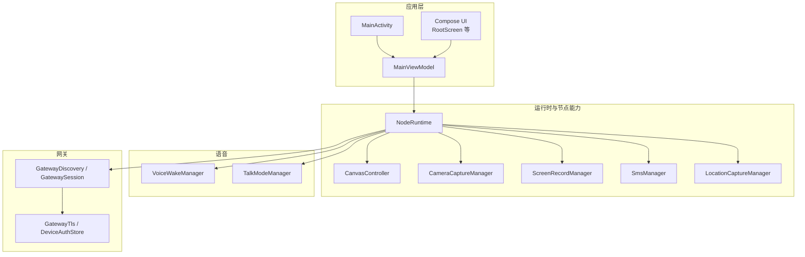
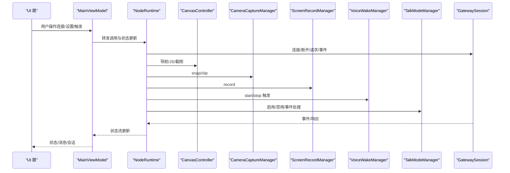
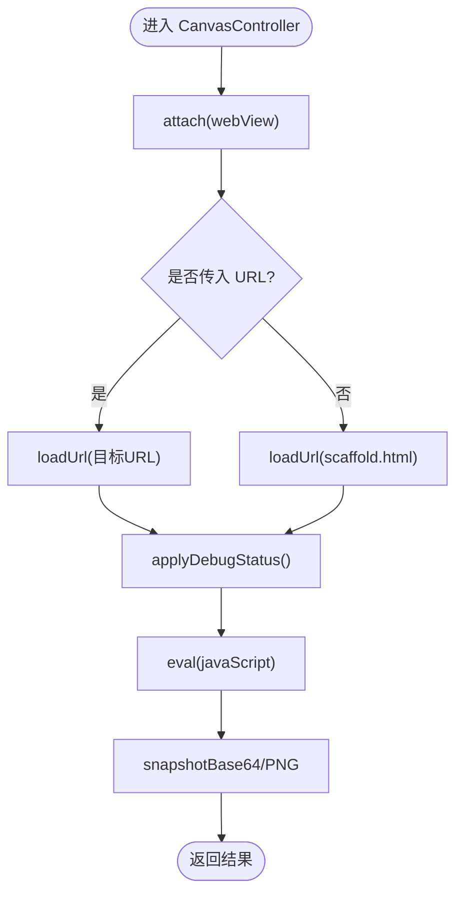
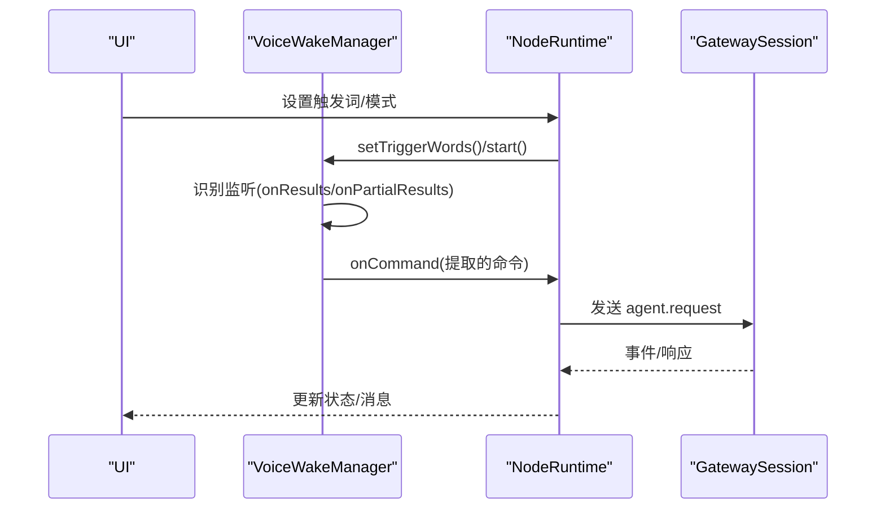
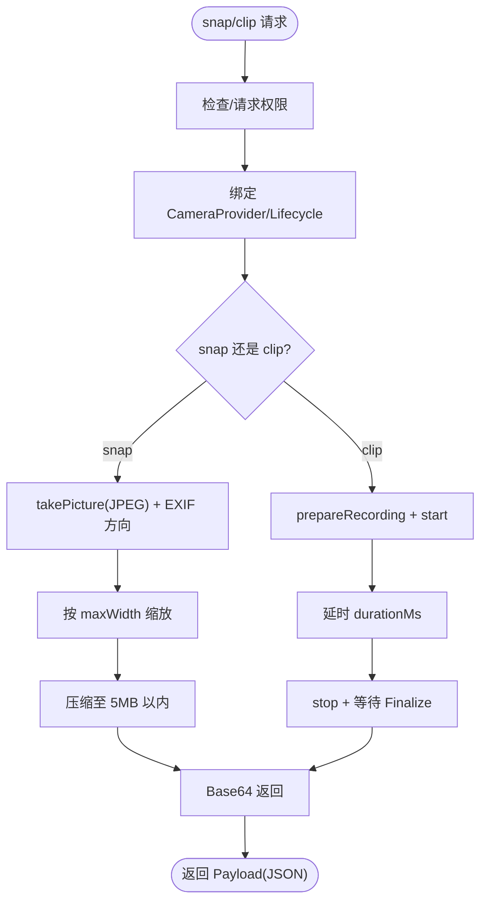
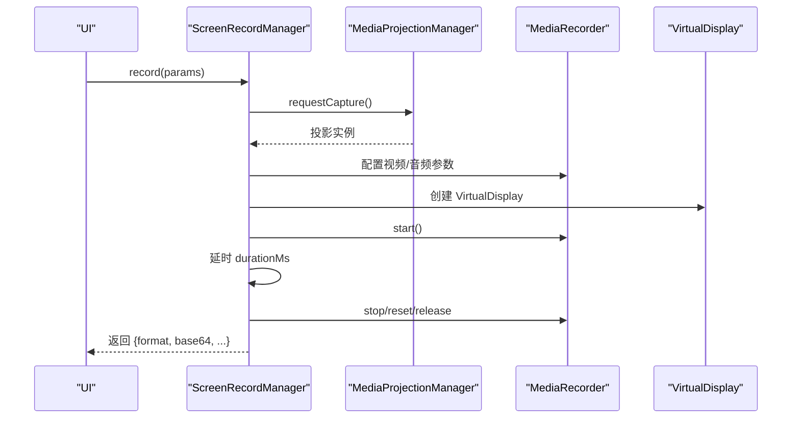
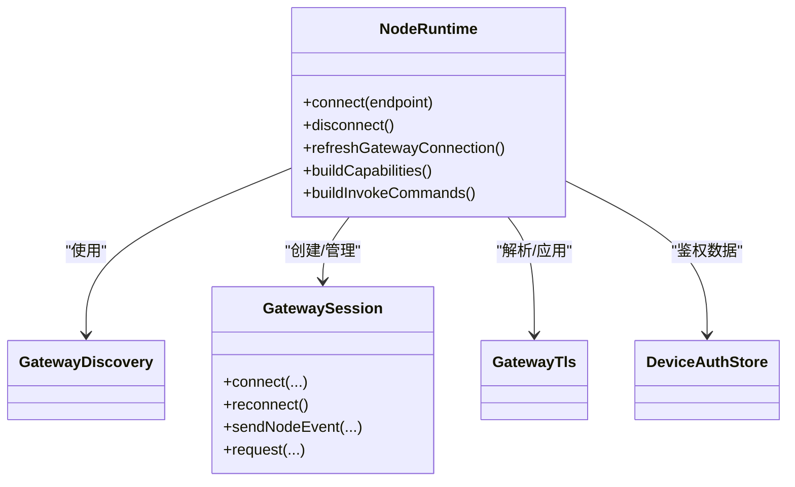
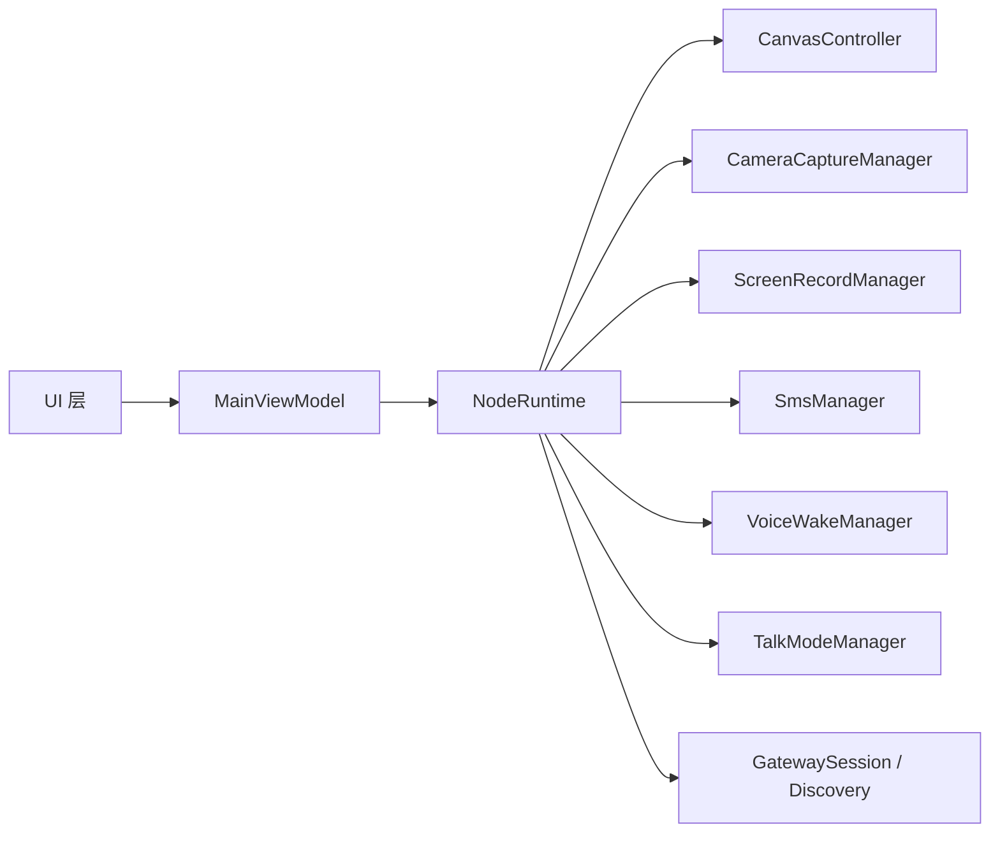

# Android 应用

## 目录
1. [简介](#简介)
2. [项目结构](#项目结构)
3. [核心组件](#核心组件)
4. [架构总览](#架构总览)
5. [组件详解](#组件详解)
6. [依赖关系分析](#依赖关系分析)
7. [性能考量](#性能考量)
8. [故障排查指南](#故障排查指南)
9. [结论](#结论)
10. [附录](#附录)

## 简介
本文件面向 OpenClaw Android 节点应用，系统化梳理其架构设计与 Kotlin 实现要点，重点覆盖：
- Canvas 表面在 Android 上的实现与渲染机制（基于 WebView 的“画布”）
- 语音触发（Voice Wake）与实时语音通话（Talk）的 Android 特定实现
- 相机拍照与视频录制、屏幕录制的集成与权限处理
- Android 平台的网络连接、发现与配对机制
- 权限管理、前台服务与电池优化策略
- Android Studio 开发环境配置与构建流程
- 测试策略与调试技巧

## 项目结构
Android 应用位于 `apps/android/app`，采用 Kotlin + Jetpack Compose UI，核心模块按职责分层：
- node：节点侧能力封装（Canvas、Camera、Screen、Sms、Location）
- voice：语音相关（Voice Wake、Talk Mode）
- gateway：网关发现、会话、TLS、鉴权等
- ui：Compose UI 层（RootScreen、主题、状态展示）
- 协议与常量：OpenClaw 协议命令与常量定义
- 应用入口：MainActivity、MainViewModel、NodeApp、NodeForegroundService
- 构建与清单：build.gradle.kts、AndroidManifest.xml

## 核心组件
- NodeRuntime：应用运行时中枢，负责网关发现与连接、能力与命令集构建、状态流管理、Canvas/A2UI 事件桥接、语音与聊天模块编排。
- CanvasController：以 WebView 承载“画布”，支持导航、JS 评估、截图（PNG/JPEG）、调试状态显示。
- CameraCaptureManager：基于 CameraX 拍照与录屏，含 EXIF 方向旋转、质量压缩、尺寸缩放、权限校验。
- ScreenRecordManager：基于 MediaProjection 的屏幕录制，支持音频采集、帧率与码率估算。
- VoiceWakeManager：基于 Android SpeechRecognizer 的离线语音唤醒，支持触发词匹配与状态流。
- TalkModeManager：基于网关事件的实时语音通话模式管理。
- Gateway 组件：Bonjour/DNS-SD 发现、WebSocket 会话、TLS 指纹校验、设备鉴权存储。

## 架构总览
下图展示从 UI 到运行时、再到各节点能力与网关交互的整体流程。

## 组件详解

### Canvas 控制器与渲染机制
- WebView 承载“画布”，默认加载本地 scaffold.html；支持动态导航到指定 URL。
- 提供 JS 评估与截图能力，支持 PNG/JPEG 格式、质量参数与最大宽度缩放。
- 支持调试状态栏注入，通过 evaluateJavascript 将状态同步到前端 API。
- 截图路径采用直接绘制到 Bitmap 的方式，保证跨版本稳定性。

### 语音触发（Voice Wake）
- 基于 Android SpeechRecognizer 的离线识别，启用部分结果与多候选。
- 支持设置触发词列表，匹配成功后派发命令并短暂去抖。
- 状态流暴露“是否监听/状态文本”，错误码映射到用户可读提示。
- 与 NodeRuntime 结合，在满足模式与权限条件下自动启停。

### 实时语音通话（Talk Mode）
- 由 NodeRuntime 中的 TalkModeManager 编排，结合网关事件与状态流。
- 与 Voice Wake 共享外部音频占用标记，避免冲突。
- 支持启用/禁用、状态文本与监听/说话状态流。

### 相机控制与拍照/录屏
- 拍照：选择前后摄像头、EXIF 方向旋转、按需缩放、质量压缩至 5MB 以内限制。
- 录像：绑定生命周期，支持带/不带音频，超时与最终化事件处理。
- 权限：相机与麦克风权限前置校验与请求。

### 屏幕录制
- 使用 MediaProjection 获取屏幕镜像，创建 VirtualDisplay 推流到 MediaRecorder。
- 可选音频采集（MIC），估算码率，支持帧率与时长参数校验。
- 录制完成后转码为 Base64 返回。

### 网络连接与配对（网关）
- 通过 GatewayDiscovery 进行本地/远端发现，支持 DNS-SD/Bonjour。
- NodeRuntime 构造“节点”和“操作者”两类会话，分别承载命令与 UI。
- 自动/手动连接策略，支持 TLS 指纹校验与指纹持久化。
- 运行时根据能力与命令集动态构建客户端信息与 User-Agent。

### 权限管理、前台服务与电池优化
- 权限：INTERNET、NETWORK_STATE、NEARBY_WIFI_DEVICES（Android 13+）、FINE/COARSE/BACKGROUND_LOCATION、CAMERA、RECORD_AUDIO、SEND_SMS、POST_NOTIFICATIONS 等。
- 前台服务：NodeForegroundService，声明 dataSync/microphone/mediaProjection 类型。
- 通知权限：Android 13+ 动态申请 POST_NOTIFICATIONS。
- 保持唤醒：根据 preventSleep 状态设置 KEEP_SCREEN_ON。

### Android Studio 开发环境与构建
- 编译与目标：compileSdk 36、minSdk 31、targetSdk 36。
- Compose、Kotlin、Serialization 插件启用。
- 依赖：Compose BOM、CameraX、OkHttp、Kotlinx Serialization、Material、dnsjava 等。
- 输出命名：按版本名与构建类型生成 `openclaw-{version}-{type}.apk`。
- 测试：单元测试启用 Android 资源，使用 JUnit5/Kotest/Robolectric。

## 依赖关系分析
- 模块内聚：NodeRuntime 将 Canvas、Camera、Screen、Sms、Voice/Talk、Gateway 等能力聚合，形成高内聚的运行时。
- 外部依赖：Compose UI、CameraX、OkHttp、dnsjava、Kotlinx Serializaton 等。
- 事件驱动：状态流（StateFlow）贯穿 UI 与运行时，事件通过 GatewaySession 下发/上行。

## 性能考量
- 截图与编码：优先在主线程进行 WebView 截图，随后在 IO/Default 线程完成压缩与 Base64 编码，避免阻塞 UI。
- 图像处理：按需缩放与质量压缩，确保传输负载在 API 限制内（约 5MB）。
- 录屏：估算码率，合理设置帧率与分辨率，避免过度消耗 CPU/GPU。
- 语音：识别重启去抖，减少重复派发；权限缺失时及时停止，降低资源浪费。
- 网络：复用会话与连接池，TLS 指纹持久化减少握手成本。

## 故障排查指南
- 语音唤醒无响应
  - 检查 RECORD_AUDIO 权限与麦克风可用性
  - 查看状态文本中的错误映射（如权限不足、网络错误）
  - 确认触发词已同步到运行时
- 相机拍照失败
  - 确认 CAMERA 权限与生命周期绑定
  - 检查 EXIF 方向旋转与缩放逻辑
  - 关注压缩失败或尺寸异常
- 屏幕录制失败
  - 确认 MediaProjection 授权与投影实例有效
  - 检查音频权限与码率估算
  - 关注 Finalize 超时与文件清理
- Canvas 无法渲染或 JS 评估报错
  - 确认 WebView 已 attach 且页面加载完成
  - 检查调试状态注入与 JS 语法
- 网关连接问题
  - 核对 TLS 指纹与指纹持久化
  - 检查自动/手动连接策略与端口范围
  - 查看状态文本与断开原因

## 结论
OpenClaw Android 节点应用以 NodeRuntime 为核心，将 Canvas、相机、屏幕录制、语音唤醒与通话、网关连接等能力统一编排，配合 Compose UI 与状态流实现响应式交互。通过严格的权限管理、前台服务与电池优化策略，以及稳健的图像/音频处理与网络协议栈，实现了在移动平台上的可靠节点能力。

## 附录
- 开发与构建建议
  - 使用 Android Studio 最新稳定版，启用 Compose 预览与 Lint 警告
  - 在模拟器与真机上分别验证相机、录音、屏幕录制与语音识别
  - 使用 Gradle Sync 与 Clean Rebuild 确保依赖一致
- 测试策略
  - 单元测试：Kotest + Robolectric，覆盖权限、参数解析、状态流
  - 集成测试：通过协程测试工具与 Mock GatewaySession 验证事件链路
- 调试技巧
  - WebView 调试：开启 WebContentsDebuggingEnabled（仅 Debug）
  - 日志：利用 CanvasController 的日志开关与状态文本
  - 网络：检查 TLS 指纹与 User-Agent，确认会话重连策略