# iOS 应用

## 目录
1. [简介](#简介)
2. [项目结构](#项目结构)
3. [核心组件](#核心组件)
4. [架构总览](#架构总览)
5. [详细组件分析](#详细组件分析)
6. [依赖关系分析](#依赖关系分析)
7. [性能考虑](#性能考虑)
8. [故障排查指南](#故障排查指南)
9. [结论](#结论)
10. [附录](#附录)

## 简介
本技术文档面向 OpenClaw iOS 节点应用，系统性梳理其架构设计与 SwiftUI 实现，重点覆盖以下方面：
- Canvas 表面渲染与交互：基于 WKWebView 的本地/远程页面承载、A2UI 动作桥接、深链拦截与调试状态显示。
- 语音唤醒与对话：实时麦克风音频采集、SFSpeech 识别、触发词门控匹配、与网关事件同步。
- 网络连接与配对：Bonjour 发现、自动连接、TLS 参数解析与指纹校验、连接生命周期管理。
- 摄像头控制、屏幕录制与位置服务：设备选择、拍照/录视频、录屏写入、定位授权与查询。
- iOS 特性与工程实践：权限管理、后台处理、电池优化、应用生命周期与内存优化、性能调优。
- 测试策略与调试技巧。

## 项目结构
iOS 应用位于 `apps/ios`，采用模块化组织：
- Sources：应用源码，按功能域分层（App 入口、Canvas、网关、语音、相机、屏幕、位置、设置等）
- Tests：单元与集成测试，覆盖各控制器与业务逻辑
- fastlane：自动化构建与上传配置
- README：生成 Xcode 工程、共享包说明、fastlane 使用

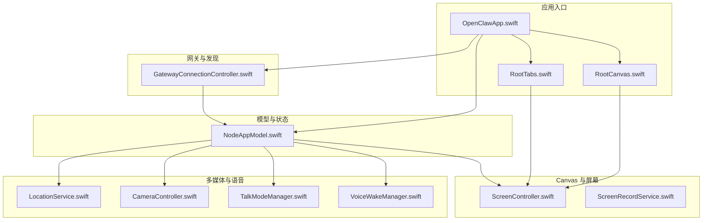

## 核心组件
- 应用入口与场景生命周期：OpenClawApp 初始化全局模型与网关控制器，注入到 RootCanvas/RootTabs，并监听 scenePhase 与深链。
- 应用模型 NodeAppModel：统一协调 Canvas、语音唤醒、相机、屏幕录制、位置、网关会话、Talk 模式；负责命令分发与错误处理。
- Canvas 展示与交互：ScreenController 承载 WKWebView，支持本地 scaffold 页面与外部 URL；拦截 `openclaw://` 深链并回调上层；支持 A2UI 动作消息通道；提供快照、导航与调试状态。
- 语音唤醒 VoiceWakeManager：实时音频采集与识别，触发词门控匹配，状态同步与暂停/恢复。
- 网关连接 GatewayConnectionController：Bonjour 发现、自动连接、TLS 参数解析、能力与命令清单、设备信息上报。
- 屏幕录制 ScreenRecordService：基于 ReplayKit 的录屏写入，支持可选音频与帧率控制。
- 相机 CameraController：设备列表、拍照与录视频（含转码），权限与参数校验。
- 位置 LocationService：授权与精度、超时控制、缓存与最新位置获取。
- Talk 模式 TalkModeManager：持续语音识别、静默窗口判定、聊天订阅、TTS 播放与中断。

## 架构总览
应用采用“SwiftUI 视图层 + 观测模型 + 多媒体/系统服务”的分层架构。Canvas 作为统一 UI 容器，通过 NodeAppModel 统一调度各子系统；网关连接由 GatewayConnectionController 管理；语音唤醒与 Talk 模式分别独立运行但与 NodeAppModel 协同。

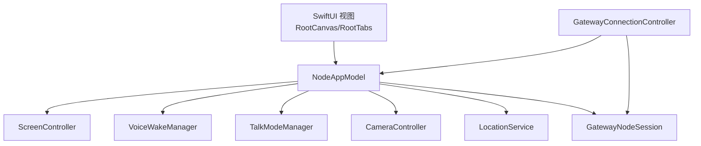

## 详细组件分析

### Canvas 渲染与交互（ScreenController）
- 页面承载：默认加载内置 scaffold HTML，支持本地文件与远程 URL；导航失败时记录错误文本。
- 深链拦截：WKNavigationDelegate 拦截 `openclaw://` 并回调 onDeepLink。
- A2UI 动作桥接：WKScriptMessageHandler 接收来自 Canvas 的动作消息，仅在受信来源（本地文件或局域网/本地 DNS）生效，透传给 onA2UIAction。
- 调试状态：通过 JS 注入设置调试状态开关与标题/副标题。
- 快照与导出：提供 PNG/JPEG 快照与宽度限制；支持等待 A2UI 就绪后执行消息。

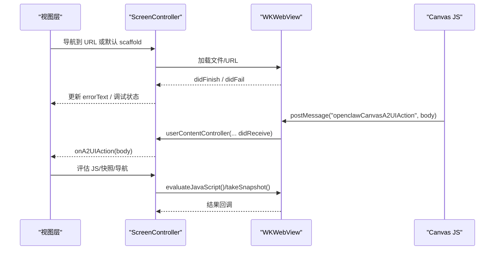

### 语音唤醒（VoiceWakeManager）
- 权限与会话：请求麦克风与语音识别权限，配置 AVAudioSession 为 measurement 模式。
- 实时采集：安装输入节点 Tap，将缓冲区复制到队列，识别任务异步处理。
- 触发词匹配：基于 `WakeWordGateConfig` 进行门控匹配，去重与最小间隔控制。
- 状态与生命周期：启动/停止/暂停/恢复；识别错误自动重启；状态文本反馈。

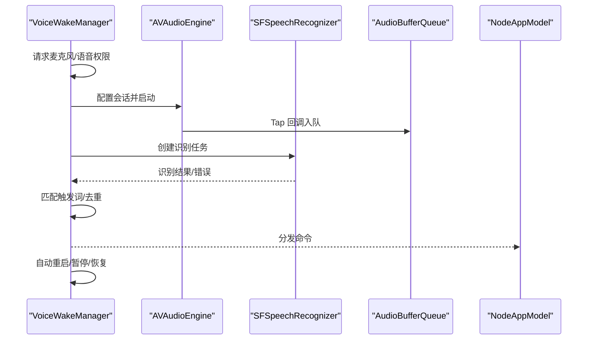

### 网络连接与 Bonjour 配对（GatewayConnectionController）
- 发现与自动连接：启动/停止发现，根据首选/上次发现的稳定 ID 自动连接；支持手动连接。
- TLS 参数：从发现结果或用户配置解析 TLS 参数，支持指纹校验与 TOFU。
- 能力与命令：动态生成客户端能力与命令清单，随设备/权限变化更新。
- 设备信息：平台、机型、版本、显示名等。

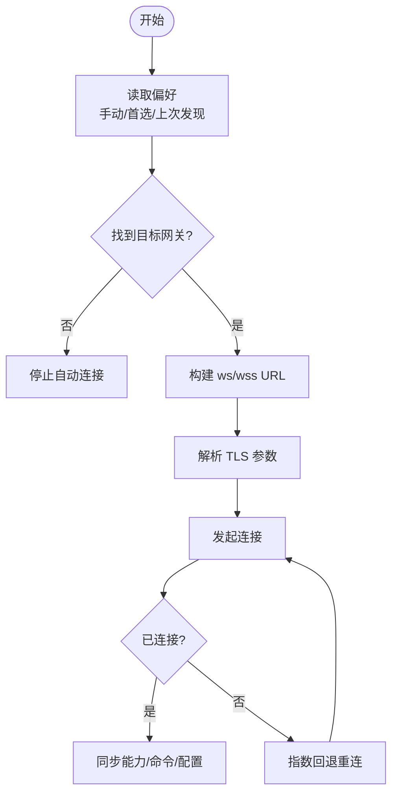

### 相机控制（CameraController）
- 设备枚举：支持多种内置摄像头类型，按方向或设备 ID 选择。
- 拍照：限制最大宽度与质量，JPEG 转码并返回 base64 与尺寸。
- 录视频：可选音频，输出 MOV 后转 MP4，返回 base64、时长与音频标志。
- 参数与安全：参数范围校验、权限检查、会话预热与延迟拍摄。

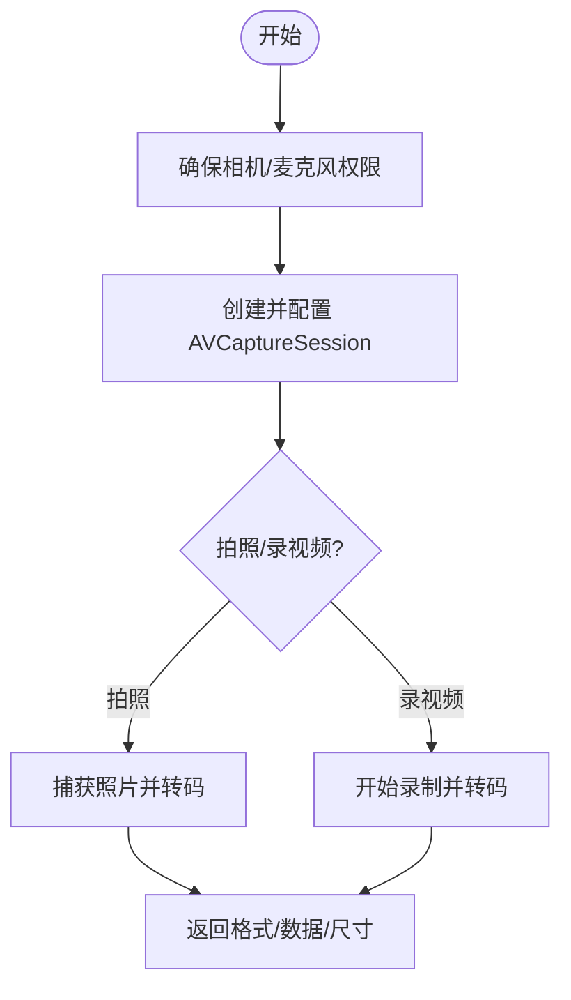

### 屏幕录制（ScreenRecordService）
- 录制流程：启动 ReplayKit 捕获，按 FPS 采样丢帧，写入 AVAssetWriter，支持可选音频。
- 写入与完成：准备写入器、标记输入完成、结束会话并完成写入。
- 参数约束：时长与帧率范围校验，避免过高的资源消耗。

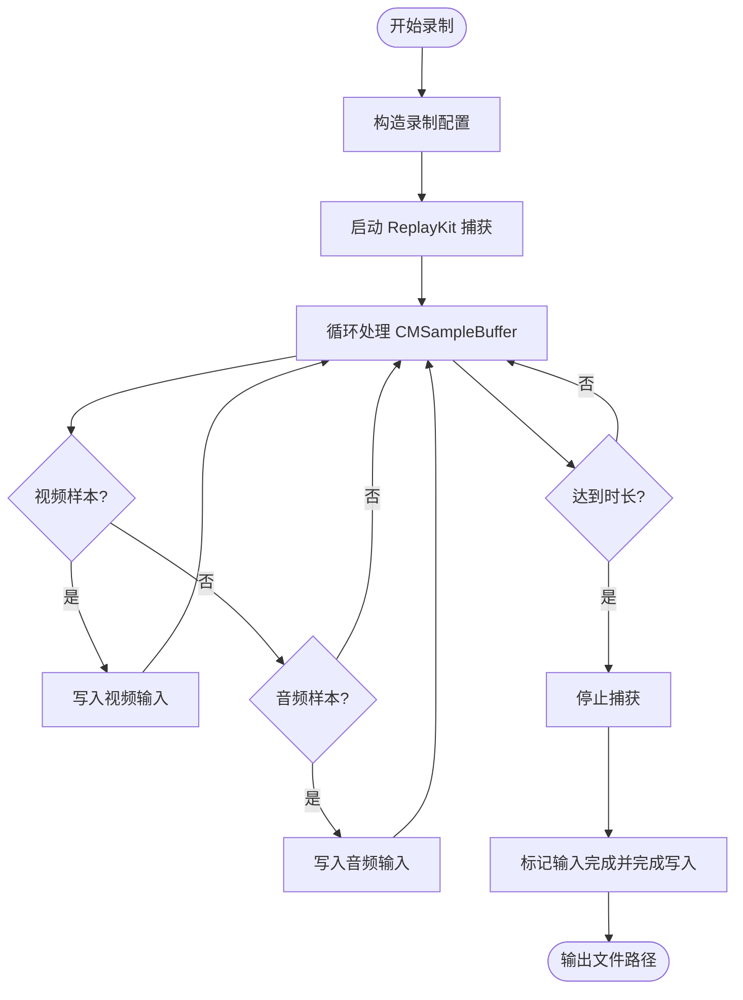

### 位置服务（LocationService）
- 授权与精度：支持 WhenInUse/Always，按需请求；缓存最近位置与年龄判断。
- 查询与超时：可配置 desiredAccuracy、maxAgeMs、timeoutMs，超时抛错。
- 回调与异常：委托回调中恢复 Continuation，失败时抛出错误。

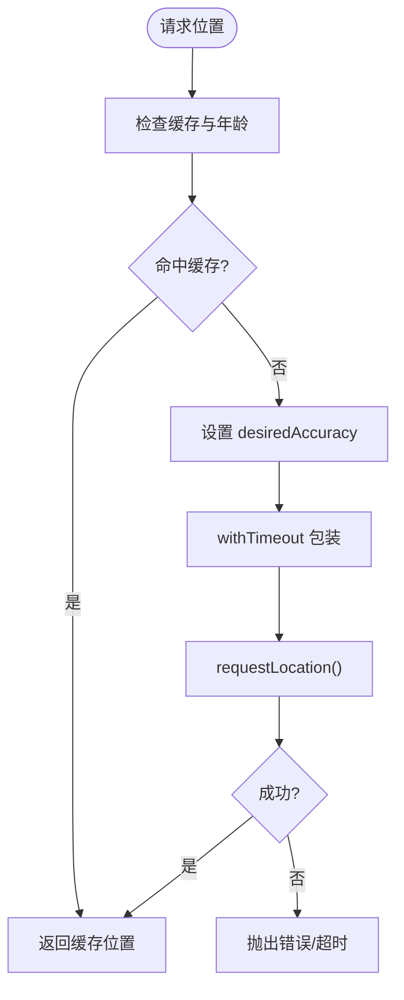

### Talk 模式（TalkModeManager）
- 识别与静默：持续识别，静默窗口后提交最终文本；识别期间可被说话打断。
- 聊天与订阅：向网关发送 chat.send，订阅 chat 事件流，等待 final/aborted/error。
- TTS 播放：优先 ElevenLabs 流式合成，支持 PCM/MP3；失败回退系统语音；支持语音别名与模型覆盖。
- 生命周期：启用/禁用、启动/停止、音频会话配置、聊天订阅清理。

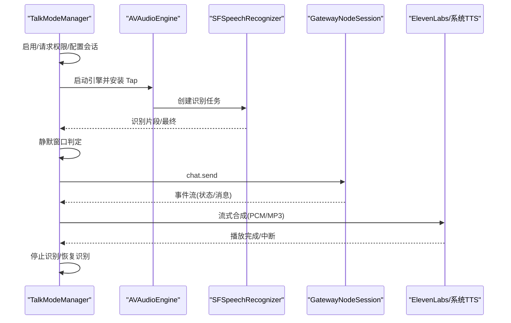

### 应用生命周期与状态同步
- 场景生命周期：OpenClawApp 监听 scenePhase，通知 NodeAppModel 与 GatewayConnectionController 切换发现/连接状态。
- Canvas 调试：RootCanvas/RootTabs 根据网关状态与相机/录音状态更新顶部状态指示与活动徽章。
- 防休眠：根据场景与偏好控制 isIdleTimerDisabled。

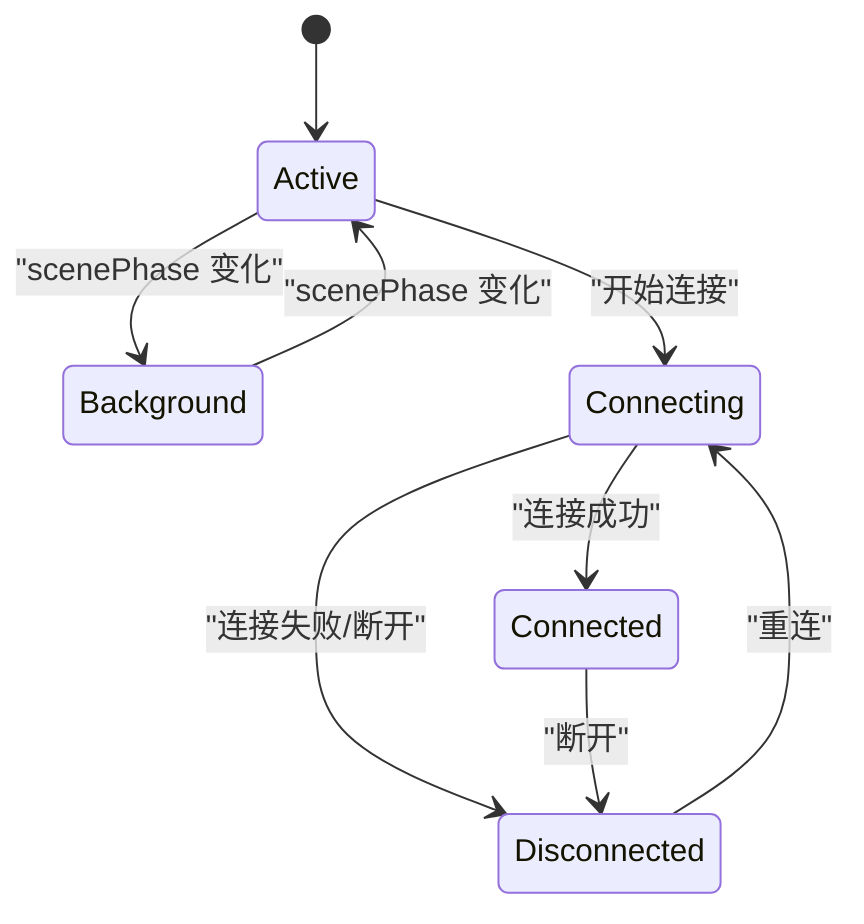

## 依赖关系分析
- 模块耦合
  - NodeAppModel 作为中枢，依赖 ScreenController、VoiceWakeManager、TalkModeManager、CameraController、LocationService、GatewayNodeSession。
  - GatewayConnectionController 依赖 Discovery 与 NodeAppModel，负责连接生命周期与能力/命令清单。
  - ScreenController 依赖 WKWebView 与自定义消息处理器，保证安全来源校验。
- 外部依赖
  - AVFoundation/AVAudioEngine：音频采集与播放、相机捕获。
  - WebKit：Canvas 渲染与 JS 交互。
  - ReplayKit：屏幕录制。
  - Speech：语音识别。
  - CoreLocation：位置服务。
  - Network：WebSocket 会话封装（通过 OpenClawKit）。

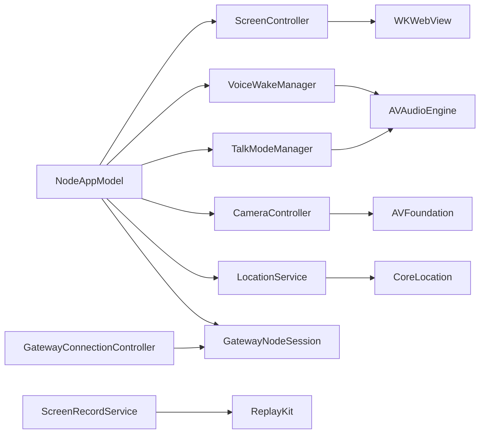

## 性能考虑
- Canvas
  - 默认不透明背景与滚动行为优化，快照时可指定最大宽度以控制负载。
  - 调试状态通过 JS 注入，避免频繁重绘。
- 语音唤醒
  - 使用 measurement 模式降低功耗；识别错误后短暂延迟再重启，避免忙等。
  - 队列复制音频缓冲，避免主线程阻塞。
- 录屏
  - 按目标 FPS 丢帧，减少写入压力；仅在需要时开启音频。
- 相机
  - 会话预热与延迟拍摄减少首帧空白；JPEG 转码限制最大宽度与质量。
- 位置
  - 缓存最近位置并按 age 判定，避免频繁请求；超时控制防止长时间占用。

## 故障排查指南
- Canvas
  - 深链无法打开：检查 `openclaw://` 拦截与 onDeepLink 回调是否正确设置。
  - A2UI 动作无效：确认消息来源为受信 URL（本地文件或局域网/本地 DNS）。
  - 调试状态不显示：确认 setDebugStatusEnabled 与 setStatus 的 JS 注入是否执行。
- 语音唤醒
  - 无声音：检查麦克风/语音识别权限；确认会话配置与引擎启动。
  - 误唤醒/不响应：调整触发词、最小间隔；检查识别错误自动重启逻辑。
- 网关连接
  - 无法发现：检查 Bonjour 是否可用、偏好设置与网络环境。
  - TLS 失败：核对指纹与 TOFU 设置；确认证书链与主机名。
- 相机/录屏/位置
  - 权限拒绝：引导用户在设置中授权；注意 WhenInUse/Always 差异。
  - 资源占用高：降低快照/录屏分辨率与帧率；缩短时长；关闭音频。

## 结论
该 iOS 应用以 SwiftUI 为界面层，结合 NodeAppModel 统一编排 Canvas、语音唤醒、Talk 模式、相机、屏幕录制与位置服务，配合 GatewayConnectionController 完成 Bonjour 发现与网关连接。整体设计强调可观测性（调试状态）、安全性（受信来源校验）、鲁棒性（错误自动重启/回退）与性能（参数约束/资源控制）。建议在后续迭代中进一步完善后台任务与电池优化策略，并扩展自动化测试覆盖面。

## 附录
- 开发与构建
  - 使用 xcodegen 生成 Xcode 工程；使用 swiftformat/swiftlint 保持代码风格；fastlane 提供上传流水线。
- iOS 特性最佳实践
  - 权限管理：在首次使用前请求，提供清晰的用途说明；尊重用户拒绝。
  - 后台处理：合理使用后台任务与系统能力，避免长时间占用 CPU/GPU。
  - 电池优化：降低音频/视频处理频率与分辨率；及时释放资源与取消任务。
  - 内存优化：避免大对象常驻；及时取消异步任务与观察者；使用弱引用防止循环引用。
- 测试策略
  - 单元测试：针对各控制器与工具函数进行隔离测试（如 CameraController、ScreenRecordService）。
  - 集成测试：端到端验证 Canvas 导航、A2UI 动作、语音唤醒与网关事件同步。
  - UI 测试：使用 SwiftUI Preview 与 Snapshot 测试覆盖关键界面状态。
  - 调试技巧：利用调试状态面板、日志与断点；在模拟器与真机上分别验证不同行为。