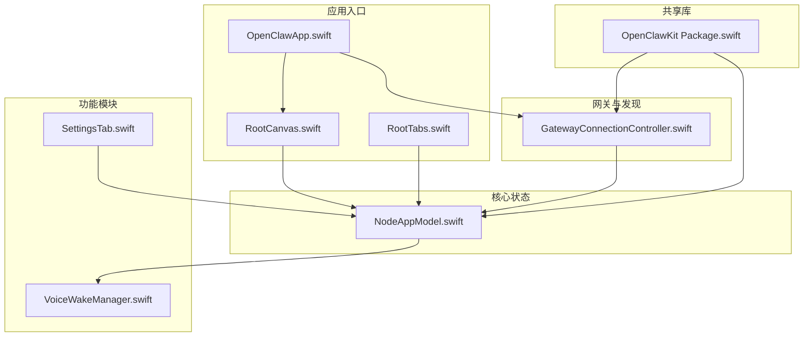
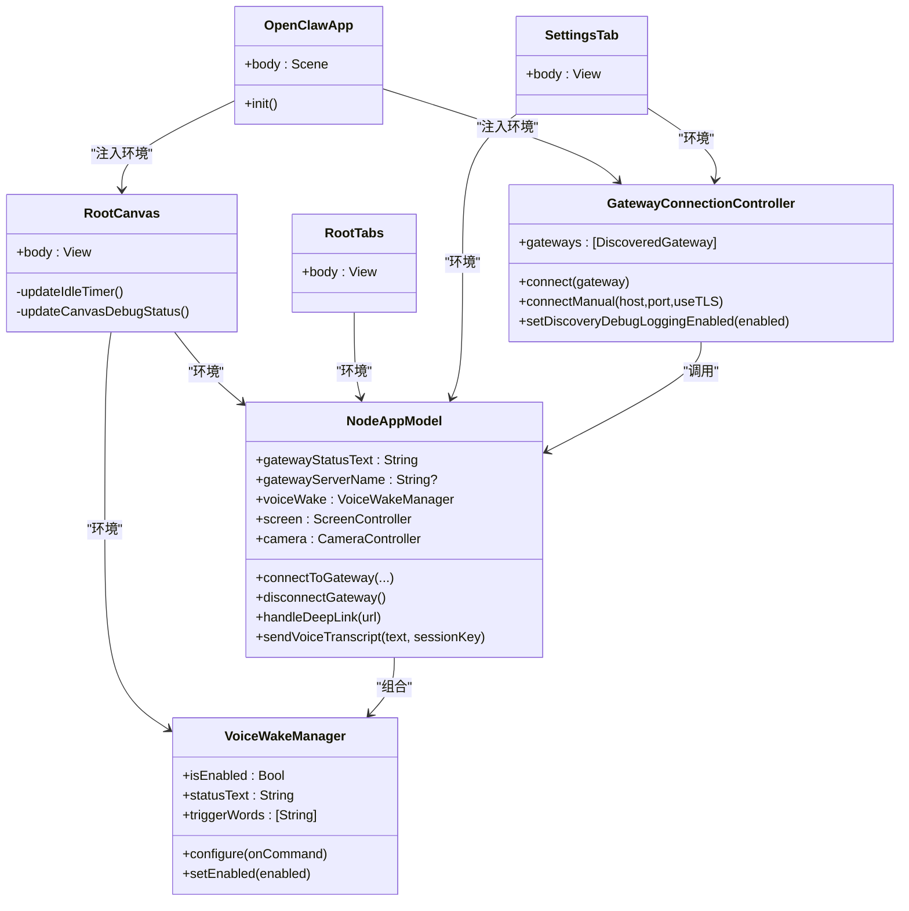
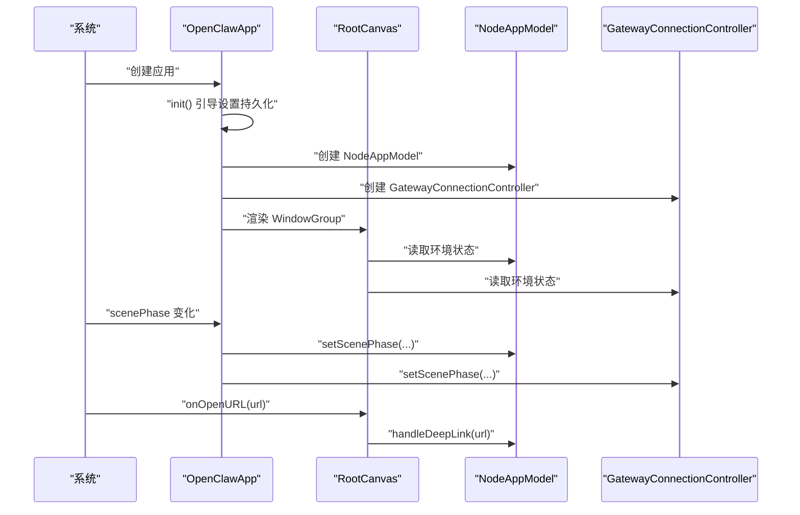
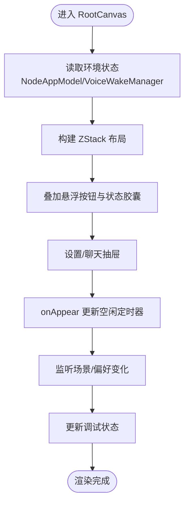
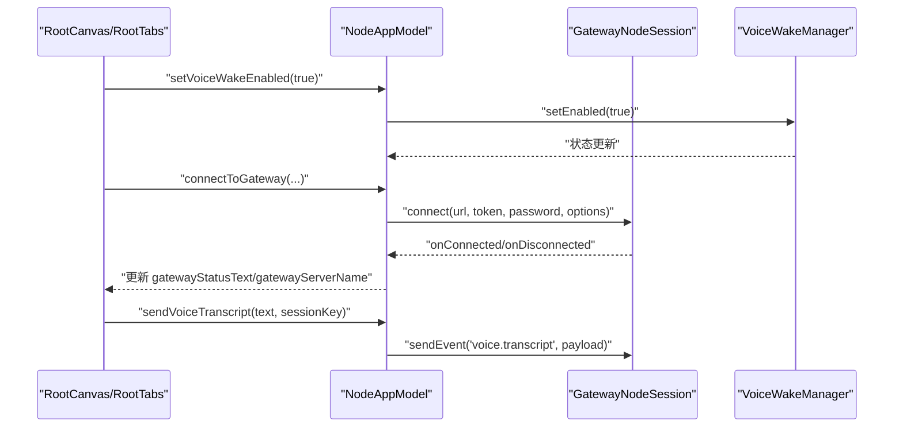
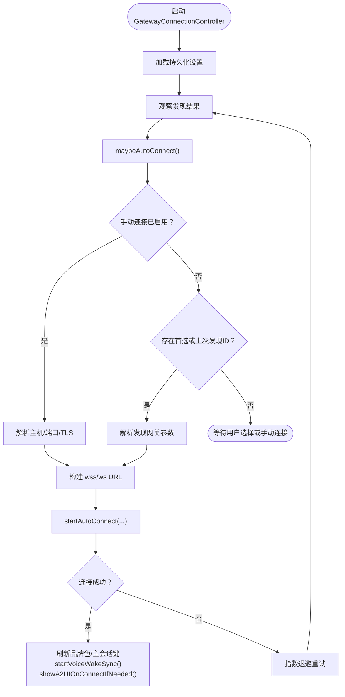
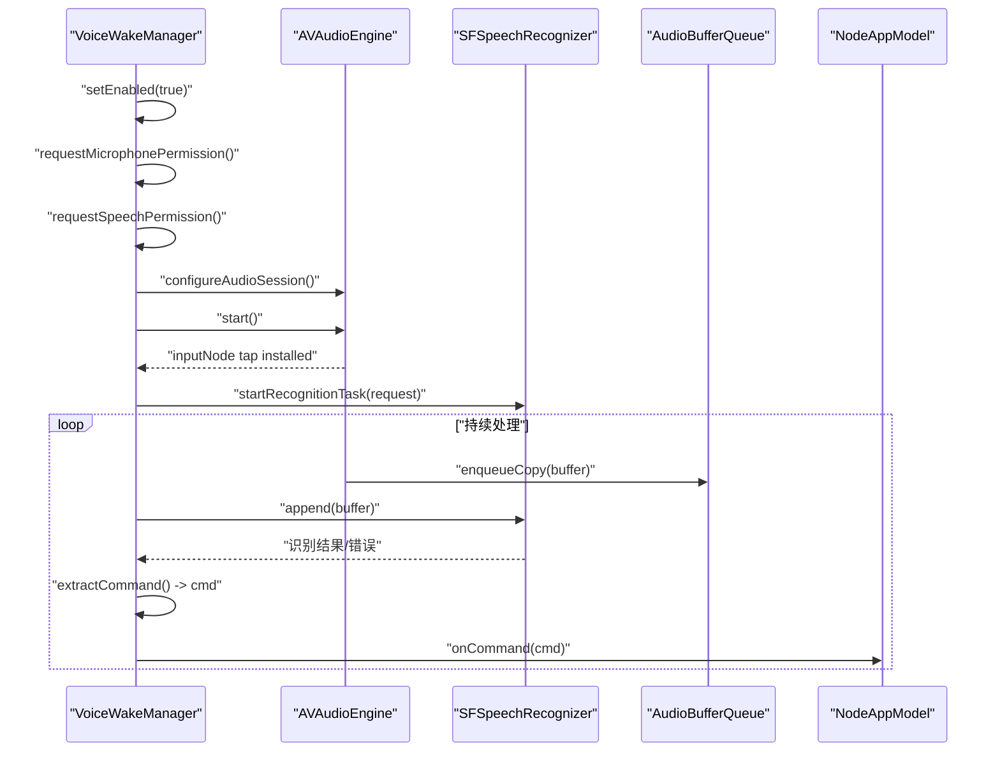
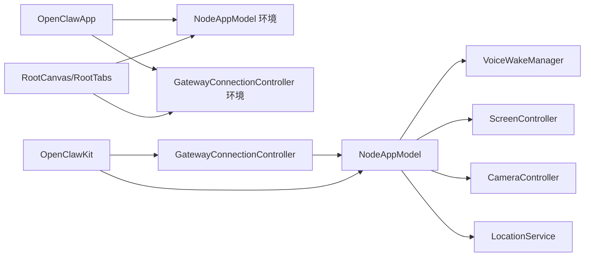

# 应用架构

## 目录
1. [引言](#引言)
2. [项目结构](#项目结构)
3. [核心组件](#核心组件)
4. [架构总览](#架构总览)
5. [详细组件分析](#详细组件分析)
6. [依赖分析](#依赖分析)
7. [性能考虑](#性能考虑)
8. [故障排查指南](#故障排查指南)
9. [结论](#结论)
10. [附录](#附录)

## 引言
本文件面向 OpenClaw iOS 应用，系统性梳理其整体架构与实现细节，重点覆盖以下方面：
- SwiftUI 应用入口与根视图层次
- 会话管理与网关连接控制
- 启动流程、初始化与生命周期管理
- 状态管理、导航架构与数据流
- 模块化组织与依赖注入
- 配置与环境变量管理
- 性能优化与内存管理策略
- 测试架构与调试工具使用

目标是帮助开发者快速理解应用如何通过 Observable 状态模型驱动 UI，并以清晰的职责边界实现网关通信、语音唤醒、屏幕与相机能力等核心功能。

## 项目结构
iOS 应用位于 `apps/ios/Sources`，采用按功能域分层的组织方式：
- 入口与根视图：`OpenClawApp.swift`、`RootCanvas.swift`、`RootTabs.swift`
- 核心状态与业务逻辑：`Model/NodeAppModel.swift`
- 网关与发现：`Gateway/GatewayConnectionController.swift`、`GatewayDiscoveryModel`（由 OpenClawKit 提供）
- 功能模块：`Voice`（语音）、`Settings`（设置）、`Screen`（屏幕）、`Camera`（相机）、`Status`（状态指示）
- 资源与图标：`Assets.xcassets`
- 配置与构建：`OpenClawKit Package.swift`（共享库）

## 核心组件
- 应用入口与场景管理
  - `OpenClawApp`：声明式 SwiftUI 应用入口，负责初始化 `NodeAppModel` 与 `GatewayConnectionController`，并在 `WindowGroup` 中注入环境值，处理深链与场景生命周期事件。
- 根视图与导航
  - `RootCanvas`：顶层 ZStack 布局，承载屏幕内容与悬浮操作按钮，支持侧边抽屉（设置与聊天）；根据系统色系与偏好控制界面外观；维护空闲休眠策略与调试状态显示。
  - `RootTabs`：传统 `TabView` 导航，包含“屏幕”“语音”“设置”三个标签页，顶部状态胶囊统一展示网关与功能状态。
- 核心状态模型
  - `NodeAppModel`：`@Observable` 单例式状态容器，封装网关连接、语音唤醒、屏幕与相机控制、位置服务、A2UI 行为派发、深链处理、会话键管理等。
- 网关连接控制器
  - `GatewayConnectionController`：负责网关发现、自动连接、TLS 参数解析、连接选项生成与场景生命周期响应；协调 `NodeAppModel` 的连接/断开流程。
- 语音唤醒
  - `VoiceWakeManager`：基于 `AVAudioEngine` 与 `SFSpeech` 的实时音频采集与识别，支持触发词匹配、外部音频捕获时暂停恢复、状态文本与权限请求。
- 设置面板
  - `SettingsTab`：集中管理节点信息、网关发现与连接、手动连接、语音唤醒、相机与定位权限、屏幕休眠、调试开关等。

## 架构总览
应用采用“Observable 状态 + 环境注入”的 SwiftUI 架构，结合 OpenClawKit 提供的协议与网关通信能力，形成清晰的职责分层：
- 视图层：`RootCanvas`/`RootTabs` 展示状态并触发用户交互
- 控制器层：`GatewayConnectionController` 协调连接与发现
- 状态层：`NodeAppModel` 统一管理业务状态与跨模块协作
- 外部能力：`VoiceWakeManager`、`ScreenController`、`CameraController`、`LocationService` 等

## 详细组件分析

### 应用入口与生命周期
- 初始化阶段
  - 在 `OpenClawApp.init` 中完成网关设置持久化引导、`NodeAppModel` 与 `GatewayConnectionController` 的实例化，并将二者注入到 `RootCanvas` 的环境值中。
- 场景生命周期
  - 监听 `scenePhase` 变化，同步更新 `NodeAppModel` 与 `GatewayConnectionController` 的内部状态（如停止/启动发现、调整后台限制）。
- 深链处理
  - `onOpenURL` 回调交由 `NodeAppModel.handleDeepLink` 处理，确保在网关可用时转发代理请求。

### 根视图与导航架构
- `RootCanvas`
  - 顶层 ZStack 包裹 Canvas 内容与相机闪光覆盖层；提供设置与聊天抽屉；根据 `AppStorage` 控制防止休眠、调试状态显示；监听场景与系统偏好变化以动态更新 UI。
  - 顶部状态胶囊统一展示网关连接状态、活动提示（维修、待审批、录制屏幕、相机 HUD、语音唤醒权限/暂停）。
- `RootTabs`
  - 传统三标签页布局，顶部状态胶囊复用相同逻辑，保持跨标签一致的状态呈现。

### 状态管理与数据流
- `NodeAppModel` 作为单一真相源，集中管理：
  - 网关连接：`connectToGateway`/`disconnectGateway`，重连退避、状态文本与远端地址更新、品牌色与主会话键同步
  - 语音唤醒：配置回调、启用/禁用、与网关同步触发词
  - 屏幕与相机：A2UI 行为派发、截图/录屏、相机设备列表与拍照/拍视频
  - 深链与代理请求：校验消息长度、转发至网关、错误文案
  - 位置服务：权限检查、精度与后台访问约束
- 数据流向
  - 视图通过环境读取状态，用户交互触发 `NodeAppModel` 方法，异步任务更新状态并回传 UI
  - 网关事件通过 `GatewayConnectionController` 与 `NodeAppModel` 协作，驱动 UI 与本地行为

### 网关连接与发现
- 自动连接策略
  - 依据首选/上次发现的稳定 ID 或手动配置，解析主机、端口与 TLS 参数，构造 WebSocket URL 并启动连接
  - 连接成功后刷新品牌色与主会话键，开始语音唤醒同步与 A2UI 自动打开
- 发现与调试
  - 支持开启发现日志与查看调试日志，便于诊断网络与配对问题
- 场景生命周期
  - 在后台停止发现，在前台恢复，避免无谓资源消耗

### 语音唤醒与音频处理
- 权限与状态
  - 请求麦克风与语音识别权限，失败时更新状态文本；在模拟器上禁用以规避音频栈问题
- 实时识别
  - 使用 `AVAudioEngine` 与 `SFSpeech`，安装输入节点 Tap 将 PCM 缓冲复制到队列，识别任务消费队列中的缓冲，提取触发词并派发命令
- 外部音频捕获
  - 拍照/录屏等场景可临时暂停识别，结束后自动重启
- 状态反馈
  - 顶部状态胶囊与 Toast 展示触发命令与权限/暂停状态

### 设置与配置
- 节点与网关
  - 显示设备信息、平台版本、模型标识；展示发现与连接状态；支持手动连接与调试日志
- 语音与相机
  - 开启/关闭语音唤醒与“说话模式”，设置触发词；允许相机请求并在前台执行
- 定位
  - 选择“关闭/使用期间/始终”，精确位置开关受模式影响；后台访问需“始终”
- 屏幕
  - 防止休眠、调试状态显示
- 网关凭据
  - 保存/加载网关 Token 与密码，按实例 ID 分组存储

## 依赖分析
- 模块化组织
  - iOS 应用通过 OpenClawKit 提供的协议与网关通信能力，实现跨平台一致性
  - `NodeAppModel` 组合多个子系统（屏幕、相机、位置、语音），并通过 `GatewayNodeSession` 与网关交互
- 依赖注入
  - `OpenClawApp` 通过环境注入 `NodeAppModel` 与 `GatewayConnectionController`，`RootCanvas`/`RootTabs` 通过环境读取状态
- 外部依赖
  - `ElevenLabsKit`、`Textual`（macOS/iOS 条件编译）等第三方库由 OpenClawKit 承载

## 性能考虑
- 音频处理
  - 识别回调在非隔离上下文执行，仅在 MainActor 上更新 UI 与状态，避免主线程阻塞
  - Tap 队列采用锁保护的缓冲池，减少主线程拷贝开销
- 网络重连
  - 指数退避与最大上限控制重试频率，降低网络抖动对用户体验的影响
- UI 与动画
  - 状态胶囊与 Toast 使用轻量动画，避免复杂过渡造成掉帧
- 资源释放
  - 断开连接与停止识别时及时移除 Tap、取消任务、释放音频会话，防止资源泄漏

## 故障排查指南
- 语音唤醒不可用
  - 检查麦克风与语音识别权限是否授予；确认不在模拟器运行；查看状态文本与 Toast 提示
- 网关连接失败
  - 查看“发现/状态/服务器/地址”字段；尝试手动连接；开启发现调试日志；核对 TLS 指纹与存储
- 深链无法转发
  - 确认网关已连接；检查消息长度限制；查看错误文案
- 相机/录屏受限
  - 确认相机权限已开启；前台执行；注意外部音频捕获时的暂停/恢复流程

## 结论
OpenClaw iOS 应用以 SwiftUI 与 Observable 状态为核心，结合 OpenClawKit 的协议与网关能力，实现了高内聚、低耦合的功能模块。通过清晰的入口与根视图、完善的生命周期管理、严格的权限与状态反馈，以及稳健的测试与调试支持，应用在易用性与可靠性之间取得了良好平衡。

## 附录

### 测试架构与调试工具
- 单元测试
  - 使用 Swift Testing 框架，集中于 `NodeAppModel` 的命令处理、深链与 A2UI 行为、背景限制与相机/屏幕格式校验等
- 调试工具
  - 设置面板提供“发现调试日志”“调试画布状态”等开关；`RootCanvas`/`RootTabs` 顶部状态胶囊提供即时反馈
- 覆盖范围
  - 测试覆盖了参数解码、负载编码、未知命令返回、深链大小限制、离线发送语音转录等关键路径