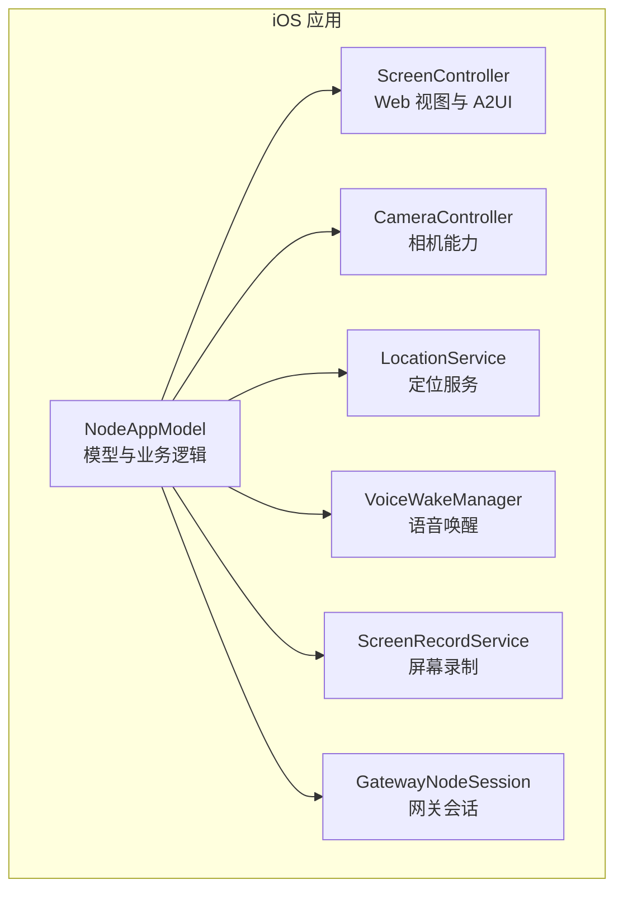
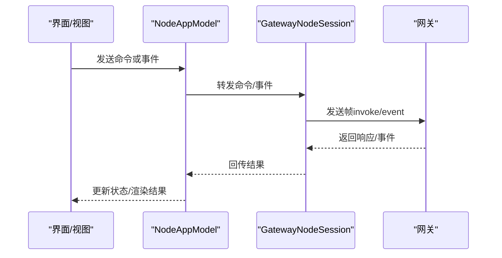
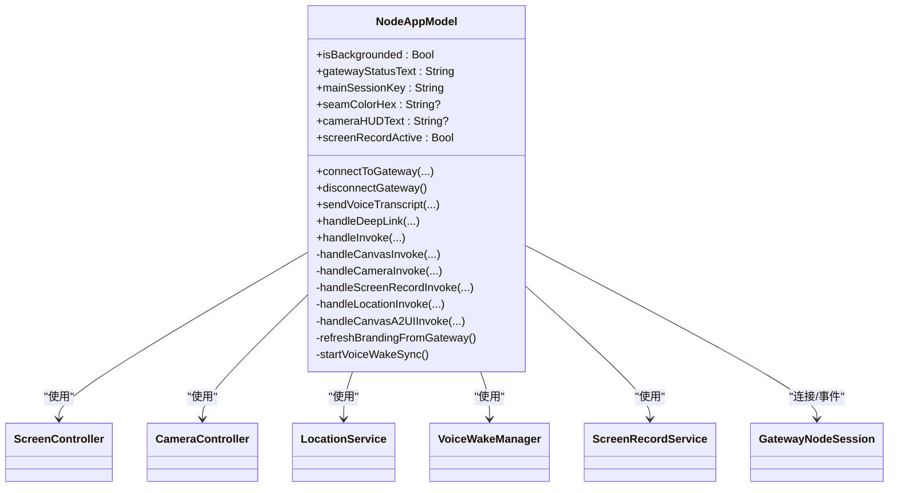
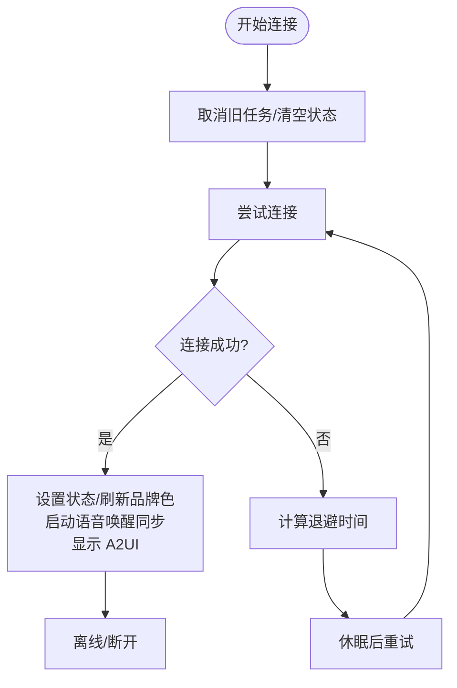
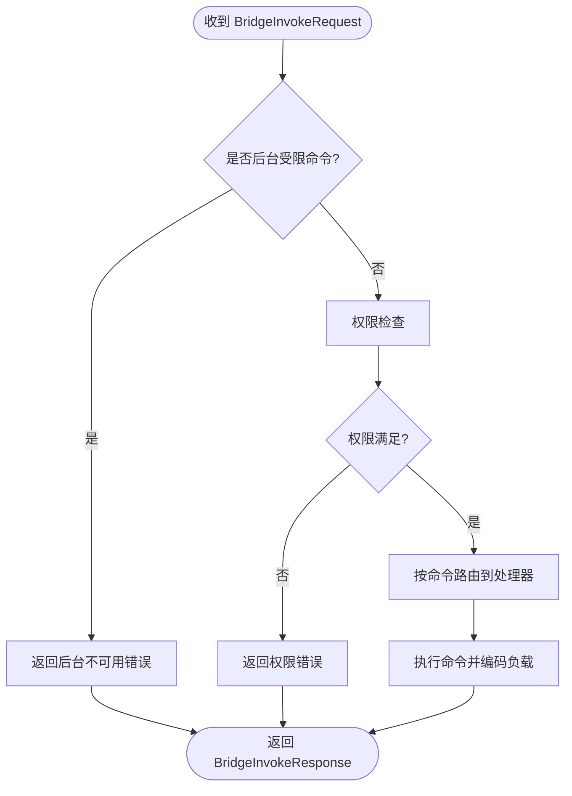
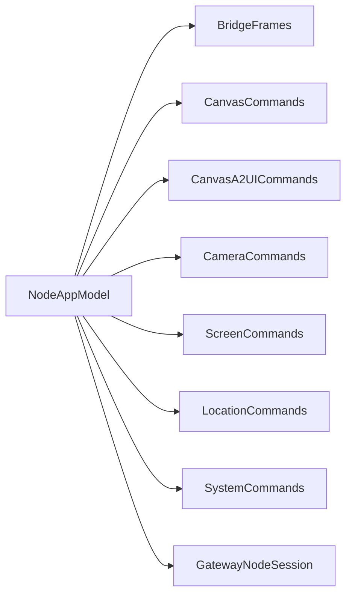

# 模型管理

## 目录
1. [简介](#简介)
2. [项目结构](#项目结构)
3. [核心组件](#核心组件)
4. [架构总览](#架构总览)
5. [详细组件分析](#详细组件分析)
6. [依赖关系分析](#依赖关系分析)
7. [性能考虑](#性能考虑)
8. [故障排查指南](#故障排查指南)
9. [结论](#结论)
10. [附录](#附录)

## 简介
本文件面向 OpenClaw iOS 平台的“节点应用模型”（NodeAppModel），系统性阐述其设计与实现原理，覆盖以下主题：
- 模型的数据结构与状态管理
- 业务逻辑与控制流
- 模型与视图（ScreenController）之间的绑定与数据流
- 初始化流程与配置管理（用户偏好、会话键、品牌色等）
- 扩展与定制方法（命令集、能力开关、A2UI 行为）
- 性能优化与缓存策略
- 测试方法与验证流程

## 项目结构
NodeAppModel 位于 iOS 应用层，负责桥接网关（Gateway）与本地 UI 能力（相机、屏幕录制、位置、语音唤醒等）。其核心职责包括：
- 网关连接与重连、事件订阅、请求转发
- 命令分发与执行（canvas、camera、screen、location、A2UI 等）
- 用户偏好与设备能力的读取与同步
- 与 ScreenController 的双向交互（导航、脚本执行、截图、A2UI 渲染）

## 核心组件
- NodeAppModel：主模型，集中管理网关连接、命令处理、状态更新、UI 绑定与用户偏好。
- ScreenController：承载 Web 视图与 A2UI 渲染，支持导航、脚本执行、截图、等待就绪等。
- CameraController：相机设备列表、拍照、拍视频等。
- LocationService：位置授权、精度、超时与最大年龄控制。
- VoiceWakeManager：语音唤醒开关与同步。
- ScreenRecordService：屏幕录制并返回编码后的媒体数据。
- GatewayNodeSession：与网关建立连接、发送事件、订阅服务器事件、RPC 请求。

## 架构总览
NodeAppModel 通过 GatewayNodeSession 与网关进行桥接通信，遵循统一的帧协议（invoke/event/ping）；同时与本地组件协作完成跨平台能力调用。

## 详细组件分析

### NodeAppModel 类与状态管理
- 角色定位：@Observable 主模型，集中维护网关连接状态、会话键、品牌色、相机 HUD、屏幕录制状态等。
- 关键状态字段：
  - 连接状态：gatewayStatusText、gatewayServerName、gatewayRemoteAddress、connectedGatewayID、gatewayConnected
  - 会话与品牌：mainSessionKey、seamColorHex
  - 能力与权限：voiceWake、talkMode、locationService、camera、screen、screenRecorder
  - UI 辅助：cameraHUDText、cameraHUDKind、screenRecordActive
- 生命周期与场景切换：通过 setScenePhase 切换 isBackgrounded，影响后台受限命令的执行策略。
- 初始化：配置语音唤醒回调、读取用户偏好、绑定深链与 A2UI 动作回调。

### 网关连接与重连机制
- 支持 TLS 配置与可取消任务；连接成功后刷新品牌色、启动语音唤醒同步、自动打开 A2UI。
- 断开时清理状态并回退到本地默认画布。
- 失败重连采用指数退避策略，避免频繁重试。

### 命令分发与执行（Invoke）
- 入口：`handleInvoke` 根据命令前缀路由到具体处理器。
- 后台限制：`canvas./camera./screen.` 命令在后台被拒绝，提示前台运行。
- 权限检查：`camera.*` 命令需相机权限；`location.get` 需位置权限且后台需 Always 授权。
- 成功路径：调用对应处理器（canvas/camera/location/screen/A2UI），构造 JSON 负载并返回。
- 异常路径：将错误转换为 OpenClawNodeError，并对相机类命令展示 HUD。

### Canvas 命令与 A2UI
- `canvas.present/hide/navigate/eval/snapshot`：与 ScreenController 协作完成导航、脚本执行与截图。
- A2UI `reset/push/pushJSONL`：解析 A2UI 主机地址，导航至 A2UI 页面，等待就绪后注入消息并返回结果。
- A2UI 行为依赖网关提供的主机地址，若未配置则返回“主机未配置”错误。

### 相机命令与相机 HUD
- `camera.list/snap/clip`：相机设备枚举、拍照（含闪光）、拍视频（含音频）。
- 相机 HUD：显示拍照/录制状态与自动隐藏逻辑，避免叠加动画。

### 屏幕录制命令
- `screen.record`：录制指定时长与帧率的 MP4 视频，返回 Base64 编码数据与元信息。
- 录制期间状态指示器保持可见，避免遮挡。

### 位置命令
- `location.get`：根据用户偏好与当前授权状态决定精度与超时，返回标准化位置负载。
- 后台限制：非 Always 授权时禁止后台获取位置。

### 语音唤醒与品牌色
- 语音唤醒：从网关拉取触发词并同步到本地偏好；支持设置全局触发词。
- 品牌色：从网关配置读取 UI `seamColor`，支持十六进制解析与默认值。

### 深链接与代理请求
- `handleDeepLink` 解析 `openclaw://agent` 链接，校验大小与连接状态后转发到网关。
- `sendAgentRequest` 将 `AgentDeepLink` 编码为事件发送。

### 模型与视图绑定机制
- ScreenController 提供 `onDeepLink/onA2UIAction` 回调，NodeAppModel 在初始化时注册，形成从视图到模型的单向数据流。
- NodeAppModel 通过 ScreenController 的导航、脚本执行、截图、等待就绪等接口完成 UI 更新。
- 相机 HUD 与屏幕录制状态通过 @Observable 字段驱动 SwiftUI 自动刷新。

### 初始化流程与配置管理
- 初始化阶段：
  - 配置语音唤醒回调并读取用户偏好（`voiceWake.enabled`、`talk.enabled`）
  - 绑定深链与 A2UI 动作回调
- 配置来源：
  - UserDefaults：位置模式、精确度、相机启用、实例标识、显示名称等
  - 网关：`config.get` 获取 UI 品牌色与会话主键
  - 设备：UIDevice 当前名称

### 扩展与定制方法
- 命令集扩展：`GatewayConnectionController` 依据节点能力动态列出可用命令（如 `camera/location`），便于在新平台上快速接入。
- A2UI 定制：通过网关下发的 `canvas host` 地址与 `openclawA2UI` 接口，实现前端渲染管线的灵活替换。
- 会话键定制：支持从网关读取主会话键并同步到 TalkMode，实现多会话上下文管理。

## 依赖关系分析
- NodeAppModel 依赖 OpenClawKit 的命令与帧协议定义，确保跨平台一致性。
- 与本地组件解耦：通过 ScreenController、CameraController、LocationService 等抽象接口调用，便于替换与测试。
- 网关协议：遵循 `invoke/event/ping` 帧规范，保证与网关的稳定交互。

## 性能考虑
- 连接重试退避：指数退避避免风暴式重连，降低网络压力。
- 截图尺寸控制：默认截图宽度针对不同格式设定上限，避免超过网关客户端的最大负载。
- 任务取消与弱引用：对网关任务、语音唤醒同步任务、相机 HUD 自动隐藏任务均采用可取消与弱引用，防止泄漏。
- 后台限制：后台执行受限命令直接拒绝，减少无效开销与权限失败带来的异常成本。

## 故障排查指南
- 网关连接问题
  - 现象：状态长时间为“连接中/重连中/错误”
  - 排查：检查 TLS 参数、Token/密码、网络连通性；观察日志文本与断开原因
- A2UI 主机未配置
  - 现象：A2UI `reset/push` 报错“主机未配置”
  - 排查：确认网关已提供 `canvas host`；检查 `resolveA2UIHostURL` 结果
- 语音唤醒不同步
  - 现象：本地触发词与网关不一致
  - 排查：确认 `startVoiceWakeSync` 已启动；检查 `voicewake.changed` 事件订阅
- 相机命令失败
  - 现象：相机 HUD 显示错误
  - 排查：确认相机权限；检查 `isCameraEnabled`；查看具体错误描述
- 屏幕录制格式错误
  - 现象：返回“格式必须为 mp4”
  - 排查：核对 `screen.record` 的 `format` 参数

## 结论
NodeAppModel 以清晰的状态机与命令路由为核心，结合本地组件与网关协议，实现了 iOS 节点的完整能力闭环。通过用户偏好与网关配置的双源驱动，既保证了本地体验的一致性，又支持远端策略的动态调整。建议在扩展新能力时遵循现有命令与参数命名规范，复用现有错误与 HUD 机制，确保一致的用户体验与可观测性。

## 附录

### 命令与参数一览（节选）
- Canvas 命令：`canvas.present`、`canvas.hide`、`canvas.navigate`、`canvas.eval`、`canvas.snapshot`
- 相机命令：`camera.list`、`camera.snap`、`camera.clip`
- 屏幕命令：`screen.record`
- 位置命令：`location.get`
- A2UI 命令：`canvas.a2ui.reset`、`canvas.a2ui.push`、`canvas.a2ui.pushJSONL`
- 系统命令：`system.run`、`system.which`、`system.notify`、`system.execApprovals.*`

### 测试方法与验证流程
- 单元测试覆盖：
  - 参数编解码与负载编码正确性
  - 后台命令拒绝、相机禁用拒绝、屏幕格式校验
  - Canvas/A2UI 命令在主机缺失时的行为
  - 深链大小限制与连接状态下的行为
  - 语音转录在离线时的异常抛出
- 测试辅助：`withUserDefaults` 快照恢复 UserDefaults，保证测试隔离。