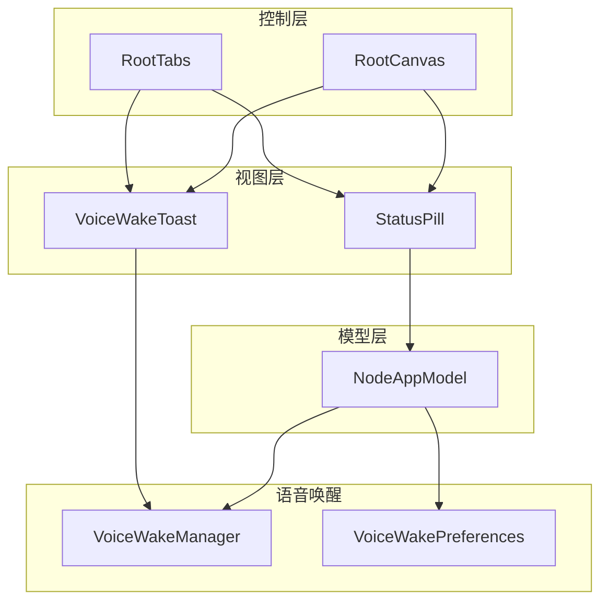
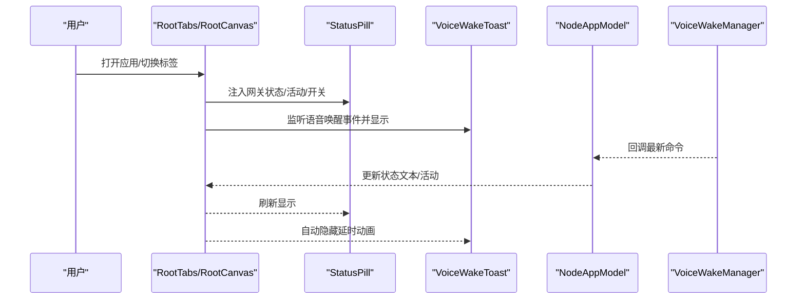
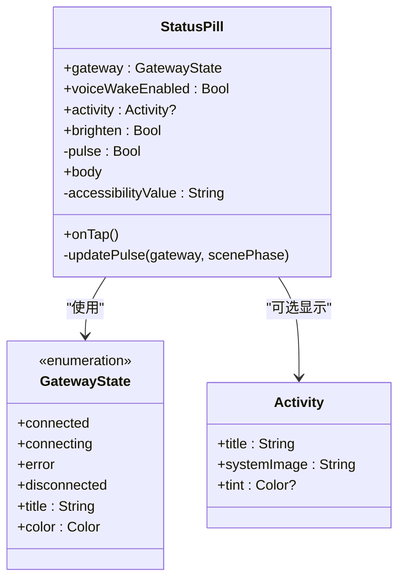
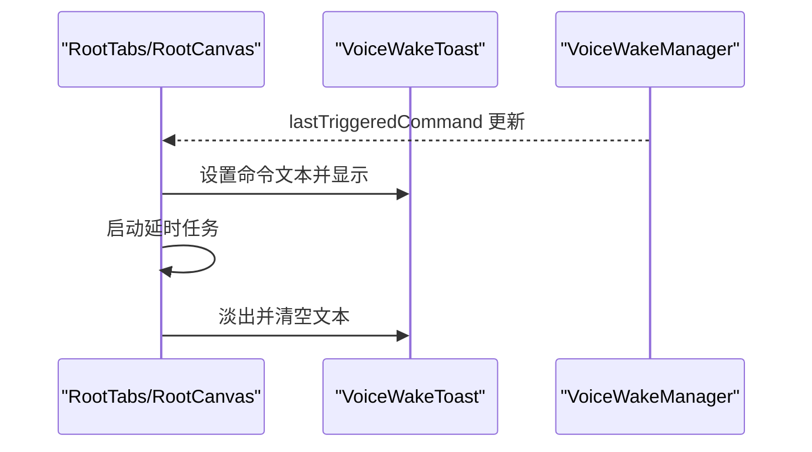
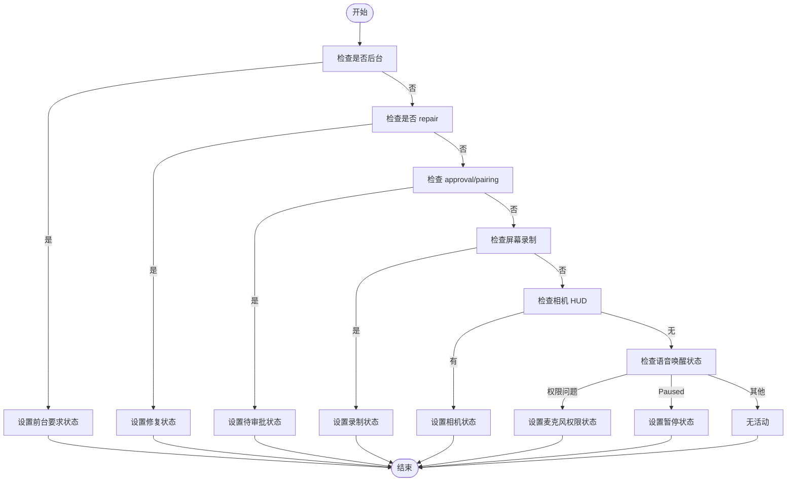
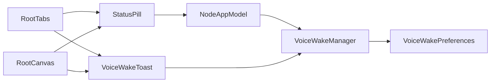

# 状态指示

## 目录
1. [简介](#简介)
2. [项目结构](#项目结构)
3. [核心组件](#核心组件)
4. [架构总览](#架构总览)
5. [组件详解](#组件详解)
6. [依赖关系分析](#依赖关系分析)
7. [性能考量](#性能考量)
8. [故障排查指南](#故障排查指南)
9. [结论](#结论)
10. [附录](#附录)

## 简介
本文件面向 OpenClaw iOS 的“状态指示”功能，系统化梳理状态胶囊（StatusPill）与语音唤醒吐司（VoiceWakeToast）的 SwiftUI 实现、视觉设计、动画与过渡、状态监听与响应策略，并给出样式定制、主题适配、最佳实践与性能优化建议，以及测试与用户体验评估要点。

## 项目结构
iOS 平台的状态指示由以下模块协同完成：
- 视图层：StatusPill、VoiceWakeToast
- 控制层：RootTabs、RootCanvas
- 模型层：NodeAppModel（网关状态、相机 HUD、屏幕录制等）
- 语音唤醒：VoiceWakeManager、VoiceWakePreferences
- macOS 对应组件：OpenClaw 中的 StatusPill（对比参考）

## 核心组件
- 状态胶囊（StatusPill）：展示网关连接状态、活动图标与文本、语音唤醒开关；在连接中时提供脉冲动画；支持可点击跳转设置页；具备无障碍标签与值。
- 语音唤醒吐司（VoiceWakeToast）：在顶部显示最近一次触发的语音命令，带材质背景与阴影，支持明亮边框以适配浅色主题。
- 控制器（RootTabs/RootCanvas）：负责将状态与活动注入到 StatusPill；监听语音唤醒事件并展示/收起吐司；管理吐司自动消失任务。
- 模型（NodeAppModel）：维护网关状态文本、服务器名、远程地址、相机 HUD、屏幕录制状态等；桥接语音唤醒回调。
- 语音唤醒（VoiceWakeManager/Preferences）：负责麦克风与语音识别权限、启动/停止监听、状态文本更新、触发词加载与清洗。

## 架构总览
状态指示的端到端流程如下：

## 组件详解

### 状态胶囊（StatusPill）实现与设计
- 状态枚举与映射
  - 连接状态：已连接、连接中、错误、离线；标题与颜色分别映射。
- 活动信息
  - 支持显示相机/屏幕录制/修复/待审批/语音唤醒暂停/麦克风权限等状态；图标与可选着色。
- 交互与无障碍
  - 可点击跳转设置页；无障碍标签包含“状态”及当前值（含活动描述）。
- 动画与过渡
  - 连接中且场景处于活跃时，小圆点执行往返脉冲动画；活动切换使用上移淡入组合过渡；整体微动画提升反馈。
- 主题适配
  - 使用超薄材质背景与可选明亮描边，浅色主题下更突出描边；阴影增强层级感。

### 语音唤醒吐司（VoiceWakeToast）显示逻辑
- 内容构成：麦克风图标 + 命令文本（单行截断）。
- 外观：圆角矩形材质背景 + 轻描边 + 阴影；浅色主题下可启用更亮描边。
- 无障碍：标签为“语音唤醒”，值为实际命令文本。
- 显示与消失：由控制器监听语音唤醒事件，触发后立即显示；延时后执行淡出动画并清空内容。

### 状态变化监听与响应策略
- 网关状态映射
  - 优先判断是否已连接；否则根据状态文本包含“connecting/reconnecting/error”映射到对应状态。
- 活动状态优先级
  - 前台要求、修复中、待审批、屏幕录制、相机 HUD、语音唤醒状态（权限/暂停）等，避免与主连接状态重复。
- 场景与生命周期
  - 监听场景阶段（active/background），仅在活跃时对“连接中”执行脉冲动画。
- 语音唤醒事件
  - 监听最后触发命令，去空白后显示；取消旧任务、启动新任务并在固定时间后自动隐藏。

### 动画与过渡处理
- 连接中脉冲：仅在场景活跃时启动往返动画；场景非活跃或状态变更时平滑停止。
- 活动切换：组合透明度与从顶部移入的过渡，避免遮挡连接指示。
- 吐司出现：弹簧动画快速弹入；消失：缓出动画优雅收尾。
- 吐司自动隐藏：定时任务在固定时长后触发淡出并清理文本。

### 样式定制与主题适配
- 材质与描边：统一使用超薄材质背景与连续圆角；浅色主题下可启用更亮描边以增强可读性。
- 颜色体系：连接状态采用语义化颜色（绿/黄/红/灰）；活动图标支持可选着色。
- 字体与间距：统一字号与内边距，确保在不同设备与安全区域下的稳定布局。
- macOS 对比：macOS 版本采用胶囊形状与半透明白色描边，体现平台差异。

### 状态管理最佳实践
- 单向数据流：控制器从模型读取状态，视图只负责渲染与交互；模型通过观察者模式暴露状态。
- 状态映射：将底层文本状态标准化为语义化的枚举，便于 UI 一致呈现。
- 任务生命周期：监听器与定时任务在视图消失时及时取消，避免泄漏。
- 无障碍：为关键元素提供标签与值，提升可访问性。

## 依赖关系分析
- 视图依赖模型：StatusPill 依赖 NodeAppModel 提供的网关状态与活动信息；RootTabs/RootCanvas 将这些信息注入到视图。
- 语音唤醒依赖：VoiceWakeManager 提供状态文本与最后触发命令；NodeAppModel 在初始化时配置回调，将命令转发至会话。
- 触发词配置：VoiceWakePreferences 负责加载与清洗触发词，保证长度与数量限制。
- 互操作：RootCanvas 与 RootTabs 共享相同的注入与监听逻辑，确保多入口一致性。

## 性能考量
- 动画节流：连接中脉冲仅在场景活跃时运行，避免后台消耗；活动切换与吐司动画时长短、曲线柔和，降低掉帧风险。
- 任务管理：监听器与定时任务在视图消失时取消，防止内存泄漏与无效计算。
- 渲染优化：使用超薄材质与阴影时注意层级叠加，避免过度阴影导致的渲染压力。
- 文本截断：命令文本单行截断，减少复杂布局计算。

## 故障排查指南
- 语音唤醒无法启动
  - 检查麦克风与语音识别权限是否授予；查看状态文本提示。
  - 在模拟器环境下可能不支持，状态文本会明确提示。
- 吐司不显示或不消失
  - 确认 `lastTriggeredCommand` 是否为空白；检查定时任务是否被取消。
  - 确保视图可见时才触发显示与隐藏。
- 连接中动画未出现
  - 确认场景阶段为活跃；确认状态为“连接中”。

## 结论
OpenClaw iOS 的状态指示通过清晰的视图-模型分层、稳定的监听与动画策略，实现了高可用、可访问、跨入口一致的状态反馈。结合主题适配与性能优化，可在不同设备与场景下提供流畅体验。后续可进一步扩展活动类型与自定义样式，完善无障碍覆盖与测试矩阵。

## 附录
- 测试建议
  - 单元测试：验证状态映射、活动优先级、权限文案与触发词清洗。
  - 集成测试：验证从语音唤醒到吐司显示与隐藏的完整链路。
  - 可访问性测试：检查无障碍标签与值的一致性。
- 用户体验评估
  - 关注连接中动画的感知时长与节奏；确认浅色主题下描边可读性；评估活动切换的视觉连贯性。