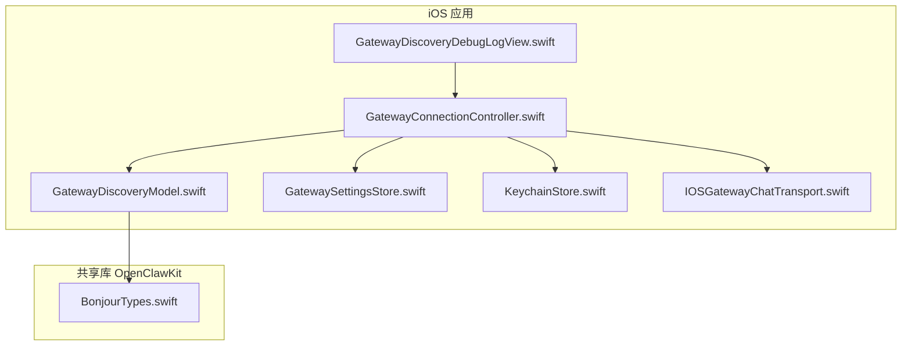
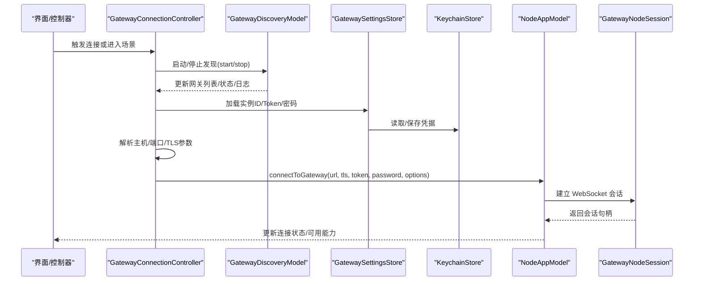
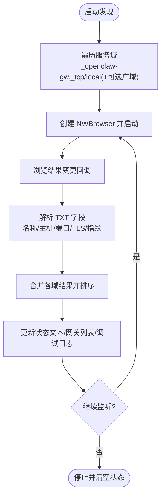
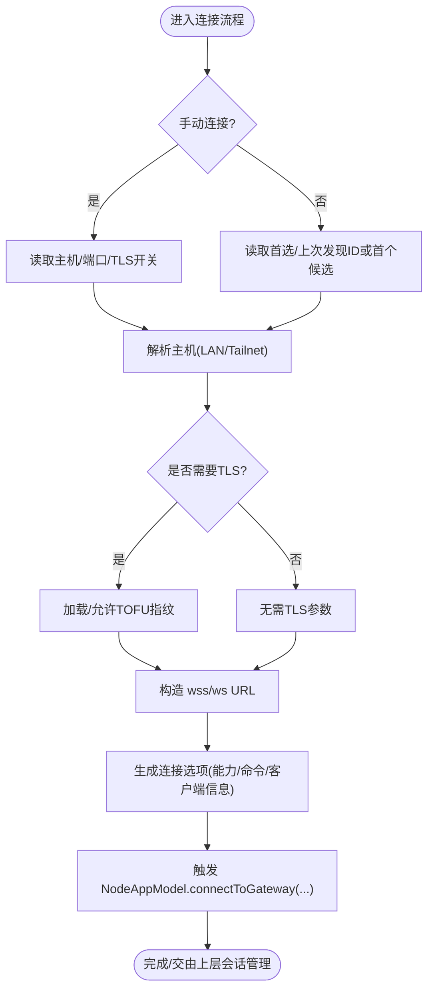
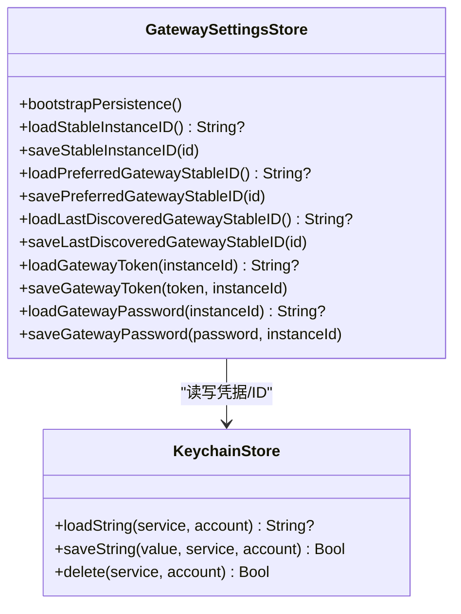
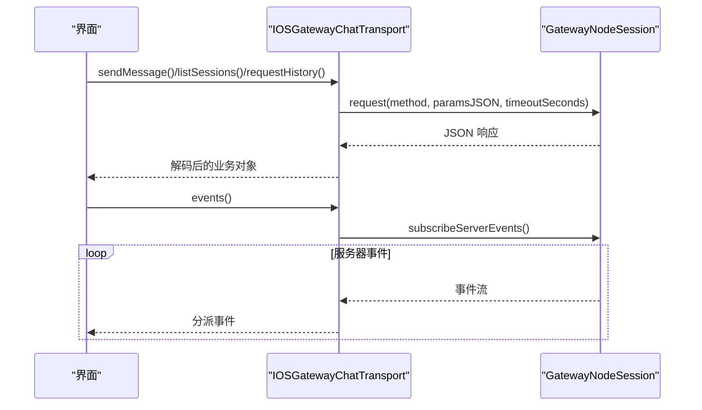
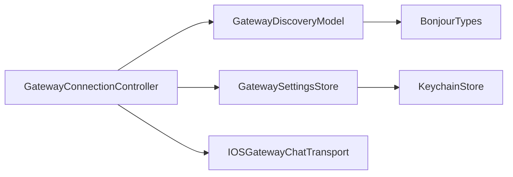

# 网关连接

## 目录
1. [简介](#简介)
2. [项目结构](#项目结构)
3. [核心组件](#核心组件)
4. [架构总览](#架构总览)
5. [组件详解](#组件详解)
6. [依赖关系分析](#依赖关系分析)
7. [性能与连接优化](#性能与连接优化)
8. [故障排查与诊断](#故障排查与诊断)
9. [结论](#结论)
10. [附录：测试与质量保障](#附录测试与质量保障)

## 简介
本文件面向 OpenClaw iOS 网关连接功能，系统性阐述以下内容：
- 网关发现机制：基于 Bonjour 的服务发现、TXT 记录解析、状态与调试日志。
- 连接建立流程：自动连接策略、手动连接、TLS 参数解析与校验指纹。
- 状态管理：连接控制器的自动重连、断线恢复、错误处理与用户交互。
- 设置与凭据：本地持久化与钥匙串安全存储，实例 ID 与偏好网关稳定 ID 的迁移。
- 钥匙串与加密：基于系统安全框架的密钥链读写与访问控制。
- 调试与诊断：发现日志收集、复制导出、UI 展示与清理。
- 网络异常处理与优化：Bonjour 状态机、超时与重试策略建议。
- 测试与质量保障：单元测试覆盖能力与命令集生成。

## 项目结构
iOS 网关连接相关代码主要位于 `apps/ios/Sources/Gateway` 与 `apps/ios/Sources/Chat`；共享的 Bonjour 类型定义位于 `apps/shared/OpenClawKit`。

## 核心组件
- 网关发现模型（GatewayDiscoveryModel）：封装 NWBrowser 的 Bonjour 发现、TXT 解析、状态文本与调试日志。
- 网关连接控制器（GatewayConnectionController）：负责自动/手动连接、TLS 参数解析、构建连接选项、触发 NodeAppModel 建立会话。
- 设置与钥匙串（GatewaySettingsStore / KeychainStore）：实例 ID、偏好网关稳定 ID、网关 Token/Password 的安全持久化。
- 聊天传输层（IOSGatewayChatTransport）：通过 GatewayNodeSession 封装聊天相关 RPC 请求与事件订阅。
- 发现日志视图（GatewayDiscoveryDebugLogView）：UI 层展示与导出 Bonjour 发现日志。

## 架构总览
下图展示了 iOS 网关连接从“发现—选择—连接—会话”的端到端流程。

## 组件详解

### 网关发现机制（Bonjour）
- 使用 Network.framework 的 NWBrowser 对 `_openclaw-gw._tcp` 服务类型进行多域扫描（含本地与可选广域域）。
- TXT 记录字段用于提取显示名、LAN 主机、Tailnet DNS、端口、TLS 开关与指纹等信息。
- 状态机根据浏览器状态更新“搜索中/等待/失败/就绪/设置”等文本，便于用户感知。
- 支持调试日志开关，记录生命周期与结果变化，最多保留最近 200 条。

### 连接建立与状态管理
- 自动连接策略：
  - 若未启用手动模式且存在首选/上次发现的稳定 ID，则优先尝试该网关。
  - 否则在发现列表中按名称排序选择第一个候选。
  - 解析主机优先级：LAN 主机 > Tailnet DNS > 其他。
  - TLS 参数：若网关声明开启或已存指纹，则强制 TLS，并允许首次信任（TOFU）以提升用户体验。
- 手动连接：
  - 用户输入主机、端口与 TLS 开关，生成稳定 ID 并解析 TLS 参数后发起连接。
- 连接选项：
  - 客户端角色、能力集合（画布、屏幕、相机、位置、语音唤醒）、命令集（画布、屏幕、系统、相机、位置等）动态生成。
  - 设备信息（平台、设备型号、应用版本）随连接上报。
- 断线恢复与重试：
  - 控制器不直接做重试，而是由上层 NodeAppModel/会话层负责；控制器仅在必要时重新触发连接（例如场景回到前台时重启发现）。

### 设置与凭据管理
- 实例 ID：
  - 首次运行生成 UUID，同时写入 UserDefaults 与钥匙串，确保跨会话稳定。
- 偏好网关与上次发现网关：
  - 默认键值与钥匙串账户分离，启动时双向迁移，避免覆盖用户选择。
- 网关 Token/Password：
  - 按“实例 ID”派生账户名，分别保存于钥匙串；读取时去空白并判空。
- 钥匙串访问控制：
  - 使用 AfterFirstUnlockThisDeviceOnly，满足 iOS 安全策略。

### 聊天传输层与健康检查
- 通过 GatewayNodeSession 封装请求/事件订阅：
  - 聊天发送、历史、会话列表、事件流等。
  - 健康检查方法返回布尔值，便于 UI 快速反馈。
- 事件解码采用统一的负载解码器，按事件类型分派。

### 发现日志与调试
- 可在设置中启用“发现调试日志”，记录生命周期与结果变化。
- UI 提供复制导出，格式包含时间戳与消息正文。
- 关闭调试日志将清空缓存条目，避免内存膨胀。

## 依赖关系分析
- 组件耦合：
  - `GatewayConnectionController` 依赖 DiscoveryModel、SettingsStore、KeychainStore 与 NodeAppModel。
  - `GatewayDiscoveryModel` 依赖 OpenClawKit 的 Bonjour 类型常量。
  - `ChatTransport` 依赖 GatewayNodeSession，向上层提供统一接口。
- 外部依赖：
  - Network.framework（Bonjour/NWBrowser）、Security.framework（钥匙串）、Foundation/UIKit/SwiftUI/Observation。

## 性能与连接优化
- 发现阶段：
  - 多域并发扫描，合并后排序，减少重复与抖动。
  - 调试日志上限控制，避免长期运行内存占用增长。
- 连接阶段：
  - TLS 参数预解析与指纹复用，降低握手失败概率。
  - 连接选项按用户配置动态生成，避免不必要的能力与命令。
- 场景与生命周期：
  - 应用进入后台时停止发现，回到前台时恢复，平衡资源与体验。
- 建议的优化点（通用实践，非现有实现）：
  - 引入指数退避重试与连接超时配置。
  - 在网络切换时主动触发一次快速重连。
  - 对长连接增加心跳与断线检测，结合会话层做自动恢复。

## 故障排查与诊断
- 启用发现调试日志，观察状态文本与日志条目，定位“等待/失败/就绪/搜索中”等阶段问题。
- 导出日志到剪贴板，配合截图与设备信息一并提交。
- 检查实例 ID、偏好网关稳定 ID 是否被意外覆盖；确认钥匙串中 Token/Password 是否存在。
- 若 TLS 报错，确认网关指纹是否匹配或允许首次信任（TOFU）。

## 结论
iOS 网关连接模块以 Bonjour 为基础实现网关发现，结合本地设置与钥匙串安全存储，提供自动/手动两种连接路径，并通过连接选项动态适配设备能力。控制器负责状态编排与 UI 交互，实际会话由上层 NodeAppModel/会话层承接。配套的调试日志与测试用例有助于问题定位与质量保障。

## 附录：测试与质量保障
- 单元测试覆盖：
  - 显示名解析默认值与回填逻辑。
  - 能力集合与命令集随开关变化的行为。
  - 发现模型调试日志生命周期与状态一致性。
- 测试执行建议：
  - 使用 @Test 注解的测试套件在主线程运行，确保 @Observable 与 @MainActor 的行为一致。
  - 对关键路径（如能力/命令生成、显示名解析、调试日志开关）进行断言。