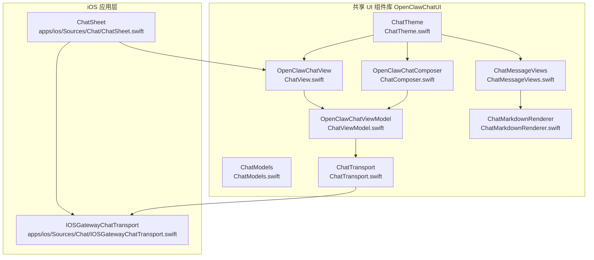
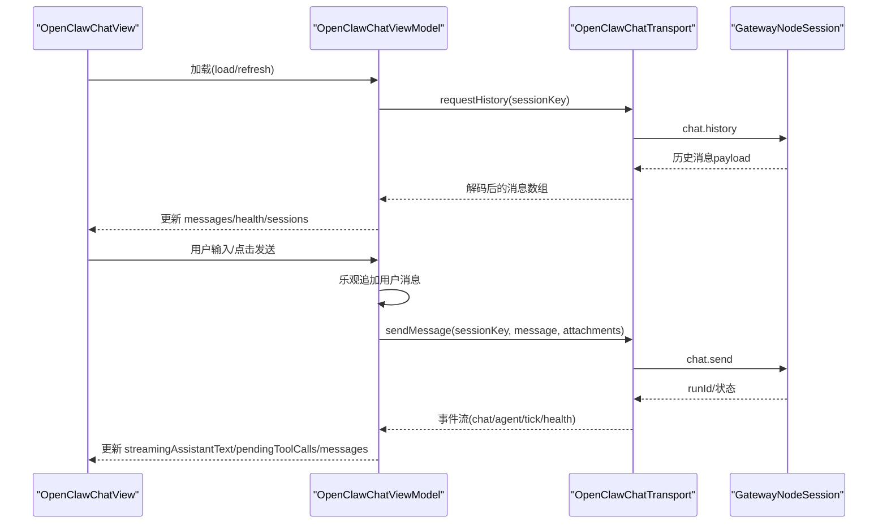
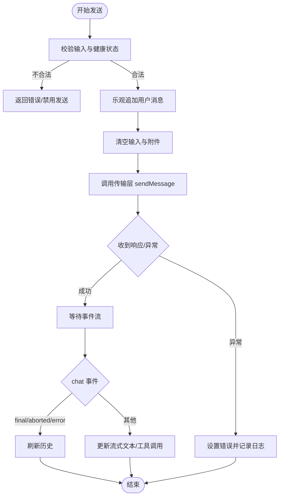
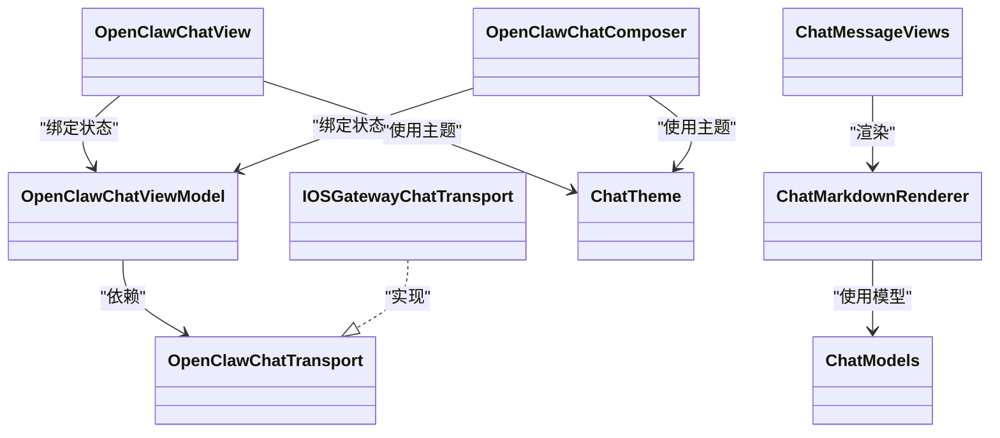

# 聊天界面

## 目录
1. [简介](#简介)
2. [项目结构](#项目结构)
3. [核心组件](#核心组件)
4. [架构总览](#架构总览)
5. [详细组件分析](#详细组件分析)
6. [依赖关系分析](#依赖关系分析)
7. [性能考虑](#性能考虑)
8. [故障排查指南](#故障排查指南)
9. [结论](#结论)
10. [附录](#附录)

## 简介
本文件面向 OpenClaw iOS 聊天界面的技术文档，系统性阐述基于 SwiftUI 的聊天 UI 实现、交互设计、输入处理、消息发送与状态反馈、与网关的聊天传输协议与消息路由、聊天历史的显示与更新策略、主题与自定义、富文本渲染、性能优化与内存管理，以及测试与调试策略。目标读者既包括 iOS 开发者，也包括对 SwiftUI 和聊天 UI 架构感兴趣的非技术读者。

## 项目结构
OpenClaw 的聊天界面由两部分组成：
- iOS 应用层：负责入口视图与平台适配（如键盘、相册选择等），并注入网关连接。
- 共享 UI 组件库（OpenClawChatUI）：提供跨平台的聊天视图、视图模型、传输协议抽象、主题与富文本渲染等。

## 核心组件
- 视图层
  - `OpenClawChatView`：聊天主视图，负责消息列表、输入区、空态与错误提示、滚动行为与自动定位、工具调用与打字指示器等。
  - `OpenClawChatComposer`：输入表单，支持会话切换、思考级别、附件添加、发送/中止按钮、连接状态提示等。
  - `ChatMessageViews`：消息气泡、工具调用/结果卡片、打字指示器、流式助手文本等子视图。
  - `ChatMarkdownRenderer`：Markdown 预处理与渲染，支持标准/紧凑两种变体。
  - `ChatTheme`：跨平台主题色值与动态解析。
- 视图模型层
  - `OpenClawChatViewModel`：状态管理与业务逻辑，负责加载历史、发送消息、事件订阅、健康检查、会话切换、去重与合并工具结果、超时控制等。
- 传输层
  - `OpenClawChatTransport` 协议与 `IOSGatewayChatTransport` 实现：封装与网关的请求/事件通信，包括 `chat.history`、`chat.send`、`chat.abort`、`sessions.list`、`health` 等。
- 数据模型
  - `ChatModels`：消息、内容、使用量、附件、事件载荷等模型定义。

## 架构总览
聊天界面采用“视图-视图模型-传输层-网关”的分层架构，通过异步事件流驱动 UI 更新，保证响应性与一致性。

## 详细组件分析

### 视图层：OpenClawChatView
- 功能要点
  - 消息列表：LazyVStack + ScrollView，支持滚动锚定到底部；首次加载后自动滚动；用户发送消息或新消息到达时自动滚动。
  - 空态与错误：根据 isLoading、errorText、pendingRunCount、pendingToolCalls、streamingAssistantText 决策展示空态卡、横幅或加载。
  - 工具结果合并：将 `tool_result` 合并到对应 `tool_call` 气泡中，提升可读性。
  - 布局与样式：按平台（iOS/macOS）调整内边距、间距、圆角与阴影；支持 onboarding 样式。
- 关键交互
  - 初始滚动：首次完成加载后滚动到底部。
  - 发送后滚动：用户发送消息后强制滚动到底部。
  - 自动滚动：当处于底部且有新消息时自动滚动。
  - 会话切换：通过 sheet 展示会话选择器（若启用）。

### 输入表单：OpenClawChatComposer
- 功能要点
  - 编辑器：iOS 使用 TextEditor，macOS 使用自定义 ChatComposerTextView 支持多行与回车发送。
  - 附件：iOS 通过 PhotosPicker，macOS 通过文件对话框；限制大小与类型，生成预览。
  - 会话与思考级别：会话选择器与思考级别菜单（仅在标准样式下显示）。
  - 发送/中止：根据 canSend 控制按钮可用；pendingRunCount>0 显示中止按钮。
  - 连接状态：根据 healthOK 显示连接状态胶囊。
- 平台差异
  - macOS 支持拖拽文件；iOS 支持相册选择；两者均支持粘贴图片。

### 消息渲染与富文本：ChatMessageViews 与 ChatMarkdownRenderer
- 消息气泡
  - 用户/助手不同背景色与边框；支持带尾部的气泡形状（onboarding 样式）。
  - 支持内联附件、工具调用/结果卡片、流式助手文本、打字指示器。
- Markdown 渲染
  - 预处理（去除不可见字符、提取内联图片）、渲染（GitHub 风格或紧凑风格）、内联样式（代码、链接颜色）。
  - 支持文本选择与可访问性。

### 主题与自定义：ChatTheme
- 跨平台主题
  - macOS 使用 NSColor 动态解析，确保浅色/深色外观正确；iOS 使用 UIColor。
  - 提供表面色、卡片色、气泡色、输入区背景/边框、分割线等。
- 自定义入口
  - 可通过 userAccent 参数覆盖用户气泡色；onboarding 样式提供独立边框与阴影。

### 视图模型：OpenClawChatViewModel
- 状态与生命周期
  - 初始化即启动事件流订阅；deinit 取消任务与超时任务。
  - load/refresh 引导 bootstrap：设置活动会话、请求历史、拉取会话列表、健康轮询。
- 发送流程
  - 乐观 UI：先追加用户消息，再发起网络请求；清空输入与附件。
  - 超时控制：为每个 runId 设置超时任务，避免 UI 长时间挂起。
  - 错误处理：捕获异常并设置 errorText；记录日志。
- 事件处理
  - chat 事件：根据 runId 与 pendingRuns 匹配；final/aborted/error 分支刷新历史。
  - agent 事件：assistant 文本流式更新；tool 调用 start/result 更新 pendingToolCalls。
  - tick/health：周期性健康检查；seqGap：事件流中断提示。
- 历史与会话
  - 去重策略：基于 role、timestamp、文本摘要去重。
  - 合并工具结果：将 `tool_result` 合并进对应的 `tool_call`。
  - 会话选择：最近 24 小时内的会话去重排序，包含当前会话占位。

### 传输层：OpenClawChatTransport 与 IOSGatewayChatTransport
- 协议能力
  - 请求历史、发送消息、中止运行、列出会话、请求健康、事件流订阅。
- iOS 实现
  - 通过 `GatewayNodeSession.request` 与 `subscribeServerEvents` 实现；
  - 事件映射：tick、seqGap、health、chat、agent；
  - 参数编码/解码：JSON 编解码，超时控制。

### iOS 入口：ChatSheet
- 将 `GatewayNodeSession` 注入 `IOSGatewayChatTransport`，并创建 `OpenClawChatViewModel`，包裹在 `OpenClawChatView` 中。
- 支持会话切换器与关闭按钮。

## 依赖关系分析
- 组件耦合
  - ChatView 依赖 ChatViewModel；ChatComposer 依赖 ChatViewModel；二者通过状态驱动 UI。
  - ChatMessageViews 依赖 ChatMarkdownRenderer；MarkdownRenderer 依赖 Textual。
  - ChatTheme 为纯样式层，被多处视图使用。
  - ChatViewModel 依赖 ChatTransport 抽象，具体实现由 iOS 注入。
- 外部依赖
  - OpenClawKit/OpenClawProtocol：网关通信与负载解码。
  - SwiftUI/Textual：UI 与富文本渲染。
  - PhotosUI（iOS）：相册选择。
  - OSLog：日志记录。

## 性能考虑
- 滚动与布局
  - 使用 LazyVStack + scrollTargetLayout 减少重排开销；通过锚点 ID 与 scrollPosition 稳定滚动，避免 ScrollViewReader 重布局抖动。
- 列表渲染
  - 仅渲染可见消息；工具调用/结果卡片按需显示；内联图片懒加载。
- 事件与异步
  - 事件流在后台任务中消费，统一回到主线程更新 UI；超时任务及时清理。
- 图像与附件
  - 限制附件大小（默认 5MB）；生成预览；仅在 macOS 上支持拖拽。
- 内存管理
  - deinit 取消事件任务与超时任务；使用 AnyCodable 与轻量模型减少解码成本；去重与合并策略避免重复渲染。

## 故障排查指南
- 常见问题
  - 无法发送：检查 healthOK；确认输入非空或存在有效附件；查看 errorText。
  - 无历史：确认 setActiveSessionKey 成功；检查 requestHistory 是否抛错；尝试 refresh。
  - 事件流中断：出现 seqGap 提示，建议刷新页面；检查网关连接与心跳。
  - 超时：pendingRun 超过 120 秒自动清除并提示；可重试或刷新。
- 调试技巧
  - 打印事件流与关键状态变化（如 messages、pendingToolCalls、streamingAssistantText）。
  - 在 iOS 端验证传输层参数编码/解码是否符合网关预期。
  - 使用 Accessibility Inspector 检查可访问性标签与交互元素。
- 日志
  - 视图模型内部使用 OSLog 记录失败信息，便于定位问题。

## 结论
OpenClaw iOS 聊天界面以 SwiftUI 为核心，结合共享 UI 组件库与平台适配的传输层，实现了高可用、可扩展、跨平台的一致体验。通过事件驱动的状态管理、乐观 UI、工具结果合并与富文本渲染，兼顾了易用性与可读性。建议在实际集成中关注事件流稳定性、附件处理与主题一致性，并配合完善的测试与日志体系保障质量。

## 附录

### 聊天传输协议与消息路由
- 方法清单
  - `chat.history`：获取会话历史（含 messages、sessionId、thinkingLevel）。
  - `chat.send`：发送消息（支持附件、思考级别、幂等键）。
  - `chat.abort`：中止运行（部分传输支持）。
  - `sessions.list`：列出会话（部分传输支持）。
  - `health`：健康检查。
  - 事件：tick、seqGap、health、chat、agent。
- 路由机制
  - 通过 `sessionKey` 路由到指定会话；chat 事件携带 `runId` 与 `state`，用于匹配当前 pendingRuns 并触发刷新或错误提示；agent 事件驱动 assistant 流式文本与 tool 调用状态。

### 聊天历史显示与更新策略
- 显示策略
  - 首次加载完成后自动滚动到底部；新消息到达时自动滚动；工具结果与文本混合渲染。
- 更新策略
  - 去重：基于 role、timestamp、文本摘要；合并：将 `tool_result` 合并到对应 `tool_call`。
  - 事件驱动：chat.final/aborted/error 或外部客户端完成 run 后刷新历史。

### 主题与自定义
- 主题变量
  - 表面色、卡片色、气泡色、输入区背景/边框、分割线；支持 macOS 动态外观解析。
- 自定义入口
  - userAccent 覆盖用户气泡色；onboarding 样式提供独立边框与阴影；紧凑/标准 Markdown 变体。

### 富文本与消息格式化
- Markdown 渲染
  - 预处理 + StructuredText 渲染；支持代码块、链接、标题、列表等；内联图片展示。
- 消息格式
  - content 类型：text、file/attachment、tool_call/tool_result 等；支持 thinking 字段与工具参数。

### 测试策略与调试技巧
- 单元测试
  - ChatViewModel：覆盖发送、超时、健康检查、事件处理、去重与合并工具结果。
  - ChatComposer：覆盖输入、附件、发送/中止按钮状态。
  - ChatMarkdownRenderer：覆盖 Markdown 渲染与内联图片。
- 集成测试
  - 通过 Mock 传输层模拟事件流与错误场景；验证 UI 响应与状态一致性。
- 调试技巧
  - 使用 Xcode Debug Navigator 观察线程与任务；利用 Console 查看 OSLog 输出；断点验证事件流与状态变更。