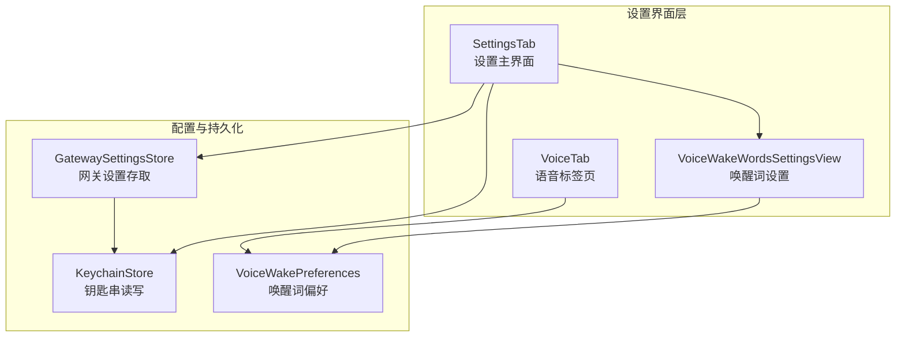
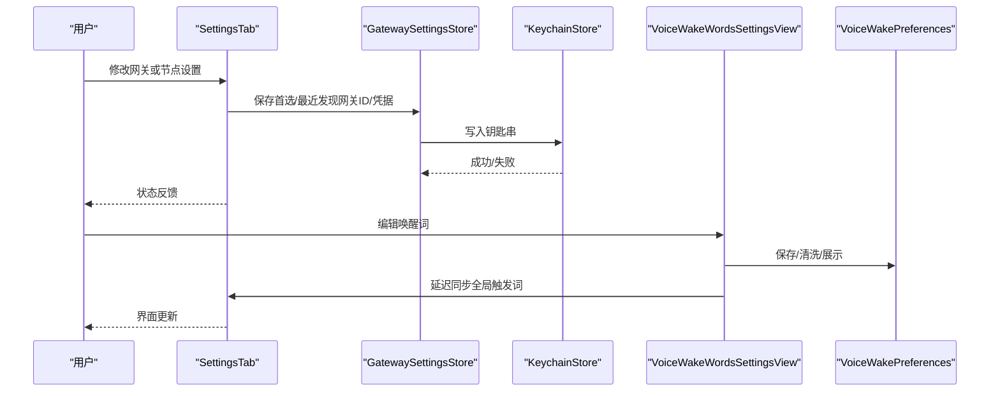
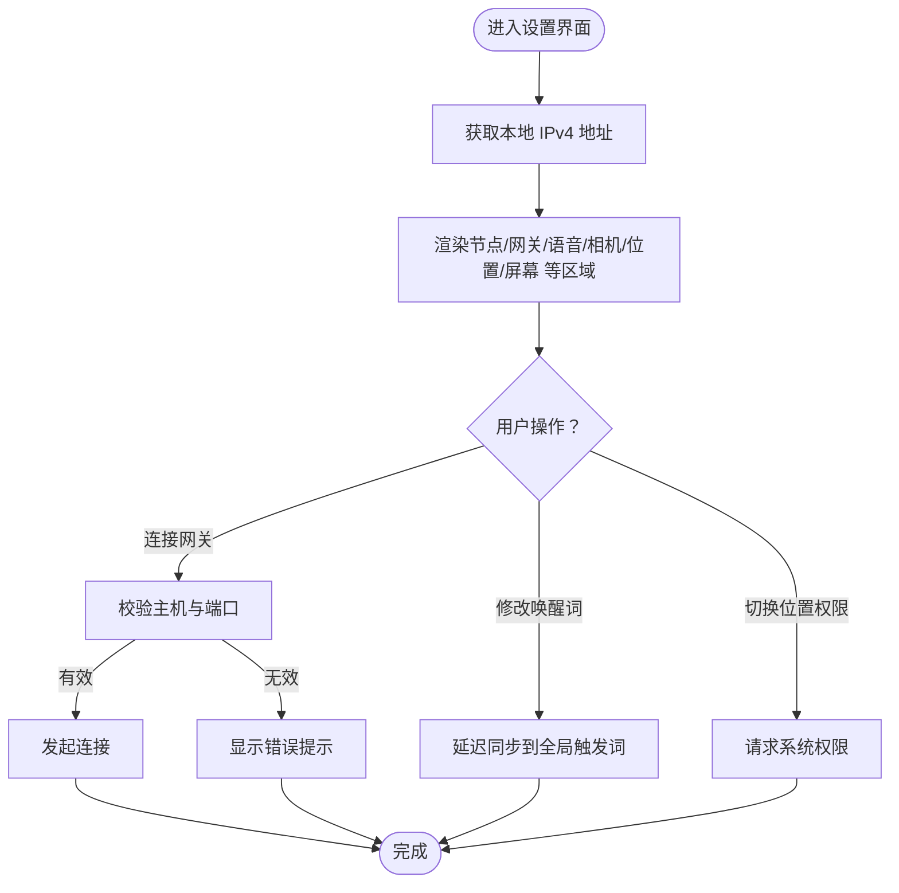
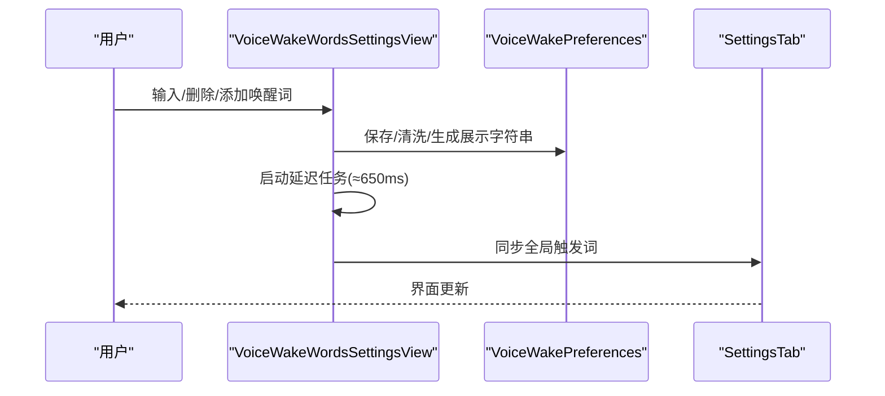
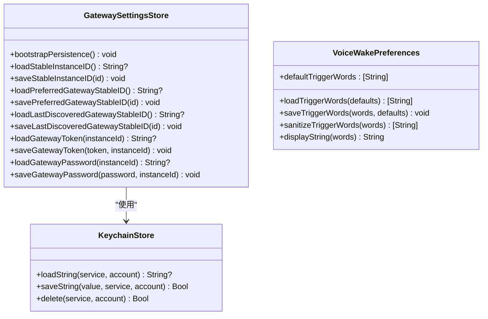
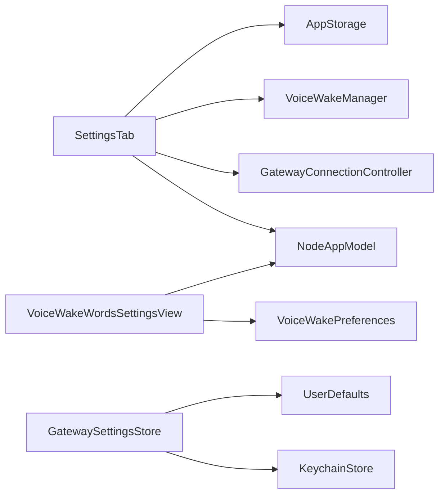

# 设置配置

## 目录
1. [简介](#简介)
2. [项目结构](#项目结构)
3. [核心组件](#核心组件)
4. [架构总览](#架构总览)
5. [组件详解](#组件详解)
6. [依赖关系分析](#依赖关系分析)
7. [性能与可用性](#性能与可用性)
8. [故障排查指南](#故障排查指南)
9. [结论](#结论)
10. [附录：设置项分类与体验优化](#附录设置项分类与体验优化)

## 简介
本文件面向 OpenClaw iOS 的“设置配置”功能，系统化梳理设置界面的 SwiftUI 实现、网络配置助手（发现与连接）、语音唤醒词设置与参数管理、设置数据的持久化与同步策略，并给出验证与错误处理建议及测试与调试方法。目标是帮助开发者与测试人员快速理解并高效维护该模块。

## 项目结构
围绕 iOS 设置配置的关键代码位于以下目录与文件：
- 设置主界面与网络配置：apps/ios/Sources/Settings/SettingsTab.swift
- 语音唤醒词设置界面：apps/ios/Sources/Settings/VoiceWakeWordsSettingsView.swift
- 语音唤醒词参数管理：apps/ios/Sources/Voice/VoiceWakePreferences.swift
- 网关设置持久化与钥匙串访问：apps/ios/Sources/Gateway/GatewaySettingsStore.swift、apps/ios/Sources/Gateway/KeychainStore.swift
- 语音标签页与触发词展示：apps/ios/Sources/Voice/VoiceTab.swift
- 测试用例：apps/ios/Tests/*.swift

## 核心组件
- 设置主界面（SettingsTab）
  - 负责节点信息、网关发现与连接、手动连接、调试日志开关、Canvas 状态显示等。
  - 使用 AppStorage 绑定本地设置，通过环境注入的 NodeAppModel、GatewayConnectionController、VoiceWakeManager 协调状态。
- 语音唤醒词设置（VoiceWakeWordsSettingsView）
  - 提供唤醒词列表编辑、默认值重置、去空格与长度限制、延迟同步到全局触发词。
- 语音唤醒词偏好（VoiceWakePreferences）
  - 定义默认唤醒词、最大数量与长度、加载/保存/清洗逻辑、展示格式。
- 网关设置持久化（GatewaySettingsStore）
  - 将实例 ID、首选/最近发现网关稳定 ID、网关凭据等在钥匙串与 UserDefaults 之间双向迁移与保持一致。
- 钥匙串存取（KeychainStore）
  - 通用的钥匙串读写封装，支持查询、更新、新增与删除。
- 语音标签页（VoiceTab）
  - 展示当前激活的触发词集合与使用说明。

## 架构总览
设置配置采用“界面层 + 偏好与持久化层”的分层设计：
- 界面层（SwiftUI）负责渲染与用户交互，绑定 AppStorage 与环境对象。
- 偏好层（UserDefaults/钥匙串）负责数据的读取、写入与一致性保证。
- 同步层（异步任务与 onChange 触发）负责将用户输入即时应用到运行时状态。

## 组件详解

### 设置主界面（SettingsTab）
- 节点信息区：名称、实例 ID、本地 IPv4 地址、平台版本与设备型号。
- 网关区：显示发现状态、连接状态、服务器名与地址；支持连接已有网关或断开；提供手动连接（主机、端口、TLS）。
- 语音区：开启/关闭语音唤醒、开启/关闭“说话模式”、显示“说话按钮”、跳转到唤醒词设置。
- 摄像头区：允许摄像头请求权限。
- 位置区：三段式权限选择（关闭/使用中/始终），精确位置可单独开关。
- 屏幕区：防止休眠。
- 网络检测与连接流程：
  - 自动获取主 IPv4 地址用于展示与复制。
  - 连接前进行输入校验（主机非空、端口范围合法）。
  - 支持从 Discovery 日志与调试开关中获取网络状态线索。
- 数据持久化：
  - 首选/最近发现网关稳定 ID 通过 `GatewaySettingsStore` 写入钥匙串。
  - 网关令牌与密码按实例 ID 分账户写入钥匙串。
- 错误提示：
  - 手动连接失败时设置状态文本，便于用户感知。

### 语音唤醒词设置（VoiceWakeWordsSettingsView）
- 列表编辑：逐行输入、删除、添加新行；禁用“添加”当存在空词条。
- 默认值重置：一键恢复默认唤醒词。
- 输入清洗与同步：
  - 失焦或提交时保存并清洗（去空白、截断超长、去空词、限制数量）。
  - 使用延迟任务（约 650ms）合并频繁变更，避免抖动与过度同步。
  - 将清洗后的快照同步到全局触发词集合。
- 多设备/多进程一致性：
  - 监听 UserDefaults 变更，在无焦点时刷新本地视图以对齐其他进程的改动。

### 网络配置助手（发现与连接）
- 发现与连接
  - 通过 GatewayConnectionController 获取网关列表与状态，支持连接已发现网关或断开。
  - 手动连接时进行主机与端口校验，支持 TLS 开关。
- 网络检测
  - 通过系统接口枚举网络接口，优先返回 en0，否则回退第一个可用 IPv4 地址，用于展示与复制。
- 调试与日志
  - 提供“发现调试日志”开关与“发现日志”页面入口，便于诊断网络问题。

### 设置数据持久化与同步
- 钥匙串（KeychainStore）
  - 提供统一的读取、保存、更新、删除能力，使用“首次解锁后可见”策略。
- 网关设置（GatewaySettingsStore）
  - 在启动时执行引导流程，确保 UserDefaults 与钥匙串之间的关键键值一致：
    - 实例 ID（node.instanceId）
    - 首选网关稳定 ID（gateway.preferredStableID）
    - 最近发现网关稳定 ID（gateway.lastDiscoveredStableID）
  - 网关令牌与密码按实例 ID 作为账户名分别保存。
- 用户默认值（UserDefaults）
  - 通过 AppStorage 绑定界面控件，自动落盘。
- 同步策略
  - onChange 触发即时写入 UserDefaults；
  - 钥匙串写入由 `GatewaySettingsStore` 负责；
  - 唤醒词通过延迟任务合并写入全局触发词集合。

## 依赖关系分析
- SettingsTab 依赖：
  - NodeAppModel（节点状态与能力）
  - GatewayConnectionController（网关发现与连接）
  - VoiceWakeManager（语音唤醒状态）
  - AppStorage（本地设置）
- VoiceWakeWordsSettingsView 依赖：
  - VoiceWakePreferences（唤醒词偏好）
  - NodeAppModel（全局触发词同步）
- GatewaySettingsStore 依赖：
  - KeychainStore（钥匙串）
  - UserDefaults（默认值）

## 性能与可用性
- 性能
  - 唤醒词同步采用延迟任务合并，降低频繁写入与 UI 抖动风险。
  - 网络地址获取仅在界面出现时执行一次，避免重复扫描。
- 可用性
  - 手动连接入口提供清晰的错误提示与上下文菜单（复制主机/端口/完整 URL）。
  - 位置权限切换时若失败，自动回滚到上一个状态，提升容错。
  - 唤醒词输入禁用首字母大写与拼写纠正，减少误触。

## 故障排查指南
- 钥匙串读写异常
  - 使用测试用例验证保存/更新/删除的往返流程，确认服务名与账户名正确。
- 网关设置一致性
  - 启动时执行引导流程，确保 UserDefaults 与钥匙串中的关键键值一致；若缺失则补齐。
- 唤醒词未生效
  - 检查延迟同步是否完成（约 650ms），确认清洗规则未过滤掉全部词条。
- 网络连接失败
  - 校验主机与端口范围；检查 TLS 选项；查看“发现日志”定位网络问题。

## 结论
OpenClaw iOS 的设置配置以 SwiftUI 为核心，结合 UserDefaults 与钥匙串实现可靠的数据持久化，并通过延迟同步与输入清洗保障用户体验。网络配置助手提供直观的发现与连接流程，配合调试日志与错误提示，便于快速定位问题。整体设计在易用性与健壮性之间取得良好平衡。

## 附录：设置项分类与体验优化
- 节点信息
  - 名称、实例 ID、本地 IP、平台版本、设备型号
  - 体验优化：支持复制 IP/URL，便于分享与排障
- 网关
  - 发现状态、连接状态、服务器名与地址、断开连接
  - 手动连接（主机、端口、TLS）、调试日志开关与日志页面
  - 体验优化：输入校验与错误提示；禁用无效按钮
- 语音
  - 语音唤醒、说话模式、显示说话按钮、唤醒词设置
  - 体验优化：禁用自动大写与拼写纠正；延迟同步减少抖动
- 摄像头
  - 允许摄像头请求权限
- 位置
  - 三段式权限选择；精确位置单独开关
  - 体验优化：切换失败自动回滚
- 屏幕
  - 防止休眠
- 唤醒词参数
  - 默认值、最大数量与长度限制、展示格式
  - 体验优化：空词条禁用“添加”，重置默认值