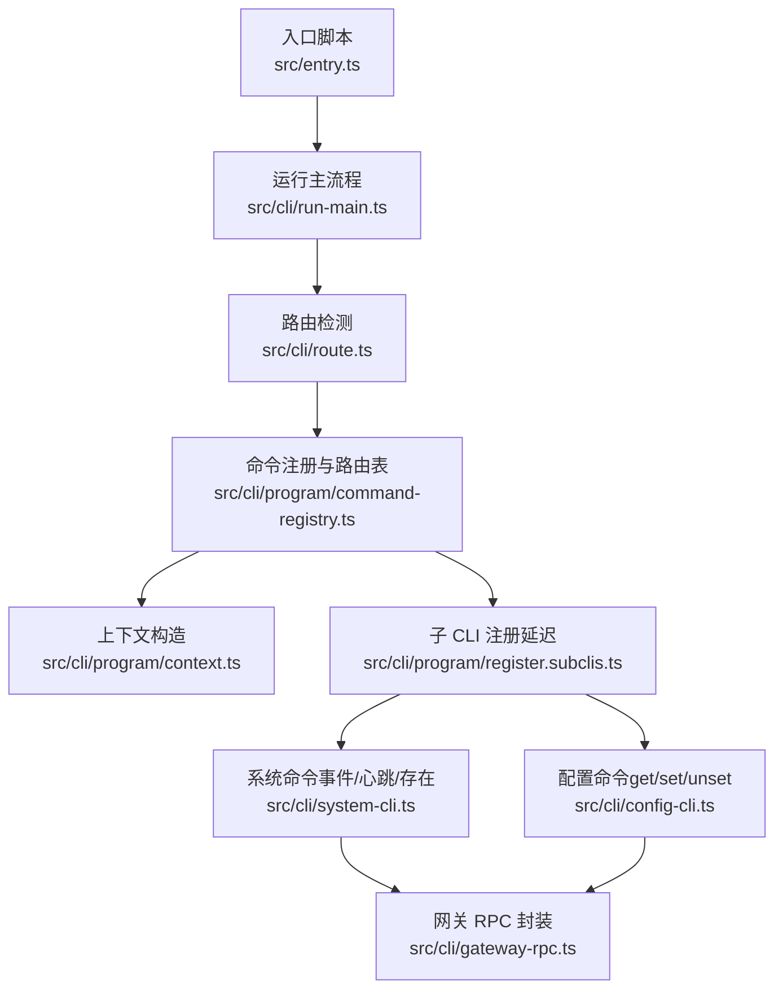
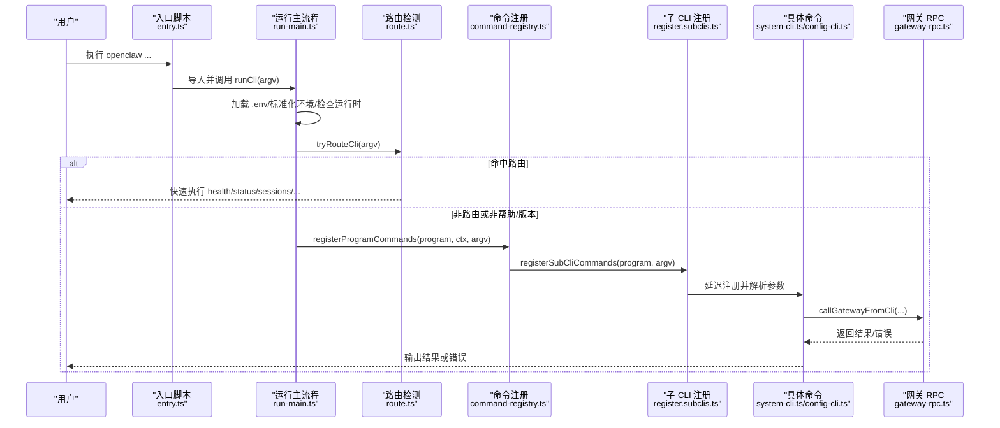
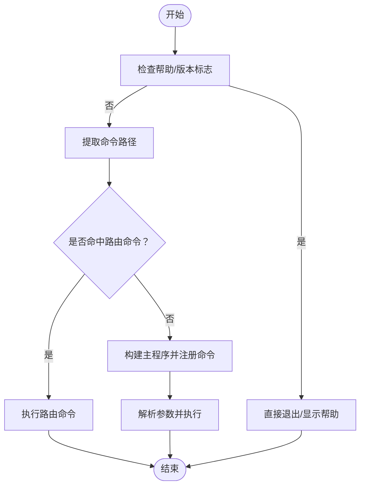
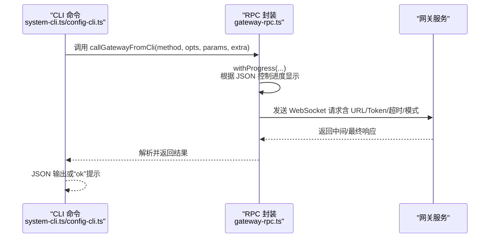
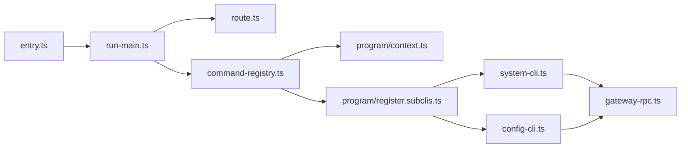

# Mac CLI 工具

## 目录
1. [简介](#简介)
2. [项目结构](#项目结构)
3. [核心组件](#核心组件)
4. [架构总览](#架构总览)
5. [详细组件分析](#详细组件分析)
6. [依赖关系分析](#依赖关系分析)
7. [性能考量](#性能考量)
8. [故障排查指南](#故障排查指南)
9. [结论](#结论)
10. [附录：常用命令与最佳实践](#附录常用命令与最佳实践)

## 简介
本文件面向 OpenClaw macOS CLI 工具，系统性阐述其设计与实现原理，覆盖命令行接口架构（命令解析、参数验证、执行流程）、与网关的通信机制与数据交换格式、命令分类与功能组织、常用命令用法与参数说明、错误处理与日志记录机制，以及自动化脚本集成与批处理操作的最佳实践。目标是帮助开发者与运维人员高效理解并正确使用该 CLI。

## 项目结构
OpenClaw CLI 采用模块化分层设计：
- 入口与启动：入口脚本负责环境初始化、参数规范化、实验性警告抑制与子进程桥接，并在完成预处理后委托运行主流程。
- 运行主流程：加载环境变量、检查运行时版本、尝试“路由式”快速命令、启用控制台结构化日志、构建主程序并注册插件命令、解析参数。
- 路由与命令注册：支持“路径路由”直接执行健康/状态/会话等快捷命令；其余命令通过“延迟注册”按需加载，提升启动性能。
- 子 CLI 分类：系统事件、心跳、存在性；配置读写；节点与设备；网关控制；计划任务、DNS、文档、钩子、Webhook、配对、插件、通道、目录、安全、技能、更新、补丁等。
- 网关通信：统一的 RPC 封装，支持超时、令牌、WebSocket URL、进度提示与最终响应等待。

## 核心组件
- 参数解析与帮助/版本标志识别：提供通用的标志判断、值提取、正整数解析、命令路径提取、可迁移状态判断等能力。
- 路由式命令：针对 `health`、`status`、`sessions`、`agents list`、`memory status` 等进行“路径路由”，无需完整注册即可快速执行。
- 主程序与上下文：构建主命令对象，注入版本、通道选项等上下文信息，注册常规命令与插件命令。
- 子 CLI 按需注册：通过“占位符+延迟注册”策略，在首次调用时才加载对应模块，降低启动开销。
- 网关 RPC 封装：统一封装 WebSocket 调用、超时、令牌、客户端模式与进度提示，支持等待最终响应。
- 错误处理与日志：全局未捕获异常/拒绝处理器、结构化日志捕获、危险输出高亮与退出码控制。

## 架构总览
下图展示从入口到命令执行的关键交互链路，包括参数解析、路由、命令注册、插件加载与网关通信。

## 详细组件分析

### 命令解析与参数验证
- 帮助/版本标志识别：用于决定是否跳过插件注册与子命令加载，优先显示帮助或版本信息。
- 标志值提取：支持“--flag value”与“--flag=value”两种形式，数值型参数支持正整数校验。
- 命令路径提取：从 `argv` 中提取最多深度的命令路径，用于路由匹配与状态迁移判断。
- 可迁移状态判断：根据命令路径决定是否需要迁移状态，避免对健康/状态/会话等轻量命令进行不必要的状态迁移。

### 主程序与上下文
- 上下文包含版本号、通道选项字符串及其变体，便于命令在不同场景下选择合适的通道。
- 主程序注册顺序：`setup`/`onboard`/`configure`/`config`/`maintenance`/`message`/`memory`/`agent`/`subclis`/`status-health-sessions`/`browser` 等。
- 路由表：为 `health`、`status`、`sessions`、`agents list`、`memory status` 提供专用路由，支持 JSON 输出、超时与详细级别等参数。

### 子 CLI 注册与延迟加载
- 子 CLI 列表涵盖 `acp`、`gateway`、`daemon`、`logs`、`system`、`models`、`approvals`、`nodes`、`devices`、`node`、`sandbox`、`tui`、`cron`、`dns`、`docs`、`hooks`、`webhooks`、`pairing`、`plugins`、`channels`、`directory`、`security`、`skills`、`update`、`completion`。
- 延迟注册策略：当存在主命令且非帮助/版本时，仅注册该主命令对应的子 CLI；否则注册全部子 CLI 占位符，首次调用时再真实加载。
- 特殊处理：`pairing` 在注册前先加载插件 CLI，确保通道插件可用；`plugins` 在注册后加载插件 CLI，以支持动态命令。

### 网关通信机制与数据交换
- 统一 RPC 封装：支持指定 WebSocket URL、令牌、超时、是否等待最终响应、JSON 输出等。
- 客户端标识：CLI 使用固定客户端名称与模式，便于网关侧识别来源。
- 进度提示：在非 JSON 输出时自动显示进度条，提升用户体验。
- 错误处理：命令内部捕获异常，使用危险样式输出错误并设置退出码。

### 系统管理命令（事件/心跳/存在）
- 事件：支持文本输入与唤醒模式（立即/下次心跳），可输出 JSON 或简洁“ok”。
- 心跳：支持查询上次心跳、启用/禁用心跳，输出 JSON。
- 存在：列出系统存在项，输出 JSON。
- 参数验证：对唤醒模式进行严格校验，非法值抛出错误。

### 配置操作命令（读取/设置/删除）
- 路径语法：支持点号与方括号混合表示，如 `a.b[0].c`。
- 值解析：默认 JSON5 解析，失败回退为原始字符串；支持显式 JSON5 解析。
- 写入与删除：按路径定位并修改或移除配置项，写回配置文件后提示重启网关生效。
- 错误处理：无效路径、类型不匹配、JSON5 解析失败均给出明确错误并退出。

### 帮助与示例格式化
- 示例格式：提供多行与单行示例格式化函数，统一命令与注释样式。
- 文档链接：在各命令描述后追加文档链接，便于用户查阅。

## 依赖关系分析
- 启动阶段依赖：入口脚本依赖运行时守卫、路径环境、实验性警告过滤、子进程桥接与 dotenv 加载。
- 运行阶段依赖：运行主流程依赖路由检测、命令注册、插件注册、上下文构造与参数解析。
- 命令阶段依赖：系统命令与配置命令依赖网关 RPC 封装；子 CLI 注册依赖延迟加载与插件注册。
- 外部依赖：Commander（命令定义与解析）、JSON5（配置值解析）、终端主题与链接格式化。

## 性能考量
- 延迟注册：仅在首次调用时加载子 CLI 模块，显著减少启动时间。
- 路由式执行：对健康/状态/会话等高频命令提供直连路由，避免完整注册流程。
- 进度提示：在非 JSON 输出时显示进度，避免长时间无反馈。
- 环境与运行时：启动前统一标准化环境与运行时版本检查，减少运行期异常。

## 故障排查指南
- 全局错误处理：安装未处理拒绝与未捕获异常处理器，打印结构化错误并退出。
- 结构化日志：启用控制台捕获，保证日志一致性与可检索性。
- 配置有效性：配置命令在写入前校验配置有效性，无效时列出问题并引导使用 `doctor` 修复。
- 网关通信：RPC 封装统一处理超时与最终响应等待，命令内捕获异常并以危险样式输出。

## 结论
OpenClaw macOS CLI 通过“路由式命令 + 延迟注册 + 统一 RPC 封装”的架构，实现了高性能、可扩展、易维护的命令行工具。其清晰的命令分类、严谨的参数验证与完善的错误处理，使其适用于系统管理、配置操作与诊断工具等多种场景。配合文档链接与示例格式化，用户可以快速上手并高效集成到自动化脚本与批处理流程中。

## 附录：常用命令与最佳实践
- 系统事件与心跳
  - enqueuing system event with optional wake mode and JSON output
  - 查询/启用/禁用心跳并输出 JSON
  - 列出系统存在项
- 配置操作
  - 获取/设置/删除配置项，支持点号与方括号路径、JSON5 值解析
  - 写入后提示重启网关生效
- 最佳实践
  - 在自动化脚本中优先使用 `--json` 输出，便于解析
  - 对长耗时命令结合 `--timeout` 设置合理超时
  - 使用 `--expect-final` 等待最终响应，确保异步操作完成
  - 使用补全脚本与文档链接提升命令发现与使用效率