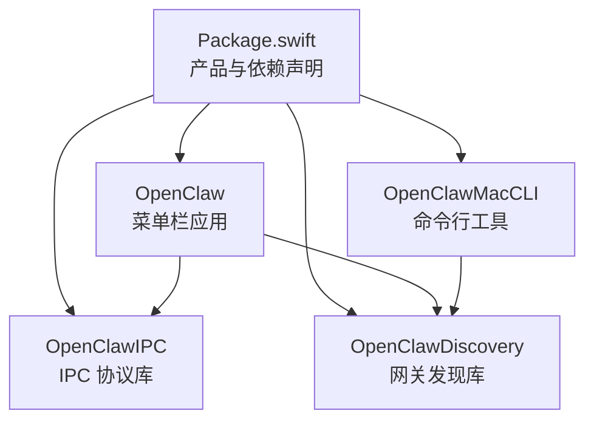
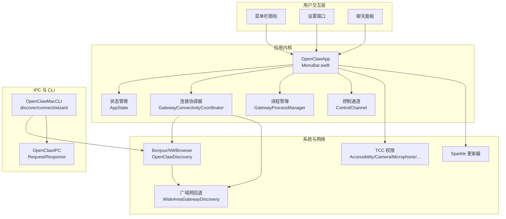
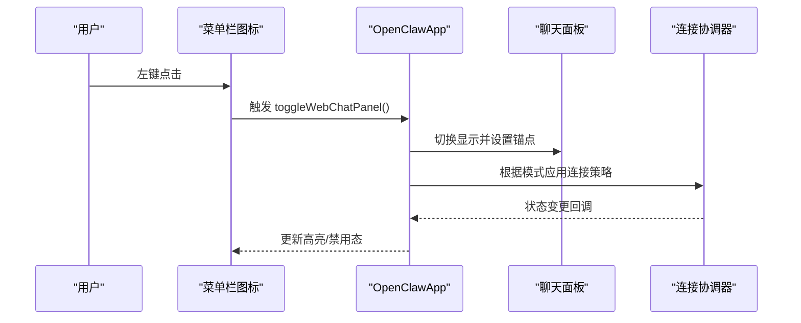
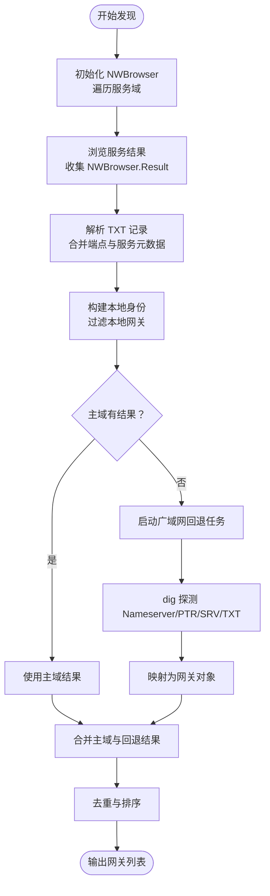
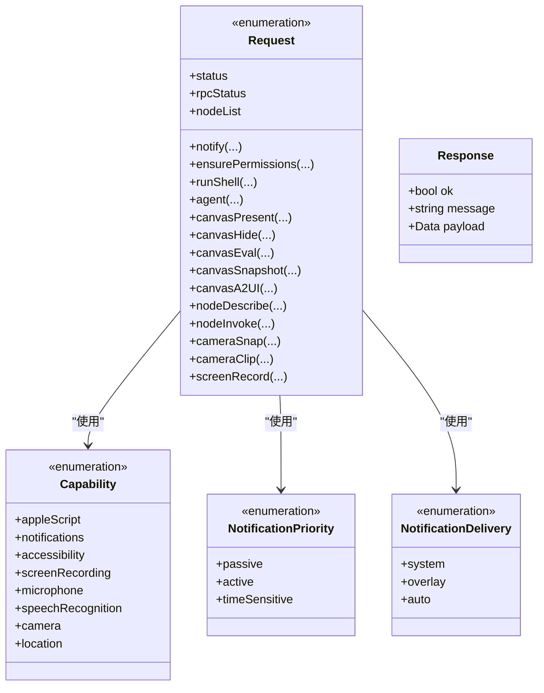
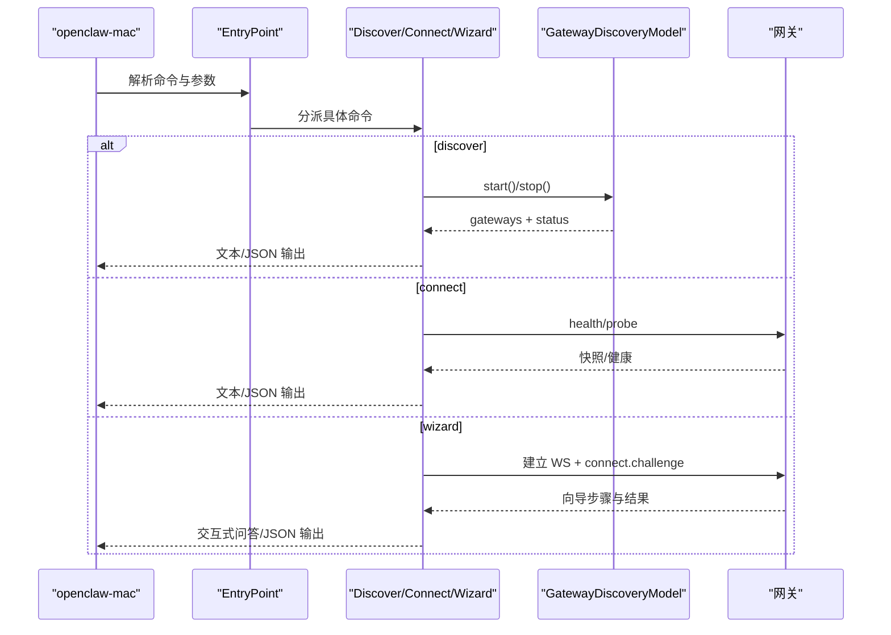
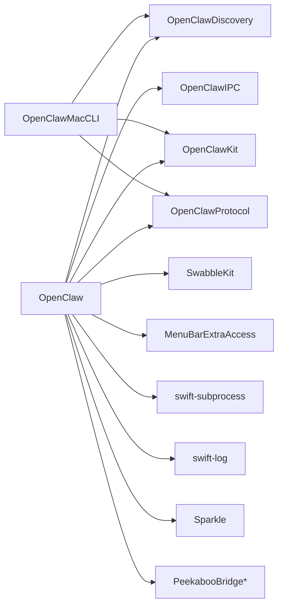

# macOS 应用

## 目录
1. [简介](#简介)
2. [项目结构](#项目结构)
3. [核心组件](#核心组件)
4. [架构总览](#架构总览)
5. [详细组件分析](#详细组件分析)
6. [依赖关系分析](#依赖关系分析)
7. [性能考虑](#性能考虑)
8. [故障排查指南](#故障排查指南)
9. [结论](#结论)
10. [附录](#附录)

## 简介
本文件面向 OpenClaw macOS 应用的技术文档，聚焦于菜单栏控制界面、状态管理与系统集成；网关发现机制（OpenClawDiscovery）的实现与 Bonjour/DNS-SD 使用；IPC 通信模块（OpenClawIPC）的设计与数据传输协议；Mac CLI 工具（OpenClawMacCLI）的命令行接口；以及 macOS 特定功能（图标、通知、后台运行）与权限、签名、安全模型。同时提供开发环境、构建与打包流程、调试与性能优化建议。

## 项目结构
OpenClaw macOS 子工程采用 Swift Package Manager 组织，核心产物包括：
- 可执行程序：OpenClaw（菜单栏应用）
- 库：OpenClawIPC（进程间通信协议）、OpenClawDiscovery（网关发现）
- 命令行工具：openclaw-mac（discover/connect/wizard）

## 核心组件
- 菜单栏应用 OpenClaw：基于 SwiftUI 和 AppKit，提供状态栏图标、悬浮提示、设置窗口、聊天面板等。
- 网关发现 OpenClawDiscovery：使用 Network.framework 的 NWBrowser 进行本地 Bonjour 发现，并通过 WideAreaGatewayDiscovery 结合 dig 与 Tailscale 状态进行广域网回退探测。
- IPC 模块 OpenClawIPC：定义请求/响应类型、能力枚举、Canvas 展示参数与控制套接字路径，用于宿主应用与网关之间的通信。
- CLI 工具 OpenClawMacCLI：提供 discover/connect/wizard 三类命令，支持 JSON 输出与交互式向导。

## 架构总览
OpenClaw macOS 应用以菜单栏为核心入口，通过状态管理协调网关连接、聊天面板与系统通知；IPC 模块承载跨进程通信协议；CLI 工具提供命令行辅助与向导。

## 详细组件分析

### 菜单栏控制界面与状态管理
- 入口与生命周期：应用在初始化时引导日志、状态存储、连接模式协调、权限提示、节点配对与语音唤醒同步等；终止时清理隧道、关闭连接、停止服务。
- 菜单栏图标行为：左键打开/切换聊天面板，右键弹出菜单；悬停触发 HoverHUD 控制；根据暂停/睡眠/连接状态调整按钮外观。
- 设置窗口：尺寸固定、可调整大小，内容随设置页签变化。
- 更新器：根据签名状态动态启用 Sparkle 或禁用更新器，避免未签名应用弹窗。

### 网关发现机制（OpenClawDiscovery）
- 本地发现：使用 NWBrowser 对多个 Bonjour 域进行浏览，监听状态与结果变化，解析服务端点与 TXT 记录，合并本地身份信息过滤本地网关。
- TXT 解析：通过 NetServiceDelegate 异步解析 TXT，合并到服务描述中，提取 `lanHost`、`tailnetDns`、`sshPort`、`gatewayPort`、`cliPath` 等字段。
- 广域网回退：当本地 Bonjour 无可用结果或仅返回本地网关时，通过 WideAreaGatewayDiscovery 使用 dig 查询 PTR/SRV/TXT，结合 Tailscale 状态与 Nameserver 探测，动态补全网关列表。
- 去重与排序：按稳定 ID 去重，按显示名排序，支持过滤本地网关。

### IPC 通信模块（OpenClawIPC）
- 能力与权限：Capability 枚举覆盖 AppleScript、通知、无障碍、屏幕录制、麦克风、语音识别、相机、位置等；通知优先级与投递方式支持系统中心与应用内覆盖。
- 请求类型：包含通知、权限检查、Shell 执行、状态查询、代理消息、RPC 状态、Canvas 展示/隐藏/脚本/截图/A2UI、节点列表/描述/调用、摄像头拍照/录像、屏幕录制等。
- 响应结构：统一的 Response 包含 ok、message 与可选 payload（如 PNG、stdout）。
- 传输路径：控制套接字默认位于用户目录的应用支持路径，供宿主与网关通信。

### Mac CLI 工具（OpenClawMacCLI）
- 命令入口：解析根命令 discover/connect/wizard，打印帮助与错误。
- discover：支持超时、JSON 输出、是否包含本地网关；内部构造 GatewayDiscoveryModel 并在主线程调度生命周期。
- connect：解析连接选项（URL、token、password、mode、client 信息、作用域等），发起健康探测与快照获取，支持 JSON 输出。
- wizard：要求 TTY 交互，建立 WebSocket 连接，处理 connect.challenge，驱动向导流程，支持 JSON 输出。

## 依赖关系分析
- 产品与平台：目标 macOS 15，严格并发启用。
- 外部依赖：MenuBarExtraAccess（菜单栏扩展）、swift-subprocess（子进程）、swift-log（日志）、Sparkle（更新）、Peekaboo（桥接）。
- 内部依赖：OpenClaw 依赖 OpenClawIPC、OpenClawDiscovery、OpenClawKit、OpenClawProtocol、SwabbleKit 等。

## 性能考虑
- 发现回退：广域网回退采用指数退避与短超时，避免长时间阻塞 UI；仅在测试环境禁用后台工作。
- 主线程调度：UI 相关状态更新与视图刷新均在主线程完成，确保稳定性。
- 资源限制：CLI JSON 输出与大消息（如截图）注意内存占用，必要时分块传输或临时文件落盘。
- 更新器：未签名/开发者签名下禁用 Sparkle 提示，减少不必要的系统交互。

## 故障排查指南
- 开发运行与签名
  - 快速启动：使用脚本一键重启应用，支持跳过签名或强制签名。
  - 团队 ID 审计：签名后校验嵌入二进制的 Team ID 一致性，失败则阻止。
  - 库验证绕过：开发阶段可开启禁用库验证以缓解 Sparkle 团队 ID 不匹配导致的加载失败。
- CLI 常见问题
  - discover：确认超时时间与是否包含本地网关；查看状态文本与网关数量。
  - connect：检查 URL、token/password、模式与作用域；必要时使用 `--probe` 强制健康探测。
  - wizard：需 TTY 交互；若取消，会发送取消请求；JSON 模式便于排错。
- 网关发现
  - 若 Bonjour 仅返回本地网关，检查 WideArea 回退是否成功；确认 dig 可用与 Nameserver 可达。
  - TXT 解析失败时，检查服务端 TXT 字段格式与转义。

## 结论
OpenClaw macOS 应用以菜单栏为中心，结合严格的并发与主线程调度，提供稳定的 UI 体验；通过 NWBrowser 与广域网回退实现健壮的网关发现；IPC 协议抽象清晰，CLI 工具覆盖常见运维场景；开发与打包流程完善，具备签名与团队 ID 审计保障。建议在生产环境关闭库验证绕过，合理配置超时与回退策略，持续优化 UI 与网络交互的性能与可靠性。

## 附录
- 开发环境与构建
  - 使用 Swift Package Manager 管理依赖与产品；目标平台 macOS 15。
  - 菜单栏应用资源包含图标与设备模型；CLI 工具独立编译。
- 部署策略
  - 打包生成 .app 并自动签名；Sparkle 更新器按签名状态启用。
- 安全与权限
  - 通过 Capability 枚举与 TCC 系统对接；权限不足时可交互申请。
  - 设备身份与签名在向导连接流程中使用，保障端到端安全。