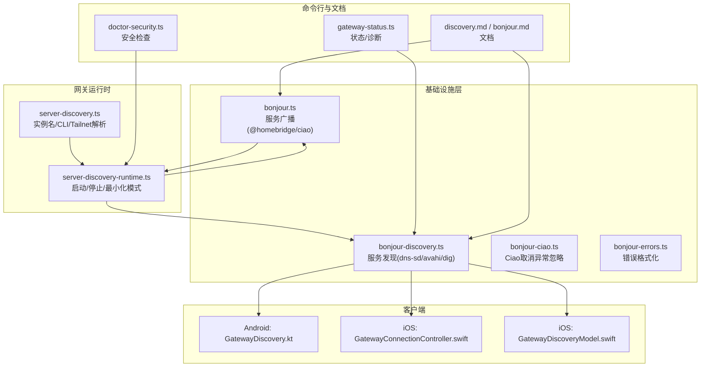
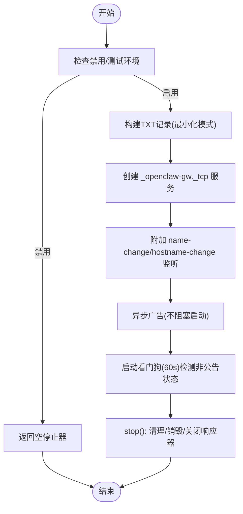
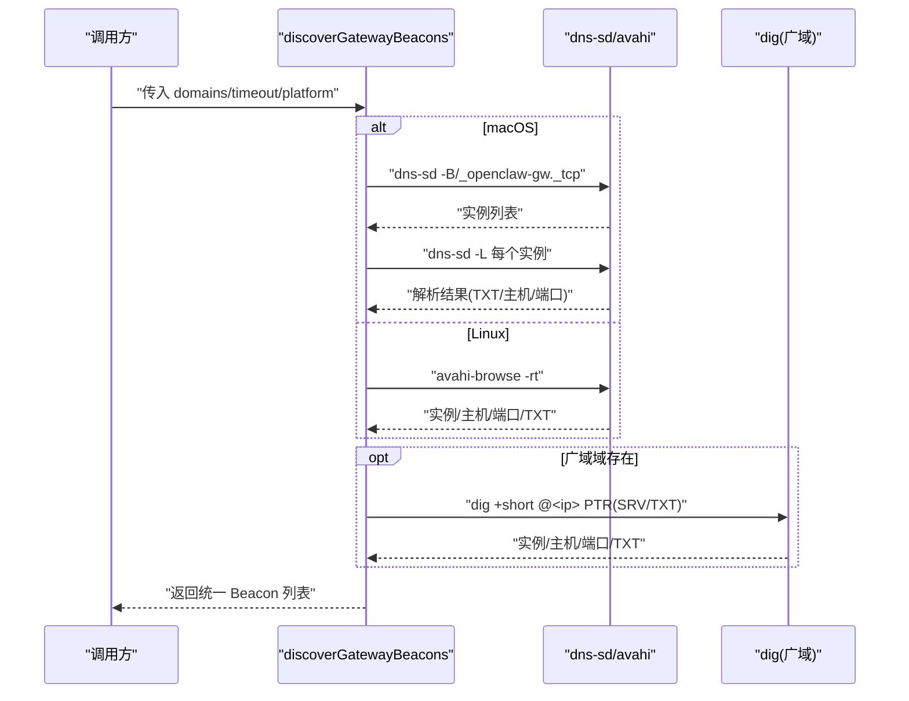
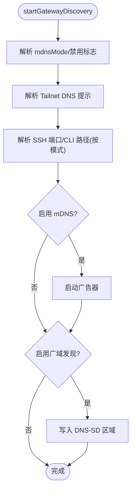
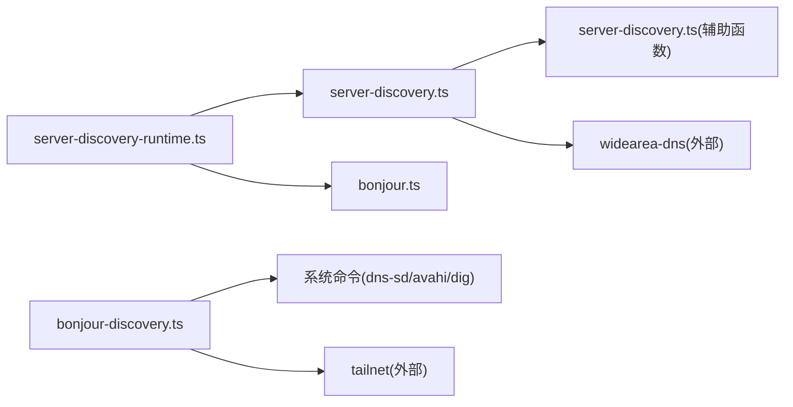

# 网关发现

## 目录
1. [引言](#引言)
2. [项目结构](#项目结构)
3. [核心组件](#核心组件)
4. [架构总览](#架构总览)
5. [详细组件分析](#详细组件分析)
6. [依赖关系分析](#依赖关系分析)
7. [性能考量](#性能考量)
8. [故障排查指南](#故障排查指南)
9. [结论](#结论)
10. [附录](#附录)

## 引言
本文件面向 OpenClaw 网关发现模块，系统化阐述基于 Bonjour（mDNS/DNS-SD）的服务注册、广播与解析机制，以及在不同平台（macOS、iOS、Android、Linux）上的实现与差异。文档覆盖以下主题：
- 服务注册与广播：如何通过 @homebridge/ciao 发布 `_openclaw-gw._tcp` 服务，TXT 记录字段与最小化模式。
- 服务发现与解析：本地与广域（Tailscale Unicast DNS-SD）两种路径的浏览与解析流程。
- 网络拓扑检测与连接状态管理：实例名规范化、主机名冲突处理、看门狗自动修复、Tailnet DNS 提示。
- 发现算法：实例名转义解码、TXT 键值解析、服务过滤与优先级选择策略。
- 配置与防火墙：环境变量、绑定模式、端口与安全建议。
- 调试工具与诊断：日志关键字、命令行工具、客户端调试日志。
- 兼容性与跨平台一致性：各平台实现差异与统一行为。

## 项目结构
网关发现相关代码主要分布在以下位置：
- 基础设施层（基础设施与通用逻辑）
  - 服务广播：`src/infra/bonjour.ts`
  - 服务发现：`src/infra/bonjour-discovery.ts`
  - Ciao 取消异常忽略：`src/infra/bonjour-ciao.ts`
  - 错误格式化：`src/infra/bonjour-errors.ts`
- 网关运行时（服务注册入口与运行时控制）
  - 实例名与 CLI 路径解析：`src/gateway/server-discovery.ts`
  - 启动与停止：`src/gateway/server-discovery-runtime.ts`
- 文档与测试
  - 文档：`docs/gateway/discovery.md`、`docs/gateway/bonjour.md`
  - 测试：`src/infra/bonjour.test.ts`、`src/infra/bonjour-discovery.test.ts`
- 客户端实现（跨平台）
  - Android：`apps/android/app/src/main/java/.../GatewayDiscovery.kt`
  - iOS：`apps/ios/Sources/Gateway/GatewayConnectionController.swift`、`GatewayDiscoveryModel.swift`
- 命令行与安全
  - 状态与诊断：`src/commands/gateway-status.ts`
  - 安全检查：`src/commands/doctor-security.ts`



## 核心组件
- 服务广播器（GatewayBonjourAdvertiser）
  - 使用 @homebridge/ciao 创建并发布 mDNS 服务，支持最小化模式（减少敏感信息暴露），监听名称/主机名冲突事件，并内置看门狗定时重播以应对休眠/接口切换。
- 服务发现器（GatewayBonjourDiscoverOpts/Beacon）
  - 支持本地（dns-sd）与广域（Tailscale Unicast DNS-SD，dig）两种路径；解析实例名转义、TXT 键值，输出统一的网关信标结构体。
- 运行时集成（startGatewayDiscovery）
  - 统一入口，根据配置与环境变量决定是否启用 mDNS 广播与广域 DNS-SD 区域更新；解析 Tailnet DNS 提示、SSH 端口、CLI 路径等。
- 客户端实现
  - iOS 使用 NWBrowser 浏览 `_openclaw-gw._tcp`；Android 使用 NsdManager；Linux/macOS 使用 avahi-browse 或 dns-sd。

## 架构总览
下图展示从网关到客户端的发现与连接路径，包括本地广播、广域解析与客户端选择策略。

```mermaid
sequenceDiagram
participant GW as "网关进程"
participant MDNS as "mDNS 广播(@homebridge/ciao)"
participant DISC as "服务发现(本地/广域)"
participant IOS as "iOS 客户端"
participant AND as "Android 客户端"
GW->>MDNS : "创建并发布 _openclaw-gw._tcp 服务(TXT)"
MDNS-->>GW : "广告成功/失败日志"
DISC->>MDNS : "dns-sd/avahi 浏览 _openclaw-gw._tcp"
MDNS-->>DISC : "实例列表/解析结果"
DISC-->>IOS : "Bonjour 信标(含 TXT)"
DISC-->>AND : "NSD 信标(含 TXT)"
IOS->>GW : "建立 WebSocket 控制面(可选 TLS)"
AND->>GW : "建立 WebSocket 控制面(可选 TLS)"
```

## 详细组件分析

### 服务广播（GatewayBonjourAdvertiser）
- 关键职责
  - 解析环境变量与配置，生成服务实例名与显示名，构建 TXT 记录（role、lanHost、gatewayPort、sshPort、gatewayTls、gatewayTlsSha256、canvasPort、tailnetDns、cliPath、displayName 等）。
  - 在最小化模式下隐藏敏感字段（如 cliPath、sshPort），降低信息泄露风险。
  - 注册名称/主机名冲突事件监听，记录冲突解决日志。
  - 异步发起广告，不阻塞网关启动；对异常进行捕获与格式化输出。
  - 启动看门狗（每 60 秒）检测非公告状态并尝试重播。
  - 提供 stop 方法清理服务、销毁响应器并移除未处理拒绝处理器。
- 环境变量与开关
  - `OPENCLAW_DISABLE_BONJOUR=1` 禁用广告。
  - `OPENCLAW_SSH_PORT` 覆盖 TXT 中 sshPort。
  - `OPENCLAW_TAILNET_DNS` 发布 tailnetDns 提示。
  - `OPENCLAW_CLI_PATH` 覆盖 cliPath（最小化模式下会被忽略）。
  - `OPENCLAW_MDNS_HOSTNAME`/`CLAWDBOT_MDNS_HOSTNAME` 控制 mDNS 主机名。
- 错误处理
  - 使用 ignoreCiaoCancellationRejection 忽略特定取消异常，避免未处理拒绝。
  - formatBonjourError 统一错误消息格式。



### 服务发现（本地与广域）
- 本地发现（macOS/Linux）
  - macOS：使用 `dns-sd -B/-L` 浏览与解析，解析实例名转义、TXT 键值，输出统一 Beacon 结构。
  - Linux：使用 `avahi-browse -rt`，解析 hostname/port/txt 并映射到 Beacon。
- 广域发现（Tailscale Unicast DNS-SD）
  - 若未检测到本地实例且配置了广域域，则探测 Tailscale IPv4 列表，多路并发 `dig @<ip>` 找到权威 Nameserver，再 dig SRV/TXT 获取目标主机、端口与 TXT。
  - 限制并发与预算时间，确保不会长时间阻塞。
- 实例名与 TXT 解析
  - 支持 `\DDD` 转义解码；解析 gatewayPort/sshPort/tailnetDns/cliPath/gatewayTls/gatewayTlsSha256/role/transport/displayName 等键。
  - 若无 displayName，回退为实例名。



### 运行时集成与最小化模式
- 启动流程
  - 根据 mdnsMode 决定是否启用 mDNS 广播与最小化模式；解析 Tailnet DNS 提示、SSH 端口、CLI 路径。
  - 若启用广域发现，解析域并写入 DNS-SD 区域文件，记录变更或警告。
- 最小化模式要点
  - 不发布 sshPort 与 cliPath，降低信息泄露风险；仅在 full 模式下发布。
- 日志与可观测性
  - 输出 `bonjour:` 开头的日志，包含广告状态、冲突解决、看门狗修复等。



### 客户端实现与跨平台一致性
- iOS
  - 使用 NWBrowser 浏览 `_openclaw-gw._tcp`，解析 TXT 字段（displayName、lanHost、gatewayPort、canvasPort、gatewayTls、gatewayTlsSha256、cliPath、tailnetDns）。
  - 支持开启发现调试日志，便于问题定位。
- Android
  - 使用 NsdManager 的 DiscoveryListener 浏览 NSD 服务，解析服务丢失事件并更新本地列表。
- Linux/macOS
  - 使用 dns-sd/avahi-browse，遵循相同的 TXT 键解析规则。
- 一致性保障
  - 统一服务类型 `_openclaw-gw._tcp` 与 TXT 键集合，确保跨平台 UI 行为一致。

### 发现算法与数据模型
- 服务过滤与优先级
  - 过滤非 `_openclaw-gw._tcp` 类型与无效条目；按平台选择最佳路径（macOS 优先本地 dns-sd，Linux 使用 avahi-browse）。
  - 广域路径作为本地不可用时的后备，按剩余超时预算分摊并发任务。
- 数据模型
  - GatewayBonjourBeacon：包含实例名、域名、显示名、主机、端口、lanHost、tailnetDns、gatewayPort、sshPort、TLS 开关与指纹、cliPath、role、transport、原始 TXT 映射等。

## 依赖关系分析
- 组件耦合
  - `server-discovery-runtime.ts` 依赖 `bonjour.ts` 与 `server-discovery.ts`，负责运行时参数整合与启动/停止。
  - `bonjour-discovery.ts` 依赖系统命令（dns-sd/avahi-browse/dig）与 Tailnet 信息解析。
- 外部依赖
  - @homebridge/ciao：mDNS 广播与响应器。
  - 系统工具：dns-sd、avahi-browse、dig、tailscale status。
- 循环依赖
  - 未见循环依赖；模块边界清晰。



## 性能考量
- 广播非阻塞：广告在后台异步执行，避免影响网关启动时间。
- 看门狗修复：每分钟检查一次服务状态，自动重播，减少人工干预。
- 广域扫描限流：dig 并发上限与预算时间控制，避免长时间阻塞。
- 最小化模式：减少 TXT 字段，降低网络负载与信息暴露。

## 故障排查指南
- 常见问题
  - Bonjour 不跨网：使用 Tailnet 或 SSH。
  - 多播被阻断：部分 Wi-Fi 网络禁用 mDNS。
  - 休眠/接口切换：macOS 可能临时丢弃 mDNS 结果，稍后重试。
  - 浏览成功但解析失败：主机名复杂（含特殊字符）导致解析器困惑，简化主机名并重启网关。
- 日志定位
  - 网关日志中查找以 `bonjour:` 开头的行，关注广告失败、名称/主机名冲突、看门狗修复等。
- 命令行工具
  - macOS：`dns-sd -B _openclaw-gw._tcp local.`；`dns-sd -L <instance>`。
  - Linux：`avahi-browse -rt`。
  - 广域：`dig +short @<TAILNET_IP> _openclaw-gw._tcp.<DOMAIN> PTR/SRV/TXT`。
- 客户端调试
  - iOS：设置 → Gateway → 高级 → 启用“发现调试日志”，复制日志以便分析。
- 安全检查
  - `doctor-security`：检查绑定模式、认证方式与暴露范围，确认是否需要更强的安全策略。

## 结论
OpenClaw 的网关发现模块通过 mDNS 广播与多平台服务发现实现本地便捷接入，并以 Tailscale Unicast DNS-SD 支撑跨网络场景。运行时集成提供最小化模式与看门狗修复，提升安全性与鲁棒性。配合完善的日志与诊断工具，可在多平台环境下稳定地完成网关发现与连接。

## 附录

### 环境变量与配置项
- `OPENCLAW_DISABLE_BONJOUR`：禁用 mDNS 广播。
- `OPENCLAW_SSH_PORT`：覆盖 TXT 中 sshPort。
- `OPENCLAW_TAILNET_DNS`：发布 tailnetDns 提示。
- `OPENCLAW_CLI_PATH`：覆盖 cliPath（最小化模式下忽略）。
- `OPENCLAW_MDNS_HOSTNAME`/`CLAWDBOT_MDNS_HOSTNAME`：控制 mDNS 主机名。
- `gateway.bind`：控制网关监听地址（loopback、lan、tailnet、custom 等）。

### 网络配置与防火墙建议
- 绑定模式
  - loopback：仅本机访问，最安全。
  - lan：允许局域网访问，需配合认证。
  - tailnet：通过 Tailscale 访问，推荐用于远程场景。
  - custom：指定 IP 地址。
- 端口
  - 默认网关端口 18789；SSH 端口默认 22（可通过 `OPENCLAW_SSH_PORT` 覆盖）。
- 防火墙
  - 本地 Bonjour 无需额外放行；广域访问需确保 Tailscale Nameserver 可达。
  - 仅在必要时开放端口，优先使用 TLS 与强认证。