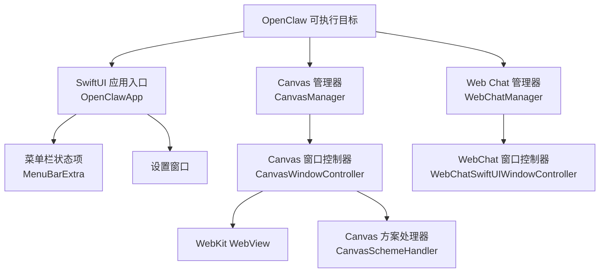
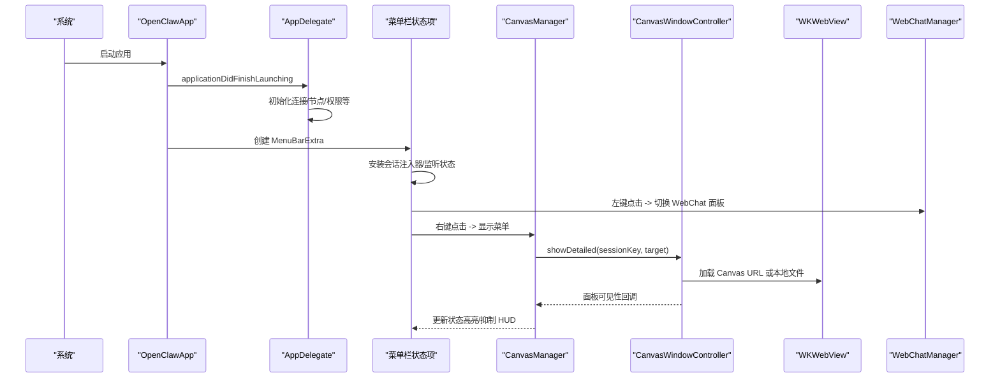
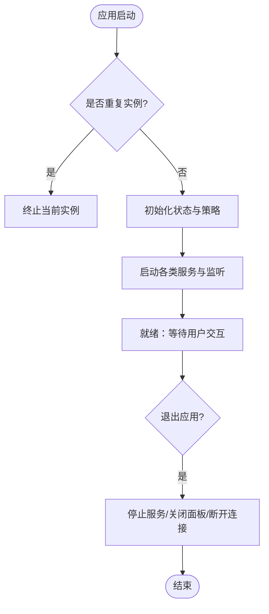
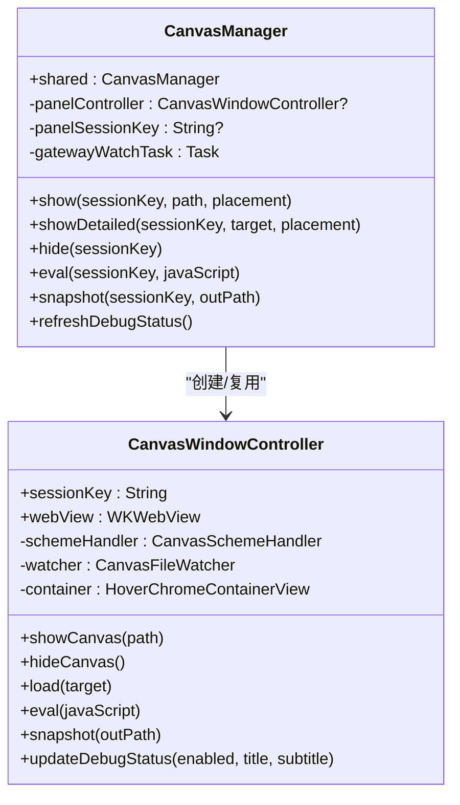
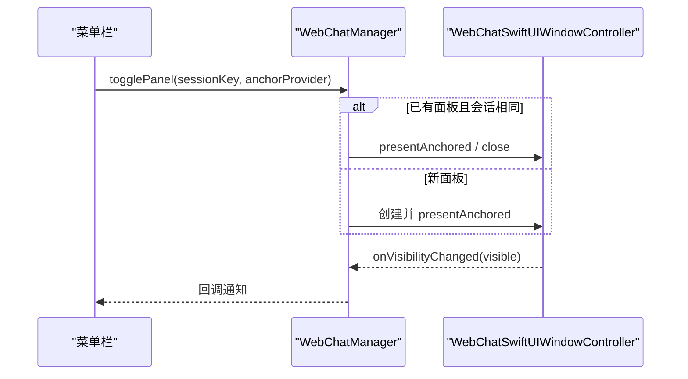
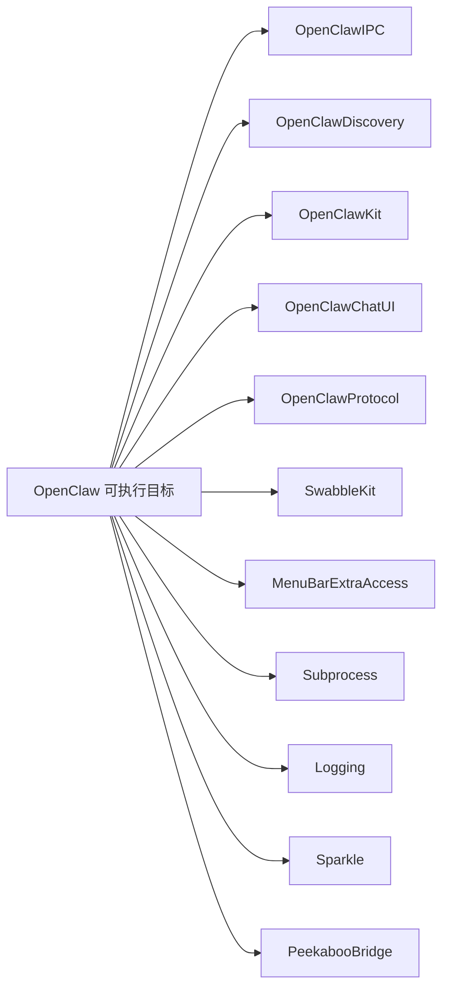

# 菜单栏应用

## 目录
1. [简介](#简介)
2. [项目结构](#项目结构)
3. [核心组件](#核心组件)
4. [架构总览](#架构总览)
5. [组件详解](#组件详解)
6. [依赖关系分析](#依赖关系分析)
7. [性能与可用性考量](#性能与可用性考量)
8. [故障排查指南](#故障排查指南)
9. [结论](#结论)

## 简介
本技术文档面向 OpenClaw 的 macOS 菜单栏应用，聚焦于应用入口、菜单栏交互、根画布（Canvas）渲染与锚定面板机制、会话管理与状态联动、以及系统集成与用户体验优化。文档以代码级事实为基础，配合图示帮助读者理解从启动到面板呈现的完整链路。

## 项目结构
OpenClaw macOS 包含可执行目标“OpenClaw”以及若干库目标（如 IPC、发现、协议等）。菜单栏应用的核心入口位于 macOS 平台的 Swift 源码中，使用 SwiftUI 构建菜单栏图标与设置窗口，并通过 WebKit 承载 Canvas 与 Web Chat 面板。

## 核心组件
- 应用入口与生命周期：`OpenClawApp`（SwiftUI App），`AppDelegate`（NSApplicationDelegate），负责启动、更新器、深链处理、终止清理等。
- 菜单栏与状态指示：`MenuBarExtra` 标签页、状态项外观与高亮、悬停 HUD 抑制、鼠标事件接管。
- Canvas 系统：`CanvasManager` 统一管理会话与面板；`CanvasWindowController` 负责 WebView 初始化、脚本注入、导航、自动重载与快照。
- Web Chat 系统：`WebChatManager` 管理窗口与面板两种呈现形态，支持锚定面板与首选会话缓存。
- 会话与状态：会话键贯穿 Canvas 与 Web Chat；状态变化驱动图标状态、连接模式切换、睡眠态判定等。

## 架构总览
下图展示从应用启动到菜单栏交互、再到 Canvas/Chat 面板呈现的关键路径与组件协作。

## 组件详解

### 应用入口与生命周期（`OpenClawApp.swift`）
- 入口与状态
  - 使用 SwiftUI App 协议，持有 AppState 状态存储，通过 MenuBarExtra 提供菜单栏入口。
  - 状态项外观受暂停、睡眠态影响，睡眠态由连接模式与网关/控制通道状态共同决定。
- 生命周期
  - `didFinishLaunching`：去重实例检测、应用激活策略、连接模式应用、信号监听、节点/配对/权限/语音唤醒等服务启动、首次引导调度、CLI 安装提示延迟检查。
  - `applicationWillTerminate`：停止各类服务、关闭面板、隧道与网关连接、桥接停止。
- 菜单栏交互
  - 通过 StatusItemMouseHandlerView 接管左/右键与悬停事件，左键切换 WebChat 面板，右键显示菜单并抑制状态高亮。
  - 鼠标悬停时通过 HoverHUDController 控制 HUD 显示。
- 更新器
  - 基于 Sparkle 的更新控制器，仅在签名有效的发布包中启用；否则使用禁用版本避免调试弹窗。

### Canvas 管理与渲染（`CanvasManager.swift`、`CanvasWindowController.swift`）
- 会话与面板
  - `CanvasManager` 统一管理会话键与面板生命周期，支持复用现有控制器或新建，支持锚定面板与默认锚点（鼠标或菜单栏按钮）。
  - `CanvasWindowController` 负责：
    - 初始化 WKWebView 配置、安装 Canvas URL Scheme 处理器。
    - 注入 A2UI 动作桥接脚本，回传到原生代理循环。
    - 监听文件变更自动 reload，支持本地 Canvas 内容热更新。
    - 提供 JavaScript 执行与截图能力。
- 导航与自动跳转
  - 支持 http/https/file 与 Canvas 自定义 Scheme；当未显式目标时，根据网关推送的 Canvas Host URL 自动导航至 A2UI。
- 调试状态
  - 根据应用状态动态设置调试状态标题/副标题，用于 Canvas 内部调试面板。

### Web Chat 管理（`WebChatManager.swift`）
- 形态与锚定
  - 支持窗口与锚定面板两种形态；面板形态可通过提供锚点矩形进行定位。
- 会话与缓存
  - 缓存首选会话键，减少每次查询网关的开销；面板隐藏后保留控制器以便快速复现。
- 可见性回调
  - 通过回调通知外部（如菜单栏）面板可见性变化，联动状态高亮与 HUD 抑制。

### 会话键与状态管理
- 会话键作用
  - Canvas 与 Web Chat 均以会话键区分不同会话上下文；Canvas 会话键用于隔离会话目录与 URL 命名空间。
- 状态联动
  - `CanvasManager` 依据应用状态与连接模式刷新调试状态；菜单栏根据暂停/睡眠态调整按钮外观。
  - 网关推送的 Canvas Host URL 作为自动导航的目标来源，避免重复导航。

## 依赖关系分析
- 目标与产品
  - 可执行目标 OpenClaw 依赖 IPC、发现、协议、聊天 UI、协议、Swabble、MenuBarExtraAccess、Subprocess、Logging、Sparkle、Peekaboo 等。
  - 资源包含图标与设备模型目录。
- 组件耦合
  - `OpenClawApp` 与 `AppDelegate` 通过 `MenuBarExtra` 与状态存储耦合。
  - `CanvasManager` 与 `CanvasWindowController` 强耦合，前者负责生命周期与导航策略，后者负责 WebView 渲染细节。
  - `WebChatManager` 与 `CanvasManager` 分别管理各自面板，但共享状态项锚点与可见性回调。

## 性能与可用性考量
- 面板复用与锚定
  - `CanvasManager` 对同一会话键复用控制器，减少初始化成本；面板锚定避免频繁布局计算。
- 自动重载
  - Canvas 文件监视器在本地内容变更时触发 reload，提升开发体验。
- 调试状态注入
  - 在 Canvas 内部按需注入调试状态，避免额外 UI 开销。
- 更新器策略
  - 仅在签名有效时启用 Sparkle，避免调试构建中的误触发。

## 故障排查指南
- 无法打开 Canvas/Chat 面板
  - 检查面板可见性回调是否正确传递；确认 `CanvasManager`/ `WebChatManager` 的 `onVisibilityChanged` 是否被设置。
- Canvas 不自动跳转
  - 确认网关已推送 Canvas Host URL；检查 `lastAutoA2UIUrl` 是否导致重复跳转；验证 `CanvasWindowController.shouldAutoNavigateToA2UI` 的条件。
- 面板锚定位置异常
  - 确认 `defaultAnchorProvider` 返回的 NSRect；若为空则回落到鼠标位置。
- 更新器弹窗干扰
  - 确认当前构建是否为签名有效的发布包；非签名包将使用禁用更新器控制器。

## 结论
OpenClaw macOS 菜单栏应用以 SwiftUI 与 AppKit 为核心，结合 WebKit 实现 Canvas 与 Web Chat 的沉浸式体验。通过会话键隔离多会话上下文，借助 `CanvasManager` 与 `WebChatManager` 实现面板生命周期与导航策略的统一管理。菜单栏交互通过自定义 MouseHandler 与 HoverHUD 控制器实现流畅的用户反馈。整体架构清晰、模块职责明确，具备良好的扩展性与系统集成能力。