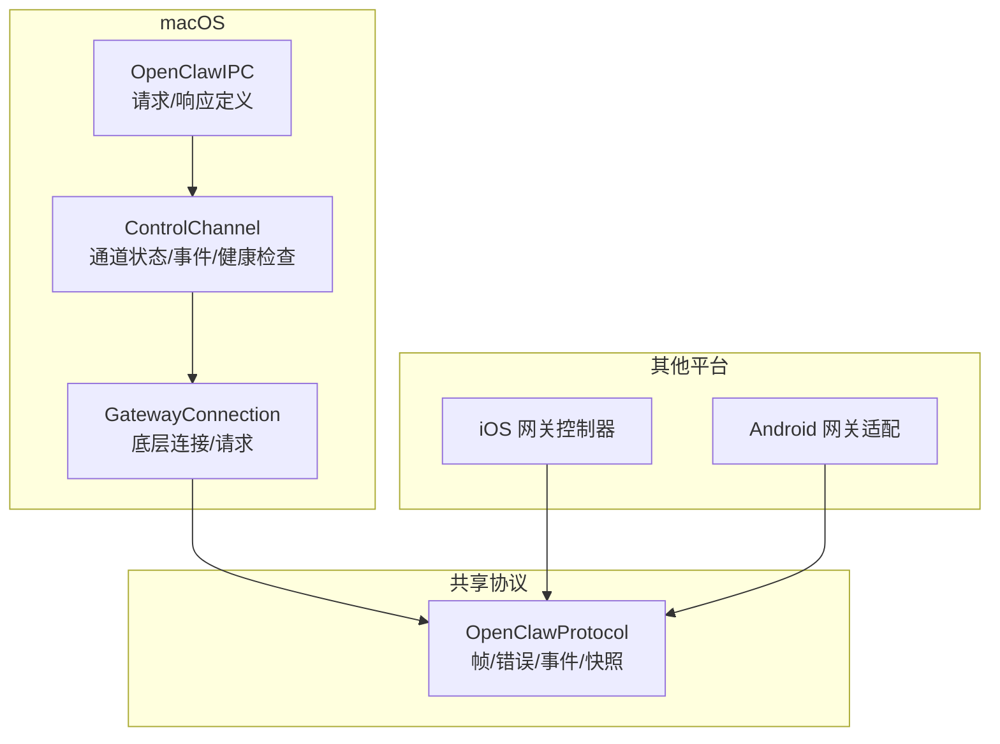
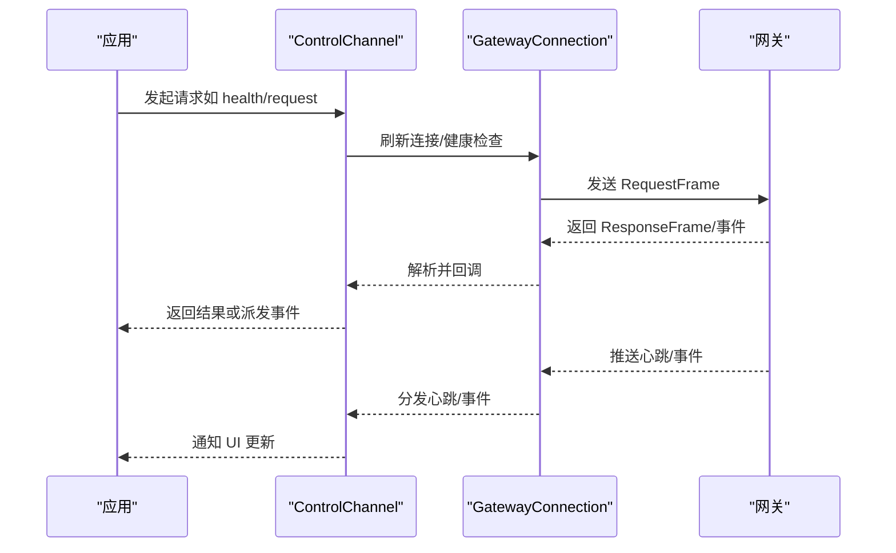
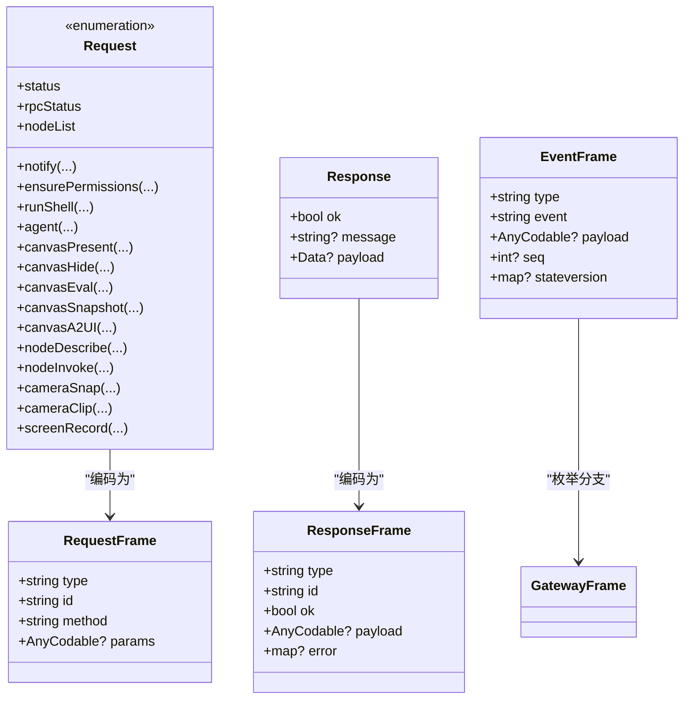
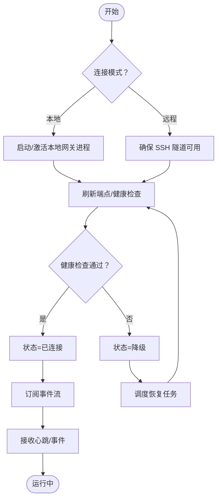
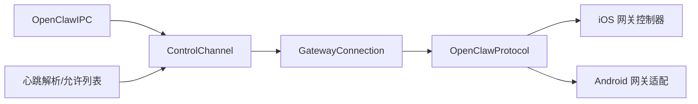

# 进程间通信

## 目录
1. [简介](#简介)
2. [项目结构](#项目结构)
3. [核心组件](#核心组件)
4. [架构总览](#架构总览)
5. [详细组件分析](#详细组件分析)
6. [依赖关系分析](#依赖关系分析)
7. [性能考量](#性能考量)
8. [故障排查指南](#故障排查指南)
9. [结论](#结论)
10. [附录](#附录)

## 简介
本文件系统性梳理 OpenClaw 的进程间通信（IPC）模块，覆盖消息协议、序列化/反序列化、通道建立与维护（含心跳与错误恢复）、安全与权限控制、性能优化与并发处理、调试与监控，以及与各平台组件的集成方式与使用示例。

## 项目结构
OpenClaw 的 IPC 由“请求/响应模型 + WebSocket/本地套接字 + 心跳与事件流”构成，跨平台通过统一的协议模型进行交互。关键位置如下：
- macOS 平台：`OpenClawIPC` 定义请求/响应与传输参数；`ControlChannel` 负责通道生命周期与事件订阅；`GatewayConnection` 提供底层连接与请求封装。
- 共享协议：`OpenClawProtocol` 定义通用的帧模型、错误码、快照与事件等，确保多端一致性。
- iOS/Android：通过各自的网关适配层对接同一协议，保证跨端一致行为。

## 核心组件
- 请求/响应模型与序列化
  - macOS 定义了丰富的请求类型（通知、权限、命令执行、Canvas 操作、节点调用、媒体采集等），并通过自定义 Codable 实现对每种请求类型的编码/解码，确保字段精确映射与可扩展。
  - 传输路径：应用侧构造 Request，经 JSON 编码后发送；服务端返回 Response 或 `GatewayFrame`，客户端再解码并分发到 UI 或业务逻辑。
- 控制通道（`ControlChannel`）
  - 统一管理连接状态（未连接/连接中/已连接/降级），负责健康检查、事件订阅、错误友好化与自动恢复。
  - 提供 `health`、`last-heartbeat`、`request` 等接口，简化上层调用。
- 网关连接（`GatewayConnection`）
  - 封装底层连接刷新、健康检查、请求发送与事件订阅，屏蔽平台差异。
- 共享协议（`OpenClawProtocol`）
  - 定义 `RequestFrame`/`ResponseFrame`/`EventFrame`、错误码、快照、事件等，确保跨端一致的消息格式与语义。

## 架构总览
下图展示从应用发起请求到网关响应的关键流程，以及心跳与事件推送的异步通道。

## 详细组件分析

### 请求/响应与消息格式
- 请求类型
  - 包括通知、权限校验、Shell 执行、状态查询、代理消息投递、Canvas 展示/隐藏/脚本/截图/A2UI、节点列表/描述/调用、摄像头拍照/录制、屏幕录制等。
  - 每个请求均通过自定义编码器写入 `type` 字段以标识类型，并按需写入具体参数键值。
- 响应模型
  - 统一的 Response 结构包含 `ok`、`message` 与可选 `payload`（如图片字节、命令输出等），便于上层统一处理。
- 协议帧
  - `RequestFrame`/`ResponseFrame`/`EventFrame` 三类帧承载方法调用、返回与事件推送，配合 `GatewayFrame` 泛型枚举实现多态解析。

### 通道建立与维护（连接管理、心跳、错误恢复）
- 连接模式
  - 支持本地与远程两种模式；远程模式会确保 SSH 隧道可用后再建立连接。
- 健康检查
  - 提供 `health` 接口，支持超时参数；成功后记录往返耗时并置为已连接。
- 事件订阅
  - 订阅网关推送的 `agent`/`heartbeat`/`shutdown` 等事件，解码并派发到 UI 或工作活动存储。
- 错误恢复
  - 当连接断开或降级时，调度恢复任务：本地模式启动/重启进程，远程模式重建隧道，随后刷新端点并重连。
- 友好化错误
  - 对常见网络/握手错误进行归类与用户可读提示，便于快速定位问题。

### 数据安全与权限控制
- 权限能力
  - 通过 `Capability` 枚举声明所需系统权限（如自动化、通知、辅助功能、屏幕录制、麦克风、相机、定位等），并在需要时触发交互式授权流程。
- 认证来源
  - 通过 `GatewayConnection` 获取认证来源（设备令牌/共享令牌/密码/无），并在 UI 中显示当前使用的认证方式。
- 平台适配
  - macOS 通过 TCC 与系统权限框架协作；iOS/Android 通过各自平台的权限与安全模型实现对应能力。

### 心跳检测与事件流
- 心跳事件
  - 网关周期性推送心跳事件，包含时间戳、状态、预览信息、媒体标记等；客户端解码后通过通知中心广播，驱动 UI 更新。
- 事件路由
  - 对 `agent` 事件进行会话键解析，将作业/工具事件路由到工作活动存储，支撑 UI 与后台任务联动。
- 快照与状态版本
  - 通过快照与状态版本号跟踪网关状态变化，用于增量更新与一致性保障。

### 跨平台集成与 API 使用示例
- macOS
  - 使用 `ControlChannel.request` 发送方法调用；使用 `health` 获取网关健康状态；通过事件订阅监听心跳与代理事件。
- iOS
  - 通过 `GatewayConnectionController` 管理连接生命周期，与共享协议保持一致。
- Android
  - 通过 `GatewayEndpoint`/`GatewayProtocol`/`GatewaySession`/`GatewayTls` 等模块对接网关，遵循相同协议帧与事件模型。

## 依赖关系分析
- 组件耦合
  - `ControlChannel` 依赖 `GatewayConnection` 与 `OpenClawProtocol`；`GatewayConnection` 依赖共享协议与平台网络栈；`OpenClawIPC` 仅定义请求/响应，不直接依赖连接细节。
- 外部依赖
  - 心跳发送方解析与允许列表来自基础设施层，影响事件路由与发送者标识。
- 循环依赖
  - 未见循环依赖迹象；协议层为纯数据模型，避免循环。

## 性能考量
- 序列化开销
  - 使用结构化 JSON 编码，字段精确映射，减少冗余；`payload` 采用二进制（如图片）避免额外编码成本。
- 连接复用
  - 通过单连接复用请求/响应与事件订阅，降低握手与上下文切换成本。
- 心跳与事件
  - 心跳频率与事件批量化有助于减少网络抖动带来的 UI 抖动。
- 并发与恢复
  - 异步任务与恢复调度避免阻塞主线程；在降级状态下快速重试与最小化等待时间。

## 故障排查指南
- 常见错误与提示
  - 网络不可达/端口占用：提示检查本地端口或 SSH 隧道。
  - 认证失败：提示设置/清理网关令牌或密码。
  - 请求超时：提示检查本地网关进程状态。
- 自检步骤
  - 使用 `health` 接口确认连通性与延迟；查看 `last-heartbeat` 事件确认心跳是否持续。
  - 观察 `ControlChannel` 状态变化（未连接/连接中/已连接/降级）与恢复日志。
- 单元测试参考
  - `CanvasIPCTests` 展示了请求的编解码往返与空字段处理，可用于验证序列化一致性。

## 结论
OpenClaw 的 IPC 模块以清晰的请求/响应模型与统一协议为核心，结合可靠的连接管理、心跳与事件流、友好的错误恢复与跨平台适配，实现了稳定高效的进程间通信。通过严格的序列化约束与状态机管理，既保证了易用性，也兼顾了可维护性与可扩展性。

## 附录
- API 使用要点
  - 发起请求：使用 `ControlChannel.request(method, params, timeoutMs)`，注意超时与错误处理。
  - 健康检查：使用 `health(timeout:)`，获取往返毫秒数并更新 UI。
  - 事件订阅：监听通知名称，解析心跳与代理事件，更新工作活动。
- 测试建议
  - 在 `CanvasIPCTests` 的基础上增加边界场景（空参数、缺失字段、非法类型）以强化健壮性。