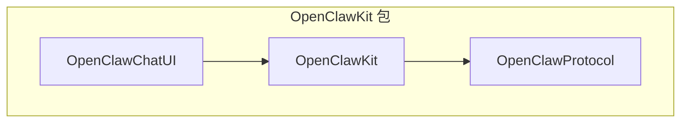
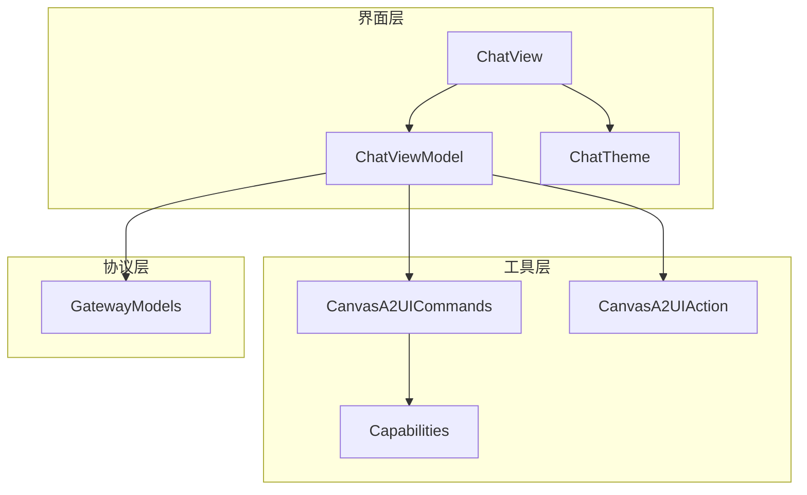
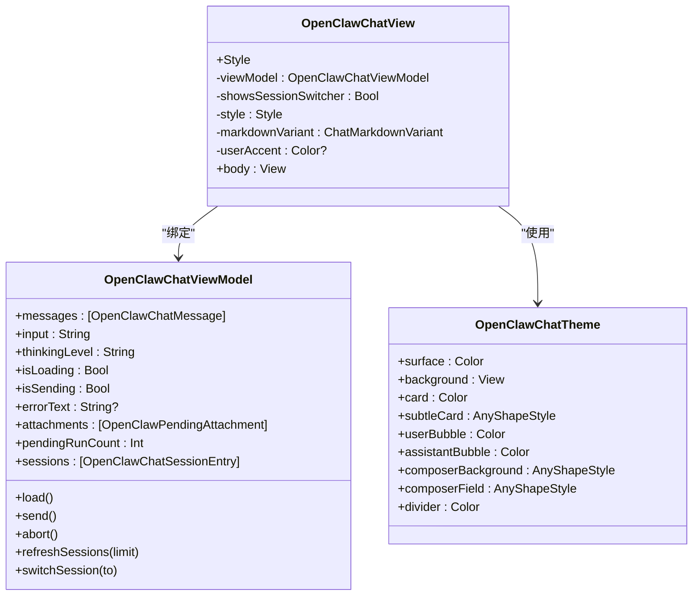
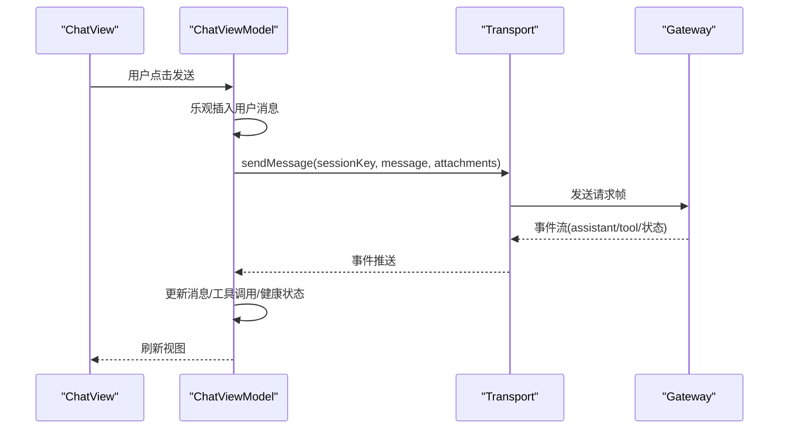
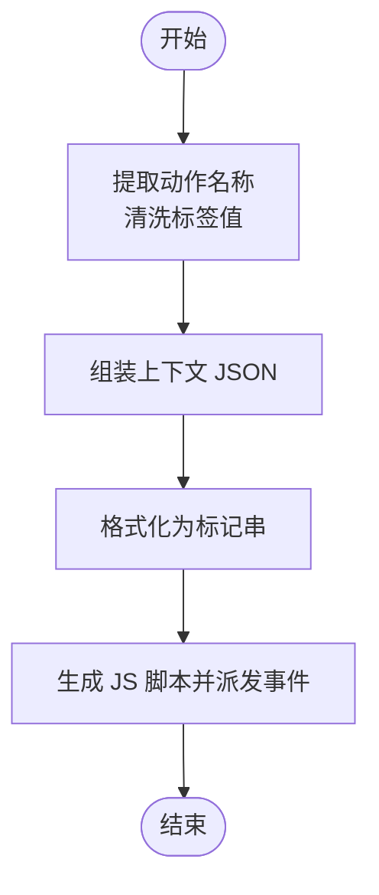
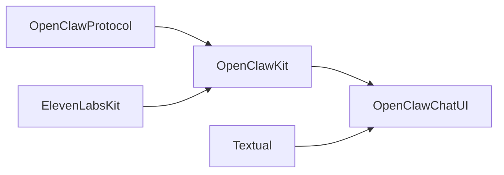

# 共享组件库

## 目录
1. [引言](#引言)
2. [项目结构](#项目结构)
3. [核心组件](#核心组件)
4. [架构总览](#架构总览)
5. [组件详解](#组件详解)
6. [依赖关系分析](#依赖关系分析)
7. [性能与可扩展性](#性能与可扩展性)
8. [故障排查指南](#故障排查指南)
9. [结论](#结论)
10. [附录：使用与最佳实践](#附录使用与最佳实践)

## 引言
本技术文档面向 OpenClaw 共享组件库（OpenClawKit），系统化阐述其设计理念、架构原则与实现细节。重点覆盖以下方面：
- OpenClawChatUI 的界面与样式体系，以及消息流与状态管理
- OpenClawKit 的核心能力模块：协议定义、通用工具接口与 Canvas A2UI 集成
- Canvas A2UI 的渲染命令与前端事件桥接机制
- 版本管理、依赖关系与跨平台兼容策略
- 使用指南、最佳实践、构建与测试流程、发布流程
- 在 iOS/macOS 平台中的集成方式与注意事项

## 项目结构
OpenClawKit 采用 Swift Package Manager 组织，核心由三个目标构成：
- `OpenClawProtocol`：网关协议模型与错误码
- `OpenClawKit`：通用工具、命令与 Canvas A2UI 能力
- `OpenClawChatUI`：基于 SwiftUI 的聊天界面与主题系统

## 核心组件
- 协议层（`OpenClawProtocol`）
  - 定义连接参数、帧模型、事件与错误等协议结构，确保客户端与网关通信的一致性与可演进性。
- 工具层（`OpenClawKit`）
  - 提供 Canvas A2UI 命令与动作格式化、能力枚举、资源与命令集等，支撑跨设备的统一交互。
- 界面层（`OpenClawChatUI`）
  - 基于 SwiftUI 的聊天视图、主题与 ViewModel，负责消息渲染、输入处理、会话切换与工具调用展示。

## 架构总览
OpenClawKit 将“协议”“工具”“界面”分层解耦，通过 ViewModel 驱动 UI，通过 Transport 与网关交互；Canvas A2UI 作为渲染通道，通过命令与动作桥接到前端环境。

## 组件详解

### OpenClawChatUI：聊天界面与样式系统
- 视图结构
  - `OpenClawChatView` 采用自适应布局，区分 macOS 与 iOS 的内边距、间距与滚动行为；支持标准与引导式两种风格。
  - 内置消息列表、输入区、会话切换弹窗、加载态与错误提示。
- 主题系统
  - `OpenClawChatTheme` 提供动态背景、气泡色板、卡片与输入区域样式，并针对 macOS 的外观变化进行适配。
- 状态与消息流
  - `ChatViewModel` 负责历史拉取、发送、中止、会话切换、健康检查与事件流处理；支持工具调用的挂起展示与合并渲染。
  - 支持乐观 UI：发送前即时插入用户消息，提升响应感；超时与中断有明确的回退与提示。

### OpenClawKit：核心功能模块
- 协议与模型
  - `GatewayModels` 定义连接、请求/响应帧、事件、快照与错误等结构，确保与网关的稳定交互。
- 能力枚举
  - `Capabilities` 提供 `canvas`、`camera`、`screen`、`voiceWake`、`location` 等能力标识，便于运行时能力检测与路由。
- Canvas A2UI 命令与动作
  - `CanvasA2UICommands` 定义 `canvas.a2ui.push`、`canvas.a2ui.pushJSONL`、`canvas.a2ui.reset` 等命令与参数。
  - `CanvasA2UIAction` 提供动作提取、标签值清洗、上下文 JSON 序列化与 JS 桥接的状态回传脚本生成，用于前端与原生之间的事件联动。

### Canvas A2UI：实现原理与前端集成
- 命令语义
  - `push`：在设备画布上渲染 A2UI 内容；`pushJSONL`：向后兼容的 JSONL 推送别名；`reset`：重置渲染器状态。
- 动作上下文
  - 通过 `AgentMessageContext` 描述动作名称、会话、组件与上下文 JSON，经清洗与格式化后形成可解析的字符串标记，便于网关侧识别与路由。
- JS 桥接
  - 通过 `jsDispatchA2UIActionStatus` 生成自定义事件脚本，向 window 分发 `openclaw:a2ui-action-status` 事件，携带 `actionId`、`ok` 与 `error` 字段，供前端监听与处理。

## 依赖关系分析
- 平台与工具链
  - Swift Tools Version 6.2，启用 StrictConcurrency 与 upcoming feature，确保并发安全与未来兼容。
  - 依赖 ElevenLabsKit 与 Textual（仅 macOS/iOS 条件编译），分别用于语音与富文本渲染。
- 目标依赖
  - `OpenClawProtocol`：无外部依赖，专注协议模型。
  - `OpenClawKit`：依赖 `OpenClawProtocol` 与外部产品包 ElevenLabsKit。
  - `OpenClawChatUI`：依赖 `OpenClawKit`，并条件引入 Textual 以支持 Markdown 渲染。

## 性能与可扩展性
- 并发与线程模型
  - 启用 StrictConcurrency，确保跨平台并发安全；ViewModel 中使用非隔离任务处理事件流与超时，避免阻塞主线程。
- UI 响应与滚动
  - 使用 `scrollTargetLayout` 与锚点滚动，减少布局抖动；对新消息与发送完成自动滚动到底部，优化阅读体验。
- 事件去重与历史刷新
  - 对消息内容进行去重键计算，避免重复渲染；在工具调用或会话切换后按需刷新历史，保持一致性。
- 资源与主题
  - 资源通过 `.process` 处理，主题系统针对 macOS 外观变化动态解析颜色，降低绘制成本。

## 故障排查指南
- 连接与健康
  - 当健康检查失败或事件流中断，ViewModel 会设置错误文案并清理挂起运行；建议触发刷新操作重新同步。
- 发送超时
  - 若超过预设超时时间未收到回复，自动提示“等待回复超时”，可重试或刷新。
- 工具调用异常
  - 工具调用阶段若出现错误，ViewModel 会记录错误并清理挂起集合；可在 UI 上查看工具调用状态。
- Canvas A2UI 动作
  - 若前端未收到状态事件，检查 `jsDispatchA2UIActionStatus` 生成的脚本是否正确注入；确认 window 自定义事件 `openclaw:a2ui-action-status` 是否被监听。

## 结论
OpenClawKit 通过清晰的分层设计与严格的并发模型，提供了可复用、可扩展且跨平台一致的聊天与渲染能力。ChatUI 以 ViewModel 驱动，结合 Canvas A2UI 命令与动作桥接，实现了从协议到界面的完整闭环。配合完善的错误处理与性能优化策略，能够满足多端集成与复杂场景下的稳定性与可用性要求。

## 附录：使用与最佳实践

### 版本管理与兼容性
- Swift Tools Version 与特性
  - 使用 6.2 及 StrictConcurrency，确保未来迁移平滑；注意 upcoming feature 的演进节奏。
- 平台最低版本
  - iOS 18、macOS 15，建议在目标平台上启用最接近的工具链版本。
- 依赖版本
  - ElevenLabsKit 与 Textual 采用固定版本，避免不兼容变更影响。

### 构建与测试
- 构建
  - 使用 Swift Package Manager 构建；确保依赖已解析（Package.resolved）。
- 测试
  - 开启 SwiftTesting 实验特性，针对 OpenClawKit 与 OpenClawChatUI 的核心逻辑进行单元与集成测试。
- 资源
  - OpenClawKit 目标包含资源目录，构建时会进行处理。

### 发布流程
- 包版本
  - 依据仓库版本策略更新包版本号与依赖约束，确保与上游依赖保持一致。
- 文档与示例
  - 配合 README 与示例工程，提供最小可运行示例，便于第三方集成。

### 在 iOS/macOS 平台集成要点
- 导入与链接
  - 在应用 Target 中添加 OpenClawKit 依赖；确保 OpenClawChatUI 的条件依赖（Textual）在对应平台生效。
- 主题与外观
  - 使用 `OpenClawChatTheme` 获取系统级配色；在 macOS 下注意外观切换时的颜色动态解析。
- 事件与命令
  - 通过 `CanvasA2UICommands` 与 `CanvasA2UIAction` 与前端桥接，确保动作名称与上下文清洗规则一致。