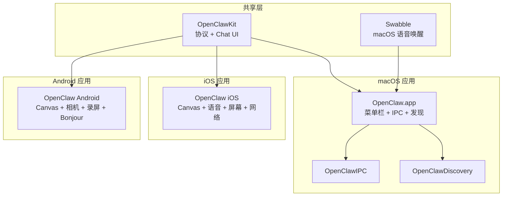
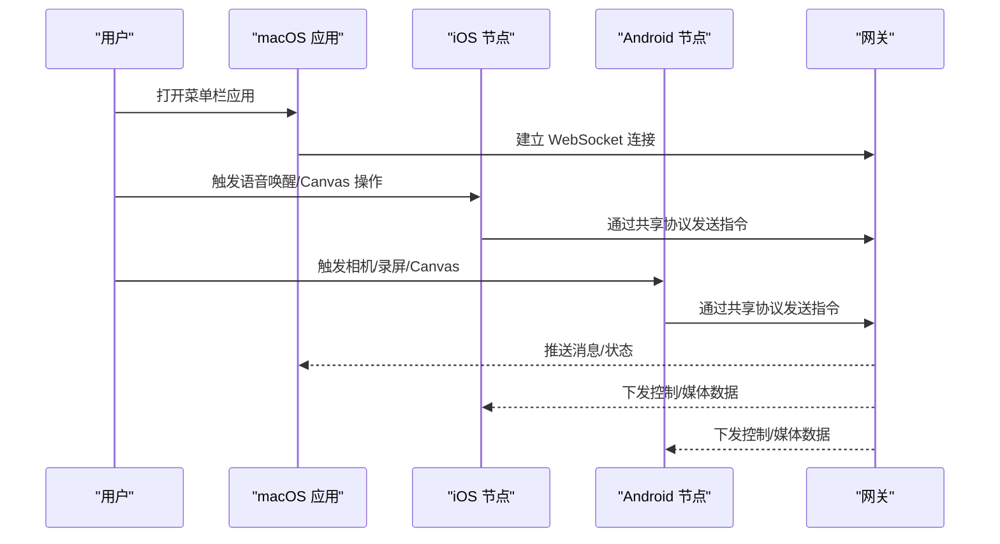
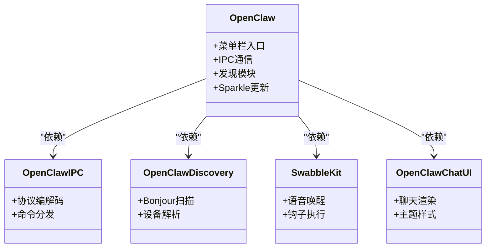
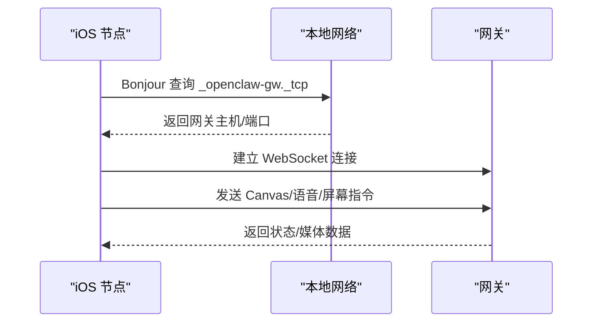
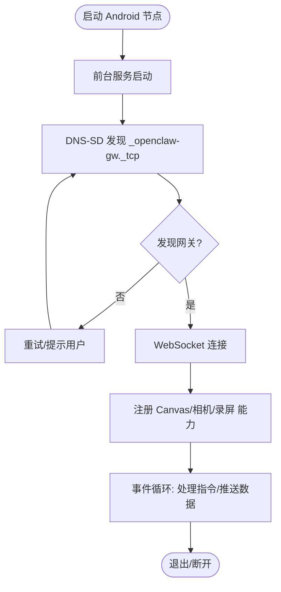
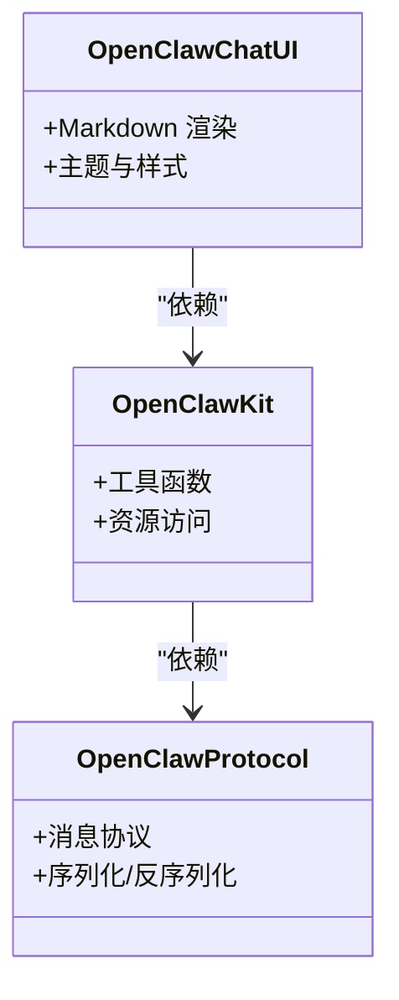
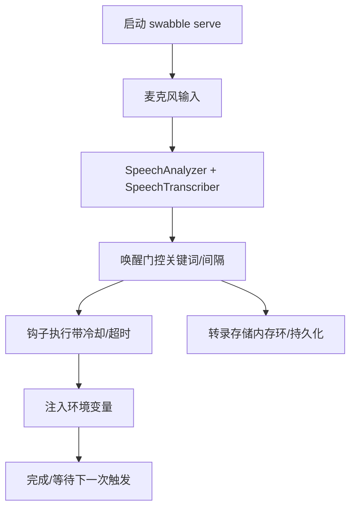
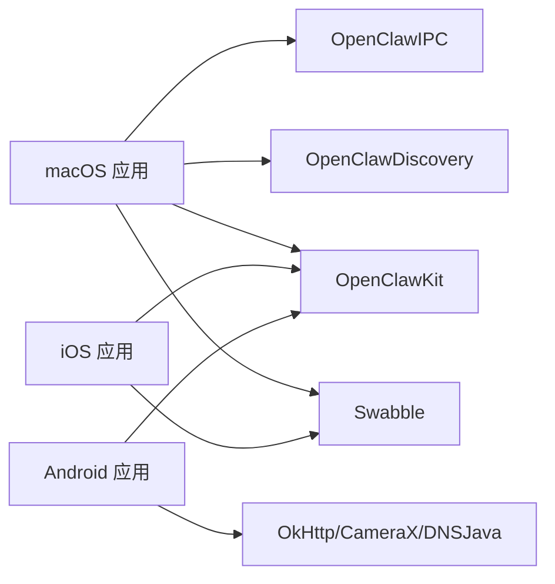

# 平台应用

## 目录
1. [简介](#简介)
2. [项目结构](#项目结构)
3. [核心组件](#核心组件)
4. [架构总览](#架构总览)
5. [详细组件分析](#详细组件分析)
6. [依赖关系分析](#依赖关系分析)
7. [性能考虑](#性能考虑)
8. [故障排查指南](#故障排查指南)
9. [结论](#结论)
10. [附录](#附录)

## 简介
本技术文档面向 OpenClaw 平台应用，系统性梳理 macOS 应用（OpenClaw.app）、iOS 节点应用、Android 节点应用与共享组件库 OpenClawKit 的设计与实现要点。重点覆盖：

- macOS：菜单栏控制、语音唤醒（基于 Swabble）、WebChat 集成、IPC 与发现模块、打包与分发。
- iOS：节点应用架构、Canvas 表面、语音触发、Bonjour 配对与网络权限。
- Android：节点应用架构、Canvas 支持、相机控制、屏幕录制、DNS-SD 发现与权限管理。
- 共享组件库：OpenClawKit 的产品化组织、协议与 UI 组件复用。
- 开发指南：构建流程、签名与公证、权限与部署策略、跨平台一致性保障。
- 使用示例与最佳实践：从开发到上线的完整路径。

## 项目结构
OpenClaw 采用多工程工作区组织，按平台拆分应用工程，并通过 Swift Package Manager 和 Gradle 管理依赖与构建。共享逻辑集中在 OpenClawKit，iOS/macOS 应用通过该库共享协议与 UI 组件；Swabble 提供 macOS 专用的本地语音唤醒能力。

## 核心组件
- OpenClawKit：提供跨平台协议（OpenClawProtocol）与聊天 UI（OpenClawChatUI），作为 iOS/macOS/Android 的共享基础。
- Swabble：macOS 专用的本地语音唤醒守护进程与工具集，支持配置化钩子执行与转录存储。
- macOS 应用（OpenClaw.app）：菜单栏常驻、IPC 通信、Bonjour 发现、Sparkle 更新、Peekaboo 桥接等。
- iOS 应用：Canvas 表面、语音唤醒、屏幕录制、位置服务、网关连接与 Bonjour 权限声明。
- Android 应用：Canvas 控制、CameraX 相机、屏幕捕获、DNS-SD Bonjour 发现、前台服务与权限。

## 架构总览
OpenClaw 平台由“网关（Gateway）+ 多节点（Node）+ 应用（App）”构成。节点通过 Bonjour/DNS-SD 或直接地址发现网关，建立 WebSocket 连接后进行会话与指令交互。共享协议与 UI 在各端复用，确保一致体验。

## 详细组件分析

### macOS 应用（OpenClaw.app）
- 组件职责
  - 菜单栏常驻与控制面板
  - IPC 通信与发现模块
  - Sparkle 自动更新
  - Peekaboo 桥接与自动化
  - 资源打包（图标、设备模型）
- 关键特性
  - 严格并发设置（StrictConcurrency）
  - 通过 `OpenClawIPC`/`OpenClawDiscovery` 与网关交互
  - 通过 `OpenClawChatUI` 渲染聊天界面
  - 通过 `SwabbleKit` 提供语音唤醒能力
- 打包与分发
  - 签名与公证脚本
  - DMG 制作与 AppCast 生成
  - 本地运行与调试脚本

### iOS 节点应用
- 组件职责
  - Canvas 表面与交互
  - 语音唤醒与转录
  - 屏幕录制与 WebView
  - 位置服务与网络连接
  - Bonjour 服务声明与权限
- 关键特性
  - AppIntents 元数据禁用
  - 后台音频模式
  - 多方向界面支持
  - Bonjour 服务标识（`_openclaw-gw._tcp`）
  - 语音识别与麦克风权限
- 配对与网络
  - 通过 Bonjour 发现网关
  - 网络权限描述与任意加载配置

### Android 节点应用
- 组件职责
  - Canvas 控制与渲染
  - CameraX 相机与视频
  - 屏幕捕获与录屏
  - DNS-SD Bonjour 发现
  - 前台服务与持久通知
- 关键特性
  - Modern Android（minSdk 31）
  - Jetpack Compose UI
  - OkHttp 网络栈
  - CameraX 生态（camera-core/camera2/lifecycle/video/view）
  - DNSJava 实现 Wide-Area Bonjour
- 权限与安全
  - Wi-Fi 设备发现（Android 13+）
  - 通知权限（Android 13+）
  - 相机与录音权限

### 共享组件库 OpenClawKit
- 产品化组织
  - `OpenClawProtocol`：跨端协议定义
  - `OpenClawKit`：通用工具与资源
  - `OpenClawChatUI`：跨平台聊天 UI
- 平台支持
  - iOS 18+、macOS 15+
  - 严格并发启用
- 资源与测试
  - 资源处理（Resources）
  - Swift Testing 实验特性

### Swabble（macOS 语音唤醒）
- 目标与范围
  - macOS 26+ 本地语音唤醒，基于 Speech.framework
  - 默认唤醒词“clawd”，可扩展别名
  - 可选禁用唤醒门控（`--no-wake`）
  - 钩子执行与转录存储
- 架构要点
  - CLI 层（Commander）+ 配置（JSON）+ 音频/语音流水线 + 唤醒门 + 钩子执行器 + 转录存储 + 日志
  - 严格并发设置（Swift 6）

## 依赖关系分析
- 平台依赖
  - macOS：MenuBarExtraAccess、Subprocess、Logging、Sparkle、Peekaboo
  - iOS：AppIntents、Bonjour 服务声明
  - Android：OkHttp、CameraX、DNSJava、Compose 生态
- 共享依赖
  - OpenClawKit：ElevenLabsKit、Textual（macOS/iOS）
  - Swabble：Commander、swift-testing

## 性能考虑
- 本地优先：语音唤醒与转录在 macOS 侧本地完成，降低延迟与隐私风险。
- 轻量 UI：iOS/macOS 使用 Textual/Compose，减少主线程阻塞。
- 网络优化：Android 使用 OkHttp，结合 DNS-SD 快速定位网关；iOS 声明后台音频以保持稳定连接。
- 资源与缓存：macOS 转录存储采用环形缓冲与可选持久化，避免磁盘压力。
- 并发与稳定性：严格并发设置与 Swift Testing 实验特性提升可靠性。

## 故障排查指南
- macOS
  - 签名与公证失败：检查团队 ID、证书与公证脚本参数。
  - Sparkle 更新异常：核对 AppCast URL 与 DMG 生成流程。
  - 语音唤醒无响应：确认 Speech 权限与资产下载、Swabble 配置文件。
- iOS
  - Bonjour 无法发现：检查 Info.plist 中 NSBonjourServices 与网络权限描述。
  - 语音识别失败：确认麦克风与语音识别权限。
- Android
  - DNS-SD 不可用：验证 DNSJava 依赖与网络权限（Wi‑Fi 设备、通知）。
  - 录屏/相机失败：确认相机权限与 CameraX 生命周期绑定。

## 结论
OpenClaw 平台通过 OpenClawKit 实现协议与 UI 的跨平台复用，借助 Swabble 在 macOS 上提供本地语音唤醒，iOS/Android 节点分别利用系统框架与现代 SDK 完成 Canvas、相机、录屏与网络发现。整体架构强调本地化、低延迟与一致性，配合完善的构建、签名、公证与分发脚本，形成从开发到上线的闭环。

## 附录

### 开发环境搭建与构建流程
- macOS
  - 工具链：Xcode 16+、Swift 6.2、Homebrew
  - 构建：SwiftPM 或 Xcode
  - 签名与公证：codesign 与 notarize 脚本
  - 打包与发布：package-mac-app.sh、create-dmg.sh、make_appcast.sh
- iOS
  - 工具链：Xcode 16+、Swift 6.0、XcodeGen
  - 构建：xcodegen 生成工程后打开
  - 团队与证书：通过脚本查询团队 ID
- Android
  - 工具链：Android Studio、Kotlin 17、Jetpack Compose
  - 构建：Gradle（./gradlew）
  - 依赖：OkHttp、CameraX、DNSJava

### 权限与部署策略
- macOS
  - Sparkle 更新、Peekaboo 桥接、菜单栏访问
- iOS
  - 后台音频、Bonjour 服务、相机/麦克风/语音识别权限
- Android
  - Wi‑Fi 设备发现、通知、相机/录音权限

### 跨平台一致性保障
- 协议统一：OpenClawProtocol 保证消息契约一致
- UI 组件：OpenClawChatUI 在 iOS/macOS 复用
- 语音唤醒：SwabbleKit 提供跨端唤醒门控与钩子执行
- 网络发现：Bonjour/DNS-SD 统一节点发现

### 使用示例与最佳实践
- macOS
  - 本地运行：build-and-run-mac.sh
  - 语音唤醒：配置 Swabble 钩子与转录
  - WebChat 集成：通过 OpenClawChatUI 渲染
- iOS
  - Bonjour 配对：在设置中选择已发现网关或手动输入
  - 语音唤醒：开启麦克风与语音识别权限
- Android
  - 连接网关：通过 DNS-SD 发现或手动输入地址
  - 权限授予：相机/录音/通知/位置（按需）