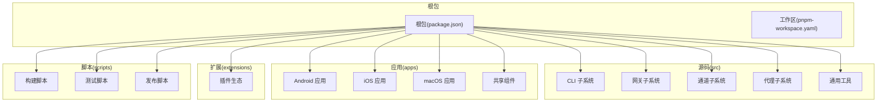
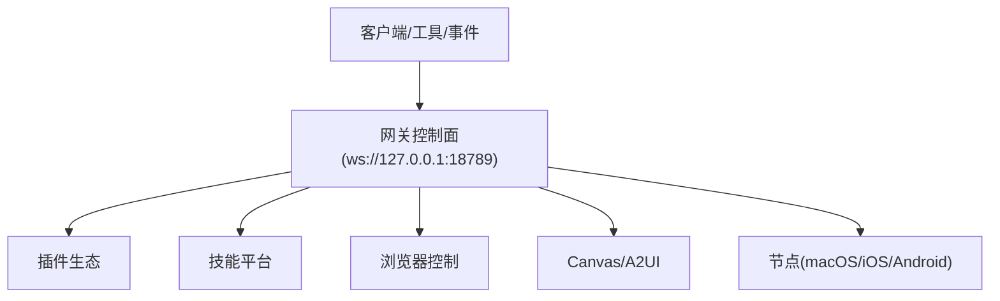
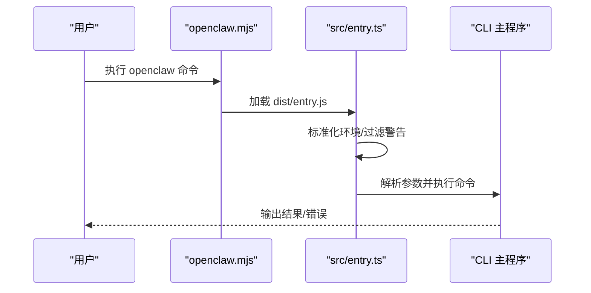
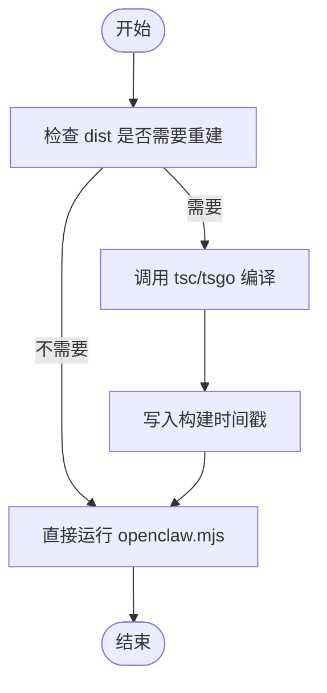
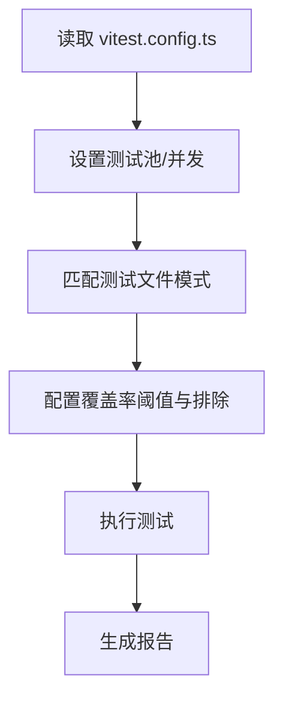
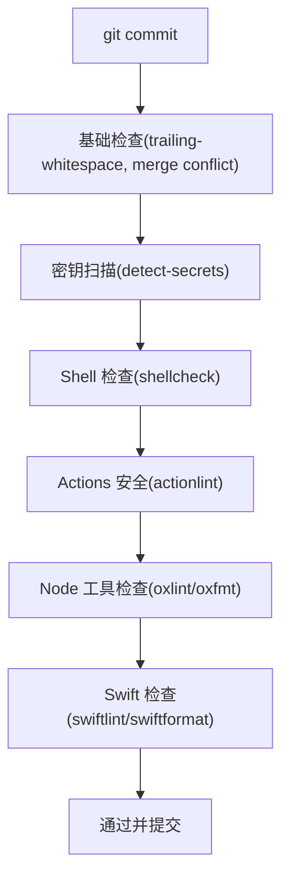
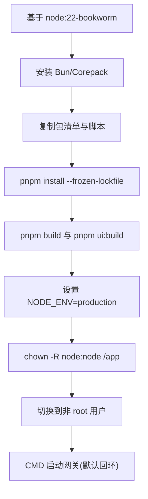
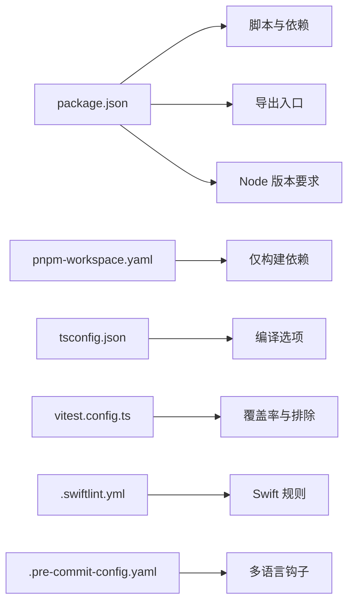

# 开发者指南

## 目录
1. [简介](#简介)
2. [项目结构](#项目结构)
3. [核心组件](#核心组件)
4. [架构总览](#架构总览)
5. [详细组件分析](#详细组件分析)
6. [依赖关系分析](#依赖关系分析)
7. [性能考虑](#性能考虑)
8. [故障排除指南](#故障排除指南)
9. [结论](#结论)
10. [附录](#附录)

## 简介
OpenClaw 是一个可在本地设备上运行的个人 AI 助手，支持多渠道消息（如 WhatsApp、Telegram、Slack、Discord、Google Chat、Signal、iMessage、Microsoft Teams、WebChat 等），并提供跨平台应用与节点能力（macOS/iOS/Android）。本指南面向开发者，覆盖从环境搭建、代码贡献到构建与发布的完整流程，并提供调试、性能分析与问题排查建议。

## 项目结构
仓库采用多包工作区布局，核心目录包括：
- 根包与脚本：根级包定义、构建脚本、测试与打包配置
- 源码：src 目录下按功能域划分模块（CLI、网关、通道、工具等）
- 应用：apps 下包含 Android、iOS、macOS 及共享组件
- 扩展：extensions 目录提供插件生态
- 文档：docs 目录提供官方文档与多语言翻译
- 脚本：scripts 目录提供构建、测试、打包、协议生成等自动化脚本

## 核心组件
- CLI 入口与运行时：通过 `openclaw.mjs` 启动，入口逻辑在 `src/entry.ts` 中处理参数解析、环境标准化与进程警告过滤；最终调用 CLI 主程序。
- 网关与通道：网关作为控制平面，承载会话、事件、工具与通道路由；通道适配器负责与各消息平台对接。
- 插件与技能：插件生态通过 `extensions` 提供，技能通过 `skills` 目录管理。
- 构建与打包：基于 TypeScript 编译与打包脚本，配合 UI 构建与资源复制。
- 测试与覆盖率：使用 Vitest 进行单元测试与覆盖率统计，区分不同测试类型与排除范围。

## 架构总览
OpenClaw 的核心是“网关 WebSocket 控制面”，客户端、工具与事件在此汇聚；同时提供浏览器控制、Canvas/A2UI、语音唤醒与节点能力。容器化部署默认绑定回环地址以增强安全性。

## 详细组件分析

### CLI 启动流程
CLI 通过 `openclaw.mjs` 加载编译产物，再由 `src/entry.ts` 完成参数解析、环境标准化与进程警告抑制，随后调用 CLI 主程序执行命令。

### 开发环境自动构建与运行
`scripts/run-node.mjs` 实现了“增量构建 + 自动运行”的开发体验：检测源码与配置变更，决定是否重新编译，然后启动 CLI。

### 测试与覆盖率策略
Vitest 配置区分不同测试场景，设置超时、并发与覆盖率阈值，并对特定模块进行排除，确保核心逻辑得到充分验证。

### 代码质量与预提交钩子
项目通过 pre-commit 集成多种检查：文件格式、YAML/Shell/Actions 安全扫描、Node/TypeScript 格式与风格检查、SwiftLint/SwiftFormat 等。

### 容器化与安全基线
Dockerfile 使用 Node LTS 基础镜像，非 root 用户运行，支持可选的 APT 包安装与 UI 构建偏好，CMD 默认绑定回环地址并允许无配置启动。

## 依赖关系分析
- 包管理：根包 `package.json` 定义脚本、导出与依赖；`pnpm-workspace.yaml` 统一工作区与仅构建依赖列表。
- TypeScript：`tsconfig.json` 统一编译选项，严格模式与 NodeNext 模块解析。
- 测试：Vitest 配置包含覆盖率阈值与排除规则，CI 与本地一致。
- 平台与工具：SwiftLint/SwiftFormat 用于 Swift 代码质量；pre-commit 集成多语言检查。

## 性能考虑
- 构建与缓存：`run-node.mjs` 通过构建时间戳判断是否需要重建，减少不必要的编译开销。
- 并发测试：Vitest 在 CI 与本地根据 CPU 数量动态调整 worker 数量，提高测试吞吐。
- 覆盖率门槛：统一的覆盖率阈值有助于保持核心模块的测试质量。
- 容器安全与性能：非 root 用户运行降低逃逸风险；只读文件系统与能力裁剪进一步提升安全性。

## 故障排除指南
- 端口占用：CLI 提供端口可用性检查与错误描述，便于定位端口冲突。
- 运行时版本：确保 Node 版本满足最低要求，避免安全漏洞相关问题。
- 密钥扫描：使用 `detect-secrets` 基线扫描，避免将敏感信息提交。
- 预提交失败：检查 SwiftLint/SwiftFormat、oxlint/oxfmt 与 shellcheck 报错，按提示修复。
- 容器权限：遵循非 root 用户与只读文件系统建议，必要时限制容器能力。

## 结论
本指南提供了 OpenClaw 开发的全景视图：从环境搭建、贡献流程、代码质量到构建与发布，以及调试与安全最佳实践。建议开发者优先阅读 README 的开发通道与快速开始部分，结合 CONTRIBUTING 的贡献流程与 SECURITY 的安全策略开展工作。

## 附录

### 开发环境搭建
- 运行时：Node ≥22（推荐 LTS）
- 包管理：pnpm（推荐）或 bun
- Swift 工具：swiftlint、swiftformat（macOS/iOS 相关）

### 代码贡献流程
- 讨论先行：新特性与架构变更先发起讨论或在 Discord 交流
- 提交规范：聚焦单一目标、描述“做了什么/为什么”
- 测试要求：本地自测与 CI 脚本一致（build、check、test）
- AI 协作：AI 辅助 PR 需标注程度与测试情况

### 构建与打包
- 根包脚本：build、ui:build、prepack、protocol:gen 等
- TypeScript：`tsconfig.json` 统一编译目标与严格模式
- Docker：Dockerfile 提供生产镜像构建与运行建议

### 测试策略
- 单元测试：Vitest 配置、覆盖率阈值与排除规则
- 端到端与实时测试：通过独立脚本与环境变量启用
- 并发与超时：根据平台与 CI 条件动态调整

### 安全与合规
- Node 版本安全：遵循最低版本要求与已知漏洞修复
- 容器安全：非 root 用户、只读文件系统、能力裁剪
- 密钥扫描：`detect-secrets` 基线与提交前扫描