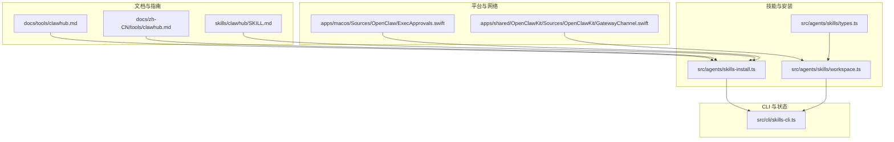
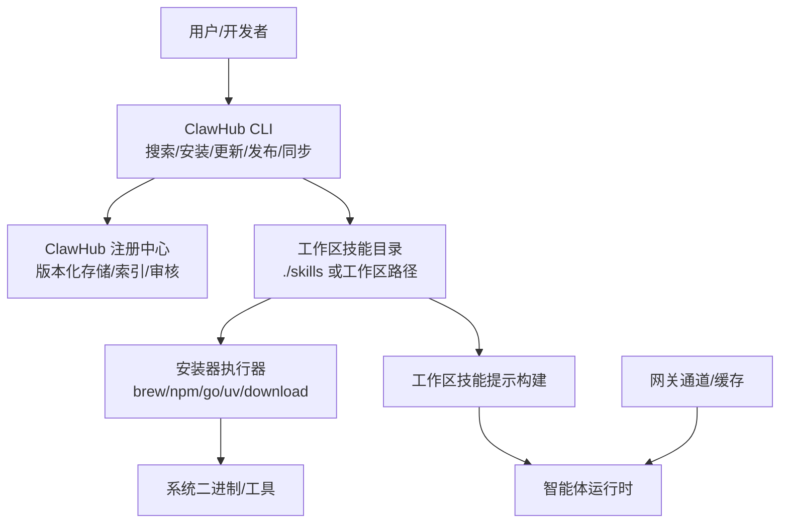
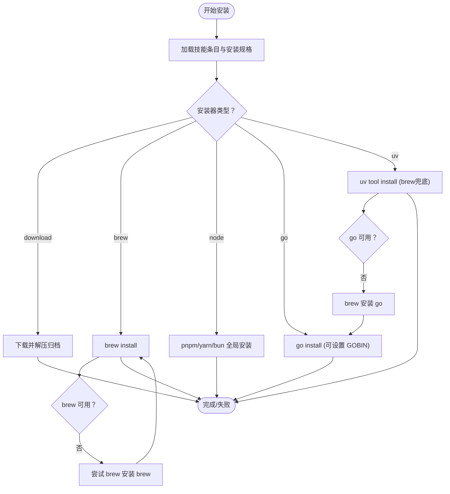
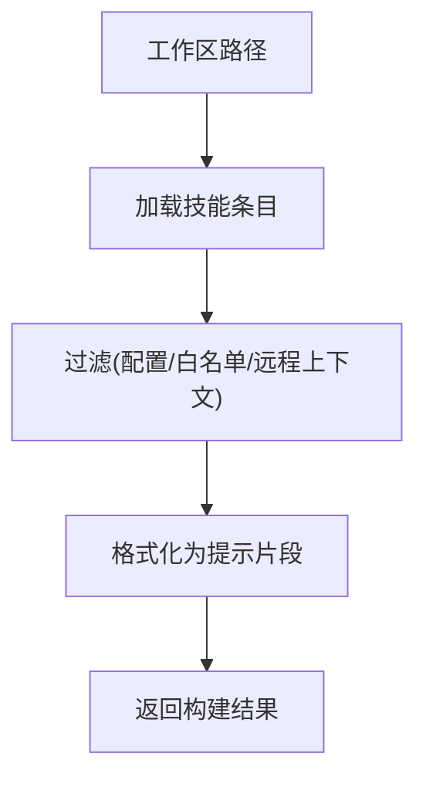
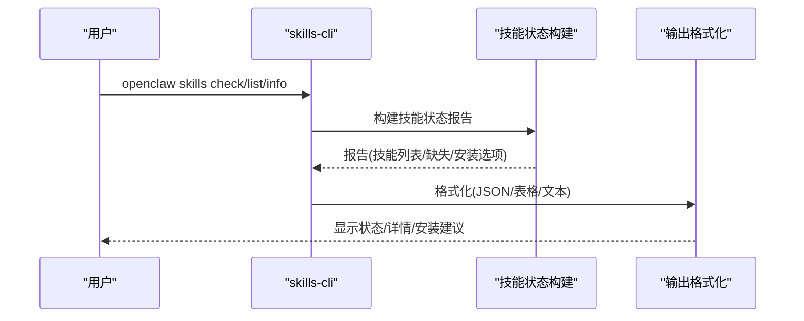
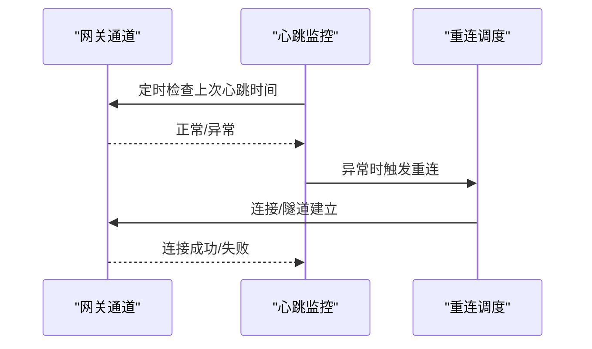
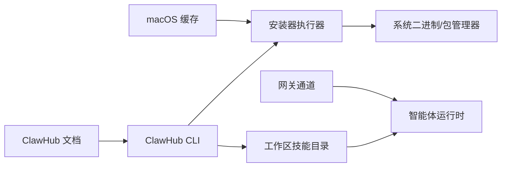

# ClawHub 集成

## 目录
1. [引言](#引言)
2. [项目结构](#项目结构)
3. [核心组件](#核心组件)
4. [架构总览](#架构总览)
5. [详细组件分析](#详细组件分析)
6. [依赖关系分析](#依赖关系分析)
7. [性能考量](#性能考量)
8. [故障排查指南](#故障排查指南)
9. [结论](#结论)
10. [附录](#附录)

## 引言
本文件面向集成 OpenClaw 与 ClawHub 的工程师与使用者，系统化阐述 ClawHub 的架构设计、服务发现与插件生态，深入说明技能安装流程、版本管理与依赖解析机制，解释与本地技能系统的同步策略、冲突处理与缓存管理，梳理技能搜索、推荐与分类体系，介绍评分与评价系统及社区互动机制，提供 ClawHub API 使用指南、认证机制与调用示例，涵盖技能发布流程、审核与质量保障，以及网络问题、同步延迟与错误恢复的最佳实践。

## 项目结构
围绕 ClawHub 集成的关键模块分布如下：
- 文档层：ClawHub 使用指南与 CLI 参数说明，覆盖安装、搜索、更新、发布、同步等常用工作流。
- 技能层：技能定义规范、前端元数据解析、安装器与下载器实现、工作区技能构建与过滤。
- CLI 层：技能状态检查、列表与详情输出、安装请求执行。
- 平台层：macOS 与通用网关通道的缓存与重连机制，保障网络稳定性。
- 展示与背景：社区案例与品牌故事，帮助理解使用场景与最佳实践。

## 核心组件
- 技能注册中心与 CLI：提供公共技能注册、版本化存储、语义搜索、下载、星评与审核能力，CLI 支持搜索、安装、更新、发布与同步。
- 技能安装与依赖解析：根据 SKILL.md 元数据与安装规格，选择 `brew`/`npm`/`go`/`uv`/`download` 等安装器，解析二进制、环境变量、操作系统与可选依赖。
- 工作区技能构建与过滤：按优先级与可用性筛选技能，生成提示词，支持远程执行上下文与允许清单控制。
- CLI 技能状态检查：汇总技能就绪状态、缺失需求与安装选项，便于诊断与修复。
- 平台缓存与网络恢复：macOS 缓存技能二进制集合，网关通道心跳与指数退避重连，提升稳定性。

## 架构总览
ClawHub 集成由“文档指引 + 技能定义 + 安装执行 + 状态检查 + 平台健壮性”五部分协同构成，形成从“发现/安装/更新/发布/同步”的闭环。

## 详细组件分析

### 组件 A：技能安装与依赖解析
- 安装规格解析：从 SKILL.md 解析 `metadata.openclaw.install` 列表，支持 `id`/`label`/`bins`/`os`/`formula`/`package`/`module`/`url`/`archive`/`extract`/`stripComponents`/`targetDir` 等字段。
- 安装器选择：`brew`、`node`(`pnpm`/`yarn`/`bun`)、`go`、`uv`、`download` 分支，分别构建命令或下载解压。
- 二进制与环境：校验 PATH 中二进制是否存在，必要时通过 `brew` 安装缺失工具，GOBIN 指向 Homebrew bin 目录。
- 错误摘要：对 stdout/stderr 提取首条错误行，限制长度，便于 CLI 输出与日志定位。

### 组件 B：工作区技能构建与过滤
- 技能过滤：支持按配置、技能名白名单与远程执行上下文过滤，仅保留可执行技能。
- 提示构建：将可执行技能格式化为提示片段，结合远程执行备注，供智能体运行时使用。
- 类型定义：`SkillEntry`/`SkillEligibilityContext`/`SkillSnapshot` 等类型支撑过滤与提示生成。

### 组件 C：CLI 技能状态检查与输出
- 状态汇总：统计总技能数、就绪、禁用、被允许清单阻断、缺失需求。
- 详情输出：支持 JSON 与人类可读格式，展示要求项、安装选项与路径信息。
- 交互提示：在无技能或空过滤时给出建议，引导使用 `npx clawhub`。

### 组件 D：平台缓存与网络恢复
- macOS 技能二进制缓存：定期刷新技能所需二进制集合，避免频繁查询网关状态。
- 网关通道心跳与重连：检测心跳缺失自动触发重连，指数退避避免风暴，支持本地/远程模式隧道。

## 依赖关系分析
- 文档与 CLI：ClawHub 使用文档定义 CLI 命令、参数与环境变量，CLI 依据文档约定与工作区路径执行安装与同步。
- 安装器与系统：安装器依赖系统二进制与包管理器，必要时通过 `brew` 安装缺失工具，确保 GOBIN 指向正确路径。
- 工作区与运行时：工作区技能经过滤与提示构建后注入智能体运行时，远程执行上下文影响可用性。
- 平台与网络：macOS 缓存减少频繁查询，网关通道心跳与重连保障连接稳定。

## 性能考量
- 并发与批处理：同步命令支持并发检查注册中心，合理设置并发度以平衡速度与资源占用。
- 缓存与去抖：macOS 技能二进制缓存与网关通道心跳减少重复请求与抖动。
- 超时与重试：安装命令与下载过程设置超时上限，网络异常时通过指数退避重连。
- 输出截断：安装失败摘要与长输出截断，避免日志膨胀与渲染卡顿。

[本节为通用指导，无需特定文件引用]

## 故障排查指南
- 安装失败诊断：CLI 会提取 stderr/stdout 中的首条错误行并截断，结合安装器类型与缺失二进制列表定位问题。
- 缺失需求检查：使用 `skills check/list/info` 查看 `bins`/`anyBins`/`env`/`config`/`os` 缺失项，按需安装或调整配置。
- 网络不稳定：网关通道检测心跳缺失后自动重连，指数退避降低峰值压力；必要时切换本地/远程模式。
- 缓存过期：macOS 缓存每 90 秒刷新一次，强制刷新可绕过陈旧状态。

## 结论
ClawHub 集成以“文档驱动 + 元数据解析 + 多安装器 + 工作区构建 + 平台健壮性”为核心，形成从发现到发布的完整闭环。通过标准化的 SKILL.md 与安装规格，配合 CLI 的状态检查与平台缓存/重连机制，既能满足快速迭代的开发需求，也能保障生产环境的稳定性与可观测性。

[本节为总结，无需特定文件引用]

## 附录

### 使用场景与最佳实践
- 快速发现与安装：使用 `npx clawhub` 搜索并安装技能，随后启动新会话使技能生效。
- 批量同步与备份：使用 `sync --all` 将本地技能扫描并发布到注册中心，实现版本化备份。
- 安全与合规：第三方技能视为不可信代码，优先沙箱运行；敏感配置与密钥避免泄露到提示词与日志。
- 社区协作：通过星评与评论反馈技能质量，参与审核与举报，共同维护生态健康。

### 技能发布与审核
- 发布流程：使用 `publish` 指定路径、`slug`/`name`/`version`/`tags`/`changelog`，创建新版本并索引。
- 审核与举报：注册用户可举报滥用或不安全技能；超过阈值自动隐藏；管理员可查看、取消隐藏、删除或封禁。
- 质量保障：变更日志与标签管理，支持回滚；telemetry 可关闭以保护隐私。

### API 使用指南与认证
- CLI 友好 API：支持浏览器登录与令牌登录，`whoami`/`logout` 等命令便于自动化与脚本集成。
- 环境变量：支持覆盖站点、注册中心、配置路径、工作目录与遥测开关。
- 调用示例：参考文档中的搜索、安装、更新、发布与同步命令，结合 `--no-input` 实现非交互式自动化。

### 社区案例与品牌背景
- 展示案例：涵盖自动化、知识记忆、语音电话、基础设施部署、家庭硬件控制等多个方向，体现生态多样性。
- 品牌故事：OpenClaw 的起源与三次“脱壳”（Molting），强调开源、开放与持续演进的品牌精神。