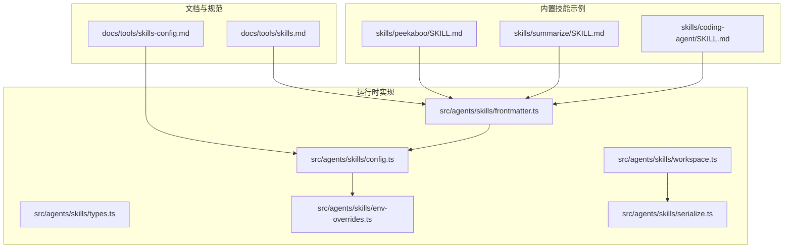
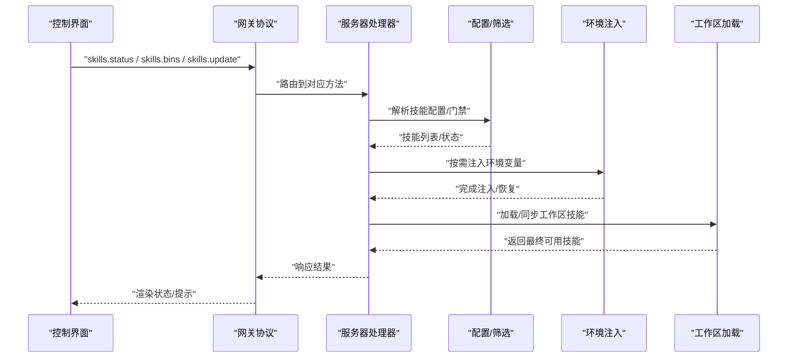
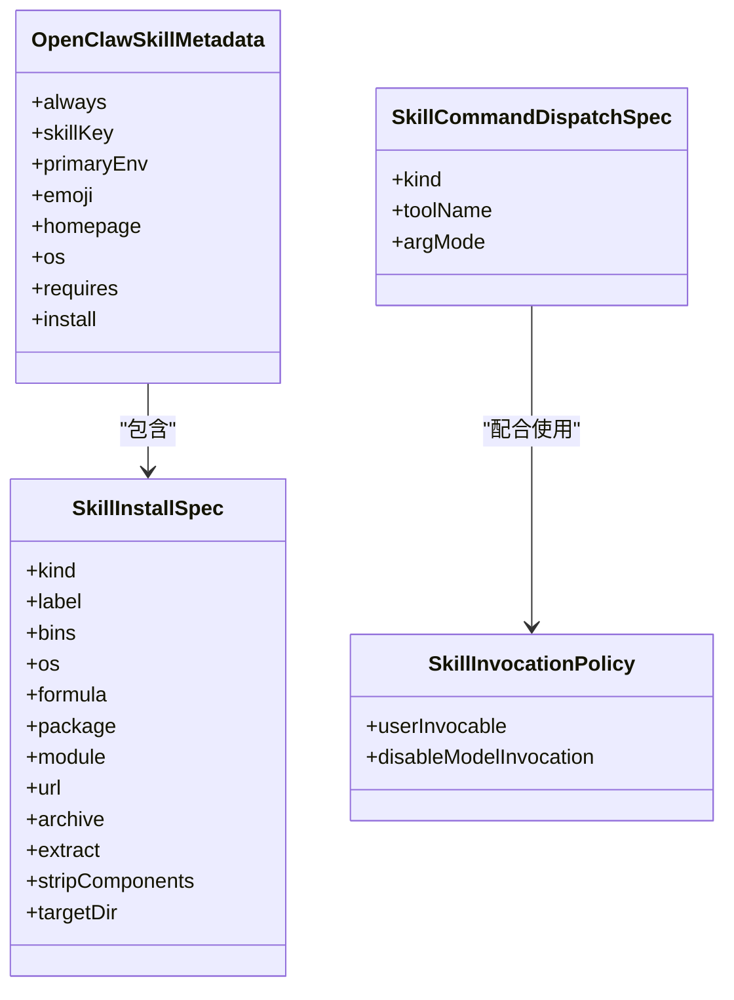
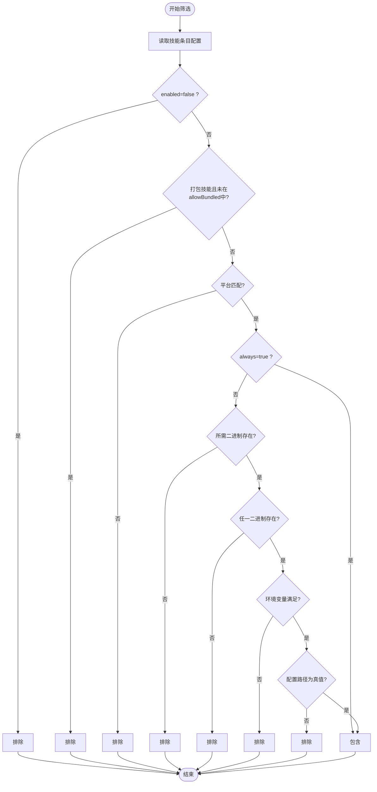
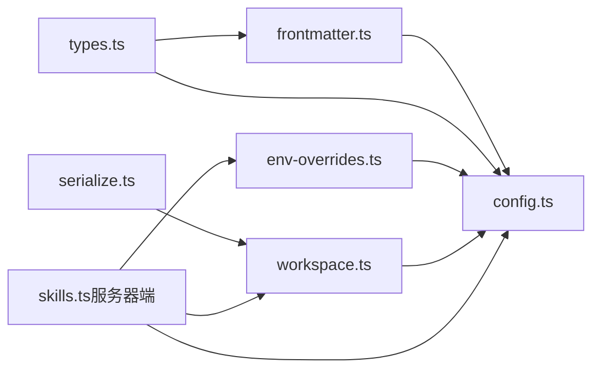

# 内置技能系统

## 目录
1. [简介](#简介)
2. [项目结构](#项目结构)
3. [核心组件](#核心组件)
4. [架构总览](#架构总览)
5. [详细组件分析](#详细组件分析)
6. [依赖分析](#依赖分析)
7. [性能考虑](#性能考虑)
8. [故障排除指南](#故障排除指南)
9. [结论](#结论)
10. [附录](#附录)

## 简介
OpenClaw 的内置技能系统基于“技能即 Markdown + 前言元数据”的轻量规范，结合运行时的动态筛选、环境注入与远程节点能力探测，为代理提供可组合、可扩展、可安全控制的工具调用能力。技能目录通过三类来源合并：打包内置技能、用户托管技能（~/.openclaw/skills）、以及工作区专属技能（`<workspace>`/skills）。系统在加载时根据二进制、环境变量、配置项与平台进行“门禁”过滤，并支持按需安装与热更新。

## 项目结构
- 技能规范与文档
  - 技能规范与加载顺序、门禁规则、环境注入、远程节点与监视器等说明见工具文档。
- 技能实现样例
  - 内置技能目录包含大量真实技能示例，如 Peekaboo（macOS UI 自动化）、Summarize（内容摘要/转录）、Coding-Agent（交互式代码代理）等。
- 运行时实现
  - 类型定义、前言解析、配置筛选、环境注入、工作区加载与同步、并发序列化、协议与 UI 集成等。

## 核心组件
- 技能类型与元数据
  - 定义技能安装规格、元数据字段（平台、依赖、安装器、主密钥环境变量等）、调用策略、命令分发等。
- 前言解析
  - 解析 SKILL.md 的 YAML/JSON5 前言，提取元数据与调用策略，支持兼容旧键名。
- 配置与筛选
  - 从全局配置中解析技能条目，按启用状态、平台、二进制、环境变量、配置路径进行门禁过滤。
- 环境注入
  - 在单次会话运行开始时注入环境变量与主密钥，结束后恢复原环境，避免全局污染。
- 工作区加载与同步
  - 支持多来源技能合并（工作区 > 托管 > 打包），并提供并发序列化与复制到沙箱的能力。
- 协议与 UI
  - 提供 skills.status、skills.bins、skills.update 等方法；UI 展示技能状态、过滤与编辑。

## 架构总览
下图展示了从 UI 到网关再到技能运行的端到端流程，包括状态查询、安装、更新与环境注入。

## 详细组件分析

### 组件 A：技能类型与元数据（类型定义）
- 关键点
  - 安装规格：brew/node/go/uv/download 多种安装器，支持目标二进制、平台过滤、归档解压等。
  - 元数据：always、skillKey、primaryEnv、os、requires（bins/anyBins/env/config/install）。
  - 调用策略：是否允许用户触发、是否禁止模型自动调用。
  - 命令分发：将用户命令直接派发给工具，绕过模型。
- 输入输出
  - 输入：SKILL.md 前言（YAML/JSON5）。
  - 输出：OpenClawSkillMetadata、SkillInvocationPolicy、SkillCommandDispatchSpec。
- 依赖关系
  - 依赖 frontmatter 解析与兼容键名映射。

### 组件 B：前言解析与兼容性
- 关键点
  - 支持单行 JSON 对象的 metadata 字段，兼容旧键名。
  - 解析安装器数组、平台列表、依赖清单与可选元数据。
  - 提取调用策略（用户可触发、禁用模型调用）。
- 输入输出
  - 输入：SKILL.md 内容字符串。
  - 输出：ParsedSkillFrontmatter、OpenClawSkillMetadata、SkillInvocationPolicy。
- 错误处理
  - 解析失败时返回空值，不中断整体流程。

### 组件 C：配置解析与技能门禁筛选
- 关键点
  - 从配置中解析技能条目（enabled/env/apiKey）。
  - 门禁规则：平台匹配、always 强制、二进制存在（本地+远程）、任一二进制满足、环境变量存在或可由配置提供、配置路径为真值。
  - 允许打包技能白名单（仅对打包技能生效）。
- 输入输出
  - 输入：SkillEntry、OpenClawConfig、可选远程平台信息。
  - 输出：布尔值（是否包含该技能）。
- 并发与稳定性
  - 使用 serializeByKey 对工作区同步进行串行化，避免竞态。

### 组件 D：环境变量注入与恢复
- 关键点
  - 在会话开始时应用技能配置中的 env 与 apiKey（若进程未设置），结束后恢复原环境。
  - 沙箱模式下不继承宿主机环境，需通过沙箱镜像或 docker.env 注入。
- 输入输出
  - 输入：技能快照/条目、OpenClawConfig。
  - 输出：回滚函数（用于恢复）。
- 注意
  - 仅对宿主机运行生效；沙箱内需另行配置。

### 组件 E：工作区技能加载与同步
- 关键点
  - 合并来源优先级：工作区技能 > 托管技能 > 打包技能；额外目录最低优先级。
  - 支持将已筛选技能复制到目标工作区，便于沙箱执行。
  - 并发序列化确保同一目标目录的同步串行化。
- 输入输出
  - 输入：源工作区、目标工作区、配置、目录路径。
  - 输出：技能条目列表、命令规范、状态报告。

### 组件 F：协议与 UI 集成
- 关键点
  - 网关提供 skills.status、skills.bins、skills.update 等方法，参数与返回值均有类型校验。
  - UI 支持刷新、过滤、切换启用状态、编辑环境变量、触发安装等。
- 输入输出
  - 参数：名称、安装 ID、超时、启用开关、API Key、环境变量等。
  - 返回：状态报告、可用二进制集合、更新后的配置。

### 组件 G：内置技能示例与使用场景
- Peekaboo（macOS UI 自动化）
  - 适用场景：屏幕截图、元素定位、点击/输入、窗口/应用管理、菜单栏/Dock 操作。
  - 依赖：仅 macOS；需要 Screen Recording/Accessibility 权限；二进制 peekaboo 可用。
  - 配置要点：metadata.openclaw.requires.bins=["peekaboo"]；可提供安装器。
- Summarize（内容摘要/转录）
  - 适用场景：链接/视频/文件摘要、YouTube 转录、文本抽取。
  - 依赖：二进制 summarize；支持多种模型与 API Key（OPENAI/ANTHROPIC/XAI/GOOGLE）。
  - 配置要点：metadata.openclaw.requires.bins=["summarize"]；可通过 apiKey 注入主密钥。
- Coding-Agent（交互式代码代理）
  - 适用场景：Codex/Claude Code/OpenCode/Pi 的交互式任务执行。
  - 依赖：至少一个代理二进制（claude/codex/opencode/pi）；需要 PTY。
  - 配置要点：anyBins 至少一个；注意背景模式与 PTY 必须开启。

## 依赖分析
- 组件耦合
  - frontmatter.ts 依赖类型定义与兼容键名；config.ts 依赖 frontmatter.ts 与配置对象；env-overrides.ts 依赖 config.ts 与类型；workspace.ts 依赖 config.ts 与 serialize.ts。
- 外部依赖
  - Node.js 文件系统与 PATH 探测；JSON5 解析；TypeBox Schema（网关协议）。
- 循环依赖
  - 当前模块间无循环导入迹象，职责清晰。

## 性能考虑
- Prompt 成本
  - 技能列表注入到系统提示词的成本是确定性的：基础开销约 195 字符，每技能约 97 字符 + 字段长度（XML 转义后更长）。
  - 建议：减少不必要的技能暴露，合理使用 allowBundled 与 enabled 控制。
- 加载与筛选
  - 门禁检查涉及 PATH 遍历与远程节点探测，尽量避免在每次请求都触发昂贵操作；利用会话快照复用。
- 并发与 IO
  - 工作区同步使用 serializeByKey 串行化，避免多次复制冲突；批量安装/更新时合并请求。
- 沙箱
  - 沙箱内二进制需预装，避免运行时安装带来的延迟与网络开销。

## 故障排除指南
- 技能不可用
  - 检查 enabled、allowBundled、平台匹配、二进制是否存在、环境变量是否就绪、配置路径是否为真值。
  - 若在沙箱中运行，确认二进制已在容器内安装。
- 环境变量未生效
  - 确认未被进程已有变量覆盖；沙箱模式下需通过 docker.env 或自定义镜像注入。
- 远程节点能力缺失
  - 确认节点已连接且具备所需二进制；若节点离线，相关技能仍可见但可能无法调用。
- 安装与更新
  - 使用 skills.update 更新 apiKey/env；使用 UI/CLI 触发安装；注意安装器平台过滤与偏好。
- 重试与超时
  - 对外服务调用可采用统一重试策略（指数退避+抖动），并设置最大重试次数与最大延迟。

## 结论
OpenClaw 的内置技能系统以简洁的规范与强大的运行时能力相结合，实现了从“可发现、可筛选、可安装、可注入、可同步”的全链路管理。通过明确的门禁规则、环境隔离与 UI/协议支撑，既能满足日常自动化需求，也能在复杂场景（多代理、远程节点、沙箱）下保持稳定与可控。

## 附录

### API 方法与参数概览
- skills.status
  - 功能：返回当前工作区技能状态报告。
  - 参数：无。
  - 返回：状态报告（含技能名称、描述、来源、是否可用、缺失原因等）。
- skills.bins
  - 功能：列出所有工作区已解析技能声明的二进制集合。
  - 参数：无。
  - 返回：二进制名称数组。
- skills.update
  - 功能：更新单个技能的启用状态、API Key、环境变量。
  - 参数：skillKey、enabled、apiKey、env。
  - 返回：更新后的配置与成功标记。

### 最佳实践
- 合理使用 allowBundled 与 enabled 控制技能暴露范围。
- 将敏感 API Key 通过 apiKey 字段注入，避免硬编码到提示词。
- 在沙箱环境中预置二进制与依赖，减少运行时安装。
- 使用 UI 的过滤与刷新功能快速定位问题技能。
- 对于远程节点，确保其具备所需二进制并在节点可用时再启用相关技能。