# 娱乐与实用工具技能

## 目录
1. [简介](#简介)
2. [项目结构](#项目结构)
3. [核心组件](#核心组件)
4. [架构总览](#架构总览)
5. [详细组件分析](#详细组件分析)
6. [依赖关系分析](#依赖关系分析)
7. [性能考虑](#性能考虑)
8. [故障排除指南](#故障排除指南)
9. [结论](#结论)
10. [附录](#附录)

## 简介
本文件面向 OpenClaw 的“娱乐与实用工具技能”，系统梳理天气查询、音乐播放、游戏管理、外卖订购、地点搜索、家居智能、媒体分析、语音通话、系统自动化、社交平台、动图搜索等日常实用功能。内容覆盖：
- 数据来源与 API 集成方式（如 wttr.in、Open-Meteo、Spotify、Sonos、Google Places、OpenHue、Twilio 等）
- 实时更新机制与离线能力（缓存、超时、重试、降级）
- 用户偏好与个性化（基于环境变量、配置项、会话快照）
- 技能配置的灵活性与可定制化（安装器、前置条件、作用域）
- 隐私与安全（敏感信息注入、沙箱、权限模型）

## 项目结构
OpenClaw 采用“网关控制平面 + 多客户端 + 技能生态”的架构。技能以独立目录形式存在，通过 `SKILL.md` 描述能力、前置条件与安装方式；网关负责加载、筛选与执行技能。

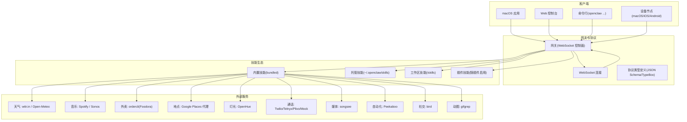

## 核心组件
- 网关与协议：统一的 WebSocket 控制面，承载会话、事件与工具调用；支持设备配对、远程访问与安全策略。
- 客户端：macOS 应用、Web 控制台、命令行、设备节点，均通过同一协议接入。
- 技能体系：遵循 AgentSkills 规范，通过 `SKILL.md` 声明能力、前置条件、安装器与 UI 元数据；支持多级优先级与热重载。
- 工具与缓存：通用网络工具包含超时控制、响应读取与缓存写入；具备网络异常识别与降级策略。

## 架构总览
下图展示从用户交互到技能执行与外部服务调用的关键路径，以及错误处理与缓存策略的落地位置。

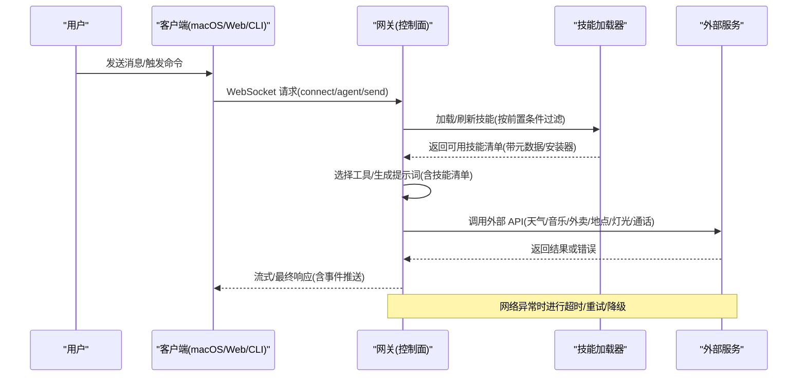

## 详细组件分析

### 天气查询技能(weather)
- 数据来源
  - 主要：wttr.in（无需 API Key，支持多种格式与单位切换）
  - 备用：Open-Meteo（免费，适合程序化使用，返回 JSON）
- 实时更新机制
  - 支持紧凑格式与完整预报；URL 参数可控制输出字段与单位
  - 可通过 PNG 导出天气图像
- 使用建议
  - 优先使用 wttr.in 获取快速概览；需要结构化数据时改用 Open-Meteo
  - 注意 URL 编码空格与机场三字码

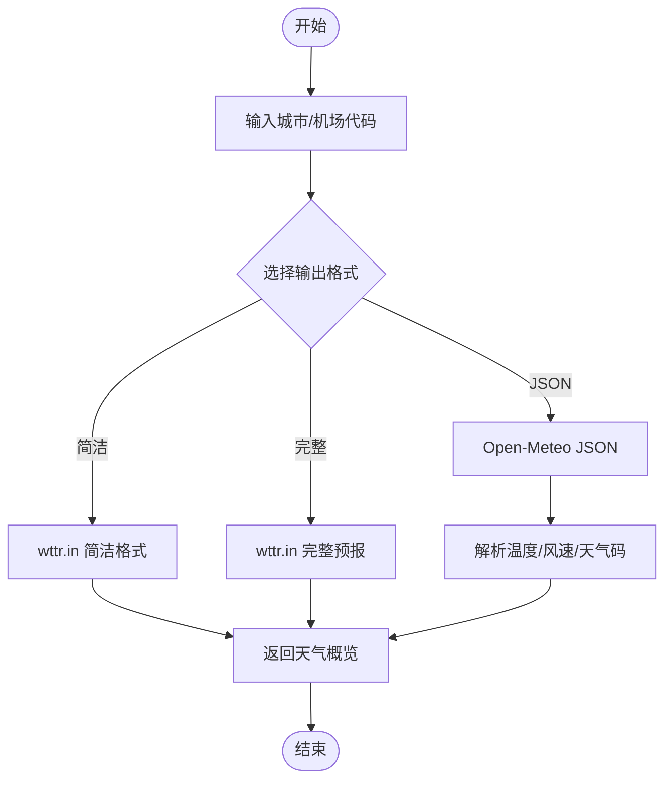

### 音乐播放技能(spotify-player)
- 数据来源
  - Spotify（需 Premium 账号）
  - 推荐使用 spogo（首选），回退到 spotify_player
- 实时更新机制
  - 设备发现与切换、播放控制、状态查询
  - 支持导入浏览器 Cookie 完成认证
- 使用建议
  - 配置用户 `client_id` 以启用 Spotify Connect
  - 使用 TUI 快捷键提升交互效率

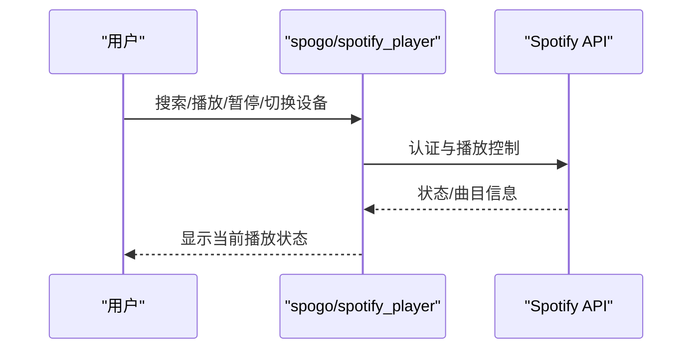

### 游戏管理技能(gog)
- 数据来源
  - Google Workspace（Gmail/日历/驱动/联系人/表格/文档）
  - 需 OAuth 设置，支持多服务授权
- 实时更新机制
  - 邮件搜索、发送、草稿、回复；日历事件增删改查；驱动与文档操作
- 使用建议
  - 使用 `--json` 与 `--no-input` 提升脚本友好度
  - 通过 `GOG_ACCOUNT` 环境变量避免重复指定账户

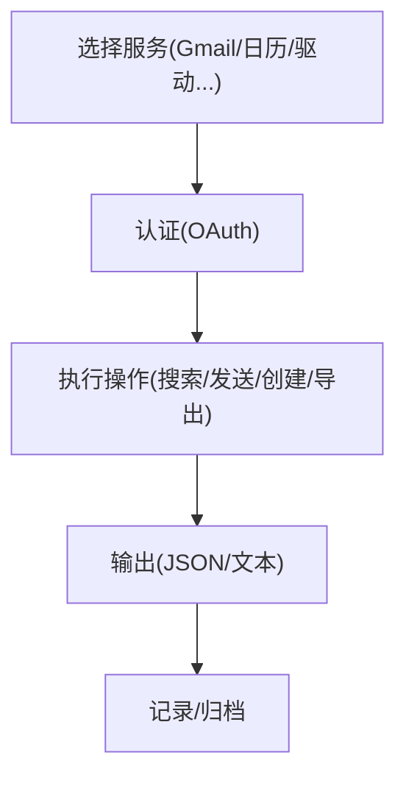

### 外卖订购技能(food-order)
- 数据来源
  - Foodora（通过 ordercli）
- 实时更新机制
  - 历史订单查询、预览重购、确认下单、实时跟踪
- 安全规则
  - 未显式确认不执行 `--confirm`；支持抛错与安全测试配置

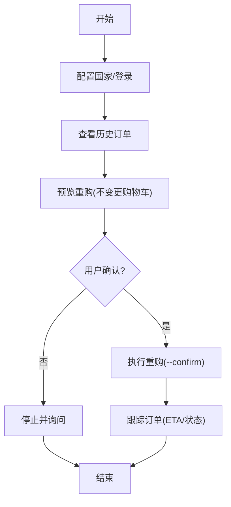

### 地点搜索技能(local-places)
- 数据来源
  - Google Places API 本地代理（uv + 环境变量 `GOOGLE_PLACES_API_KEY`）
- 实时更新机制
  - 两步流程：先解析位置，再搜索；支持分页令牌(`next_page_token`)
- 使用建议
  - 限制结果数量与位置偏差半径；按类型/评分/营业状态筛选

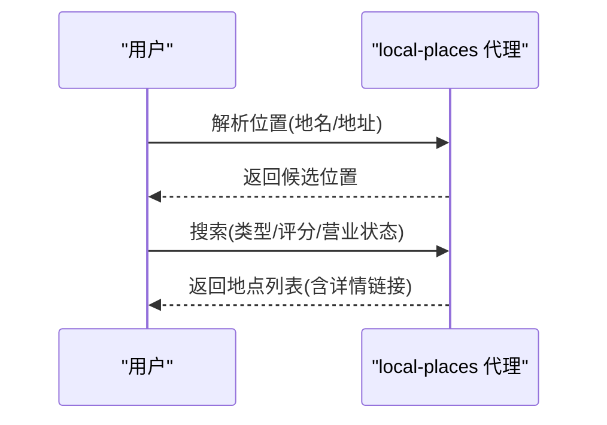

### 家居智能技能(openhue)
- 数据来源
  - OpenHue CLI（Philips Hue）
- 实时更新机制
  - 发现桥接、设置、读取灯光/房间/场景
- 使用建议
  - 首次运行需按压 Hue 桥按钮完成配对；可通过房间参数避免名称冲突

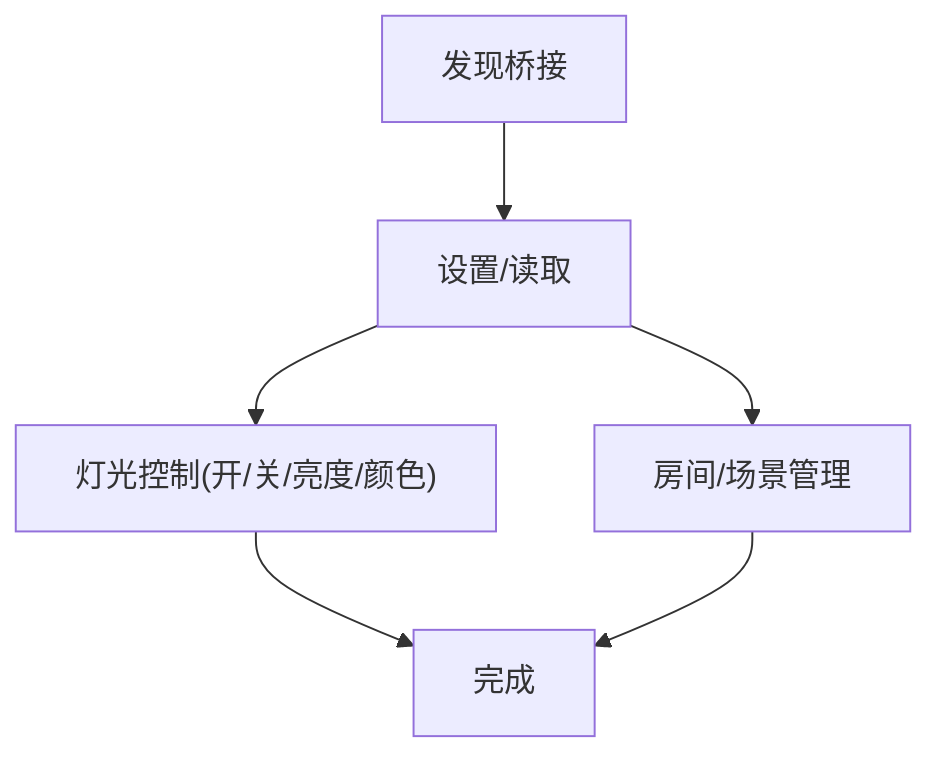

### 媒体分析技能(songsee)
- 数据来源
  - 音频文件（WAV/MP3 等），可选 ffmpeg 解码其他格式
- 实时更新机制
  - 生成频谱图/梅尔频谱/色度图/HPSS/自相似/响度/tempogram/MFCC/通量等可视化
- 使用建议
  - 支持时间切片与网格拼接（便于审阅与分享）

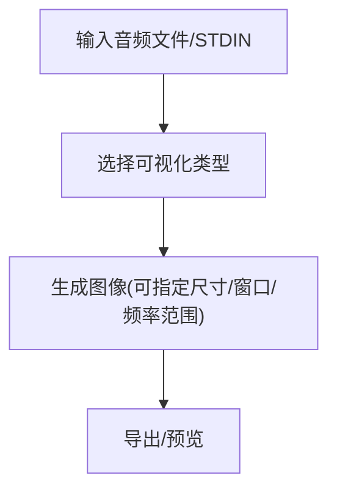

### 媒体播放技能(sonoscli)
- 数据来源
  - Sonos 本地网络设备
- 实时更新机制
  - 发现/状态/播放/音量/分组/收藏/队列；可选通过 SMAPI 搜索 Spotify
- 使用建议
  - 若 SSDP 失败，可直接指定 IP；Spotify Web API 搜索需客户端凭据

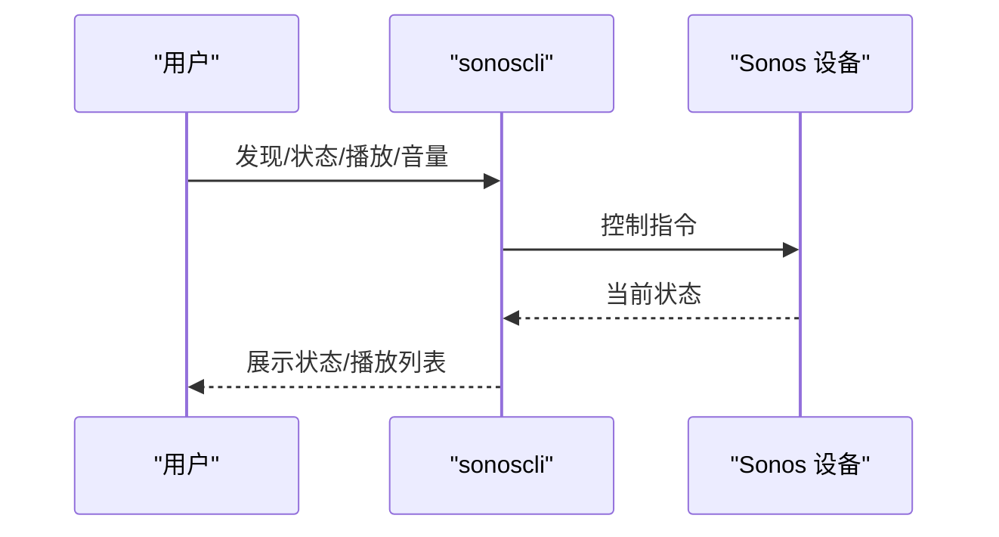

### 语音通话技能(voice-call)
- 数据来源
  - Twilio/Telnyx/Plivo 或 Mock 后端
- 实时更新机制
  - 发起/继续/播报/结束/查询通话状态
- 使用建议
  - 在网关配置中启用插件并设置提供商凭据；开发时可使用 mock

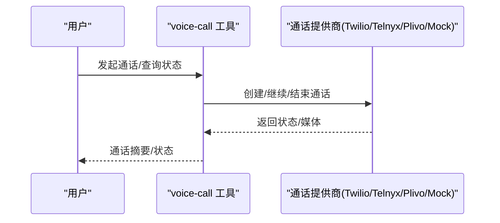

### 系统自动化技能(peekaboo)
- 数据来源
  - macOS 屏幕录制/无障碍权限下的 UI 自动化
- 实时更新机制
  - 截图/录屏/元素定位/输入/窗口/菜单/Dock/剪贴板/应用管理
- 使用建议
  - 首次运行检查权限；使用标注截图辅助目标识别

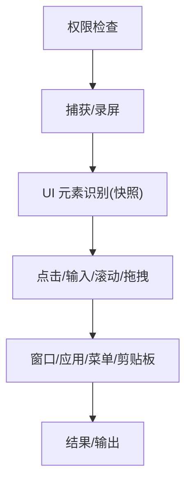

### 社交平台技能(bird)
- 数据来源
  - X/Twitter（GraphQL + Cookie 认证）
- 实时更新机制
  - 读取/搜索/新闻/趋势/书签/点赞/关注/发帖（谨慎发帖）
- 使用建议
  - 使用 `--auth-token`/`--ct0` 或浏览器 Cookie；必要时刷新查询 ID

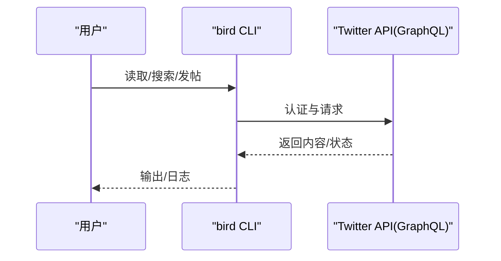

### 动图搜索技能(gifgrep)
- 数据来源
  - Tenor/Giphy（可选 `GIPHY_API_KEY`）
- 实时更新机制
  - 搜索/预览/下载/提取静帧/拼接图板
- 使用建议
  - 使用 `--thumbs` 在 Kitty/Ghostty 中预览；可强制软件动画

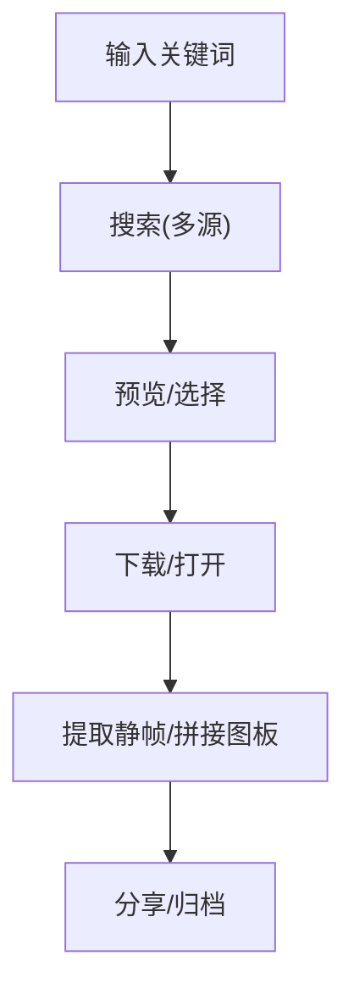

## 依赖关系分析
- 技能加载与前置条件
  - 通过 `metadata.openclaw.requres.bins`/`env`/`config` 决定是否加载
  - 支持 `anyBins` 至少满足其一；支持 `primaryEnv` 作为 `apiKey` 注入入口
- 安装器与平台
  - brew/node/go/uv/download 等安装器在 macOS Skills UI 中呈现
  - 平台过滤 `os` 字段，确保仅在兼容系统显示
- 运行时环境注入
  - 每次会话启动时注入技能所需 `env`/`apiKey`，结束后恢复原环境
- 远程节点与热重载
  - 支持监视 `SKILL.md` 变更热更新；远程 macOS 节点可按需扩展能力

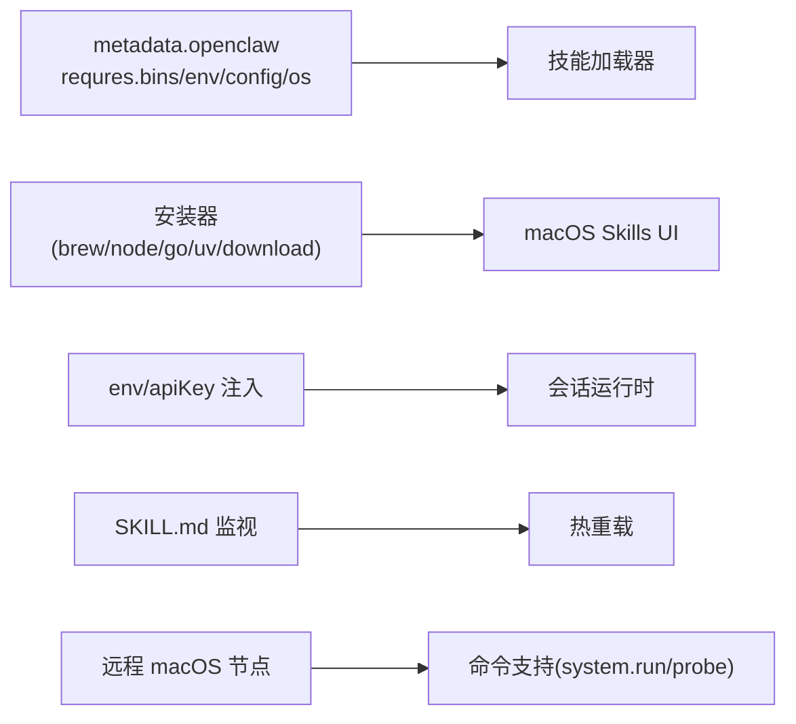

## 性能考虑
- 技能提示成本
  - 将可用技能注入系统提示词会产生确定性字符开销，影响 token 估算
- 缓存与超时
  - 通用网络工具提供 TTL 缓存与超时控制，避免频繁请求与阻塞
- 网络异常处理
  - 识别常见网络错误（如 ENOTFOUND/ECONNRESET/ETIMEDOUT）并进行降级或重试

## 故障排除指南
- 技能不可用
  - 检查 `metadata.openclaw.requres` 条件是否满足（二进制/环境变量/配置）
  - 确认安装器已正确安装对应工具
- 天气/地点/音乐等外部服务失败
  - 切换备用服务（如 wttr.in ↔ Open-Meteo；Spotify 回退）
  - 检查网络连通性与代理设置
- 外卖下单风险
  - 严格遵守“显式确认”规则；使用 throwaway 配置进行安全测试
- 通话/媒体/自动化
  - 确认提供商凭据与设备权限；必要时启用 mock 进行调试

## 结论
OpenClaw 的娱乐与实用工具技能通过标准化的 `SKILL.md` 描述与严格的前置条件校验，实现了对外部服务的即插即用与灵活组合。配合网关的统一协议、会话快照与热重载机制，既保证了易用性，也兼顾了安全性与可维护性。建议在生产环境中：
- 明确各技能的安装器与前置条件，确保部署一致性
- 对高风险操作（如下单、发帖、通话）实施显式确认与最小权限原则
- 合理利用缓存与超时策略，提升用户体验与系统稳定性

## 附录
- 配置参考与最佳实践
  - 技能开关、环境变量、API Key 注入与会话快照
  - 远程访问与安全策略（Tailscale/SSH/权限模型）
- 常见问题排查清单
  - 技能加载失败、网络异常、权限缺失、第三方服务限流