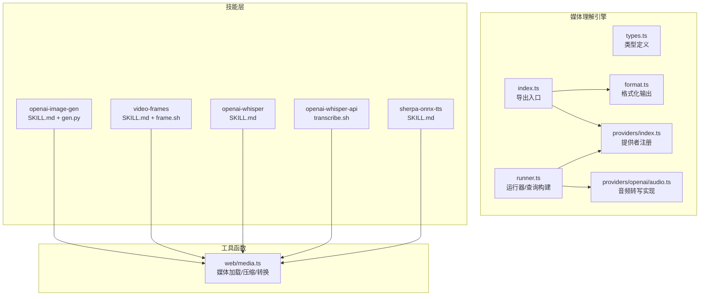
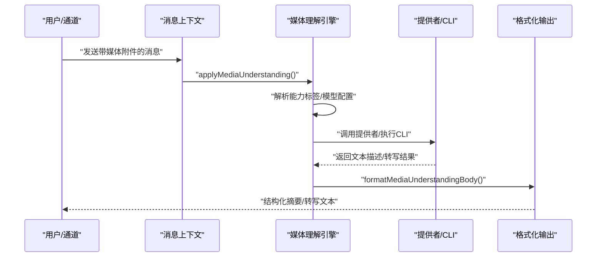
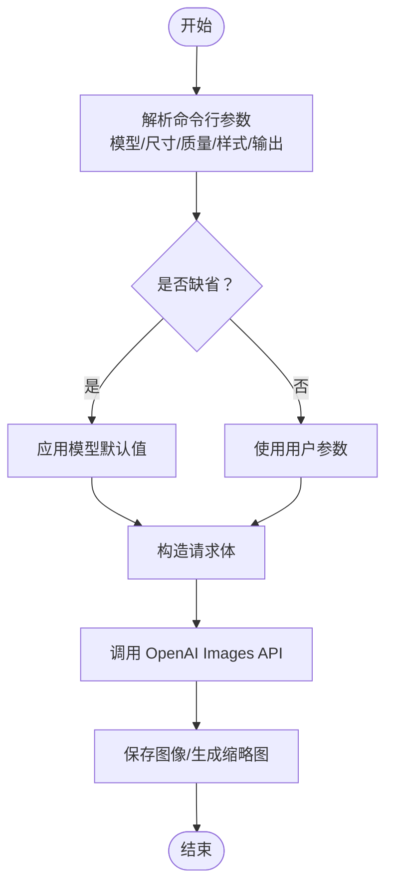
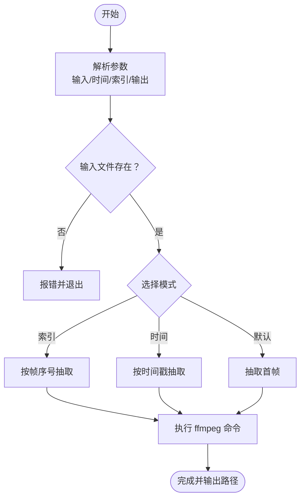
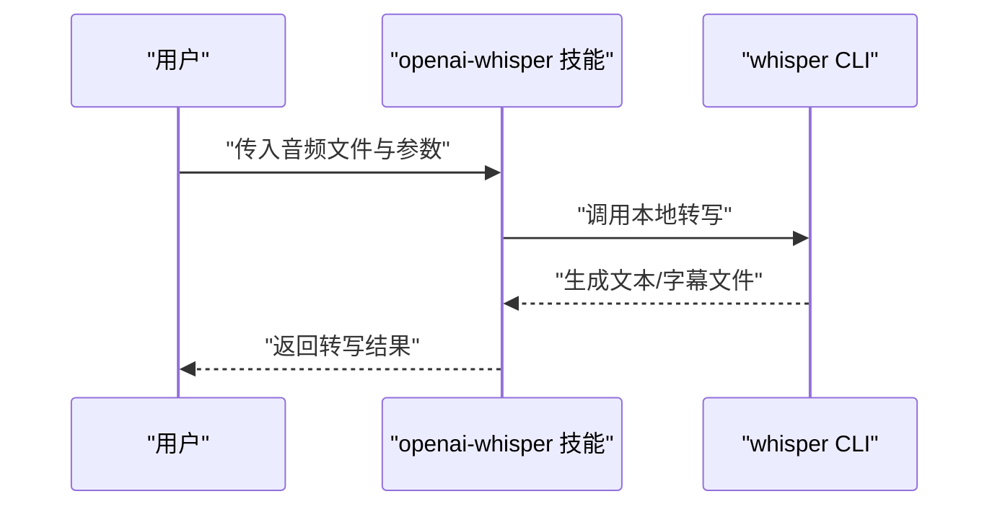
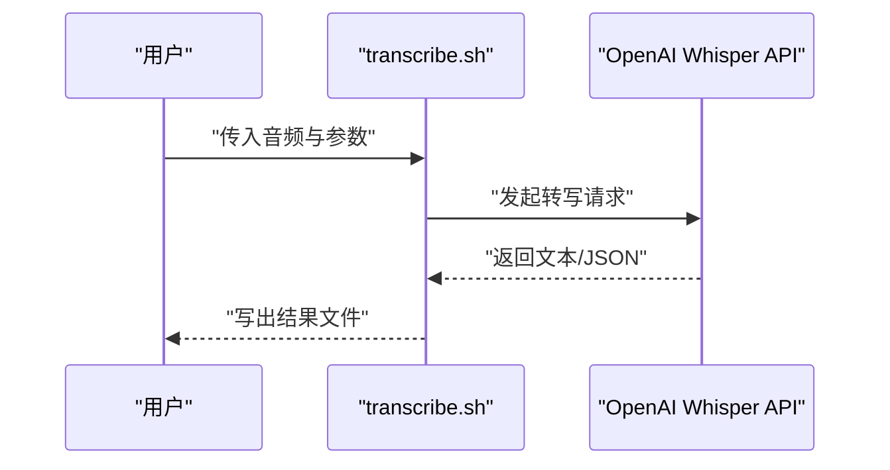
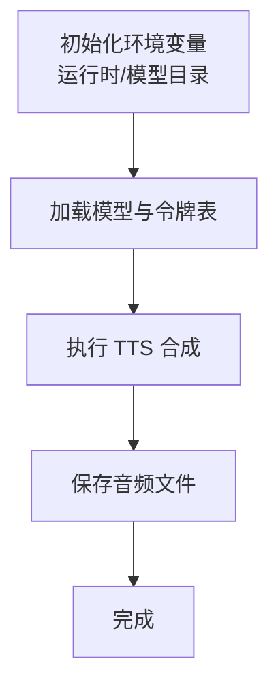
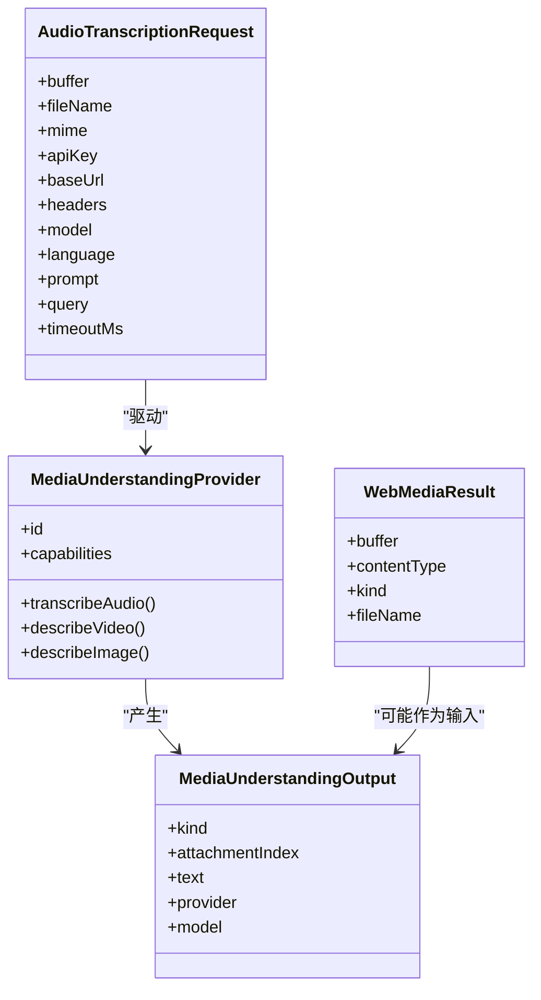
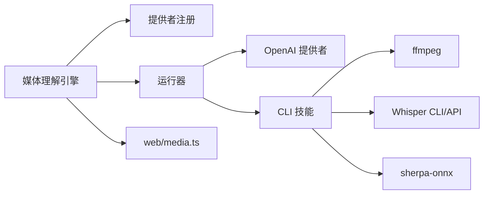

# 媒体处理技能

## 目录
1. [简介](#简介)
2. [项目结构](#项目结构)
3. [核心组件](#核心组件)
4. [架构总览](#架构总览)
5. [详细组件分析](#详细组件分析)
6. [依赖关系分析](#依赖关系分析)
7. [性能考量](#性能考量)
8. [故障排除指南](#故障排除指南)
9. [结论](#结论)
10. [附录](#附录)

## 简介
本文件系统性梳理 OpenClaw 的媒体处理能力，覆盖图像生成、视频帧提取、语音转文字（本地与云端）、文本转语音（离线）等技能，并结合代码实现解析技术原理、输入格式要求、输出质量控制、模型选择与参数调优、性能优化策略、预处理与后处理最佳实践，以及在不同场景下的应用建议与常见问题排查。

## 项目结构
媒体处理相关能力由“媒体理解引擎 + 技能层 + 工具函数”三层构成：
- 媒体理解引擎：统一抽象媒体理解的类型、格式化、提供者注册与运行器，负责按附件类型自动决策调用能力与模型。
- 技能层：以可插拔技能形式提供具体能力（如图像生成、视频帧提取、Whisper 本地转写、TTS 离线等），并给出安装与使用说明。
- 工具函数：网络媒体加载、图片压缩与格式转换、MIME 推断等通用能力。

## 核心组件
- 媒体理解类型体系：定义媒体类型、附件、输出、提供者接口与请求/结果结构，统一跨能力的数据契约。
- 提供者注册与发现：集中管理提供者能力与默认行为，支持覆盖与合并。
- 运行器与查询构建：根据配置与能力标签选择合适提供者，拼装请求参数（含语言、提示词、超时、头部、基础地址等）。
- 输出格式化：将多路媒体理解结果按“图像/音频/视频”顺序与分组进行结构化输出，支持用户文本透传与多路转写合并。
- 网络媒体加载与图片优化：支持本地与远程媒体加载、MIME 推断、HEIC 转换、PNG 保透明优化、JPEG 尺寸/质量网格搜索压缩，严格容量限制与日志记录。

## 架构总览
媒体理解工作流从消息上下文出发，识别附件类型，按能力标签路由到对应提供者或 CLI，最终将多路结果格式化输出；同时，网络媒体加载与图片优化贯穿于输入与输出阶段，确保质量与体积平衡。

## 详细组件分析

### 图像生成（OpenAI Images）
- 技术原理
  - 通过 OpenAI Images API 批量生成图像，支持多种尺寸、质量与风格参数；脚本内置随机提示词采样与 HTML 缩略图画廊。
- 输入格式与参数
  - 支持模型：GPT 图像系列、DALL·E 2/3；尺寸/质量/背景/输出格式/风格等差异参数按模型生效。
  - 环境变量：`OPENAI_API_KEY`。
- 输出质量控制
  - 自动生成 prompts.json 映射与 index.html 画廊；可指定输出目录与文件扩展名。
- 性能与成本
  - 通过批量计数与模型参数控制生成数量与分辨率，合理选择模型与质量以平衡成本与时延。
- 最佳实践
  - 使用随机提示词提升多样性；优先在有缓存的目录下组织输出；必要时限制批量数量避免高成本。

### 视频帧提取（ffmpeg）
- 技术原理
  - 使用 ffmpeg 在指定时间戳或索引处抽取单帧或生成缩略图，支持 JPG/PNG 输出。
- 输入格式与参数
  - 支持 `--time`（时间戳）、`--index`（帧序号）、`--out`（输出路径）；未指定则默认首帧。
- 输出质量控制
  - 优先 JPG 快速分享，PNG 更适合 UI 截图；注意目标目录存在性。
- 性能与成本
  - 仅本地解码与编码，无网络开销；按需选择分辨率与质量以平衡体积。
- 最佳实践
  - 使用 `--time` 定位关键片段；对大视频先估算时间再抽取；输出前确认磁盘空间。

### 语音转文字（本地 Whisper CLI）
- 技术原理
  - 通过本地 Whisper CLI 对音频进行转写或翻译，无需 API 密钥；模型首次运行会下载到缓存目录。
- 输入格式与参数
  - 支持 txt/srt 等输出格式；模型大小影响速度与精度；语言与提示词可辅助准确率。
- 输出质量控制
  - 小模型更快，大模型更准；根据场景选择模型；必要时提供语言与提示词。
- 性能与成本
  - 本地推理，无网络费用；受 CPU/GPU 影响；可通过模型裁剪与硬件加速优化。
- 最佳实践
  - 首次运行等待模型下载；选择合适模型；批量处理时注意并发与 I/O。

### 语音转文字（OpenAI Whisper API）
- 技术原理
  - 通过 OpenAI Whisper API 进行转写或翻译，支持 JSON/文本响应格式。
- 输入格式与参数
  - 支持指定模型、语言、提示词与响应格式；需要 `OPENAI_API_KEY`。
- 输出质量控制
  - 可通过语言与提示词提升准确性；JSON 格式便于后续结构化处理。
- 性能与成本
  - 云端推理，按调用计费；合理选择模型与格式以控制成本。
- 最佳实践
  - 优先本地 Whisper；若需云端能力，明确语言与提示词；批量任务注意配额与速率限制。

### 文本转语音（sherpa-onnx 离线）
- 技术原理
  - 使用 sherpa-onnx 离线 TTS 引擎，无需网络；需下载运行时与声学模型。
- 输入格式与参数
  - 通过环境变量指定运行时与模型目录；支持多种 Piper/VITS 模型；可覆盖模型文件与令牌表。
- 输出质量控制
  - 不同模型音色与清晰度不同；可通过参数调整合成质量。
- 性能与成本
  - 本地推理，零网络成本；受 CPU/GPU 影响；可选择轻量模型提升速度。
- 最佳实践
  - 预先下载并校验模型；在配置中设置模型文件；Windows 下使用 Node 包装器调用。

### 媒体理解引擎（统一抽象与格式化）
- 类型与能力
  - 定义媒体理解种类（音频转写、图像描述、视频描述）、附件、输出与提供者接口，统一跨能力数据结构。
- 格式化输出
  - 将多路输出按“图像/音频/视频”顺序与分组格式化，支持用户文本透传与多路转写合并。
- 提供者与运行器
  - 提供者注册支持覆盖与合并；运行器根据配置与能力标签构建查询参数（语言、提示词、超时、头部、基础地址等）。
- 网络媒体加载与图片优化
  - 支持 `file://` 与 `http(s)://`；自动 MIME 推断；HEIC 转换；PNG 保透明优化；JPEG 尺寸/质量网格搜索压缩；严格容量限制与日志记录。

## 依赖关系分析
- 组件耦合
  - 媒体理解引擎通过提供者接口与具体实现解耦；运行器与提供者注册共同决定调用链。
  - 技能层与工具函数通过统一的媒体加载与格式化接口协作。
- 外部依赖
  - OpenAI API（图像生成、音频转写）、ffmpeg（视频帧提取）、Whisper CLI/Server（语音转文字）、sherpa-onnx（TTS 离线）。
- 潜在循环依赖
  - 当前结构以接口与导出为主，未见直接循环导入。

## 性能考量
- 处理速度
  - 本地 Whisper 与 sherpa-onnx 受硬件影响；优先小模型与合适分辨率；批量任务注意 I/O 与并发。
  - ffmpeg 抽帧为本地操作，按视频长度与分辨率线性增长；建议预估时间点抽取。
- 资源消耗
  - OpenAI API 与本地推理均占用 CPU/GPU；图片优化采用网格搜索，可按需放宽容量上限以减少重试。
- 成本控制
  - 图像生成与 Whisper API 按调用计费；优先本地 Whisper 与离线 TTS；合理选择模型与批量大小。
- 质量与体积平衡
  - 图片优化优先 PNG 保透明，否则 JPEG；HEIC 自动转换；严格容量限制防止内存膨胀。

## 故障排除指南
- 媒体加载失败
  - `file://` URL 解析异常：检查路径合法性；确认文件存在。
  - 远程媒体过大：超出容量限制会抛出错误；适当提高上限或降低分辨率。
- 图片优化失败
  - HEIC 转换失败：确认转换工具可用；回退至 JPEG 并修正文件名。
  - GIF 动图被错误转换：保持原格式不进行 JPEG 优化。
- 语音转写
  - Whisper CLI 未找到：确认 PATH 与模型路径；优先 sherpa 离线方案。
  - Whisper API 失败：检查 `OPENAI_API_KEY`；核对语言与提示词。
- 文本转语音
  - 环境变量缺失：确认运行时与模型目录；Windows 使用 Node 包装器。
- 媒体理解输出
  - 多路输出顺序与分组：遵循“图像/音频/视频”排序；检查格式化逻辑与用户文本透传。

## 结论
OpenClaw 的媒体处理技能以“统一的媒体理解引擎 + 可插拔技能 + 通用工具函数”为核心，既支持云端模型（图像生成、音频转写 API、TTS 离线），也支持本地工具（ffmpeg、Whisper CLI、sherpa-onnx）。通过严格的类型定义、格式化输出与网络媒体加载优化，能够在保证质量的同时控制体积与成本，并提供可扩展的模型选择与参数调优空间。

## 附录
- 配置参考
  - 媒体理解模型配置项涵盖提供者、模型、能力标签、CLI 命令与参数、语言提示、超时、头部、基础地址、认证配置等。
- 应用场景建议
  - 内容审核：图像描述 + 视频描述；转写用于语音内容检索。
  - 快速预览：视频帧提取；图片优化用于分享。
  - 本地隐私：Whisper CLI 与 sherpa-onnx 离线；避免上传敏感音频。
- 兼容性与测试
  - 单元与端到端测试覆盖多路媒体理解输出顺序、GIF 保护、CLI 回退等关键路径。