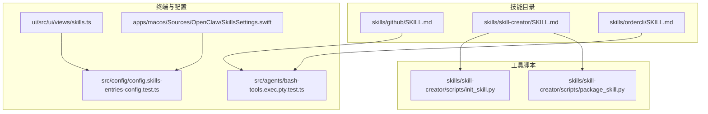
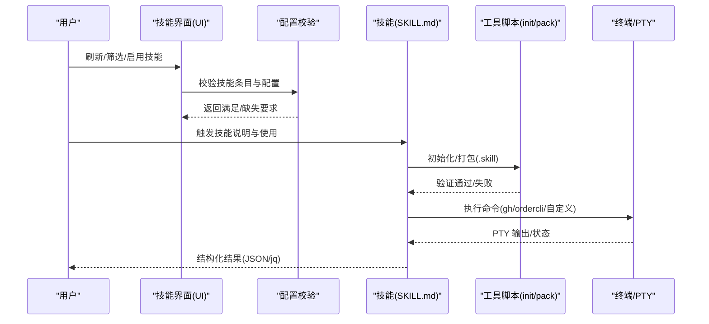
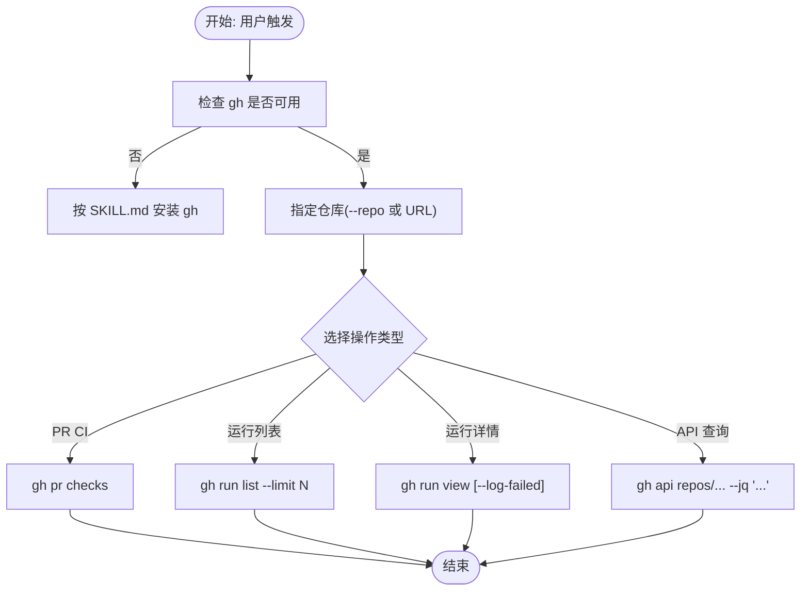
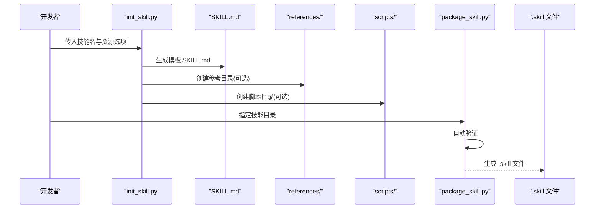
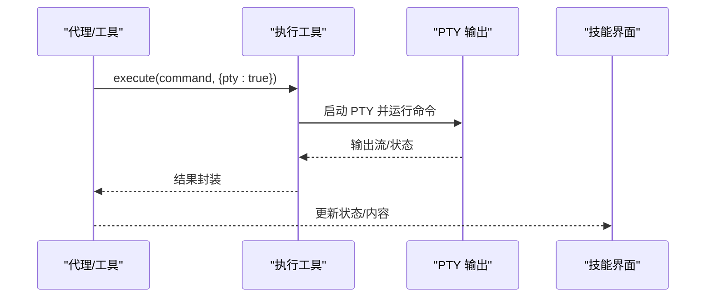
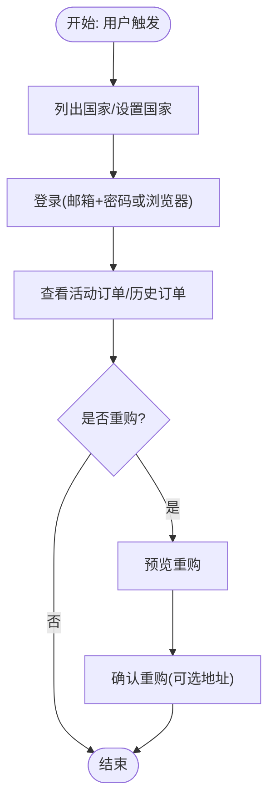
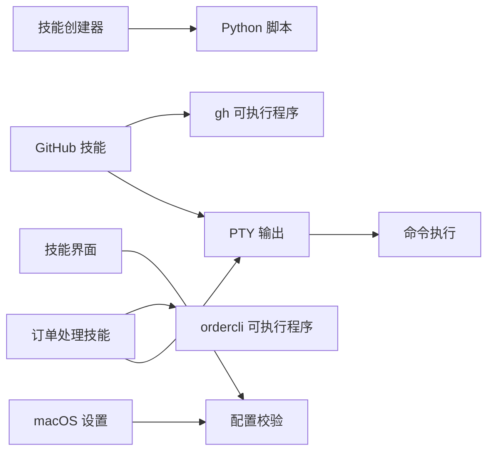

# 开发工具类技能

## 目录
1. [简介](#简介)
2. [项目结构](#项目结构)
3. [核心组件](#核心组件)
4. [架构总览](#架构总览)
5. [详细组件分析](#详细组件分析)
6. [依赖分析](#依赖分析)
7. [性能考虑](#性能考虑)
8. [故障排查指南](#故障排查指南)
9. [结论](#结论)
10. [附录](#附录)

## 简介
本文件面向 OpenClaw 的“开发工具类技能”，系统性梳理以下能力：GitHub 集成（通过 gh CLI）、代码生成与打包（技能创建器）、终端与命令执行、订单处理（ordercli）。文档覆盖各技能的配置参数、命令语法、应用场景、与开发工作流的集成方式（如代码提交、分支管理、构建流程），并提供错误处理、日志记录与调试技巧，以及与其他开发工具的协作与自动化集成方案。

## 项目结构
OpenClaw 将技能以“自包含包”的形式组织，每个技能由一个必需的 SKILL.md 和可选的资源组成（scripts、references、assets）。技能可通过内置 UI 或配置进行启用、安装与环境变量管理；终端执行支持 PTY 输出，便于交互式命令运行。

## 核心组件
- GitHub 技能：基于 gh CLI 的问题、拉取请求、CI 运行查询与高级 API 访问，支持 JSON 结构化输出与 jq 过滤。
- 技能创建器：提供技能初始化模板与打包流程，确保技能结构规范、验证通过后生成 .skill 文件。
- 终端与命令执行：支持 PTY 输出，便于交互式命令；通过配置校验与 UI/设置界面管理技能要求与环境。
- 订单处理技能：提供 Foodora 订单状态查询与重购功能，支持浏览器登录、会话导入与 Cloudflare 保护绕过提示。

## 架构总览
下图展示了技能在 OpenClaw 中的加载、校验与执行路径，以及与终端、UI、配置系统的交互。

## 详细组件分析

### GitHub 技能
- 功能概述
  - 使用 gh CLI 与 GitHub 交互，支持问题、PR、CI 运行查询与高级 API 调用。
  - 支持 JSON 输出与 jq 过滤，便于结构化数据处理。
- 配置与前置条件
  - 需要 gh 可执行程序可用（安装方式见 SKILL.md）。
  - 在非 Git 目录中操作时，需显式指定仓库或直接使用 URL。
- 命令语法与场景
  - PR CI 状态检查、最近运行列表、查看运行详情与失败步骤日志。
  - 使用 `gh api` 进行未暴露的子命令数据访问。
- 最佳实践
  - 使用 `--json` 与 `--jq` 获取精简结构化输出，减少上下文开销。
  - 在多仓库场景统一使用 `--repo` 指定目标仓库，避免歧义。
- 错误处理与调试
  - 缺少 gh 时，按安装指引完成安装；网络/认证失败时检查令牌与权限。
  - 使用 `--json` 与 `--jq` 快速定位字段，结合 limit 控制输出规模。

### 技能创建器（Skill Creator）
- 功能概述
  - 提供技能初始化模板与打包流程，确保技能结构规范并通过验证。
- 初始化流程
  - 使用 `init_skill.py` 创建目录、模板 SKILL.md 与可选资源目录。
  - 支持生成示例文件，便于快速上手。
- 打包流程
  - 使用 `package_skill.py` 对技能进行自动验证，通过后生成 .skill 文件。
- 配置与约束
  - 技能名称规范化（小写、连字符），长度限制。
  - 资源目录仅允许 scripts、references、assets。
- 最佳实践
  - 先规划可复用内容（脚本/参考/资产），再编写 SKILL.md。
  - 保持 SKILL.md 精炼，复杂内容放入 references 子文件，按需加载。
- 错误处理与调试
  - 资源类型非法、示例与资源未同时指定等会触发错误提示。
  - 打包前先运行验证，修复错误后再生成 .skill。

### 终端与命令执行（PTY）
- 能力概述
  - 支持 PTY 输出，适合需要交互式终端的应用场景。
  - 测试覆盖了 PTY 输出的正确性，确保工具链稳定。
- 集成点
  - 技能中的命令执行（如 gh、ordercli）可受益于 PTY 输出。
  - UI 与设置界面负责技能启用、过滤与环境变量编辑。
- 最佳实践
  - 对需要实时输出或交互的命令优先启用 pty。
  - 在 UI 中按需刷新技能状态，确保要求满足。

### 订单处理技能（ordercli）
- 功能概述
  - 专注于 Foodora 订单状态查询与重购，支持历史订单查看与确认。
  - 提供浏览器登录、会话导入与 Cloudflare 保护绕过建议。
- 配置与前置条件
  - 需要 ordercli 可执行程序（提供 brew/go 安装方式）。
  - 支持配置文件路径与会话导入，减少重复输入。
- 命令语法与场景
  - 国家列表、登录、当前活动订单、历史订单、重购预览与确认。
  - 会话导入与客户端刷新，便于无密码场景。
- 最佳实践
  - 使用 `--config` 指向测试配置，避免污染默认配置。
  - 重购与购物车变更前务必确认，防止误操作。
- 错误处理与调试
  - 登录失败时尝试浏览器登录与 Cookie 导入。
  - 会话失效时使用 session refresh 与客户端标识重试。

## 依赖分析
- 技能与配置
  - 技能启用/禁用与环境变量通过配置校验，UI 与 macOS 设置界面提供编辑入口。
- 工具链依赖
  - GitHub 技能依赖 gh；技能创建器依赖 Python 脚本；终端执行依赖 PTY。
- 外部工具协作
  - ordercli 与浏览器/会话管理工具配合，实现免密登录与会话复用。

## 性能考虑
- 上下文窗口优化
  - 技能采用渐进披露设计：元数据始终在上下文中，正文按需加载，资源按需读取。
- 输出控制
  - 使用 `--json` 与 `--jq` 控制输出大小，减少 token 消耗。
- 批处理与缓存
  - 对频繁查询的 API 结果进行本地缓存（如历史订单列表），降低重复调用成本。
- 并发与队列
  - 对多仓库/多任务场景，合理安排并发度，避免阻塞。

## 故障排查指南
- 技能无法启用
  - 检查缺失的二进制/环境变量/配置项，按 UI 提示补充。
- gh 命令失败
  - 确认已安装 gh，检查令牌与网络权限；必要时使用 `--repo` 明确仓库。
- ordercli 登录异常
  - 尝试浏览器登录与 Cookie 导入；检查会话导入与客户端刷新。
- PTY 输出异常
  - 确认命令支持 PTY；在 UI 中刷新技能状态，查看要求满足情况。
- 配置校验失败
  - 按错误信息修正配置键值，确保仅使用受支持字段。

## 结论
通过 GitHub 技能、技能创建器、终端执行与订单处理技能，OpenClaw 为开发工作流提供了从代码管理到自动化执行的完整工具链。遵循本文的配置参数、命令语法与最佳实践，可显著提升开发效率与稳定性；配合错误处理与调试技巧，能够快速定位并解决问题。

## 附录
- 快速参考
  - GitHub 技能：使用 `gh issue/pr/run/api`，配合 `--json` 与 `--jq`。
  - 技能创建器：`init_skill.py` 初始化，`package_skill.py` 打包。
  - 终端执行：在需要交互式输出时启用 pty。
  - 订单处理：使用 ordercli 管理 Foodora 订单，注意确认与会话导入。
- 贡献与支持
  - 参考贡献指南与文档索引，获取最新更新与社区支持。