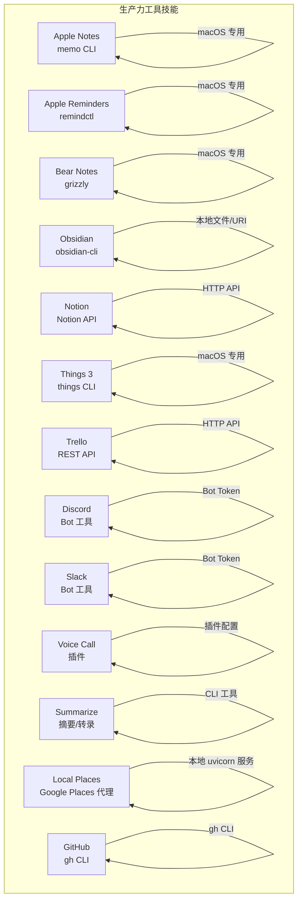
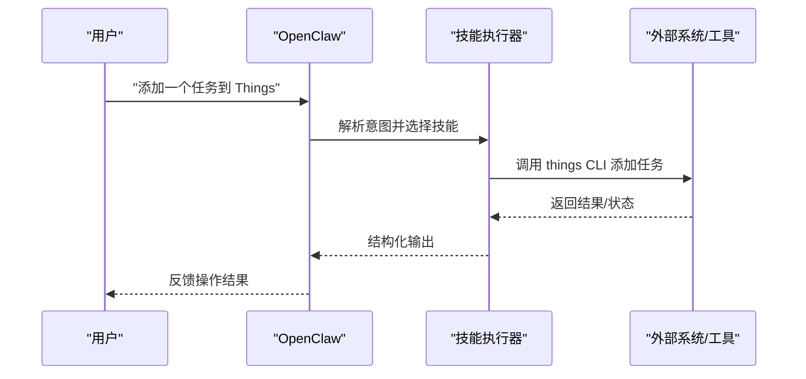
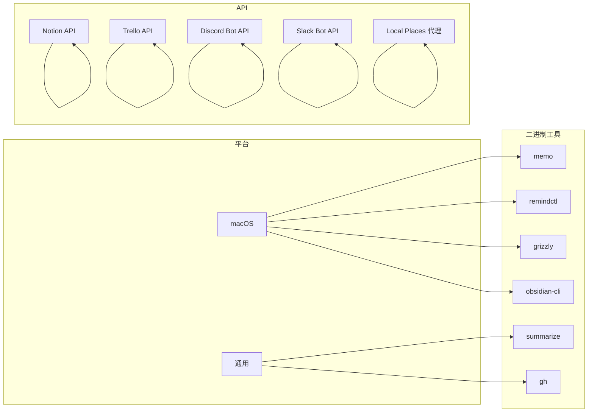
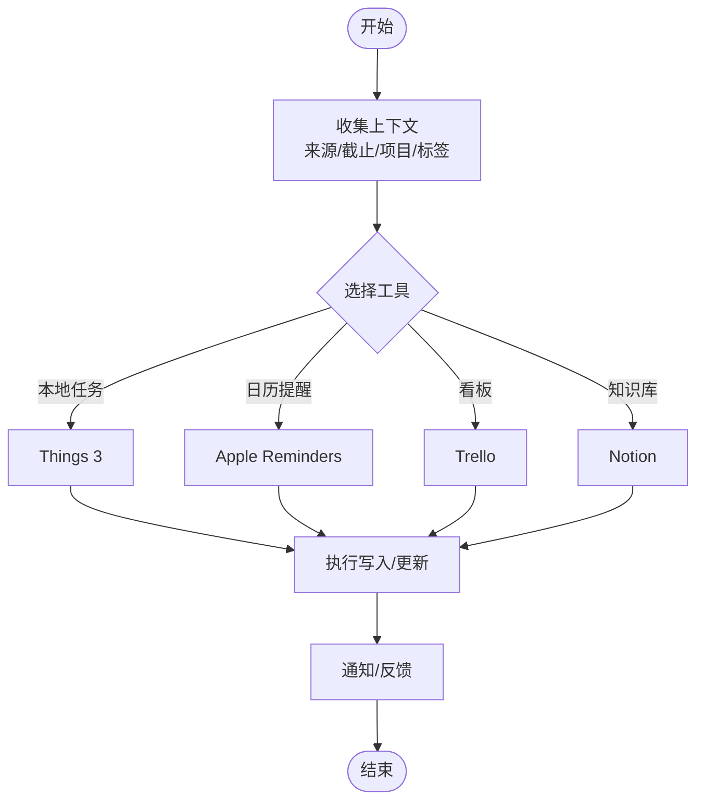

# 生产力工具技能

## 目录
1. [简介](#简介)
2. [项目结构](#项目结构)
3. [核心组件](#核心组件)
4. [架构总览](#架构总览)
5. [详细组件分析](#详细组件分析)
6. [依赖关系分析](#依赖关系分析)
7. [性能考量](#性能考量)
8. [故障排查指南](#故障排查指南)
9. [结论](#结论)
10. [附录](#附录)

## 简介
本文件面向“OpenClaw 生产力工具技能”的使用者与维护者，系统化梳理笔记应用（Apple Notes、Bear、Obsidian、Notion）、任务与日程（Apple Reminders、Things 3、Trello）、以及沟通协作（Discord、Slack）等技能的安装、配置、使用与自动化流程。文档同时覆盖跨平台数据同步、标签与内容组织、提醒与进度跟踪、工作流优化、备份与版本管理、冲突处理及常见问题排查，并给出与日常工作场景（项目管理、知识整理、学习笔记）结合的实操建议。

## 项目结构
OpenClaw 将每个外部系统或服务的能力抽象为“技能”，以独立的技能目录呈现其能力边界、依赖要求与使用方式。生产力工具相关技能主要分布在 `skills` 目录下，部分通过本地二进制工具（`memo`、`remindctl`、`grizzly`、`obsidian-cli`、`things`）或第三方 API（Notion、Trello、GitHub、Discord、Slack）进行集成。

## 核心组件
- 笔记类：Apple Notes、Bear Notes、Obsidian、Notion
  - 支持创建、搜索、编辑、移动、导出、标签管理与内容组织
  - 部分需授权访问（Automation/Reminders、Bear Token）
- 任务与日程：Apple Reminders、Things 3、Trello
  - 列表/项目管理、到期筛选、完成/删除、提醒设置与进度跟踪
- 协作与沟通：Discord、Slack
  - 消息反应、发送/编辑/删除、置顶、成员信息、频道管理（按需启用）
- 辅助工具：Voice Call、Summarize、Local Places、GitHub
  - 语音通话、摘要/转录、地点搜索、CI/PR 查询

## 架构总览
OpenClaw 的生产力工具技能遵循“统一入口 + 外部系统适配器”的模式：
- 统一入口：技能清单与元数据定义（名称、描述、平台、依赖、安装方式）
- 外部系统适配器：本地 CLI 工具或第三方 API 调用
- 自动化编排：通过命令组合、参数传递与回调机制实现跨系统联动

## 详细组件分析

### Apple Notes（`memo` CLI）
- 适用场景：快速创建/查看/编辑/删除/搜索/移动/导出笔记；macOS 本地笔记管理
- 关键能力
  - 列表、按文件夹过滤、模糊搜索
  - 交互式编辑与快速标题新增
  - 移动笔记到指定文件夹
  - 导出为 HTML/Markdown
- 使用要点
  - 首次运行需授予 Automation 访问权限
  - 不支持含图片/附件的笔记直接编辑
- 典型工作流
  - 新建：交互式编辑器或快速标题
  - 分类：移动到目标文件夹
  - 归档：导出为 Markdown/HTML

### Apple Reminders（`remindctl`）
- 适用场景：macOS 日历式提醒管理，支持列表、日期筛选与脚本化输出
- 关键能力
  - 查看：今日/明日/本周/逾期/即将/已完成/全部
  - 列表管理：列出、创建、重命名、删除
  - 提醒管理：新增、编辑、完成、删除
  - 输出格式：JSON/纯文本/计数
- 使用要点
  - 首次使用需授权 Reminders 权限
  - 远程 SSH 场景需在目标 Mac 授权

### Bear Notes（`grizzly`）
- 适用场景：Bear 应用内笔记的创建、读取、追加文本、标签管理
- 关键能力
  - 创建笔记（标题+标签）
  - 打开笔记并回调读取
  - 追加文本（支持令牌）
  - 列出标签、按标签打开
- 使用要点
  - 部分操作需要 Bear API Token（保存于配置路径）
  - Bear 必须在运行中
  - 回调读取需启用回调标志

### Obsidian（`obsidian-cli`）
- 适用场景：本地 Markdown 笔记库自动化，多库支持
- 关键能力
  - 定位默认库/活动库
  - 搜索（按文件名/内容）
  - 创建、移动/重命名、删除
  - 建议：优先直接编辑 .md 文件，由 Obsidian 同步
- 使用要点
  - 多库常见（iCloud/本地），避免硬编码路径
  - 使用 URI 打开时避免隐藏目录

### Notion（Notion API）
- 适用场景：页面、数据库与块的创建/查询/更新
- 关键能力
  - 搜索页面/数据库
  - 获取页面与块内容
  - 在数据库中创建页面（属性映射）
  - 查询数据库（过滤/排序）
  - 更新页面属性
  - 添加块
- 使用要点
  - 需要 Integration 与 API Key，并共享目标页面/数据库
  - 版本头与端点变更需注意（数据源/双 ID）

### Things 3（`things` CLI）
- 适用场景：macOS 本地任务管理，读取/搜索/添加/更新
- 关键能力
  - 读取：收件箱/今日/即将到来/搜索/项目/区域/标签
  - 写入：通过 URL Scheme 安全预览后添加/更新
  - 支持备注、时间、截止、清单项、标签、列表/标题
- 使用要点
  - DB 读取失败时需授予 Full Disk Access
  - 更新需认证令牌（可环境变量或参数传入）

### Trello（REST API）
- 适用场景：看板、列表、卡片的管理与流转
- 关键能力
  - 列出 Boards、Lists、Cards
  - 创建卡片、移动卡片、评论、归档
- 使用要点
  - 需要 API Key 与 Token（环境变量）
  - 注意速率限制

### Discord（Bot 工具）
- 适用场景：消息反应、贴纸/表情上传、投票、线程、频道/权限管理（按需启用）
- 关键能力
  - 发送/编辑/删除消息、媒体附件
  - 反应、列出反应、列出贴纸
  - 投票、权限检查、成员/角色/频道信息
  - 线程创建/列出/回复、置顶/取消置顶
  - 频道/分类创建/编辑/删除/移动
- 使用要点
  - Bot Token 由 OpenClaw 配置提供
  - 动作组可按需禁用（如 `roles`、`channels`、`moderation`）

### Slack（Bot 工具）
- 适用场景：消息反应、置顶/取消置顶、成员信息、消息读取
- 关键能力
  - 反应、列出反应、发送/编辑/删除消息
  - 读取最近消息、置顶/取消置顶、列出置顶
  - 成员信息、自定义表情列表
- 使用要点
  - Bot Token 由 OpenClaw 配置提供

### Voice Call（插件）
- 适用场景：自动发起/查询/结束语音通话（Twilio/Telnyx/Plivo 或 mock）
- 关键能力
  - 发起通话、继续通话、对用户说话、结束通话、查询状态
- 使用要点
  - 需启用 `voice-call` 插件并正确配置提供商参数

### Summarize（摘要/转录）
- 适用场景：网页、本地文件、YouTube 的摘要/最佳转录提取
- 关键能力
  - URL/文件/YouTube 摘要
  - 转录抽取、长度控制、JSON 输出
  - 模型与密钥配置
- 使用要点
  - 可选 Firecrawl/Apipe 作为回退
  - 大体量转录建议先摘要再展开

### Local Places（Google Places 代理）
- 适用场景：本地 Google Places API 代理，两步法定位+搜索
- 关键能力
  - 位置解析、地点搜索、详情获取
  - 过滤条件（类型、评分、价格、营业中）、分页
- 使用要点
  - 需 `GOOGLE_PLACES_API_KEY`
  - 本地 uvicorn 服务运行在 127.0.0.1:8000

### GitHub（`gh` CLI）
- 适用场景：Issues、Pull Requests、CI 运行、高级查询
- 关键能力
  - PR 检查状态、工作流列表/查看/失败日志
  - API 高级查询与 JSON 输出
- 使用要点
  - 非仓库目录需显式 `--repo` 或使用 URL

## 依赖关系分析
- 平台与二进制依赖
  - macOS 专属：`memo`、`remindctl`、`things`
  - 通用二进制：`obsidian-cli`、`grizzly`、`summarize`、`gh`
- 第三方 API 依赖
  - Notion：Integration + API Key
  - Trello：API Key + Token
  - Discord/Slack：Bot Token
  - Local Places：`GOOGLE_PLACES_API_KEY`
- 配置与环境
  - Bear Token、Things 认证令牌、Voice Call Provider 配置
  - GitHub CLI 需要 `gh` 配置与网络访问

## 性能考量
- API 调用节流
  - Trello：注意每 10 秒请求配额与 `/members` 限流
  - Notion：平均约 3 请求/秒
- 本地工具批处理
  - Obsidian/Things/Bear 等可通过批量命令减少往返
- 缓存与增量
  - 对频繁查询（如 Notion 数据库）采用缓存与增量更新策略
- 网络与代理
  - Local Places 本地代理降低外部依赖延迟

## 故障排查指南
- 权限与授权
  - macOS：Apple Notes（Automation）、Apple Reminders（Reminders）、Things（Full Disk Access）
  - Bear：确保 Token 文件存在且有效
- 环境变量与配置
  - Notion：确认 Integration 已共享目标页面/数据库，API Key 正确
  - Trello：API Key 与 Token 设置正确
  - Discord/Slack：Bot Token 配置正确，必要动作组已启用
  - Local Places：`GOOGLE_PLACES_API_KEY` 设置，服务在 127.0.0.1:8000 运行
- 交互与回调
  - Bear 读取需启用回调；Obsidian URI 打开需系统已注册
- 速率限制
  - 遵循各平台速率限制，必要时增加延时或合并请求

## 结论
通过将笔记、任务、日程与协作工具以技能形式封装，OpenClaw 实现了跨平台、跨系统的生产力自动化。建议在团队内统一技能使用规范、明确权限与配置管理，并结合缓存与节流策略提升稳定性与性能。针对不同工作场景（项目管理、知识整理、学习笔记），可按需组合多个技能形成闭环工作流。

## 附录

### 跨平台数据同步与兼容性
- 笔记层
  - 本地工具（Obsidian、`memo`、`grizzly`）与云服务（Notion、Bear）并存时，建议以云服务为主，本地工具为辅
  - 使用统一标签体系与命名约定，减少跨平台差异
- 任务与日程
  - 优先使用本地 CLI（`remindctl`、`things`）进行快速录入，再同步至云端（Notion/Trello/Discord/Slack 上的项目视图）
- 协作层
  - Discord/Slack 作为即时沟通与状态同步枢纽，配合贴纸/投票/置顶功能固化决策

### 标签与内容组织
- 统一标签命名：如优先级（P0/P1/P2）、项目（Proj-A）、领域（Tech/Doc/Plan）
- 分层命名：Project/Module/Topic/Type
- 与外部系统映射：Notion 数据库列名与标签保持一致

### 任务创建、提醒与进度跟踪自动化流程

### 数据备份、版本管理与冲突解决
- 备份
  - Notion：定期导出数据库/页面（可结合导出/查询）
  - Obsidian：版本控制（Git）+ 多库备份
  - Bear/Things/Reminders：依赖各自云同步（iCloud/服务器）
- 版本管理
  - 使用 Git 管理知识库与脚本化工作流
  - 对 API 调用参数与配置进行版本化管理
- 冲突解决
  - 优先以云服务为准，本地工具仅做快速录入
  - 对重复/冲突条目建立清理规则（如按时间戳/唯一标识）

### 工作流优化与效率提升
- 快速模板：为常用任务/笔记建立模板与快捷命令
- 自动化触发：结合 Cron/Webhook 触发技能，定时同步与提醒
- 可视化：在 Notion/Trello 中建立仪表盘，集中展示关键指标
- 团队协作：在 Discord/Slack 中建立固定频道与机器人，统一通知与反馈