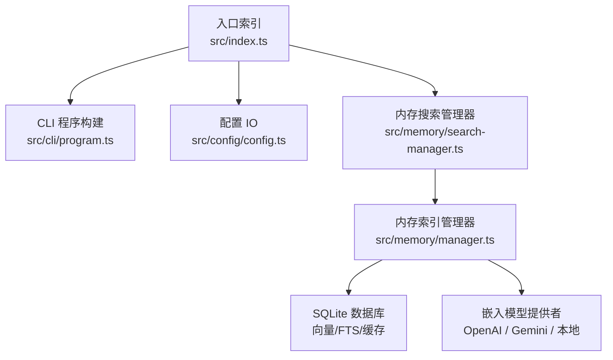
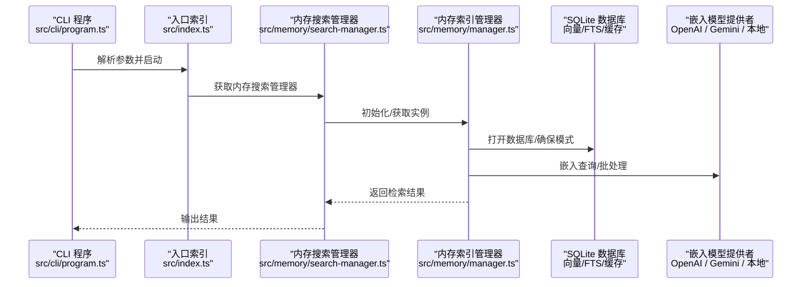
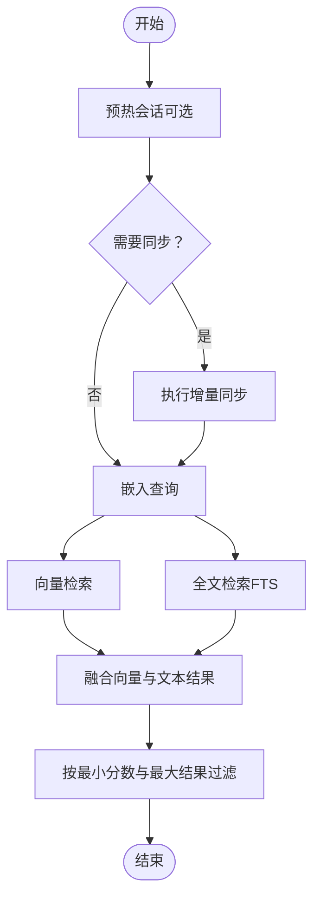
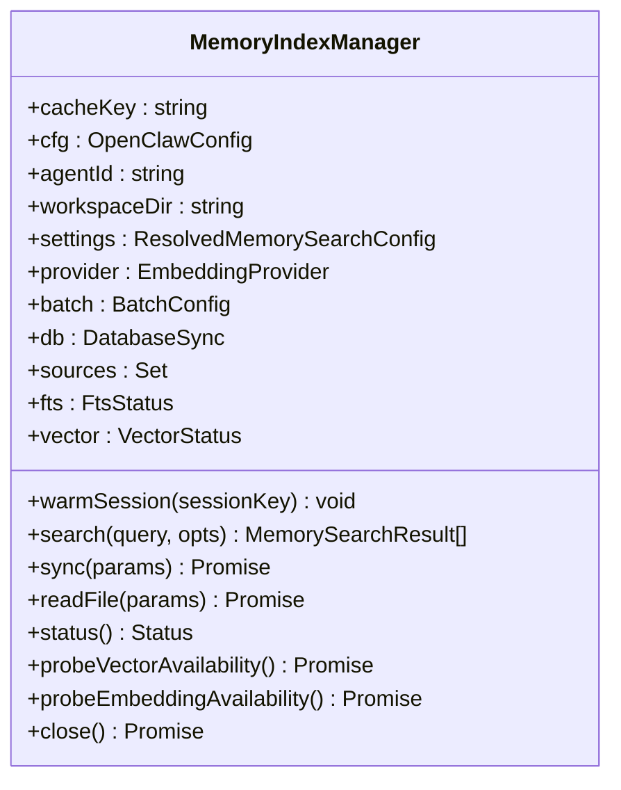
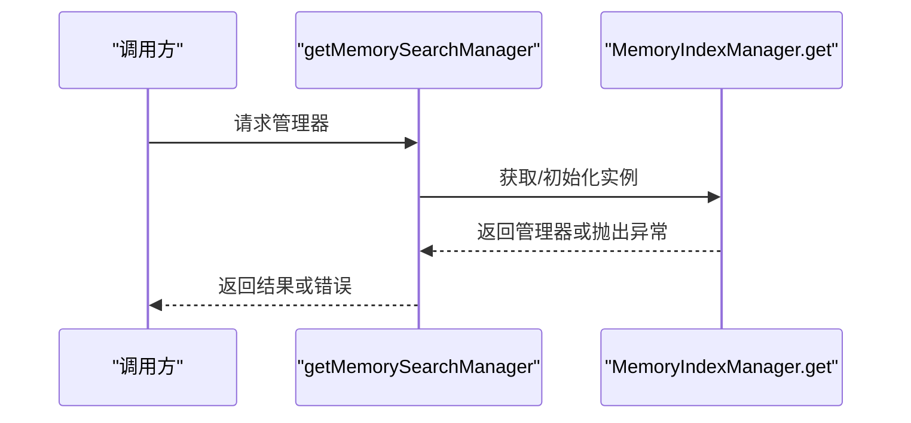
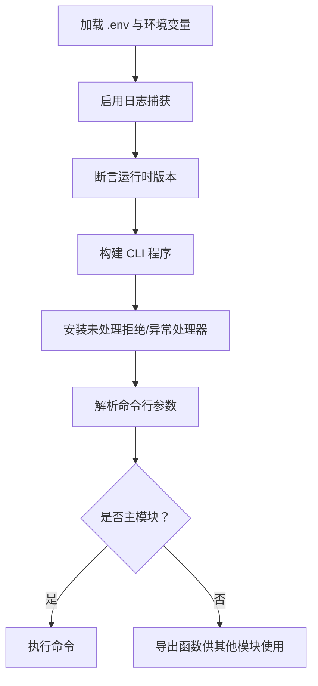
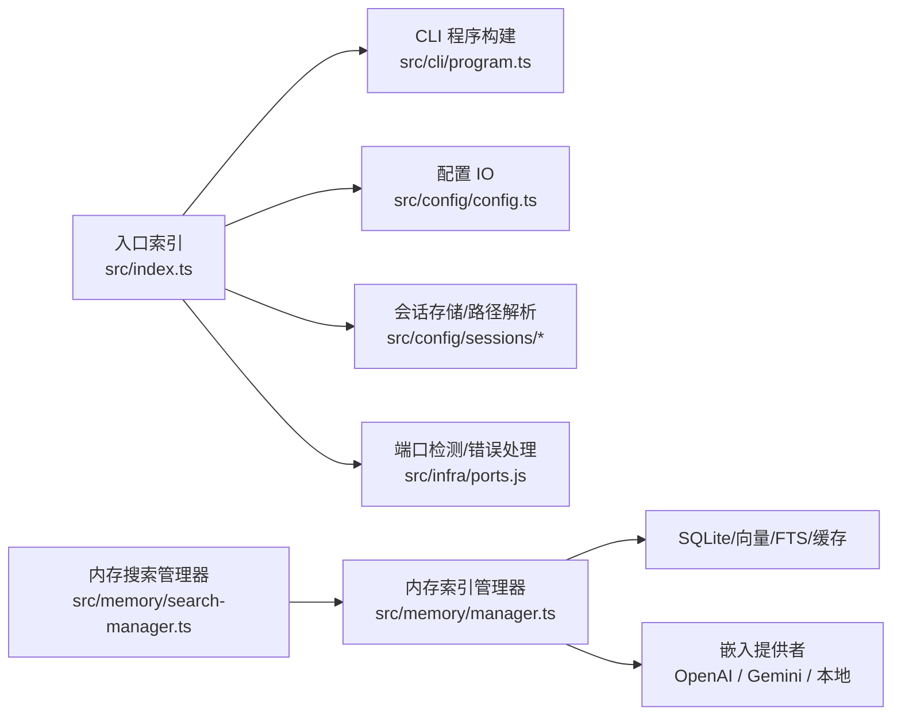

# 系统集成技能

## 目录
1. [简介](#简介)
2. [项目结构](#项目结构)
3. [核心组件](#核心组件)
4. [架构总览](#架构总览)
5. [详细组件分析](#详细组件分析)
6. [依赖关系分析](#依赖关系分析)
7. [性能考量](#性能考量)
8. [故障排查指南](#故障排查指南)
9. [结论](#结论)
10. [附录](#附录)

## 简介
本文件面向企业与平台集成场景，围绕 OpenClaw 的系统集成能力进行技术文档梳理，重点覆盖以下主题：
- 位置服务：通过节点命令与设备能力（如位置获取）实现本地与远程协同
- 会话管理：基于会话键与存储路径的解析、加载与持久化机制
- 系统监控：内存索引的增量同步、向量/全文检索、批处理与错误回退
- 数据库访问：SQLite 同步数据库、向量扩展、FTS 检索与缓存策略
- 本地服务集成：浏览器控制、Canvas/A2UI、节点调用与设备权限
- 远程 API 调用：嵌入模型提供商（OpenAI、Gemini）的批处理与重试
- 系统状态查询：内存索引状态、向量可用性探测、批处理失败统计
- 数据同步与缓存：增量同步、会话变更去抖、嵌入缓存与批处理失败上限
- 性能优化：并发批处理、超时控制、候选集合并权重融合
- 安全与权限：默认工具执行模式、沙箱策略、macOS TCC 权限映射
- 高可用与容错：嵌入模型提供者的自动回退、批处理失败锁定与告警
- 应用场景与部署：远程网关、Tailscale 暴露、多平台节点与通道接入

## 项目结构
OpenClaw 采用模块化与分层组织方式，核心入口负责 CLI 构建与全局错误处理；内存子系统提供向量/全文混合检索与增量同步；配置子系统提供配置读写与校验；CLI 子系统提供命令行程序构建。

## 核心组件
- 入口与 CLI：负责加载环境变量、运行时检查、端口占用检测、未捕获异常与拒绝处理，并构建 CLI 程序入口
- 内存索引管理器：提供向量/全文混合检索、增量同步、批处理、嵌入缓存、向量扩展加载与状态查询
- 内存搜索管理器：按代理维度获取内存索引管理器实例，支持错误返回
- 配置 IO：提供配置文件读取、写入、快照与校验，以及运行时覆盖与路径解析

## 架构总览
下图展示了从 CLI 到内存检索与数据库访问的整体流程，以及与嵌入模型提供者的交互：

## 详细组件分析

### 组件一：内存索引管理器（MemoryIndexManager）
职责与特性：
- 按代理维度缓存与复用索引管理器实例
- 支持向量检索与全文检索（FTS），并可融合两者结果
- 增量同步：监听工作区与会话目录变化，去抖后批量索引
- 批处理：对嵌入请求进行批量化与并发控制，带重试与失败上限
- 缓存：嵌入向量缓存表，减少重复计算
- 向量扩展：动态加载 `sqlite-vec` 扩展，按维度创建向量表
- 状态查询：提供文件/片段数量、脏标记、向量/FTS 可用性、批处理失败数等

关键流程（检索与同步）：

类关系概览：

### 组件二：内存搜索管理器（`getMemorySearchManager`）
职责与特性：
- 按代理 ID 获取内存索引管理器实例
- 异常捕获并返回错误信息，便于上层统一处理

调用序列：

### 组件三：入口与 CLI（入口索引）
职责与特性：
- 加载 `.env`、标准化环境变量、确保 CLI 在 `PATH` 中
- 启用结构化日志捕获，安装未处理拒绝与异常处理器
- 构建 CLI 程序并解析参数
- 提供端口占用检测与错误描述工具

关键流程（启动与错误处理）：

### 组件四：配置 IO（配置读写与校验）
职责与特性：
- 提供配置文件读取、写入、快照与哈希
- 运行时覆盖与路径解析
- 配置对象校验与插件校验

## 依赖关系分析
- 入口索引依赖 CLI 程序构建、配置 IO、会话存储、端口检测与错误格式化
- 内存搜索管理器依赖内存索引管理器的懒加载与实例获取
- 内存索引管理器依赖 SQLite、向量扩展、嵌入提供者、会话事件与文件系统监听

## 性能考量
- 并发批处理：嵌入批处理并发度与轮询间隔可配置，避免过载
- 超时控制：本地与远程嵌入查询与批处理设置不同超时阈值
- 候选集融合：向量与文本检索结果按权重融合，限制候选数量以平衡精度与速度
- 增量同步：会话目录变更去抖（毫秒级），降低频繁索引成本
- 缓存策略：嵌入向量缓存表减少重复计算，提升检索效率
- 向量扩展：按维度动态创建向量表，避免不必要重建

## 故障排查指南
- 端口占用：使用端口占用检测与错误描述工具定位占用进程
- 未捕获异常：安装未处理拒绝与异常处理器，确保错误被记录并优雅退出
- 嵌入提供者不可用：探测嵌入可用性并记录错误信息，必要时触发回退
- 向量扩展加载失败：记录加载错误并禁用向量能力，避免影响全文检索
- 批处理失败：累计失败次数与最后错误，超过阈值后锁定批处理并告警

## 结论
OpenClaw 的系统集成技能围绕“本地优先、向量增强、增量同步、安全可控”的设计原则构建。通过内存索引管理器与嵌入提供者的协作，实现了高效的知识检索与系统状态可观测性；通过 CLI 与配置 IO 的解耦，提供了灵活的部署与运维能力。在企业环境中，建议结合远程网关、Tailscale 暴露与多平台节点，实现跨设备、跨通道的一致体验与安全管控。

## 附录
- 企业部署要点：远程网关、Tailscale Serve/Funnel、SSH 隧道与权限控制
- 安全与权限：默认工具执行模式、沙箱策略、macOS TCC 权限映射
- 高可用与容错：嵌入提供者回退、批处理失败锁定与告警
- 应用场景：多通道接入、节点协同、Canvas/A2UI 与浏览器控制