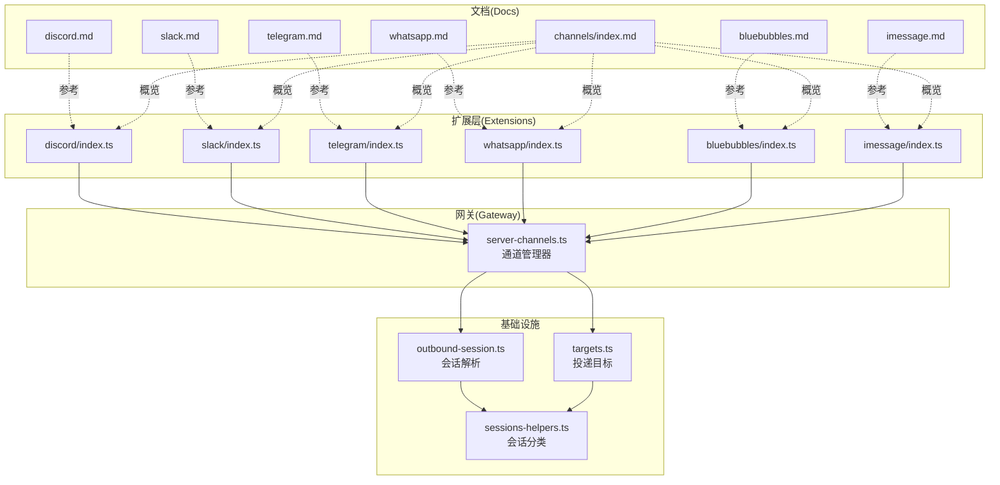
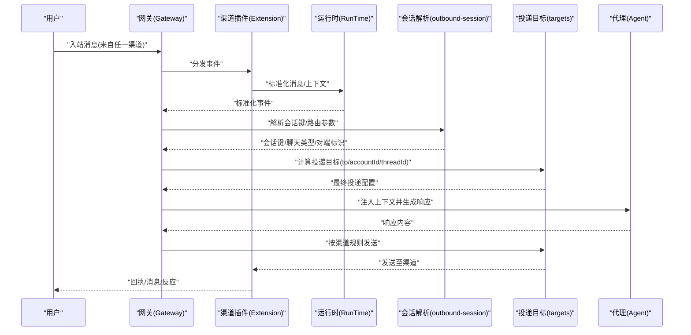
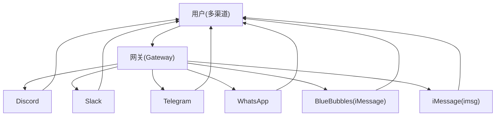
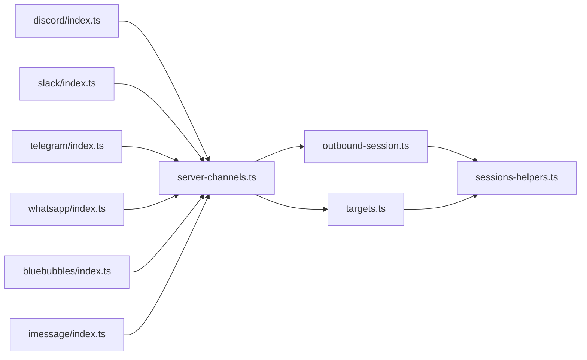

# 通信渠道技能

## 目录
1. [简介](#简介)
2. [项目结构](#项目结构)
3. [核心组件](#核心组件)
4. [架构总览](#架构总览)
5. [详细组件分析](#详细组件分析)
6. [依赖关系分析](#依赖关系分析)
7. [性能考量](#性能考量)
8. [故障排查指南](#故障排查指南)
9. [结论](#结论)
10. [附录](#附录)

## 简介
本文件面向 OpenClaw 的“通信渠道技能”，系统化梳理并解读各消息渠道（Discord、Slack、Telegram、WhatsApp、BlueBubbles、iMessage）的集成方式与使用方法，覆盖配置要求、认证与连接设置、消息路由与会话管理、用户权限控制、特色功能与适用场景、渠道限制与最佳实践，以及多渠道间的消息同步与状态管理策略。目标是帮助读者快速完成从零到一的渠道接入与运维。

## 项目结构
OpenClaw 将“渠道”以插件形式组织，位于 `extensions` 目录下；各渠道的官方文档位于 `docs/channels` 目录。运行时，网关通过 `server-channels` 负责加载与启动各渠道插件，结合 `outbound-session` 与 `targets` 实现会话解析与投递目标计算。

## 核心组件
- 渠道插件注册：各扩展在入口文件中注册自身为 OpenClaw 渠道插件，并注入运行时环境。
- 渠道管理器：负责加载配置、启动/停止指定渠道或账户、维护运行时快照。
- 会话解析与投递：根据入站消息上下文与会话键，推导出稳定的会话标识与投递目标，确保回复路由正确。
- 会话分类与派生：对会话键进行分类（主会话、群组、节点等），并从会话键中反推最近一次使用的渠道。

## 架构总览
下图展示了从“入站消息”到“会话解析与投递”的端到端流程，以及多渠道并行运行的总体架构。

## 详细组件分析

### Discord 渠道
- 集成方式：通过官方 Bot API，支持 DM 与服务器文本频道；默认启用 Socket 模式，可选 Webhook。
- 认证与连接：需要 Bot Token，并在开发者门户开启所需 Privileged Gateway Intents；支持多账号配置。
- 权限与路由：
  - DM 默认配对（pairing）访问控制，可切换为开放或白名单。
  - 服务器频道默认需被提及（requireMention），可通过 per-guild/per-channel 规则调整。
  - 会话键格式：主会话共享 `main`；服务器频道隔离为 `agent:<agentId>:discord:channel:<channelId>`。
- 特色功能：
  - 反应通知与工具动作（react、stickers、上传表情包/贴纸、搜索、线程、置顶、成员/角色/频道信息、语音状态、活动等）。
  - 回复标签支持（reply_to_current / `reply_to:`），受 `replyToMode` 控制。
  - 支持 PluralKit 成员代理消息解析。
- 限制与最佳实践：
  - 必须启用 Message Content Intent 才能读取消息正文；必要时启用 Server Members Intent。
  - 建议为服务器频道开启 `requireMention`，避免噪音。
  - 使用 `textChunkLimit` 与 `maxLinesPerMessage` 控制长回复拆分；媒体上限默认 8MB。
  - 多账号使用 `accounts` 列表，避免混用 token 与环境变量导致优先级混淆。
- 多渠道同步与状态：
  - 通过会话键与投递目标保持回复定向回源频道。
  - 支持历史上下文注入（`historyLimit`），提及回复时增强上下文质量。

### Slack 渠道
- 集成方式：Socket Mode（默认）或 HTTP Events API/Webhook。
- 认证与连接：需要 App Token（connections:write）与 Bot Token；可选 User Token（只读或读写，取决于 `userTokenReadOnly`）。
- 权限与路由：
  - DM 默认配对访问；服务器频道通过 `groupPolicy` 控制（open/disabled/allowlist）。
  - 会话键：DM 共享 `main`；服务器频道 `agent:<agentId>:slack:channel:<channelId>`；Slash 命令 `agent:<agentId>:slack:slash:<userId>`。
- 特色功能：
  - 反应通知与工具动作（react、messages、pins、memberInfo、emojiList）。
  - 支持 per-chat-type 的自动回复线程策略（direct/group/channel）。
  - Slash 命令注册与执行，支持命令授权与会话前缀。
- 限制与最佳实践：
  - 读操作优先使用 User Token，写操作默认使用 Bot Token；当 `userTokenReadOnly=false` 且无 Bot Token 时可回退到 User Token。
  - 事件订阅需包含 `message.*`、`app_mention`、`reaction_*`、`member_*`、`channel_rename`、`pin_*` 等。
  - 历史上下文默认 50 条，可调；媒体上限默认 20MB。
- 多渠道同步与状态：
  - 通过会话键与投递目标确保回复定向；支持按聊天类型差异化线程策略。

### Telegram 渠道
- 集成方式：Bot API，基于 grammY；默认长轮询，可选 Webhook。
- 认证与连接：Bot Token（BotFather 创建）；支持多账号 `accounts`。
- 权限与路由：
  - DM 默认配对访问；服务器频道 `requireMention` 默认开启，可通过 `groups.*.requireMention` 关闭。
  - 会话键：DM 共享 `main`；群组 `agent:<agentId>:telegram:group:<chatId>`；论坛主题附加 `:topic:<threadId>`。
- 特色功能：
  - 内置命令菜单注册；自定义命令（菜单项，非内置实现）。
  - Draft 流水（部分/块）与块流（`blockStreaming`）两种模式；支持推理流（reasoning stream）。
  - Sticker 接收与缓存、搜索与发送；反应通知与级别控制。
  - Inline 键盘按钮能力（off/dm/group/all/allowlist）。
- 限制与最佳实践：
  - 非提及消息在隐私模式下可能不被接收；需关闭隐私或设为管理员。
  - 文本拆分默认 4000 字符；媒体默认 5MB；超限自动降级为纯文本。
  - Webhook 需要公网可达与签名密钥；长轮询在 Node 22+ 上注意 AbortSignal 兼容性。
- 多渠道同步与状态：
  - 通过 `message_thread_id` 与会话键保证主题内回复定向；支持 per-topic 覆盖。

### WhatsApp 渠道
- 集成方式：基于 Baileys 的 WhatsApp Web；网关持有会话，支持多账号。
- 认证与连接：QR 登录（Linked Devices），凭据存储于 `credentials` 子目录；支持个人号自聊模式。
- 权限与路由：
  - DM 默认配对访问；可切换为开放或白名单；个人号模式下允许自聊。
  - 群组默认 `requireMention`（激活 always/mention），会话键 `agent:<agentId>:whatsapp:group:<jid>`。
- 特色功能：
  - 自动已读回执（可禁用）；入站消息带引用上下文；媒体占位符。
  - 工具动作 react（支持移除）；自动 ACK 反应（👀/✅/📨 等）。
  - 历史上下文注入（默认 50 条）；心跳与重连策略。
- 限制与最佳实践：
  - 建议使用独立号码；避免虚拟号；Node 运行时更稳定。
  - 文本拆分默认 4000 字符；媒体默认 5MB（出站）/50MB（入站）。
  - 群组元数据缓存 5 分钟；引用回复上下文始终附加。
- 多渠道同步与状态：
  - 通过会话键与投递目标确保回复定向；ACK 反应在组内按 mentions/always/never 策略。

### BlueBubbles 渠道（推荐用于 iMessage）
- 集成方式：macOS BlueBubbles 服务 REST API；支持 Webhook；推荐替代传统 imsg。
- 认证与连接：`serverUrl` + `password`；Webhook 路径；支持多账号。
- 权限与路由：
  - DM 默认配对访问；群组默认 allowlist；支持 per-group `requireMention`。
  - 会话键：DM 共享 `main`；群组 `agent:<agentId>:bluebubbles:group:<chat_guid>`。
- 特色功能：
  - 高级动作：编辑、撤销、回复线程、消息特效、群组管理（改名/头像/加减成员/离开）。
  - 反应通知与系统事件；块流（`blockStreaming`）支持。
  - 附件与贴图处理；短/全消息 ID；模板变量支持。
- 限制与最佳实践：
  - macOS 版本差异：编辑/头像更新在 macOS 26（Tahoe）存在已知问题，需手动禁用相关动作。
  - Webhook 密码校验；本地代理需配合网关信任代理配置。
  - 文本拆分默认 4000 字符；媒体默认 8MB。
- 多渠道同步与状态：
  - 通过 `chat_guid` 与会话键保持稳定路由；支持 per-group 覆盖。

### iMessage 渠道（imsg）
- 集成方式：macOS JSON-RPC（stdio）；需要 Full Disk Access 与自动化权限。
- 认证与连接：`cliPath`/`dbPath`；支持多账号 `accounts`；远程 SSH 方案。
- 权限与路由：
  - DM 默认配对访问；群组默认 allowlist；支持 per-group `requireMention`。
  - 会话键：DM 共享 `main`；群组 `agent:<agentId>:imessage:group:<chat_id>`。
- 特色功能：
  - 群组线程隔离；附件下载（SCP）；远程主机自动检测或显式配置。
  - 文本拆分与媒体上限；支持 per-group 覆盖。
- 限制与最佳实践：
  - 首次运行需批准权限；远程 Mac 建议使用 Tailscale；SSH 密钥免交互登录。
  - 仅支持 `chat_id` 作为稳定路由；支持 `groupPolicy` 与 `allowFrom`。
- 多渠道同步与状态：
  - 通过 `chat_id` 与会话键确保回复定向；支持 per-group 配置。

### 概念性总览（多渠道协同）

## 依赖关系分析
- 插件注册依赖：各扩展在入口文件中注册渠道插件并注入运行时。
- 渠道管理依赖：`server-channels` 提供统一的启动/停止与运行时快照管理。
- 会话与投递依赖：`outbound-session` 与 `targets` 负责从上下文推导会话键与投递目标，`sessions-helpers` 用于会话分类与通道推断。

## 性能考量
- 文本拆分与行数限制：各渠道均提供 `textChunkLimit` 与 `maxLinesPerMessage`（Telegram 还有 `chunkMode`）以控制长回复拆分，降低 API 调用失败风险。
- 媒体上限：各渠道提供 `mediaMaxMb` 限制，防止大文件占用资源。
- 并发与重试：Telegram/Slack/Discord 提供 `retry` 策略（`attempts`/`minDelayMs`/`maxDelayMs`/`jitter`），应对 429/瞬时网络错误。
- 会话键稳定性：通过会话键与投递目标计算，确保跨渠道一致的路由行为，减少重复处理与错发。
- 会话分类：`sessions-helpers` 对会话键进行分类，便于后续统计、清理与路由优化。

## 故障排查指南
- 通用诊断：
  - 使用 `openclaw doctor` 与 `channels status --probe` 获取通道健康与权限审计。
  - 查看网关日志与各子系统日志（如 `whatsapp/inbound`、`web-heartbeat`、`web-reconnect`）。
- Discord：
  - “Used disallowed intents”：启用 Message Content Intent 与 Server Members Intent。
  - 未回复：检查权限、mention 要求、allowlist、`groupPolicy`。
  - Exec 审批按钮 UI：确认 `execApprovals` 启用与 `approvers` 设置。
- Slack：
  - Socket Mode：确保 App Token + Bot Token + 事件订阅完整。
  - HTTP 模式：验证 Request URL、Signing Secret、Interactivity。
  - 用户令牌写入：`userTokenReadOnly=false` 时需具备相应 scopes。
- Telegram：
  - 非提及消息无响应：关闭隐私模式或设为管理员。
  - Node 22+ 长轮询中断：升级构建或回退 Node 20。
  - IPv6 DNS：强制 IPv4 或修复 egress。
- WhatsApp：
  - 未链接/断开：重新扫码登录；doctor 检查；查看 logs。
  - Bun 不推荐：使用 Node 运行时。
- BlueBubbles：
  - Edit/头像更新在 macOS 26（Tahoe）已知问题：禁用相关动作。
  - Webhook 密码校验与本地代理信任。
- iMessage：
  - 首次运行权限：批准 Full Disk Access 与自动化。
  - 远程 Mac：SSH 密钥与 Tailscale；`remoteHost` 显式配置。

## 结论
OpenClaw 通过插件化渠道架构实现了对主流即时通讯平台的一致接入与统一路由。借助会话键与投递目标计算，系统在多渠道并行运行时仍能保证回复定向与上下文一致性。针对各渠道的特性（Bot API、Socket/Webhook、REST、JSON-RPC），文档提供了从认证、权限、路由到特色功能与限制的完整指南。建议在生产环境中优先启用配对/白名单策略、合理设置文本拆分与媒体上限，并结合 retry 与心跳策略提升稳定性。

## 附录
- 多渠道概览与对比：参见 `channels/index.md` 的平台列表与简述。
- 会话键与通道推断：`sessions-helpers` 的 `deriveChannel` 逻辑可用于从会话键反推最近一次使用的渠道。
- 投递目标计算：`targets.ts` 的 `resolveSessionDeliveryTarget` 提供了从会话上下文与请求参数推导最终投递目标的核心流程。