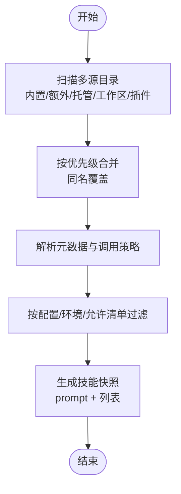

# 技能平台

## 目录
1. [简介](#简介)
2. [项目结构](#项目结构)
3. [核心组件](#核心组件)
4. [架构总览](#架构总览)
5. [详细组件分析](#详细组件分析)
6. [依赖关系分析](#依赖关系分析)
7. [性能考量](#性能考量)
8. [故障排查指南](#故障排查指南)
9. [结论](#结论)
10. [附录](#附录)

## 简介
OpenClaw 的技能平台基于“技能即知识包”的理念，通过标准化的 `SKILL.md` 文件与可选资源，将工具能力、工作流与领域知识注入到智能体中。平台支持三类技能来源：内置技能、托管/本地技能（`~/.openclaw/skills`）与工作区技能（`<workspace>/skills`），并通过元数据与前置条件门控实现按环境、配置与二进制可用性动态筛选。ClawHub 作为公共技能注册中心，提供搜索、安装、更新与发布能力，形成“发现—安装—分发—备份”的闭环。

## 项目结构
- 文档层：位于 `docs/tools` 与 `docs/zh-CN/tools`，涵盖技能加载、配置、ClawHub 使用等主题。
- 核心实现层：位于 `src/agents/skills` 与 `src/gateway/server-methods`，负责技能解析、过滤、命令生成、安装与状态展示。
- 示例与模板：`skills` 目录内包含 `clawhub`、`skill-creator` 等示例技能，便于理解格式与最佳实践。
- CLI 层：`src/cli` 提供 `skills list/info/check` 等命令，帮助用户诊断与管理技能。

## 核心组件
- 技能加载与合并：从多源目录加载技能，按优先级合并，解析元数据与调用策略，生成技能条目。
- 技能过滤与门控：依据配置、允许清单、操作系统、二进制、环境变量与配置键进行筛选。
- 技能命令生成：将可被用户调用的技能映射为命令名与描述，处理重名去重与长度限制。
- 技能状态与安装：CLI 提供状态检查、信息查询与安装入口；网关方法提供安装/更新能力。
- 技能快照与提示注入：在会话开始时构建技能快照，将精简的技能列表注入系统提示，降低上下文开销。

## 架构总览
技能平台围绕“加载—过滤—命令—安装—状态—提示注入”形成闭环，贯穿 CLI、网关与智能体运行期。

## 详细组件分析

### 组件A：技能加载与合并（workspace.ts）
- 多源加载：内置、额外目录、托管/本地、工作区与插件技能目录统一扫描。
- 合并策略：按 `extra < bundled < managed < workspace` 的优先级合并，同名以高优先级覆盖。
- 元数据解析：提取 frontmatter、OpenClaw 元数据与调用策略。
- 过滤与快照：根据配置与环境进行筛选，生成可用于提示注入的技能列表与快照。

### 组件B：技能命令生成与去重（skill-commands.ts）
- 用户可调用技能筛选：排除显式禁用的技能。
- 命令规范化：将技能名转为小写、下划线、去除多余字符，限制长度。
- 唯一性保证：若冲突，追加序号或截断后缀，确保命令唯一。
- 描述截断：Discord 等平台对描述长度有限制，自动截断并保留可读性。
- 工具派发：支持“直接派发到工具”的指令模式，校验工具名与参数模式。

### 组件C：技能安装与更新（gateway server-methods/skills.ts）
- 参数校验：对安装/更新请求进行参数校验，错误时返回标准错误形状。
- 安装执行：解析工作区目录，调用安装逻辑，支持超时控制。
- 结果响应：成功返回安装结果，失败返回 `UNAVAILABLE` 错误码与消息。

### 组件D：技能状态与 CLI（skills-cli.ts）
- 列表与信息：输出技能状态、来源、缺失要求、安装选项等。
- 检查汇总：统计就绪、禁用、受允许清单阻断、缺失要求的技能数量与名单。
- JSON 输出：支持 JSON 格式，便于自动化集成。
- 提示引导：在非 JSON 输出中提示使用 `npx clawhub` 进行技能发现与同步。

### 组件E：ClawHub 集成与分发（docs + skills/clawhub/SKILL.md）
- 文档指引：提供 ClawHub 的站点、安装 CLI、搜索、安装、更新、列表与发布流程。
- 分发机制：默认安装到当前工作目录 `./skills`，若配置了工作区则回退到工作区；OpenClaw 从 `<workspace>/skills` 加载并在下次会话生效。
- 示例技能：`clawhub` 自身作为示例技能，展示如何声明二进制依赖与安装器。

### 组件F：内置技能与模板（skills/skill-creator/SKILL.md）
- 设计原则：简洁、自由度适配、三层渐进披露（元数据常驻、`SKILL.md`触发、按需加载资源）。
- 资源组织：`scripts/` `references/` `assets/` 的职责边界与最佳实践。
- 创建流程：理解示例—规划资源—初始化—编辑—打包—迭代。

## 依赖关系分析
- `workspace.ts` 依赖 `pi-coding-agent` 的加载函数与 OpenClaw 配置、元数据解析器、插件技能目录解析器与序列化工具。
- `skills.ts` 依赖类型定义（`types.ts`）中的技能相关参数与结果类型。
- `skills-cli.ts` 依赖 `workspace.ts` 的状态构建函数与终端渲染工具。
- `skill-commands.ts` 依赖 `workspace.ts` 的条目过滤与命令生成逻辑。

## 性能考量
- 技能提示注入成本：当有技能时，OpenClaw 会注入紧凑的 XML 技能列表到系统提示；基础开销与每技能字符数相关，建议控制技能数量与描述长度。
- 快照复用：会话开始时缓存技能快照，后续回合复用，避免重复解析与拼接。
- 监视与热重载：可开启技能目录监视，变更后在下一轮次刷新，减少重启成本。
- 沙箱环境：沙箱内进程不继承宿主环境变量，需通过沙箱镜像或配置注入。

## 故障排查指南
- 技能缺失：使用 `openclaw skills check` 查看缺失的二进制、环境变量、配置键或操作系统要求。
- 门控阻断：若技能被允许清单阻断，可在配置中调整 `allowBundled` 或 `entries.<skill>` 的 `enabled`。
- 安装失败：通过网关 `skills.install/update` 方法查看错误码与消息；必要时增加超时或检查网络。
- 命令冲突：命令名会被规范化与去重，若出现重名，系统会追加序号；可在 `SKILL.md` frontmatter 中调整命名策略。
- 远程节点：若网关运行在 Linux 上且连接了 macOS 节点，且允许 `system.run`，则可将 macOS-only 技能视为可选，但需确保节点可用。

## 结论
OpenClaw 的技能平台以标准化的 `SKILL.md` 为核心，结合多源加载、动态门控、命令生成与状态管理，形成了从“发现—安装—分发—使用—维护”的完整闭环。通过 ClawHub 与内置模板，开发者可以快速创建高质量技能，并借助 CLI 与网关方法实现高效运维与可观测性。

## 附录

### 技能开发指南（步骤与最佳实践）
- 步骤：创建目录 → 编写 `SKILL.md`（frontmatter + 指令）→ 添加脚本/资源（可选）→ 刷新或重启 → 测试与迭代。
- 最佳实践：保持简洁、安全优先（避免任意命令注入）、测试本地、共享技能至 ClawHub。

### 技能配置管理要点
- 允许清单：`allowBundled` 仅影响内置技能。
- 目录扩展：`skills.load.extraDirs` 可添加额外技能目录（最低优先级）。
- 安装偏好：`install.preferBrew` 与 `install.nodeManager` 控制安装器选择。
- 环境注入：`entries.<skill>` 的 `env/apiKey` 仅在宿主运行时生效；沙箱需通过 `agents.defaults.sandbox.docker.env` 或自定义镜像注入。

### 技能权限与安全
- 第三方技能视为不受信任代码，启用前务必审阅。
- 沙箱运行优先；敏感密钥避免写入提示与日志。
- 通过 `metadata.openclaw.requires` 门控二进制、环境变量与配置键。