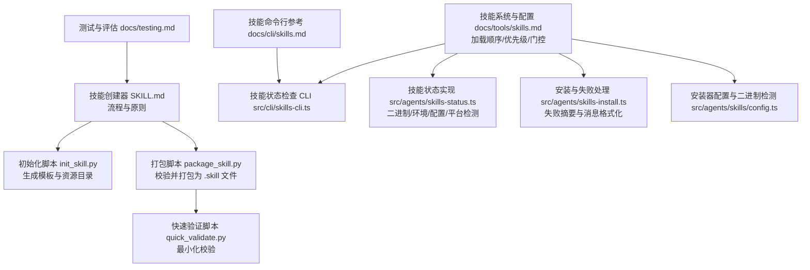
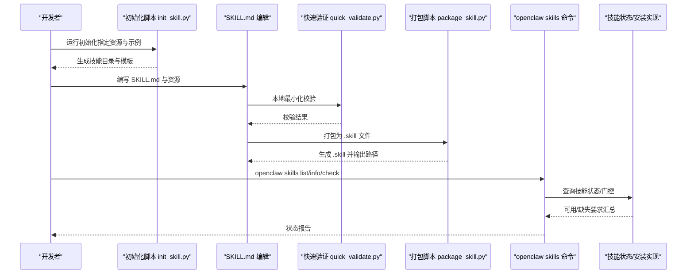
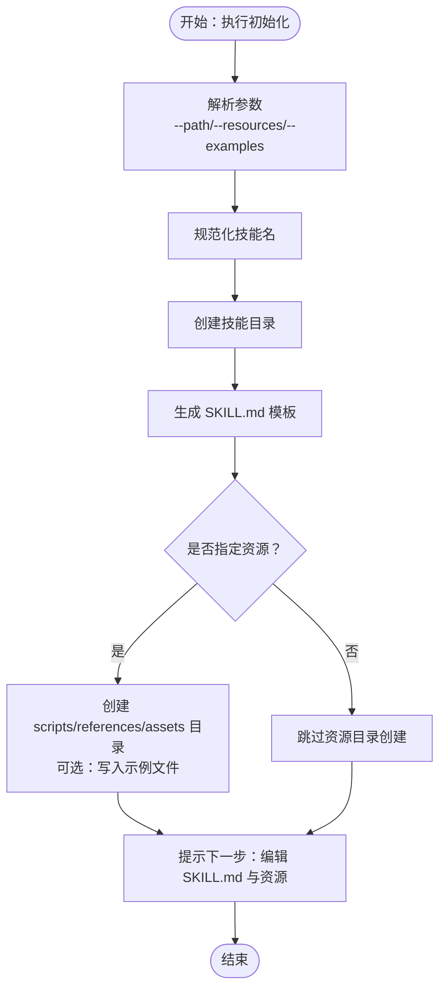
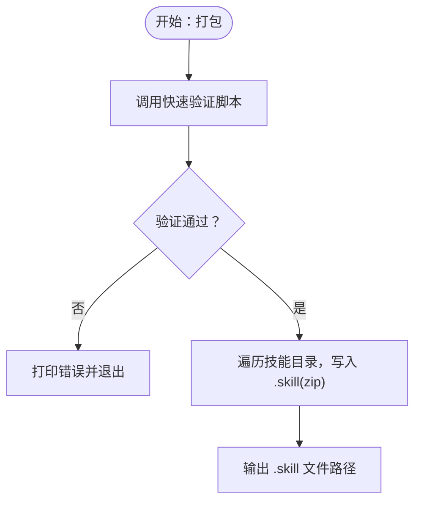
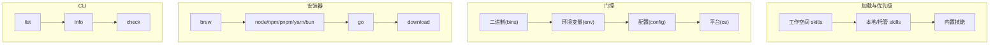
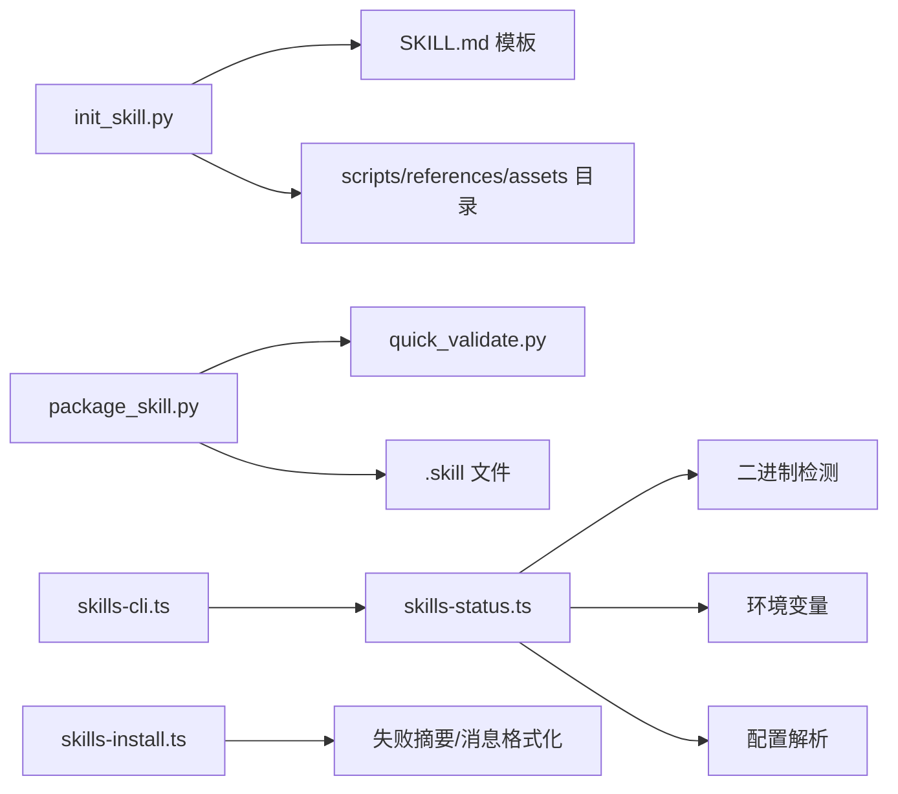

# 技能开发工作流程

## 目录
1. [引言](#引言)
2. [项目结构](#项目结构)
3. [核心组件](#核心组件)
4. [架构总览](#架构总览)
5. [详细组件分析](#详细组件分析)
6. [依赖关系分析](#依赖关系分析)
7. [性能考量](#性能考量)
8. [故障排查指南](#故障排查指南)
9. [结论](#结论)
10. [附录](#附录)

## 引言
本指南面向希望在 OpenClaw 中高效开发、测试、打包与迭代“技能”的工程师与产品人员。OpenClaw 的“技能”是模块化的知识与工具包，通过标准化的目录结构与元数据，帮助智能体在特定领域或任务上具备确定性、可复现的能力。本指南以六个核心步骤为主线，结合仓库内的脚本与文档，给出可落地的操作流程、设计思维、最佳实践、测试与验证方法、安装与部署流程、检查清单与质量保障措施，并提供常见瓶颈与效率优化建议。

## 项目结构
围绕技能开发的关键文件与位置如下：
- 技能模板与流程说明：skills/skill-creator/SKILL.md
- 自定义技能创建指南：docs/tools/creating-skills.md
- 初始化与打包脚本：skills/skill-creator/scripts/{init_skill.py, package_skill.py, quick_validate.py}
- 技能系统与配置：docs/tools/skills.md
- 技能命令行工具：docs/cli/skills.md
- 技能状态检查与安装：src/cli/skills-cli.ts、src/agents/skills-status.ts、src/agents/skills-install.ts、src/agents/skills/config.ts
- 测试与评估：docs/testing.md

## 核心组件
- 技能模板与流程：提供六步法、命名规范、资源组织原则与渐进披露设计。
- 初始化脚本：一键生成符合规范的技能目录、模板 SKILL.md 与可选资源目录。
- 打包脚本：自动校验并打包为 `.skill` 文件，便于分发。
- 快速验证脚本：最小化校验，确保 frontmatter 结构与字段合规。
- 技能系统与配置：定义技能加载顺序、优先级、门控规则（二进制、环境变量、配置、平台）、安装器与远程节点支持。
- CLI 工具：列出/查看/检查技能，辅助定位缺失要求。
- 安装与状态：对安装失败进行摘要与消息格式化；运行时检测二进制、环境与配置。

## 架构总览
下图展示从“理解需求”到“迭代改进”的端到端流程，以及与系统中脚本、CLI 和运行时组件的交互。

## 详细组件分析

### 步骤一：理解技能需求
- 操作要点
  - 明确用户会话中的具体意图与触发词，收集典型用例。
  - 将“如何从零执行该任务”作为落地方案的起点。
  - 识别重复性与可复用性高的部分，决定是否需要 scripts、references 或 assets。
- 注意事项
  - 避免过度提问导致上下文膨胀；先问关键问题，再按需补充。
  - 对于已有技能，仍建议回顾使用模式，避免重复劳动。
- 设计思维
  - 以“任务驱动”而非“功能罗列”为主，聚焦“何时触发、做什么、为何有效”。

### 步骤二：规划可复用内容
- 操作要点
  - 分析每个用例，提炼可复用的脚本、参考文档与资产。
  - 示例：PDF 旋转 → scripts/rotate_pdf.py；前端应用构建 → assets/hello-world/；BigQuery 查询 → references/schema.md。
- 资源组织原则
  - scripts：可直接执行的代码，适合确定性高、重复出现的任务。
  - references：按主题拆分的参考材料，仅在需要时加载，避免挤占上下文窗口。
  - assets：最终输出中使用的模板、图标、字体等文件。
- 最佳实践
  - 保持 SKILL.md 精简，将细节放入 references；必要时在 SKILL.md 中提供“何时/何地”阅读指引。
  - 避免深层数引用，尽量扁平化组织。

### 步骤三：初始化技能
- 操作要点
  - 使用初始化脚本生成模板目录与 SKILL.md，按需创建 scripts/references/assets。
  - 支持传入 `--resources` 与 `--examples` 参数，快速填充示例文件。
- 命名与结构
  - 技能名称采用小写连字符，长度限制，避免连续连字符与首尾连字符。
  - 目录名与技能名一致，遵循统一命名规范。
- 后续步骤
  - 编辑 SKILL.md 的 TODO 内容，完善描述与结构。
  - 如使用了 `--examples`，替换或删除不需要的占位文件。

### 步骤四：编辑技能
- 操作要点
  - 先完成资源（scripts/references/assets），再完善 SKILL.md。
  - 脚本必须经过实际运行验证，确保输出符合预期；相似脚本可抽样验证。
  - 若使用了 `--examples`，删除不需要的占位文件。
- SKILL.md 编写指南
  - 使用祈使语气，明确“何时触发、做什么、为何有效”。
  - frontmatter 仅包含 name 与 description，前者用于匹配触发，后者用于模型判断使用时机。
- 渐进披露与组织
  - 将长篇参考拆分为多个文件，SKILL.md 中仅做导航与选择指引。
  - 多域或多变体场景，按域/变体组织 references 子目录，减少无关上下文加载。

### 步骤五：打包技能
- 操作要点
  - 打包前先进行最小化校验，确保 frontmatter 结构与字段合规。
  - 打包为 `.skill` 文件（zip 格式），保留目录结构以便分发。
- 校验项
  - SKILL.md 存在且包含 YAML frontmatter。
  - frontmatter 字段合法（name/description 等），name 符合连字符命名规范，description 不含非法字符且长度受限。
- 输出
  - 成功后输出 `.skill` 文件路径，失败则打印错误并终止。

### 步骤六：迭代改进
- 操作要点
  - 在真实任务中使用技能，记录痛点与低效点。
  - 基于反馈更新 SKILL.md 或资源，重复测试与验证。
- 与流程的关系
  - 这是一个持续循环：使用 → 观察 → 识别 → 实施 → 再测试。

### 设计思维与最佳实践
- 简洁优先：只保留模型“真正需要”的信息，避免冗余解释。
- 自适应自由度：根据任务脆弱性与变异性选择“高/中/低自由度”策略。
- 渐进披露：metadata（frontmatter）始终在上下文中，SKILL.md 仅在触发时加载，资源按需加载。
- 资源边界：assets 不加载到上下文，仅用于最终输出；scripts 可在不读入上下文的情况下执行。

### 测试与验证
- 本地最小化验证
  - 使用快速验证脚本检查 frontmatter 结构、字段类型与长度限制。
- 打包前验证
  - 包装脚本内部调用验证逻辑，确保满足基本要求后再打包。
- 评估与回归
  - 文档中提出未来应建立“决策正确性、合规性、工作流契约”的评估体系，建议优先在 CI 安全环境下落地。

### 安装与部署
- 技能来源与优先级
  - 优先级：工作空间 skills > 本地/托管 skills > 内置技能；可通过配置追加额外目录。
- 门控规则
  - 二进制存在（PATH）、环境变量、配置项、平台列表、插件技能注入等。
- 安装器与远程节点
  - 支持 brew/node/go/download 等安装器；在 Linux 网关连接 macOS 节点时，若节点具备所需二进制，可视为可用。
- CLI 检查
  - 使用 `openclaw skills list/info/check` 查看技能可用性与缺失要求。

## 依赖关系分析
- 脚本间依赖
  - 打包脚本依赖快速验证脚本提供的校验能力。
  - 初始化脚本独立生成模板与资源，不依赖其他脚本。
- 运行时依赖
  - 技能状态检查依赖二进制检测、环境变量与配置解析。
  - 安装失败处理依赖对 stdout/stderr 的摘要提取与格式化。

## 性能考量
- 上下文成本控制
  - 通过渐进披露设计，metadata 始终在上下文中，SKILL.md 仅在触发时加载，资源按需加载。
  - XML 注入技能列表的成本可预估，注意控制技能数量与字段长度。
- 资源执行效率
  - scripts 可在不读入上下文的情况下执行，适合确定性高、重复出现的任务。
- 运行时快照
  - 会话开始时快照可用技能，同一会话内复用，减少重复计算。

## 故障排查指南
- 常见问题与定位
  - 缺失二进制：检查 PATH 是否包含所需命令；在沙箱环境中确认容器内已安装。
  - 缺失环境变量：确认已在配置中注入或进程环境已设置；某些技能支持通过 apiKey 自动注入主密钥环境变量。
  - 缺失配置项：核对 `openclaw.json` 中对应路径的值是否为真值。
  - 平台不匹配：确认 `metadata.openclaw.os` 列表包含当前平台。
- CLI 辅助
  - 使用 `openclaw skills check` 查看技能可用性与缺失要求；使用 `openclaw skills list` 查看全部技能。
- 安装失败处理
  - 安装失败时，系统会汇总 stderr/stdout 的关键行并截断输出，便于快速定位错误。

## 结论
通过“理解需求—规划资源—初始化—编辑—打包—迭代”的闭环流程，并结合渐进披露、最小化验证与 CLI/运行时门控机制，可以高效产出高质量的 OpenClaw 技能。建议在团队内形成“先脚本后文档”的习惯，以 scripts 为核心，SKILL.md 为导航，references 为深度资料，确保技能既实用又易维护。

## 附录

### 技能开发检查清单
- 需求与用例
  - 是否明确了触发词与典型场景？
  - 是否识别了可复用的脚本/参考/资产？
- 初始化与命名
  - 是否使用初始化脚本生成目录与模板？
  - 技能名是否符合连字符命名规范与长度限制？
- 编辑与校验
  - SKILL.md 是否包含 name 与 description？
  - frontmatter 是否仅包含允许字段？
  - 资源是否按需创建，占位文件是否清理？
  - 脚本是否经过实际运行验证？
- 打包与分发
  - 是否通过快速验证脚本进行最小化校验？
  - 是否成功生成 `.skill` 文件？
- 测试与部署
  - 是否通过 `openclaw skills check` 检查可用性？
  - 是否满足二进制/环境/配置/平台要求？
- 迭代与评估
  - 是否基于真实使用反馈进行改进？
  - 是否考虑建立决策正确性、合规性与工作流契约的评估？