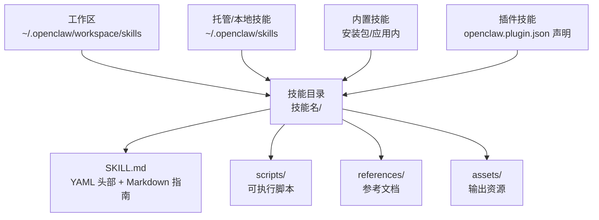
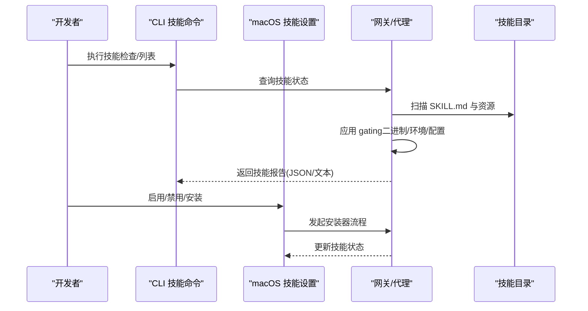
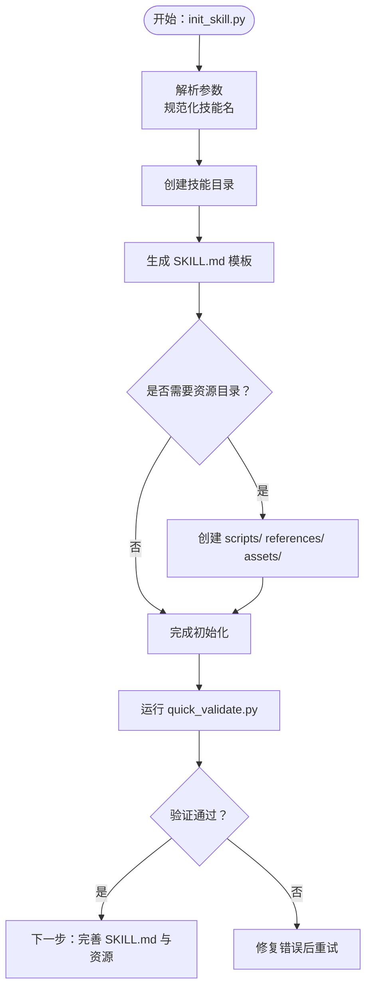
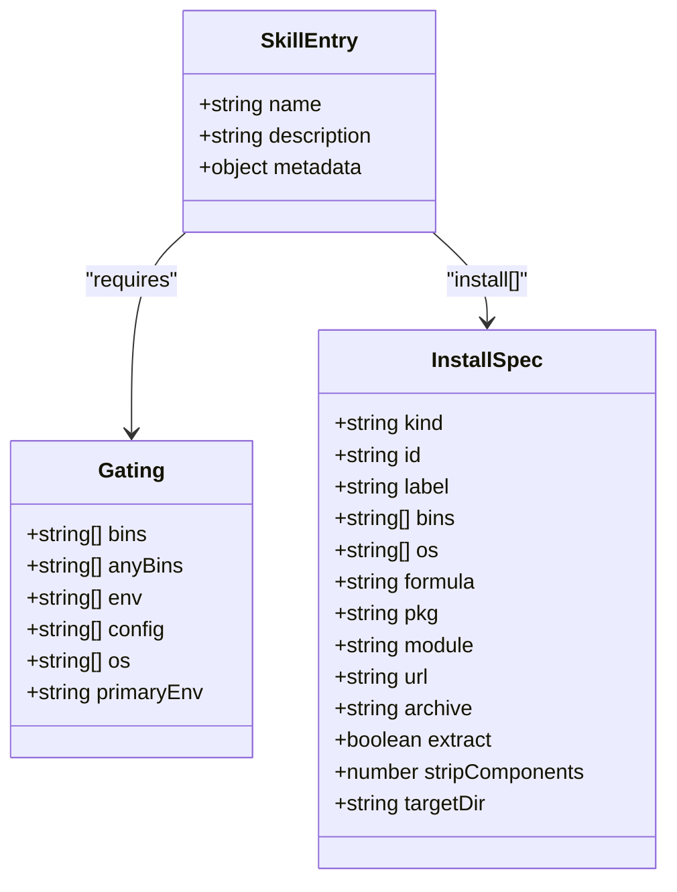
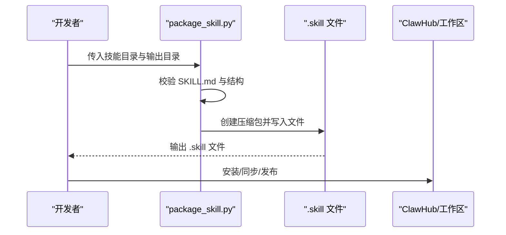
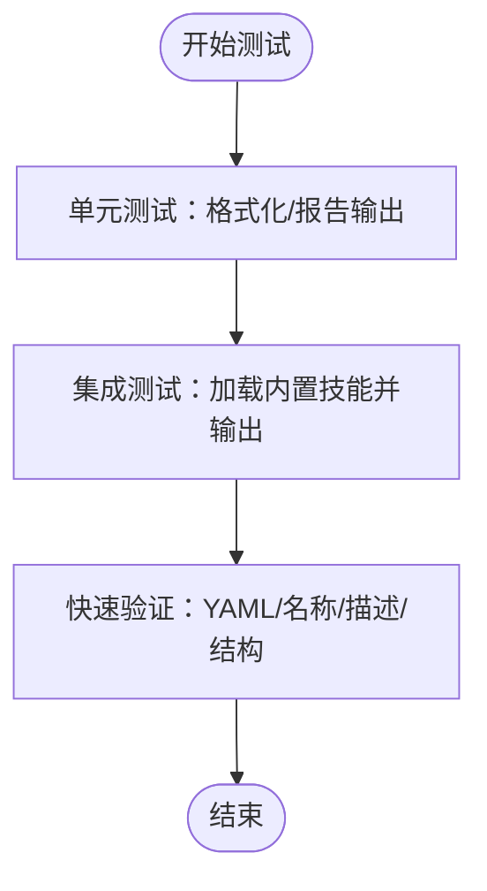
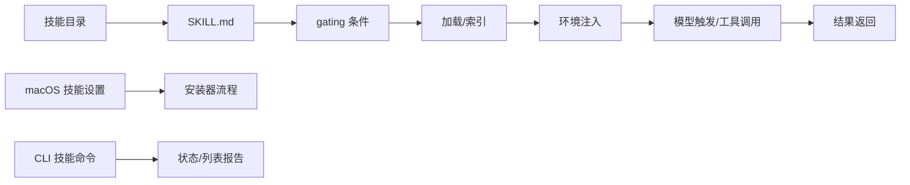

# 技能开发指南

## 目录
1. [简介](#简介)
2. [项目结构](#项目结构)
3. [核心组件](#核心组件)
4. [架构总览](#架构总览)
5. [详细组件分析](#详细组件分析)
6. [依赖关系分析](#依赖关系分析)
7. [性能考虑](#性能考虑)
8. [故障排查指南](#故障排查指南)
9. [结论](#结论)
10. [附录](#附录)

## 简介
本指南面向在 OpenClaw 平台上进行“技能（Skill）”开发的工程师与创作者，覆盖从环境准备、开发工具链、模板系统、项目结构规范、配置与元数据、测试策略、打包分发、版本管理到完整工作流的全流程。OpenClaw 的技能采用“AgentSkills 兼容”的目录结构，以 SKILL.md 作为入口，辅以可选的脚本与资源目录，实现模块化、可发现、可加载、可安装的技能生态。

## 项目结构
OpenClaw 的技能开发围绕以下关键位置与规范展开：
- 技能目录：位于工作区路径下，遵循“技能名/”的目录结构，包含必需的 SKILL.md 与可选的 scripts/、references/、assets/ 子目录。
- 内置技能：随安装包或应用内置，可通过配置进行启用/禁用与覆盖。
- 工作区技能：用户自定义技能，优先级高于内置技能。
- 插件技能：插件通过 `openclaw.plugin.json` 声明技能目录，在启用插件时参与加载与优先级规则。
- macOS 技能 UI：提供过滤、安装目标选择、安装器选项展示等能力。

## 核心组件
- SKILL.md：技能的“元数据 + 使用说明”，是模型触发与加载的关键入口。
- 脚本资源（scripts/）：可直接执行的自动化脚本，支持 Python/Bash 等。
- 参考资源（references/）：按需加载的参考文档，避免占用上下文窗口。
- 输出资源（assets/）：最终产物使用的模板、图标、字体等文件。
- 加载与过滤（gating）：基于二进制、环境变量、配置项的加载门控。
- 安装器（install）：通过 `metadata.openclaw.install` 声明，支持 brew/npm/pnpm/yarn/bun/uv/go/download 等方式。
- 配置注入（env/apiKey/config）：运行时注入环境变量与自定义字段。
- UI 与 CLI：macOS 技能设置界面与 CLI 技能检查/列表输出。

## 架构总览
技能在 OpenClaw 中的生命周期包括：发现 → 过滤 → 注入 → 触发 → 执行 → 结果返回。macOS 技能 UI 提供安装与状态管理；CLI 提供检查与列表输出；后端根据 gating 条件决定是否加载技能。

## 详细组件分析

### 组件A：技能模板系统与初始化
- 初始化脚本 `init_skill.py` 支持：
  - 规范化技能名（小写、连字符、长度限制）
  - 生成 SKILL.md 模板与 TODO 提示
  - 可选创建 scripts/、references/、assets/ 目录与示例文件
- 快速验证脚本 `quick_validate.py` 支持：
  - YAML 头部格式校验
  - name/description 必填与格式约束
  - 角色与边界：仅允许受控键，避免危险字符与过长描述

### 组件B：技能配置与元数据
- SKILL.md YAML 头部必须包含 name 与 description；可选 metadata 字段承载 gating 与安装器信息。
- `metadata.openclaw` 支持：
  - `requires.bins`/`anyBins`：主机 PATH 检查
  - `requires.env`：进程环境或配置中存在
  - `requires.config`：`openclaw.json` 对应路径为真值
  - `install`：安装器规格数组（brew/node/go/uv/download 等）
  - `os`：平台过滤
  - `primaryEnv`：与 `skills.entries.<name>.apiKey` 关联
- 前端解析与安装偏好：
  - 选择优先安装器（brew 优先、uv、node、brew、go）
  - 平台过滤与安装选项归一化

### 组件C：技能打包与分发
- 打包脚本 `package_skill.py`：
  - 校验 SKILL.md 存在与基本格式
  - 将技能目录压缩为 .skill 文件（zip）
  - 输出相对路径，保持目录结构
- 分发与安装：
  - .skill 文件即为可分发包，包含所有资源
  - macOS 技能 UI 与安装器配合，按平台与偏好选择安装方式

### 组件D：测试与质量保障
- 单元测试与集成测试：
  - CLI 测试覆盖技能检查报告输出（JSON/文本）、加载内置技能并格式化输出
- 质量控制：
  - 快速验证脚本确保 YAML 头部、名称与描述格式正确
  - 推荐在本地使用 `openclaw agent --message` 进行功能验证

### 组件E：工作区与默认技能
- 默认工作区与模板：
  - 工作区默认路径：`~/.openclaw/workspace`
  - 可复制 `AGENTS.default.md` 到工作区作为个人助理模板
- 技能清单与使用建议：
  - 核心技能涵盖截图、媒体、通讯、设备控制、语音等
  - 建议启用与审计默认技能，结合 TOOLS.md 记录环境特定注意点

## 依赖关系分析
- 技能加载依赖：
  - 目录结构与 SKILL.md 存在性
  - gating 条件满足（PATH、环境变量、配置）
  - 安装器可用性（平台、偏好）
- UI/CLI 依赖：
  - macOS 技能设置界面提供过滤与安装目标
  - CLI 技能命令用于检查与列表输出
- 文档与规范：
  - AgentSkills 兼容格式
  - OpenClaw 自定义 `metadata.openclaw` 字段

## 性能考虑
- 上下文开销估算：
  - 当有技能时，系统提示中注入技能列表，字符数与令牌数可预估
  - 基础开销 + 每技能约 97 字符 + XML 转义扩展
- 建议：
  - 控制 SKILL.md 长度，拆分参考文档至 references/
  - 使用 scripts/ 执行确定性任务，减少重复加载
  - 合理使用 gating，避免不必要的技能进入上下文

## 故障排查指南
- 常见问题与定位：
  - SKILL.md 缺失或 YAML 头部格式错误：使用 `quick_validate.py` 快速诊断
  - gating 不满足：检查 PATH、环境变量、配置项是否符合 `metadata.openclaw` 要求
  - 安装器失败：确认平台过滤、偏好设置与网络权限
- 开发者工具：
  - CLI 技能检查与列表输出，便于集成测试与本地验证
  - macOS 技能设置界面查看“Ready/Needs Setup/Disabled”状态

## 结论
OpenClaw 的技能体系以“目录 + SKILL.md + 可选资源”为核心，通过明确的模板系统、严格的元数据与 gating 规则、完善的安装器与 UI/CLI 支撑，形成可扩展、可维护、可分发的技能生态。遵循本文档的结构规范、开发流程与最佳实践，可高效构建高质量技能并融入社区。

## 附录

### A. 技能开发工作流（从创建到发布）
- 准备环境：安装 Node ≥22，使用 pnpm 或 bun，运行 `openclaw onboard` 完成向导与守护进程安装
- 创建技能：
  - 使用 `init_skill.py` 生成模板与资源目录
  - 编辑 SKILL.md 与 scripts/references/assets
  - 使用 `quick_validate.py` 校验
- 测试与迭代：
  - 本地使用 `openclaw agent --message` 验证
  - 运行 CLI 技能检查与列表输出
- 打包与分发：
  - 使用 `package_skill.py` 生成 .skill 包
  - 通过 ClawHub 或工作区安装/同步

### B. 项目结构与文件组织规范
- 目录命名：技能名（小写、连字符），与 SKILL.md name 一致
- 文件组织：SKILL.md + 可选 scripts/、references/、assets/
- 元数据：YAML 头部 name/description 必填；`metadata.openclaw` 可选承载 gating 与安装器
- 配置注入：`skills.entries.<name>` 下的 enabled/env/apiKey/config

### C. 最佳实践与常见陷阱
- 最佳实践：
  - 保持 SKILL.md 精炼，将细节放入 references
  - 使用 scripts/ 执行确定性任务，减少上下文占用
  - 明确 gating 条件，提升跨平台兼容性
  - 使用 `metadata.openclaw.install` 提供一键安装体验
- 常见陷阱：
  - YAML 头部键过多或格式错误
  - name/description 不符合规范或过长
  - gating 未满足导致技能不可用
  - 安装器未按平台过滤或偏好不匹配

### D. 许可证与合规
- 技能创建工具采用 Apache 2.0 许可，适用于技能开发与分发场景
- 分发 .skill 包时，请遵守相应第三方许可与开源协议