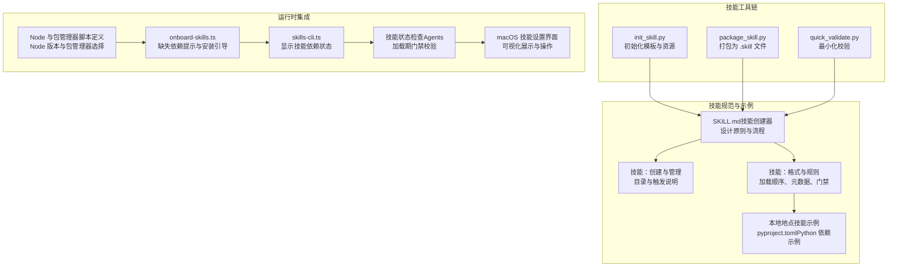
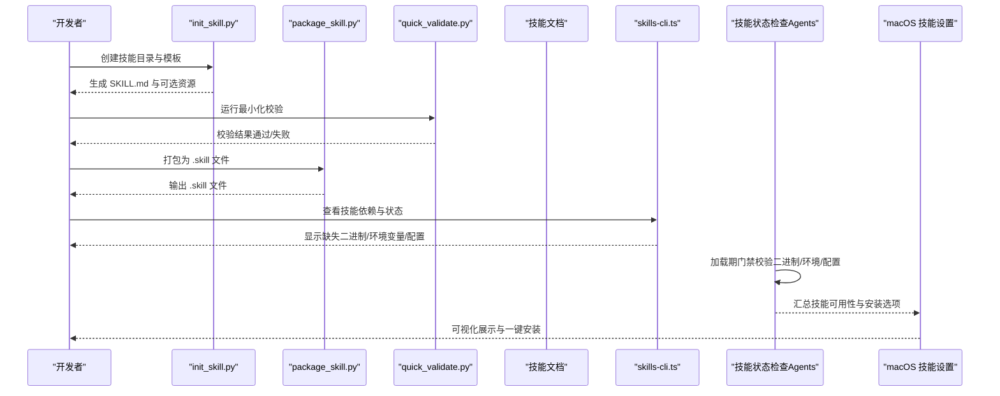
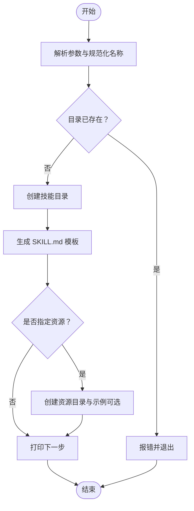
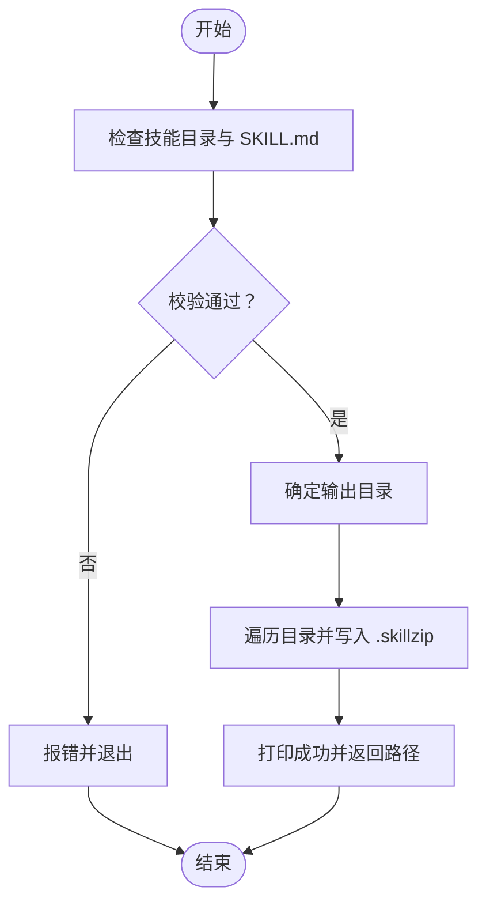
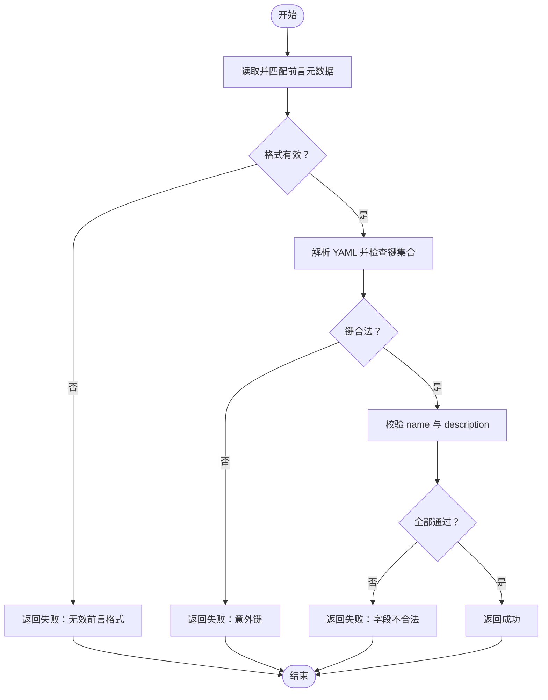
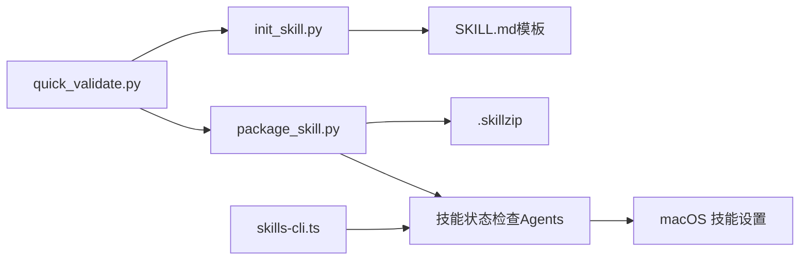

# 技能开发环境搭建

## 目录
1. [简介](#简介)
2. [项目结构](#项目结构)
3. [核心组件](#核心组件)
4. [架构总览](#架构总览)
5. [详细组件分析](#详细组件分析)
6. [依赖关系分析](#依赖关系分析)
7. [性能考量](#性能考量)
8. [故障排除指南](#故障排除指南)
9. [结论](#结论)
10. [附录](#附录)

## 简介
本指南面向希望在 OpenClaw 中开发“技能”的开发者，提供从系统要求、Python 环境配置到工具链安装与验证的完整流程。你将学会如何使用 `init_skill.py` 初始化技能目录、使用 `package_skill.py` 打包分发，并通过 `quick_validate.py` 进行快速校验；同时掌握技能目录结构、触发条件、资源组织与最佳实践。

## 项目结构
OpenClaw 的技能开发围绕“技能目录 + SKILL.md + 可选资源（scripts/references/assets）”展开，工具链位于 `skills/skill-creator/scripts` 下，配套文档位于 `docs/tools`。

## 核心组件
- `init_skill.py`：用于生成技能目录、模板 SKILL.md 以及可选的 scripts/references/assets 子目录与示例文件。
- `package_skill.py`：对技能进行最小化校验后打包为 .skill 文件（zip），便于分发。
- `quick_validate.py`：校验 SKILL.md 前言元数据格式、字段合法性与命名规范。
- SKILL.md（技能创建器）：提供技能设计原则、命名约定、内容组织与打包流程说明。
- 技能文档：技能的加载顺序、门禁规则、环境注入与 UI 展示等。

## 架构总览
技能开发工具链与运行时的关系如下：

## 详细组件分析

### 组件一：init_skill.py（技能初始化）
- 功能要点
  - 规范化技能名称（小写连字符），长度限制与非法字符处理。
  - 支持创建 scripts/references/assets 子目录，可选生成示例文件。
  - 生成带前言元数据与 TODO 指引的 SKILL.md 模板。
  - 输出下一步操作建议（编辑 SKILL.md、添加资源、运行验证）。
- 关键参数
  - 必填：技能名、输出路径。
  - 可选：`--resources`（逗号分隔，允许值：scripts,references,assets）、`--examples`（需配合 `--resources`）。
- 典型流程
  - 解析参数与规范化名称。
  - 创建目录与 SKILL.md。
  - 按需创建资源目录与示例文件。
  - 打印后续步骤。

### 组件二：package_skill.py（技能打包）
- 功能要点
  - 校验技能目录存在性与 SKILL.md 是否存在。
  - 调用 `quick_validate.py` 进行最小化校验，失败则终止。
  - 将技能目录整体压缩为 .skill 文件（zip），保持相对路径。
- 关键行为
  - 自动打印被加入 zip 的文件路径，便于审计。
  - 输出成功或错误信息并返回文件路径或空。

### 组件三：quick_validate.py（最小化校验）
- 校验范围
  - SKILL.md 存在性与前言元数据格式。
  - 允许的元数据键集合（name/description/...）。
  - name 字段的连字符命名、长度与非法字符。
  - description 的长度与非法字符限制。
- 返回值
  - 成功/失败布尔值与消息字符串，供上层脚本使用。

### 组件四：技能规范与最佳实践
- 目录结构
  - 必须包含 SKILL.md（含 YAML 前言 name/description）。
  - 可选资源：scripts/（可执行脚本）、references/（参考文档）、assets/（输出资源）。
- 命名与描述
  - name 使用小写连字符，长度限制，禁止非法字符与连续连字符。
  - description 需完整且不超过长度上限，不得包含尖括号。
- 加载与门禁
  - 加载顺序：工作区 > 本地管理 > 内置技能。
  - 门禁：二进制（bins/anyBins）、环境变量（env）、配置项（config）、平台（os）。
  - 安装器：支持 brew/npm/pnpm/yarn/bun/go/download 等方式。
- UI 与体验
  - macOS 技能设置界面展示技能可用性、缺失项与一键安装入口。

### 组件五：运行时依赖与安装引导
- Node 与包管理器
  - 项目要求 Node 版本与包管理器版本，技能安装可选择 npm/pnpm/bun。
- 缺失依赖提示
  - 引导用户安装 Homebrew 或其他依赖，支持多选批量安装。
- 技能依赖状态
  - CLI 展示每个技能的二进制、任意二进制、环境变量与配置项缺失情况。
- 加载期门禁
  - Agent 在加载技能时检查二进制、环境变量、配置与平台，决定技能是否可用。

## 依赖关系分析
- 工具链依赖
  - `init_skill.py` 与 `package_skill.py` 均依赖 `quick_validate.py` 的校验能力。
  - `package_skill.py` 依赖 Python 标准库（zipfile/yaml）与外部模块（通过依赖解析）。
- 运行时依赖
  - 技能加载受 Node 环境与包管理器影响（安装器策略）。
  - macOS 技能设置界面依赖 Agent 提供的技能状态与安装选项。

## 性能考量
- 技能列表注入成本
  - 技能可用性会以 XML 列表形式注入系统提示，字符开销与技能数量及字段长度相关。
  - 建议控制 SKILL.md 正文长度，避免冗长描述与重复信息，减少上下文占用。
- 资源加载策略
  - references/assets 按需加载，尽量将大体量内容放入 references，避免塞入 SKILL.md。
- 打包体积
  - .skill 文件为 zip，仅包含技能目录内容，注意控制 assets 大小与数量。

## 故障排除指南
- `init_skill.py` 常见问题
  - 技能名为空或过长：检查输入并确保符合命名规范。
  - `--examples` 未搭配 `--resources`：需先指定资源类型再启用示例。
  - 目标目录已存在：请更换路径或删除旧目录。
- `package_skill.py` 常见问题
  - SKILL.md 缺失：确认技能根目录下存在 SKILL.md。
  - 校验失败：根据 `quick_validate.py` 输出修复元数据与字段。
  - 打包异常：检查权限与磁盘空间，确保可写输出目录。
- 运行时门禁问题
  - 二进制缺失：根据 CLI 输出或 macOS 设置界面提示安装对应二进制。
  - 环境变量未设置：在配置中注入或在运行环境中提供。
  - 平台不匹配：确认 `metadata.openclaw.os` 与当前平台一致。
- Python 依赖（如涉及）
  - 若技能包含 Python 脚本，参考本地地点技能示例中的 `pyproject.toml`，按需安装依赖。
  - 确保 Python 可执行路径可解析（系统 PATH 包含 python3）。

## 结论
通过 `init_skill.py`、`package_skill.py` 与 `quick_validate.py` 的组合，你可以高效地完成技能的初始化、校验与打包。结合技能规范与运行时门禁机制，可以确保技能在不同平台上稳定加载与执行。建议在开发过程中遵循“最小必要元数据 + 清晰资源组织 + 严格命名规范”的原则，并利用 CLI 与 UI 实时查看依赖状态与安装进度。

## 附录

### A. 系统要求与环境准备
- Node
  - 项目要求 Node 版本与包管理器版本，请参考项目脚本定义。
- Python
  - 若技能包含 Python 脚本，确保系统 PATH 中存在 python3 可执行文件。
  - 可参考本地地点技能示例中的依赖声明与版本要求。

### B. 安装与配置步骤（摘要）
- 初始化技能
  - 使用 `init_skill.py` 生成目录与模板，按需创建资源子目录与示例文件。
- 编辑与校验
  - 完成 SKILL.md 与资源内容，使用 `quick_validate.py` 进行最小化校验。
- 打包分发
  - 使用 `package_skill.py` 将技能打包为 .skill 文件。
- 运行时验证
  - 通过 CLI 与 macOS 技能设置界面查看技能依赖与可用性，按需安装缺失项。

### C. 使用技巧与最佳实践
- 命名与描述
  - 使用简短、动词开头的连字符命名，明确“何时使用”的场景与触发条件。
- 内容组织
  - SKILL.md 保持精炼，将细节放入 references；assets 仅存放最终产物模板或素材。
- 依赖管理
  - 在 `metadata.openclaw` 中声明二进制、环境变量与配置依赖，必要时提供安装器。
- 安全与沙箱
  - 对第三方技能保持警惕，优先沙箱执行高风险工具。