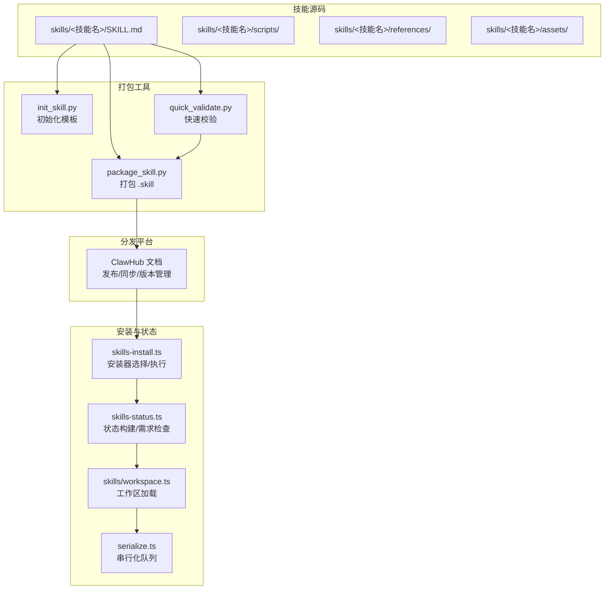
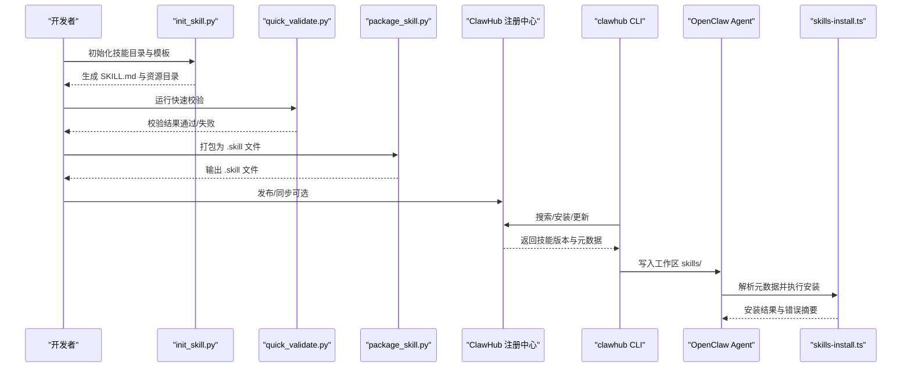
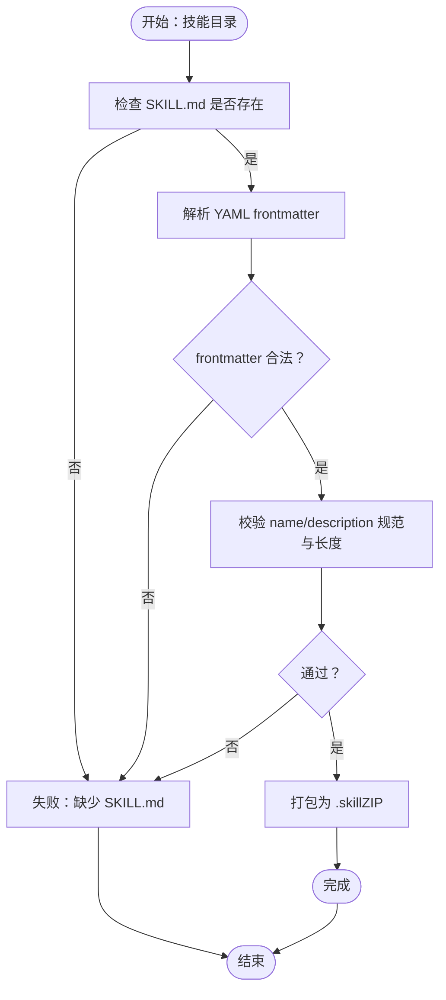
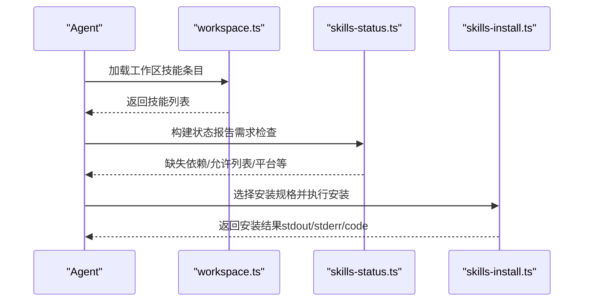
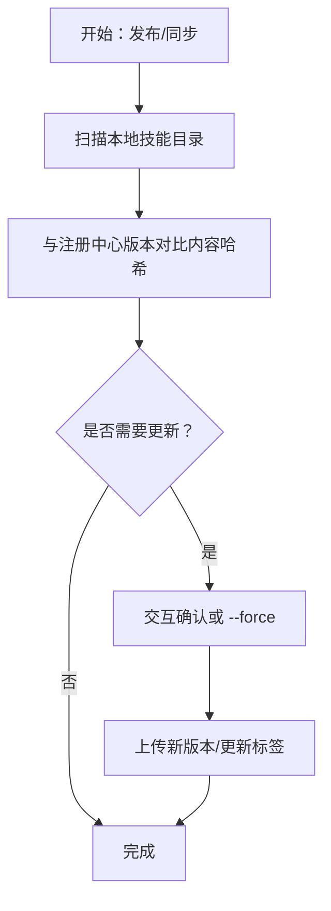

# 技能打包与分发

## 目录
1. [简介](#简介)
2. [项目结构](#项目结构)
3. [核心组件](#核心组件)
4. [架构总览](#架构总览)
5. [详细组件分析](#详细组件分析)
6. [依赖关系分析](#依赖关系分析)
7. [性能考量](#性能考量)
8. [故障排查指南](#故障排查指南)
9. [结论](#结论)
10. [附录](#附录)

## 简介
本文件面向 OpenClaw 技能的打包与分发，系统性梳理从技能开发、打包、验证、分发到安装与更新的全流程，涵盖以下关键主题：
- 技能打包与分发的完整流程与自动化工具使用
- `.skill` 文件格式与打包规范
- 技能分发与安装流程
- 技能版本管理与更新机制
- 技能市场（ClawHub）发布流程与审核要点
- 最佳实践与安全考虑
- 兼容性与依赖管理
- 分发过程中的监控与反馈机制

## 项目结构
OpenClaw 的技能生态由“技能源码”“打包工具”“安装与状态管理”“分发平台（ClawHub）”四部分组成：
- 技能源码：位于 `skills/*` 目录，每个技能以 `SKILL.md` 为核心元数据文件，可包含 `scripts/`、`references/`、`assets/` 等资源。
- 打包工具：位于 `skills/skill-creator/scripts`，提供初始化模板、快速校验与打包成 `.skill` 文件。
- 安装与状态：`src/agents` 下的技能安装与状态模块负责解析元数据、选择安装器、执行安装与状态报告。
- 分发平台：ClawHub 文档说明了注册中心、版本管理、发布与同步等能力。

## 核心组件
- 技能元数据与结构
  - `SKILL.md` 必须包含 YAML frontmatter 的 `name` 与 `description` 字段，作为触发与识别依据。
  - 可选资源：`scripts/`（可执行脚本）、`references/`（参考文档）、`assets/`（输出模板与素材）。
- 打包工具链
  - `init_skill.py`：生成标准化模板与资源目录。
  - `quick_validate.py`：校验 frontmatter 结构、字段合法性与长度限制。
  - `package_skill.py`：自动校验并通过 ZIP 格式打包为 `.skill` 文件。
- 安装与状态
  - `skills-install.ts`：解析安装规格、选择安装器（`brew`/`npm`/`go`/`uv`/`download`）、执行安装并汇总失败信息。
  - `skills-status.ts`：构建技能状态报告，检查二进制、环境变量、配置项与操作系统要求。
  - `skills/workspace.ts`：加载工作区技能条目，处理命令命名冲突与长度限制。
  - `serialize.ts`：按键串行化并发任务，避免竞态。
- 分发平台（ClawHub）
  - 提供搜索、安装、更新、发布、同步、版本标签与变更日志等能力。

## 架构总览
下图展示从技能开发到安装使用的端到端流程，以及与 ClawHub 的交互：

## 详细组件分析

### 组件A：技能打包与分发工具链
- 初始化模板
  - 生成标准化 `SKILL.md` 与可选资源目录（`scripts`/`references`/`assets`），支持示例文件注入。
- 快速校验
  - 校验 `SKILL.md` 是否存在、frontmatter 是否为合法 YAML、`name`/`description` 是否符合规范与长度限制。
- 打包为 `.skill`
  - 自动调用快速校验，通过后将技能目录整体压缩为 `.skill` 文件（ZIP 格式），文件名为 `<技能名>.skill`。

### 组件B：技能安装与状态检查
- 安装流程
  - 解析工作区技能条目，定位目标技能与安装规格。
  - 选择安装器（`brew`/`npm`/`go`/`uv`/`download`），执行安装命令并汇总输出与错误。
  - 对下载型安装，解析目标目录、归档类型并下载解压。
- 状态检查
  - 构建技能状态报告，包含二进制依赖、环境变量、配置项与操作系统要求的缺失情况。
  - 选择最优安装规格（优先策略受偏好设置影响）。

### 组件C：ClawHub 分发与版本管理
- 发布与同步
  - 支持单技能发布与批量同步，自动比较本地内容与注册中心版本，必要时提示覆盖或强制覆盖。
- 版本与标签
  - 采用语义化版本号，支持标签（如 `latest`）指向特定版本，便于回滚与发现。
- 搜索与发现
  - 基于向量检索的搜索能力，结合标签与使用信号提升排序与可见性。

### 组件D：技能市场发布流程与审核标准
- 发布流程
  - 登录（浏览器或令牌）→ 选择技能 → 设置标识/名称/版本/变更日志/标签 → 发布。
- 审核标准
  - 文档中未给出具体审核规则，建议遵循通用安全与合规原则（见“最佳实践与安全考虑”）。

## 依赖关系分析
- 技能与安装器
  - 技能元数据定义 `install` 规格（`brew`/`formula`、`node`/`package`、`go`/`module`、`uv`/`package`、`download`/`url` 等）。
  - 安装器选择受平台与偏好设置影响，优先级为 `preferBrew` → `uv` → `node` → `brew` → `go`。
- 并发与一致性
  - 通过 `serialize.ts` 的串行化队列确保同一键的任务顺序执行，避免竞态。
- 状态与需求
  - `skills-status.ts` 统一检查二进制、环境变量、配置路径与操作系统，形成缺失清单。

## 性能考量
- 打包阶段
  - 快速校验在打包前执行，减少无效打包与网络传输。
  - ZIP 压缩为 `.skill` 文件，便于传输与存储。
- 安装阶段
  - 串行化队列避免多任务并发导致的资源争用。
  - 下载安装支持超时与流式写入，降低内存占用。
- 状态检查
  - 仅在需要时加载 `references` 资源，遵循“渐进披露”原则，控制上下文窗口。

## 故障排查指南
- 打包失败
  - 症状：`package_skill.py` 报错退出。
  - 排查：确认 `SKILL.md` 存在且 frontmatter 合法；检查 `name`/`description` 规范；查看 `quick_validate.py` 输出。
- 安装失败
  - 症状：安装返回错误码与摘要信息。
  - 排查：根据失败摘要定位具体错误行；检查安装器命令是否正确（`brew`/`npm`/`go`/`uv`）；确认网络可达与下载链接有效。
- 状态异常
  - 症状：技能被标记为“缺失依赖/被允许列表阻止/平台不匹配”。
  - 排查：核对 `required.bins`/`anyBins`、环境变量、配置路径与操作系统字段；调整 `allowlist` 或安装对应二进制。
- macOS 执行缓存
  - 症状：二进制缓存过期或不一致。
  - 排查：调用刷新接口或等待缓存刷新间隔；检查 Gateway 连接状态。

## 结论
OpenClaw 的技能打包与分发体系以 `SKILL.md` 为核心元数据，配合 `init`/`validate`/`package` 工具链与 ClawHub 注册中心，实现了从开发到发布的闭环。安装与状态模块提供了稳健的跨平台安装与需求检查能力。通过语义化版本与标签管理，用户可安全地迭代与回滚技能。建议在实际使用中遵循最佳实践与安全考虑，确保技能质量与安全性。

## 附录

### `.skill` 文件格式与打包规范
- 文件格式：ZIP 压缩包，扩展名为 `.skill`。
- 文件名：以技能名命名，如 `<技能名>.skill`。
- 内容：技能目录的完整副本，包含 `SKILL.md` 与可选资源目录（`scripts`/`references`/`assets`）。
- 打包流程：先快速校验，再打包；失败时输出明确错误信息。

### 技能分发与安装流程
- 分发：通过 ClawHub 发布或同步，支持单个技能与批量同步。
- 安装：Agent 侧解析元数据，选择安装器并执行；下载型安装支持自定义目标目录与归档类型。
- 状态：构建状态报告，列出缺失依赖与平台/配置限制。

### 版本管理与更新机制
- 版本：语义化版本号，每次发布创建新版本。
- 标签：如 `latest`，可指向特定版本并支持回滚。
- 更新：支持按 `slug` 单个更新与全量更新；同步时比较内容哈希并提示覆盖。

### 技能市场的发布流程与审核标准
- 发布：登录 → 选择技能 → 设置标识/名称/版本/变更日志/标签 → 发布。
- 审核：文档未提供具体规则，建议遵循通用安全与合规原则。

### 最佳实践与安全考虑
- 前言元数据：仅保留 `name` 与 `description`，避免冗余字段。
- 描述规范：简洁、明确、不含非法字符，长度受限。
- 资源组织：遵循渐进披露原则，将详细内容放入 `references`，保持 `SKILL.md` 精简。
- 安装器选择：优先使用系统包管理器（`brew`/`npm`/`go`/`uv`），确保可重复与可审计。
- 安全：避免在 `SKILL.md` 中包含敏感信息；下载型安装需校验来源与完整性。

### 兼容性与依赖管理
- 平台过滤：`install` 规格可声明 `os` 列表，仅在匹配平台显示。
- 二进制与环境：通过 `requirements` 字段声明必需二进制、环境变量与配置路径。
- 依赖解析：优先使用系统可用二进制，远程平台可补充检测。

### 监控与反馈机制
- 安装输出摘要：失败时提取错误行并截断输出，便于诊断。
- 状态报告：统计就绪/禁用/被允许列表阻止/缺失需求等指标。
- 遥测：同步时可发送最小快照用于安装计数，支持禁用。