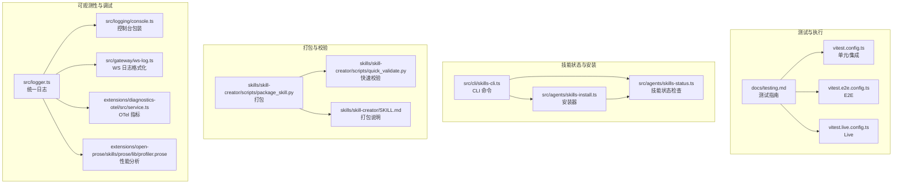
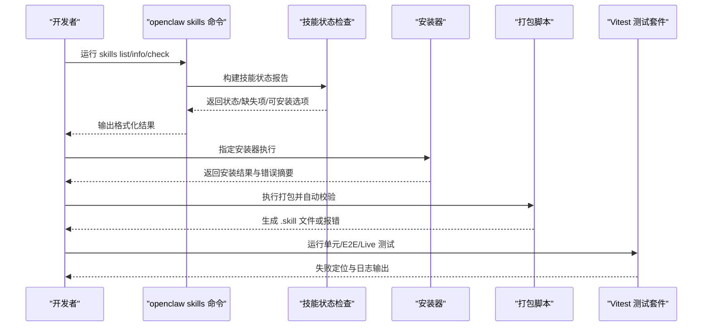
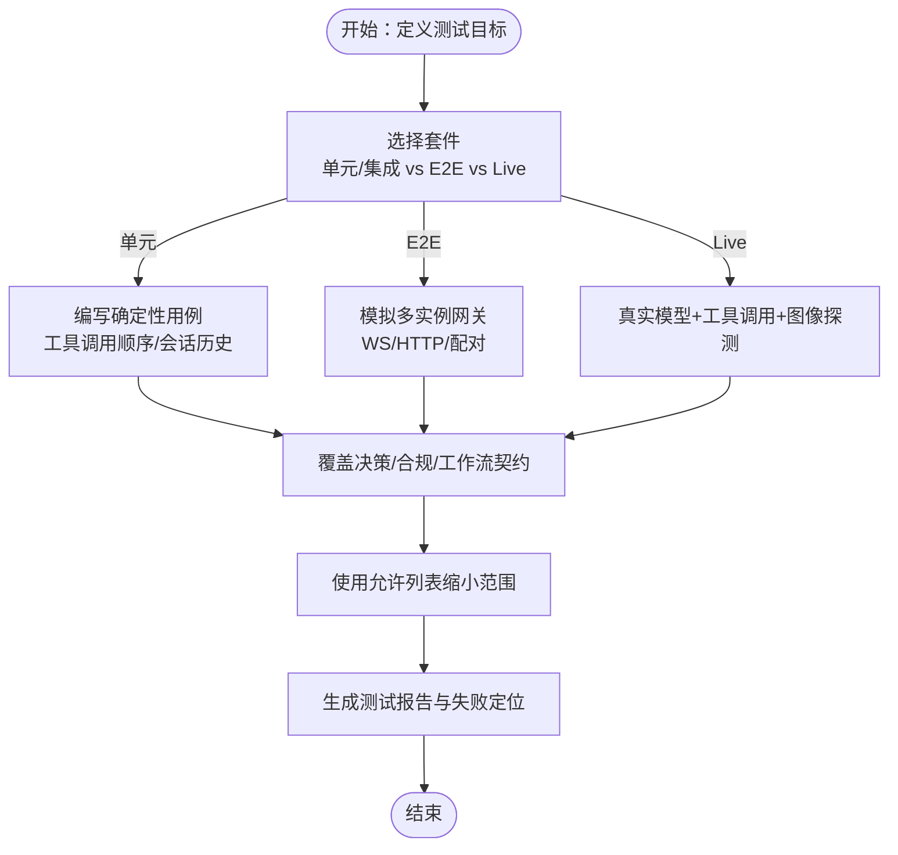
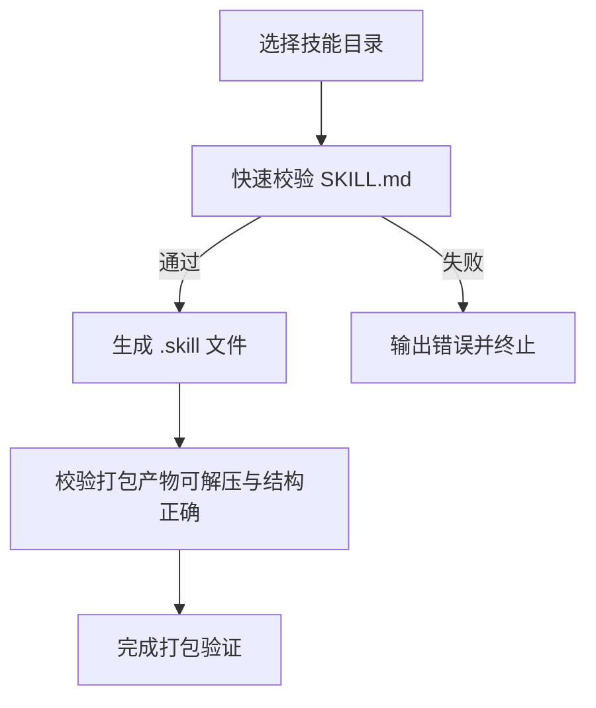
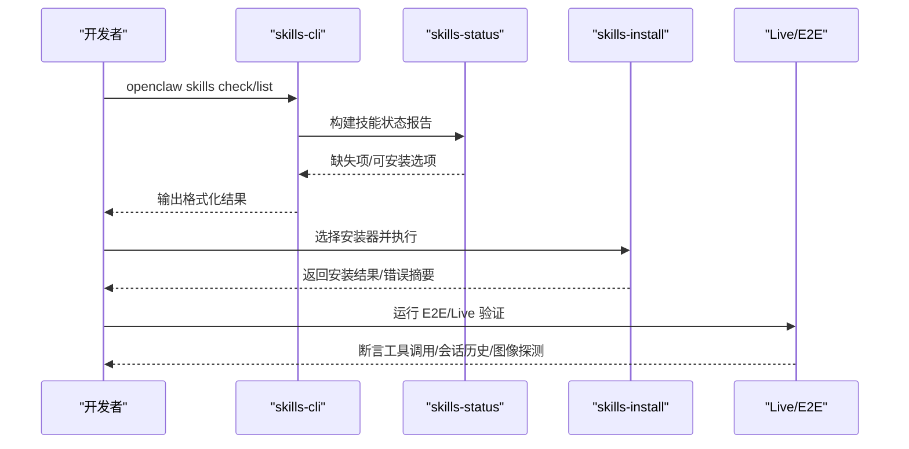
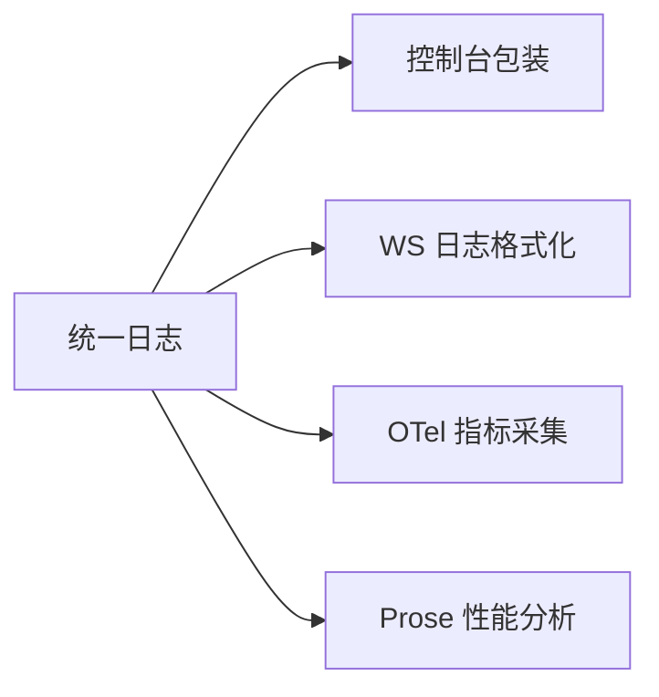
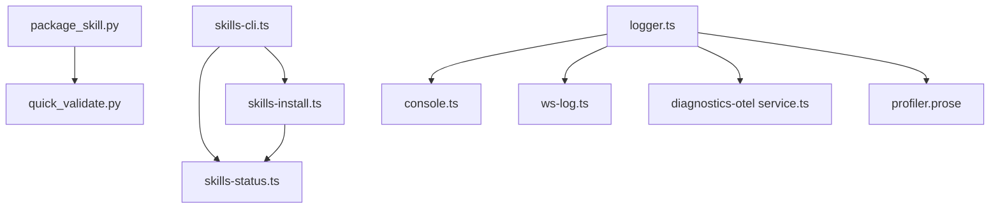

# 技能测试与调试

## 目录
1. [引言](#引言)
2. [项目结构](#项目结构)
3. [核心组件](#核心组件)
4. [架构总览](#架构总览)
5. [详细组件分析](#详细组件分析)
6. [依赖关系分析](#依赖关系分析)
7. [性能考量](#性能考量)
8. [故障排查指南](#故障排查指南)
9. [结论](#结论)
10. [附录](#附录)

## 引言
本文件面向 OpenClaw 技能测试与调试，系统化地给出测试策略、用例设计方法、技能打包验证流程、安装与运行测试方法、调试技术与问题定位、性能测试与优化策略、自动化与持续集成实践，以及常见问题与解决方案。目标是帮助开发者在本地与 CI 环境中高效、稳定地验证技能的质量与行为。

## 项目结构
围绕“技能测试与调试”的关键目录与文件包括：
- 测试框架与套件：Vitest 配置（单元/集成、E2E、Live）
- 技能状态与安装：技能状态检查、安装器、CLI 命令
- 技能打包与校验：技能包生成脚本与快速校验脚本
- 日志与可观测性：统一日志、控制台包装、WebSocket 日志格式化、OTel 指标采集
- 性能分析：Prose Profiler 脚本用于成本与时间归因分析

## 核心组件
- 测试套件与命令
  - 单元/集成：默认 Vitest 配置，带覆盖率阈值与排除规则
  - E2E：多实例网关端到端，侧重网络与配对
  - Live：真实提供商与模型，含模型直连与网关烟雾测试
- 技能状态与安装
  - 技能状态检查：收集缺失项（二进制、环境变量、配置、OS）、可安装选项
  - 安装器：支持 brew/npm/pnpm/yarn/go/uv/download 等安装方式
  - CLI：`skills list/info/check` 输出与格式化
- 打包与校验
  - 快速校验：`SKILL.md` 前言校验、字段与长度限制
  - 打包：将技能目录压缩为 `.skill` 文件，保持目录结构
- 可观测性与调试
  - 统一日志、控制台包装、WS 日志格式化
  - OTel 指标：token 使用、耗时、上下文、队列深度等
  - Prose Profiler：成本、时间、效率、缓存与热点分析

## 架构总览
下图展示从“测试命令”到“技能状态/安装/打包/调试”的整体流程与交互。

## 详细组件分析

### 测试策略与用例设计
- 套件选择与职责
  - 单元/集成：纯单元与进程内集成，确定性回归，CI 必跑
  - E2E：网关多实例、WS/HTTP、节点配对等重网络场景
  - Live：真实提供商与模型，覆盖工具调用、图像探测、会话历史等
- 用例设计要点
  - 分层断言：先断言工具调用顺序与会话历史，再断言沙箱边界
  - 场景覆盖：决策（是否使用技能）、合规（读取并遵循 `SKILL.md`）、工作流契约（多轮、上下文传递）
  - 约束与隔离：通过允许列表缩小范围，分离“提供商 API 是否可用”与“网关代理链路是否可用”

### 技能打包验证流程与标准
- 自动校验内容
  - `SKILL.md` 存在且包含 YAML 前言
  - 前言键合法（名称、描述、许可证、允许工具、元数据）
  - 描述长度与字符限制
- 打包流程
  - 校验通过后，将技能目录压缩为 `.skill` 文件（zip），保留目录结构
- 质量标准
  - 前言格式正确、描述完整、命名与目录规范、资源引用清晰
  - 打包产物可被后续安装流程识别与解压

### 技能安装与运行测试
- 安装路径选择
  - brew/npm/pnpm/yarn/go/uv/download 等，按偏好与平台选择
  - 下载型安装：支持检测压缩类型、解压与 stripComponents
- 失败诊断
  - 提取 stdout/stderr 中的错误摘要，限制长度便于阅读
- 运行测试
  - 使用 `openclaw skills list/info/check` 获取技能就绪状态
  - 结合 Live 套件验证工具调用与图像探测

### 调试技术与问题定位
- 日志与输出
  - 统一日志接口，支持子系统拆分与文件落盘
  - 控制台包装保留原始输出句柄，便于调试
  - WebSocket 日志格式化，截断过长消息
- 观测性指标
  - OTel 计数器与直方图：token 输入/输出/缓存/提示/总计、耗时、上下文、队列深度与等待
- 性能分析
  - Prose Profiler：成本归属、时间归属、效率、缓存效率、热点分析

### 性能测试与优化策略
- 指标采集
  - token 使用、耗时、上下文限制与使用量、队列深度与等待时间
- 分析维度
  - 成本归属（VM 开销 vs 子代理成本）
  - 时间归属（墙钟 vs 会话时长之和、并行因子）
  - 效率（成本/秒、吞吐、昂贵且快 vs 昂贵且慢）
  - 缓存效率（读/写比）
  - 热点（按成本与时间排序）
- 优化建议
  - 优先并行化高价值任务；避免在简单任务上使用昂贵模型
  - 优化缓存命中率与读写比例
  - 识别并减少瓶颈绑定（如工具调用或模型响应）

### 自动化与持续集成实践
- 套件与命令
  - 全量门禁：构建 + 校验 + 测试
  - 覆盖率门禁：覆盖率阈值
  - E2E/Live：按需启用，推荐使用允许列表缩小范围
- CI 安全回归
  - 网关工具调用（Mock OpenAI）+ 网关向导（WS 启动/下一步）
- Docker 运行器
  - 直连模型、网关烟雾、引导向导、网关网络、插件加载等

## 依赖关系分析
- 组件耦合
  - CLI 依赖技能状态与安装模块，形成“状态查询—安装—测试”的闭环
  - 打包脚本依赖快速校验，确保前置条件满足
  - 日志与可观测性贯穿测试与运行期，提供一致的失败定位能力
- 外部依赖
  - Vitest、Node 进程执行、fetchGuard、PATH 工具（tar/unzip/brew/go/uv 等）

## 性能考量
- 测试阶段
  - 使用允许列表聚焦关键模型，降低 Live 成本与波动
  - 将“提供商 API 可用性”与“网关代理链路”分层验证，快速定位问题域
- 运行阶段
  - 通过 OTel 指标与 Profiler 报告，持续监控成本与效率
  - 优化工具调用与模型选择策略，提升吞吐与性价比

## 故障排查指南
- 安装失败
  - 查看安装器返回的 stdout/stderr 错误摘要，关注“exit 代码 + 关键错误行”
  - 若缺少 tar/unzip/brew/go/uv 等工具，按提示安装或切换安装器
- 技能不可用
  - 使用 `openclaw skills check/list/info` 查看缺失项（二进制、环境变量、配置、OS）
  - 按提示安装对应依赖或调整配置
- Live 失败
  - 使用允许列表缩小范围（`OPENCLAW_LIVE_MODELS` / `OPENCLAW_LIVE_GATEWAY_MODELS`）
  - 确认凭据来源（配置/配置文件/环境变量），必要时使用 Docker 运行器挂载凭据
- 日志与可观测性
  - 统一日志接口与 WS 日志格式化，结合 OTel 指标与 Profiler 报告定位瓶颈

## 结论
通过明确的测试分层、严格的技能打包校验、完善的安装与运行测试流程、系统化的调试与可观测性手段，以及性能指标与分析工具，OpenClaw 能够在本地与 CI 环境中稳定地验证技能质量，并持续优化其可靠性与效率。建议在日常开发中优先使用单元/集成与 E2E，仅在必要时启用 Live 并严格限定范围，同时配合 CLI 与日志工具进行快速定位与修复。

## 附录
- 常用命令与环境变量
  - 全量门禁：构建 + 校验 + 测试
  - 覆盖率门禁：覆盖率阈值
  - Live：`OPENCLAW_LIVE_MODELS` / `OPENCLAW_LIVE_GATEWAY_MODELS` / `OPENCLAW_LIVE_PROVIDERS` 等
- 文档与指南
  - 测试指南与推荐配方
  - 技能打包与校验说明