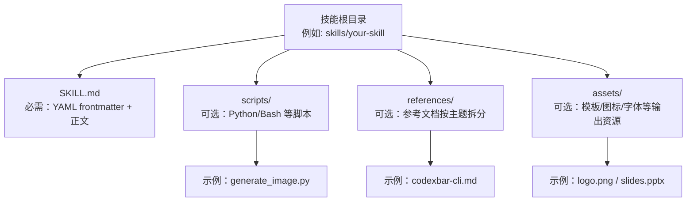
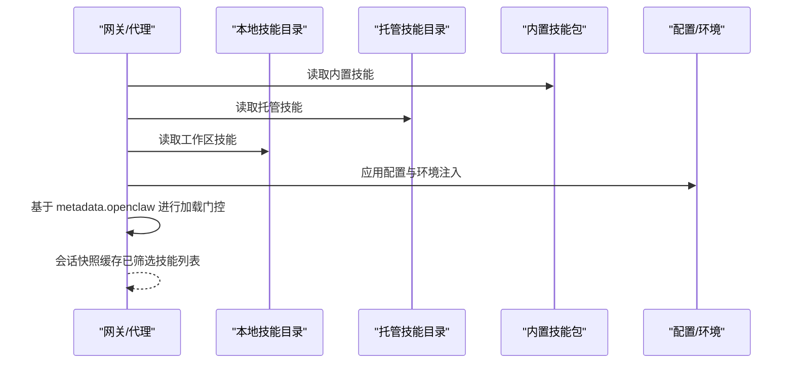

# 技能项目结构规范

## 目录
1. [引言](#引言)
2. [项目结构](#项目结构)
3. [核心组件](#核心组件)
4. [架构总览](#架构总览)
5. [详细组件分析](#详细组件分析)
6. [依赖关系分析](#依赖关系分析)
7. [性能考量](#性能考量)
8. [故障排查指南](#故障排查指南)
9. [结论](#结论)
10. [附录](#附录)

## 引言
本规范面向 OpenClaw 技能（Skill）项目，系统化定义技能目录的标准结构、文件组织原则与元数据管理方法，明确 `SKILL.md` 的 YAML frontmatter 规范与内容要求，阐述 `scripts/`、`references/`、`assets/` 目录的作用与命名规范，并总结技能资源的分类与组织策略。同时提供标准化模板与最佳实践，给出设计原则与扩展性建议，并针对常见问题提出优化方案。

## 项目结构
OpenClaw 技能以“目录即技能包”的方式组织，每个技能目录包含：
- 必需：`SKILL.md`（含 YAML frontmatter 与正文）
- 可选：`scripts/`（可执行脚本）、`references/`（参考文档）、`assets/`（输出资源）

下图展示技能目录的典型结构与文件职责：

## 核心组件
- `SKILL.md`：技能的“说明书”，包含触发元数据与使用指导；正文仅在技能被触发后加载，以控制上下文开销。
- `scripts/`：可执行脚本集合，用于确定性任务或重复性工作流，支持直接运行与按需读取。
- `references/`：按主题拆分的参考文档，按需加载到上下文，避免 `SKILL.md` 过长。
- `assets/`：最终产物使用的资源（模板、图片、字体等），不直接加载到上下文。

## 架构总览
技能系统通过“位置优先级 + 加载门控 + 配置注入”的机制实现可发现、可筛选、可复用的能力集合。下图展示技能加载与过滤的关键流程：

## 详细组件分析

### `SKILL.md` 的 YAML frontmatter 规范与内容要求
- 必填字段
  - `name`：技能名称（小写字母、数字、连字符组成，长度限制，无前导/尾随连字符，不含连续连字符）
  - `description`：技能描述（简洁、明确触发条件与适用场景，不含尖括号，长度限制）
- 可选字段
  - `homepage`：技能主页链接（用于 UI 展示）
  - `user-invocable`：是否作为用户命令暴露（默认 true）
  - `disable-model-invocation`：是否从模型提示中排除（仍可通过用户调用）
  - `command-dispatch`：slash 命令是否直连工具（tool）
  - `command-tool`：当 `command-dispatch: tool` 时指定工具名
  - `command-arg-mode`：raw（透传原始参数字符串）
- 元数据 `metadata.openclaw`
  - `emoji`：UI 表情
  - `homepage`：UI 展示网站
  - `os`：平台白名单（darwin/linux/win32）
  - `requires.bins` / `requires.anyBins`：二进制依赖（PATH 存在）
  - `requires.env`：环境变量（进程或配置提供）
  - `requires.config`：配置路径布尔值
  - `primaryEnv`：与 `apiKey` 对应的主密钥变量
  - `install`：安装器清单（brew/node/go/download 等）
  - `always`：强制包含（跳过其他门控）
- 解析与格式约束
  - frontmatter 为单行 JSON 对象（metadata）与单行键值（除 metadata 外）
  - 支持 `{baseDir}` 占位符引用技能根目录

### `scripts/` 目录：脚本组织与命名规范
- 用途：存放可执行脚本（Python/Bash 等），用于确定性任务与重复性工作流
- 命名：采用语义化文件名，如 `generate_image.py`、`frame.sh`、`transcribe.sh`
- 执行：可直接运行，亦可在 `SKILL.md` 中通过 `{baseDir}` 引用
- 示例：图像生成、视频帧提取、转录等

### `references/` 目录：参考文档的分类与组织
- 用途：按主题拆分的参考材料，按需加载到上下文
- 组织：按领域/子域划分（如财务、销售、产品、营销），或按变体（AWS/GCP/Azure）
- 最佳实践：长文档提供目录；避免与 `SKILL.md` 重复；仅保留核心流程在 `SKILL.md`
- 示例：schema 文档、API 参考、公司政策、工作流指南

### `assets/` 目录：输出资源与模板
- 用途：最终产物使用的资源（模板、图标、字体、样本文档等）
- 原则：不加载到上下文，仅在输出阶段使用
- 示例：品牌素材、PPT 模板、前端样板、字体文件

### 元数据定义与管理方法
- 元数据入口：`SKILL.md` frontmatter 的 `metadata` 字段（单行 JSON）
- 关键键值：
  - `openclaw.requires`：二进制/环境/配置依赖
  - `openclaw.install`：安装器清单（brew/node/go/download）
  - `openclaw.os`：平台白名单
  - `openclaw.primaryEnv`：与 `apiKey` 对应的主密钥变量
  - `openclaw.emoji`/`homepage`：UI 展示
- 加载门控：在加载时根据环境、配置、二进制存在性进行筛选
- 配置覆盖：通过 `openclaw.json` 的 `skills.entries.<key>` 注入启用、密钥、环境与自定义配置

### 标准化模板与最佳实践
- 目录命名：小写、短横线连接，不超过 64 字符；与技能名称一致
- 结构化内容：先在 `SKILL.md` 写核心流程与触发条件，再将细节放入 `references`
- 脚本化：重复性高、确定性强的任务使用 `scripts/`，减少上下文负担
- 资源分离：`assets/` 仅放最终产物资源，不加载到上下文
- 安全：敏感信息通过配置注入，不在提示词与日志中泄露
- 可发现性：合理使用 `metadata.openclaw.install` 与 `homepage`

### 设计原则与扩展性考虑
- 上下文效率：遵循“元数据常驻、正文按需、资源按需”的三级加载
- 可维护性：将复杂细节移至 `references`，保持 `SKILL.md` 精简
- 可移植性：通过 `metadata.openclaw.requires` 与 `install` 描述依赖与安装路径
- 可扩展性：支持多平台（`os`）、多变体（`references` 下按主题拆分）、多工具（`scripts/` 工具化）

## 依赖关系分析
技能的可用性由“位置优先级 + 加载门控 + 配置注入”共同决定。下图展示依赖链与耦合点：

## 性能考量
- 技能列表注入成本：系统提示中注入技能列表有固定开销，受字段长度与 XML 转义影响
- 上下文窗口：正文仅在触发后加载；`references` 按需加载；`scripts` 可在不读入上下文的情况下执行
- 会话快照：会话开始时快照已筛选技能列表，后续轮次复用，降低重复计算

## 故障排查指南
- 常见问题
  - `SKILL.md` 缺少 frontmatter 或格式错误
  - `name`/`description` 不符合规范（非法字符、长度超限、包含尖括号）
  - 未满足加载门控（缺少二进制、环境变量或配置）
  - 资源引用路径错误（未使用 `{baseDir}`）
- 排查步骤
  - 使用快速校验脚本检查 frontmatter 与命名
  - 检查 `metadata.openclaw.requires` 是否满足
  - 在 `openclaw.json` 中确认 `skills.entries.<key>` 的启用与密钥注入
  - 确认 `scripts/` 文件具备可执行权限与正确 shebang
- 相关工具
  - 初始化：`init_skill.py`
  - 打包：`package_skill.py`（内部调用 `quick_validate.py`）
  - 校验：`quick_validate.py`

## 结论
OpenClaw 技能体系以“目录即包、元数据驱动、按需加载”为核心理念，通过严格的结构规范与门控机制，确保技能在安全性、可维护性与性能之间取得平衡。遵循本规范可显著提升技能的可发现性、可移植性与复用价值。

## 附录

### `SKILL.md` frontmatter 字段对照表
- 必填
  - `name`：技能名称（小写、短横线、长度限制）
  - `description`：触发条件与适用场景（简洁、不含尖括号、长度限制）
- 可选
  - `homepage`：主页链接
  - `user-invocable`：是否暴露为用户命令
  - `disable-model-invocation`：是否从模型提示中排除
  - `command-dispatch`：slash 命令直连工具
  - `command-tool`：直连工具名
  - `command-arg-mode`：raw
- 元数据 `metadata.openclaw`
  - `emoji`/`homepage`：UI 展示
  - `os`：平台白名单
  - `requires.bins` / `requires.anyBins`：二进制依赖
  - `requires.env`：环境变量
  - `requires.config`：配置路径布尔值
  - `primaryEnv`：与 `apiKey` 对应的主密钥变量
  - `install`：安装器清单
  - `always`：强制包含

### 资源组织策略
- `scripts/`：确定性、可复用的自动化脚本
- `references/`：按主题/变体拆分的参考文档，避免冗长正文
- `assets/`：最终产物资源，不加载到上下文