# 技能架构原理

## 目录
1. [引言](#引言)
2. [项目结构](#项目结构)
3. [核心组件](#核心组件)
4. [架构总览](#架构总览)
5. [组件详解](#组件详解)
6. [依赖关系分析](#依赖关系分析)
7. [性能考量](#性能考量)
8. [故障排查指南](#故障排查指南)
9. [结论](#结论)
10. [附录](#附录)

## 引言
本文件系统化阐述 OpenClaw 技能架构的设计理念、架构模式与组件关系，覆盖技能注册表系统、技能生命周期管理、技能发现与命令分发、与代理系统的集成、执行上下文与权限模型、沙箱执行与安全边界、以及工作空间技能管理与优先级机制。文档同时提供架构图与组件交互流程，帮助读者快速理解并扩展该技能体系。

## 项目结构
技能系统围绕“工作空间”组织，通过多源目录加载技能（额外目录、内置打包、托管、工作空间），在运行时进行过滤、去重与命令规范化，并通过网关 RPC 暴露状态查询与安装等能力；同时结合执行审批与沙箱策略实现安全边界与可控执行。

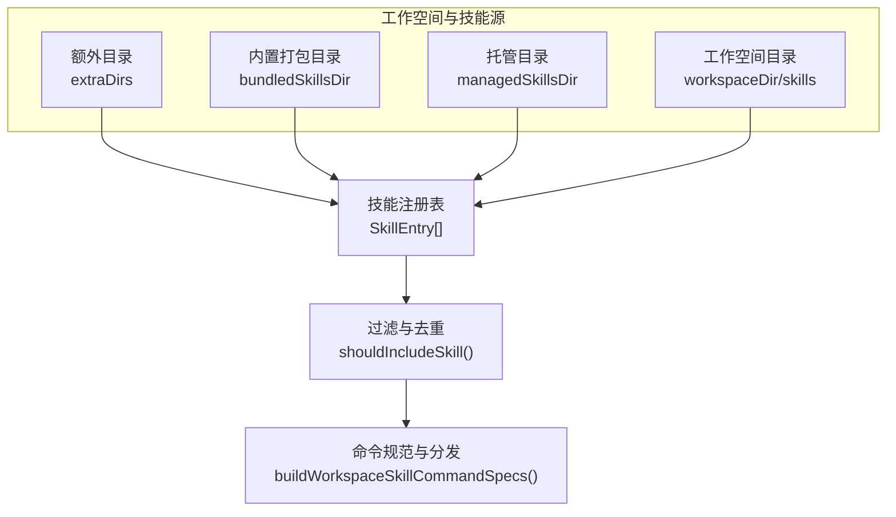

## 核心组件
- 技能注册表与发现：从多源目录合并加载技能，解析 Frontmatter，生成 `SkillEntry` 并按配置与环境进行过滤。
- 技能生命周期：构建快照（Snapshot）与提示词（Prompt），支持按会话或全局缓存；同步技能到沙箱工作区。
- 技能命令系统：规范化命令名、去重、限制长度与描述长度，支持工具分发策略。
- 权限与执行审批：基于安全级别、询问策略与允许清单的综合判定，支持通配代理与自动放行技能。
- 沙箱执行：容器化隔离、工作区挂载与访问控制、浏览器沙箱、运行时状态解析与清理。
- 网关与 CLI：提供技能状态查询、二进制集合收集、安装与更新接口，CLI 提供状态检查输出。

## 架构总览
下图展示从“工作空间加载技能”到“命令分发与执行”的端到端流程，包括权限审批与沙箱执行的关键节点。

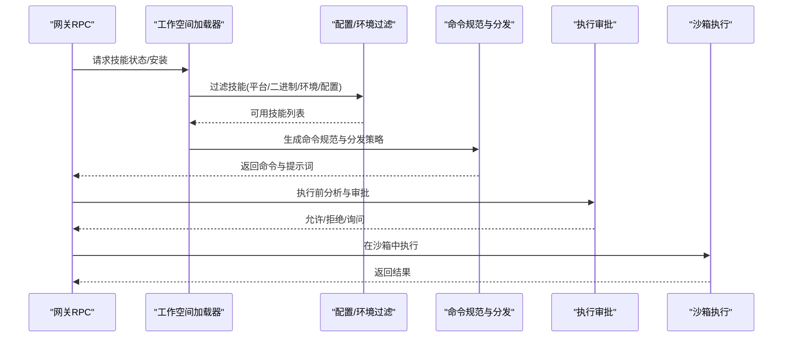

## 组件详解

### 技能注册表与工作空间管理
- 多源加载：额外目录、内置打包、托管、工作空间目录，按优先级合并，避免重复。
- Frontmatter 解析：提取元数据（OS、二进制依赖、环境变量、安装说明）、调用策略（用户可调用、禁用模型调用）。
- 过滤规则：按配置开关、平台匹配、二进制/环境/配置依赖、内置 always 标记等综合判定。
- 命令规范：规范化命令名、去重、长度与描述截断、工具分发策略（dispatch）。
- 快照与提示词：构建技能提示词与快照，支持按会话复用与版本控制。
- 同步到沙箱：序列化复制技能至沙箱工作区，保证并发安全。

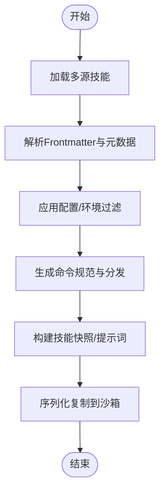

### 技能生命周期管理
- 快照版本：支持按会话或全局版本号，避免频繁重建。
- 提示词复用：优先使用已缓存的提示词，否则动态生成。
- 技能过滤：支持按名称白名单过滤，便于调试与聚焦。
- 同步策略：对目标工作区进行串行化同步，避免竞态与覆盖丢失。

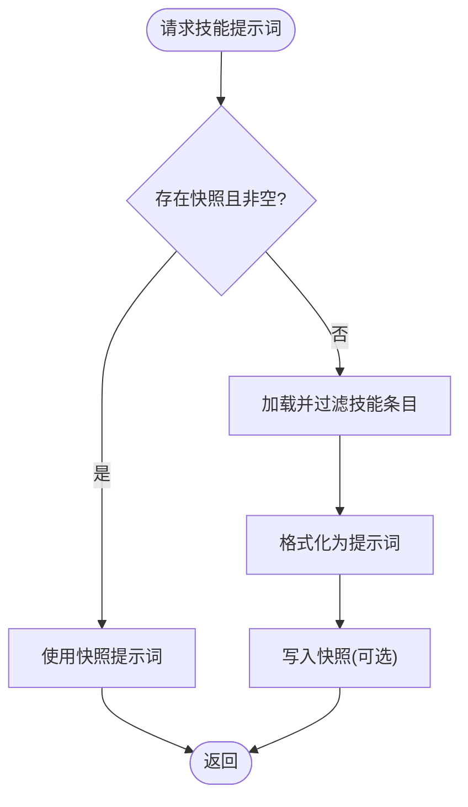

### 技能发现与命令分发
- 命令名规范化：小写、替换非法字符、截断长度、回退默认名。
- 去重策略：基于已使用集合，追加序号后缀，确保唯一性。
- 描述长度限制：Discord 描述长度上限处理。
- 工具分发：支持将命令直接转发给工具（tool），参数模式可声明为 raw。
- 列举与查找：跨代理聚合命令规范，提供大小写/标准化查找。

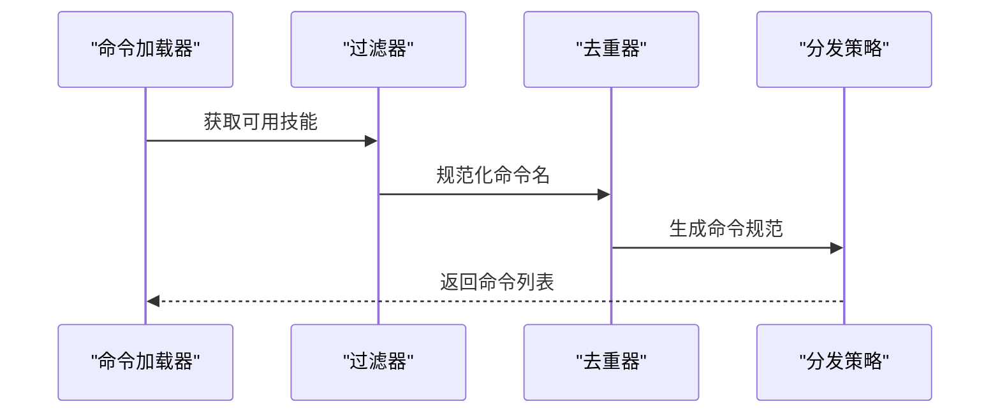

### 技能与代理系统的集成
- 会话上下文：在代理运行时注册会话键与详细级别，按需构建技能快照。
- 技能提示注入：将可用技能提示词注入到推理上下文中，控制是否允许模型调用。
- 会话策略：根据会话策略决定是否允许发送消息，避免越权。

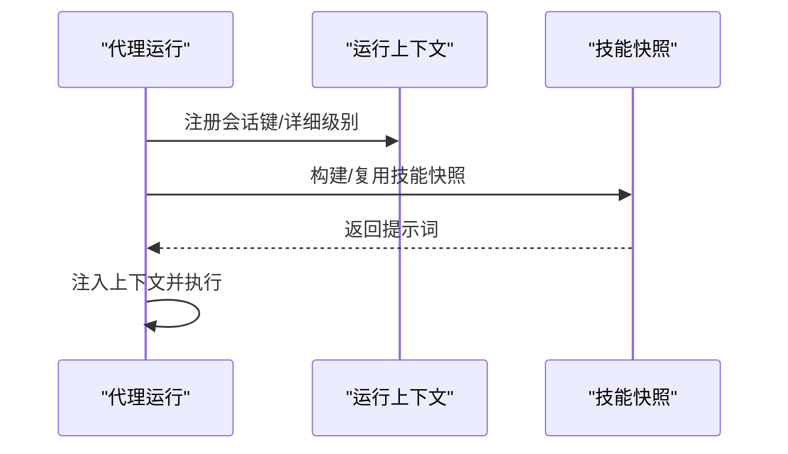

### 技能配置解析与优先级机制
- 配置路径解析：支持点号路径访问，带默认值处理。
- 平台与二进制依赖：按运行平台与 PATH 中二进制存在性判断；远程平台可补充 `hasBin`/`hasAnyBin`。
- 环境变量与配置项：要求环境变量存在或配置项为真；主密钥环境可由 `primaryEnv` 推导。
- 内置 always：标记为 always 的技能始终纳入。
- 优先级顺序：额外目录 < 内置打包 < 托管 < 工作空间，后者覆盖前者。

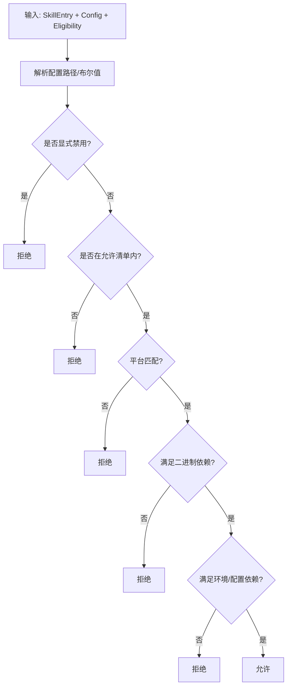

### 权限模型、执行审批与安全边界
- 安全级别：deny（禁止）、allowlist（仅允许清单）、full（宽松）。
- 询问策略：off（不询问）、on-miss（未命中允许清单时询问）、always（总是询问）。
- 允许清单：支持通配符与路径匹配，支持最后使用时间记录。
- 自动放行技能：当允许清单满足时，可自动放行技能二进制。
- 网关侧策略合并：默认、代理与通配代理合并，最终形成代理生效策略。

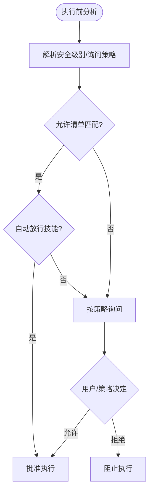

### 沙箱执行与安全边界
- 上下文解析：根据会话键与代理 ID 决定是否启用沙箱，解析运行时状态与配置。
- 容器与工作区：按访问级别（none/ro）挂载工作区与代理工作区，必要时创建容器。
- 浏览器沙箱：按需准备浏览器容器，支持设置命令与工作目录。
- 清理与修剪：定期清理过期沙箱，保持资源健康。

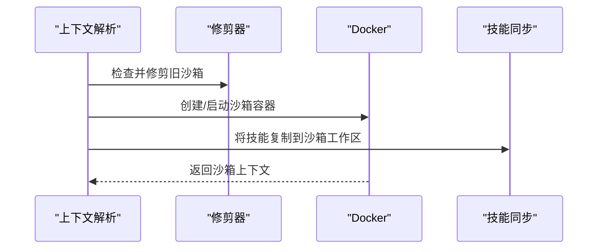

### 网关与 CLI 集成
- 网关方法：提供 `skills.status`、`skills.bins`、`skills.install`、`skills.update` 等 RPC 接口，统一校验参数与返回错误码。
- CLI 输出：以结构化文本输出技能状态检查结果，包含总数、就绪、禁用、缺失依赖等统计。
- 二进制集合：聚合所有工作空间的技能二进制需求，用于前端与客户端显示。

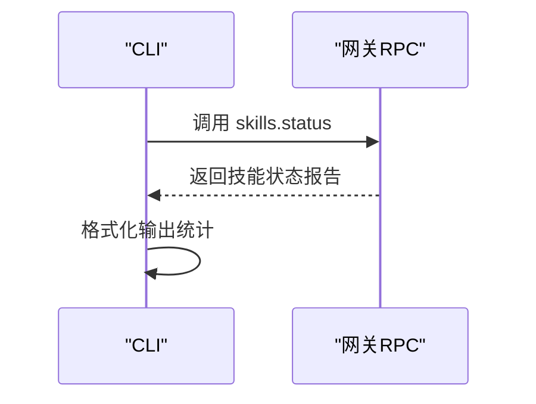

### 用户界面与设置
- macOS 设置：技能过滤（全部/就绪/待设置/禁用），实时刷新与状态展示。
- Web UI：技能列表渲染、过滤、刷新、切换启用状态、编辑与保存、安装操作。
- 网关技能二进制集合：周期性刷新，缓存过期控制，用于 UI 展示与策略评估。

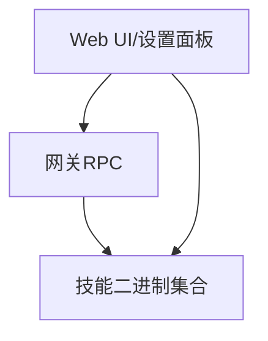

## 依赖关系分析
- 组件耦合：工作空间模块与配置/环境模块强耦合，但通过类型与函数边界清晰；命令规范与前端展示解耦。
- 外部依赖：PATH 查询、文件系统、Docker 客户端、网关 RPC、UI 渲染框架。
- 循环依赖：未见直接循环；权限模块与沙箱模块通过上下文间接协作。
- 关键接口契约：Frontmatter 键名兼容旧版、命令分发策略明确、快照版本号控制一致性。

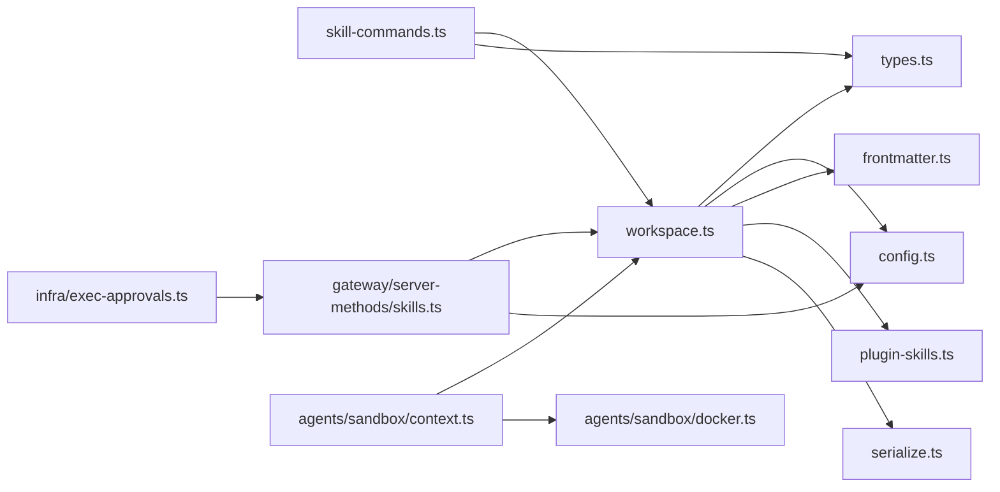

## 性能考量
- 并发控制：使用串行队列（`serializeByKey`）保障同一目标工作区的技能同步不会并发冲突，降低磁盘竞争与状态不一致风险。
- 缓存与快照：优先使用技能快照与提示词，减少重复解析与格式化成本；快照版本号控制失效策略。
- 过滤前置：在加载阶段尽早过滤不可用技能，缩小后续处理规模。
- 二进制扫描：`hasBinary` 与 PATH 遍历为 O(n)，建议在高频场景下缓存结果或按需刷新。
- 沙箱复制：仅在需要时复制技能，避免不必要的 IO；ro 访问时仍需复制以保证隔离。

## 故障排查指南
- 技能未显示或被过滤
  - 检查配置开关、平台匹配、二进制/环境/配置依赖是否满足。
  - 使用 CLI 技能状态检查输出定位“缺失依赖/被允许清单阻断/禁用”等问题。
- 命令冲突或重复
  - 查看命令规范化与去重逻辑，确认是否因命名冲突导致重命名。
- 执行被阻止
  - 检查安全级别、询问策略与允许清单；确认是否命中自动放行技能。
- 沙箱未生效或复制失败
  - 核对沙箱模式与作用域，确认容器创建与工作区挂载成功；查看技能复制日志。

## 结论
OpenClaw 技能架构以“工作空间为中心”，通过多源加载、严格过滤与命令规范化，结合执行审批与沙箱隔离，实现了可发现、可治理、可审计的技能生态。其设计强调可扩展性（插件技能目录、允许清单、代理特定沙箱配置）与可维护性（快照、串行化同步、UI 集成）。未来可在以下方向持续演进：更细粒度的权限与策略组合、跨代理共享的沙箱缓存、更丰富的安装与依赖解析策略。

## 附录
- 设计决策与权衡
  - 优先级顺序：后加载覆盖先加载，简化冲突处理但需注意迁移策略。
  - 默认行为：deny 安全级别与 on-miss 询问策略作为默认，兼顾安全与可用性。
  - 命令规范：长度与描述限制提升跨渠道兼容性。
- 扩展性设计
  - 插件技能目录：通过插件清单动态扩展技能源。
  - 代理特定沙箱：支持按代理覆盖沙箱模式、作用域与工作区根路径。
- 关键流程图（概念）
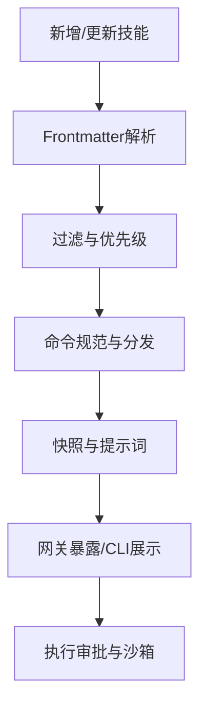