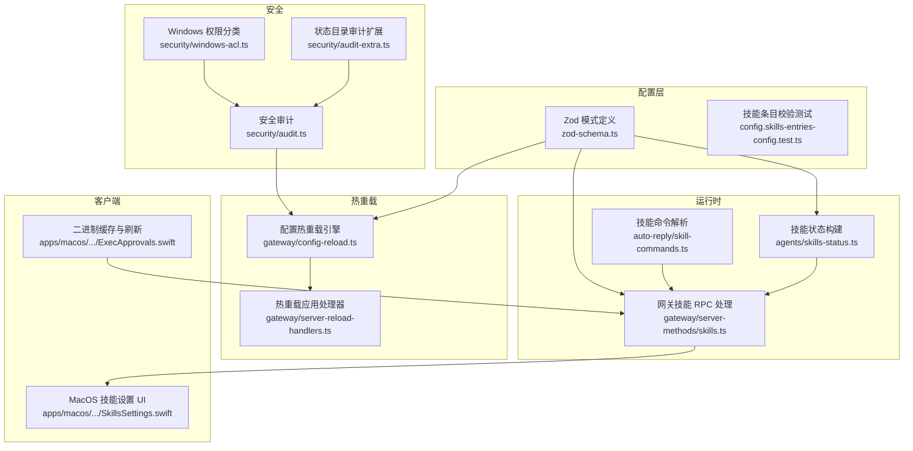
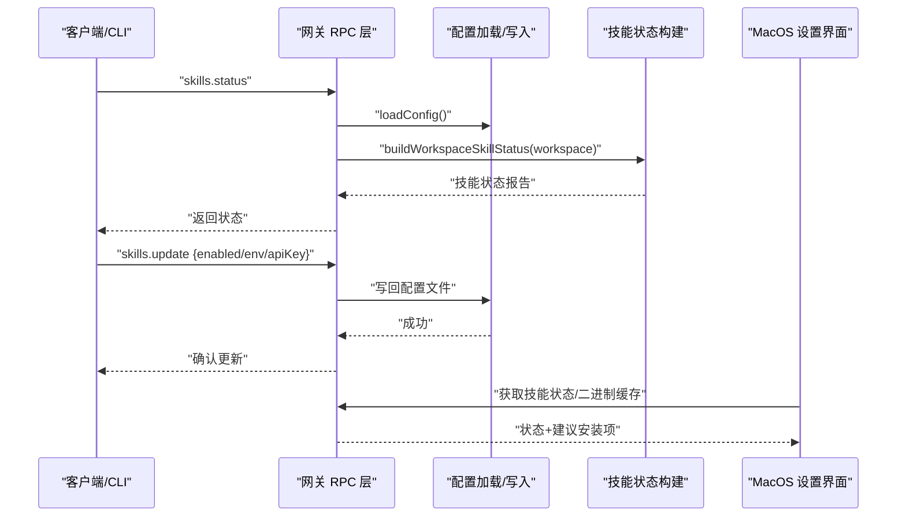
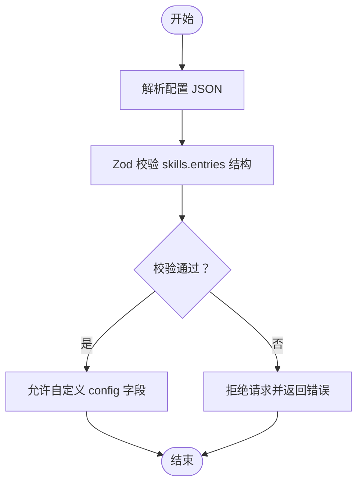
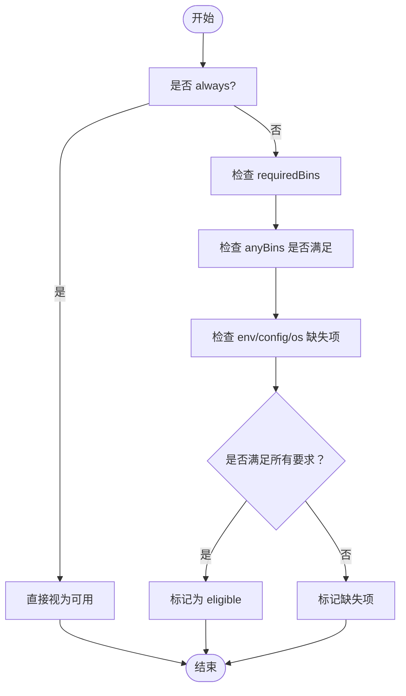
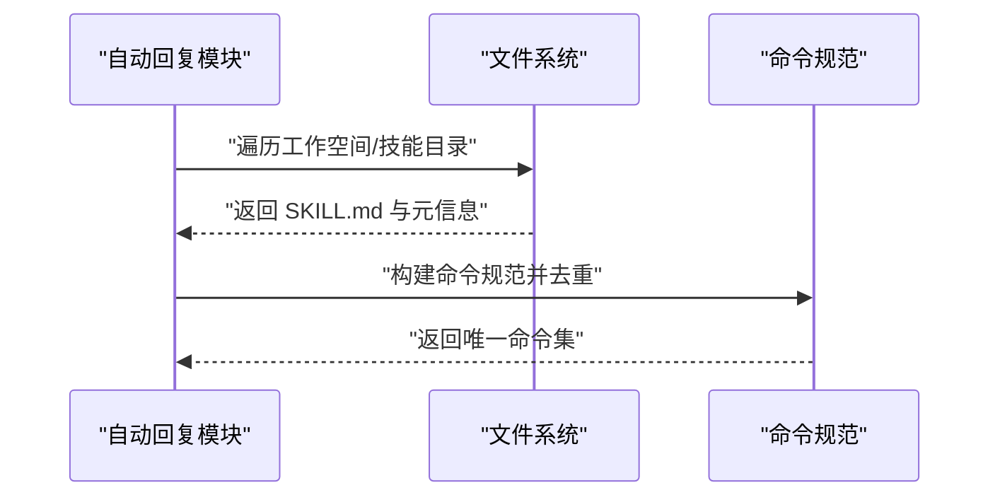
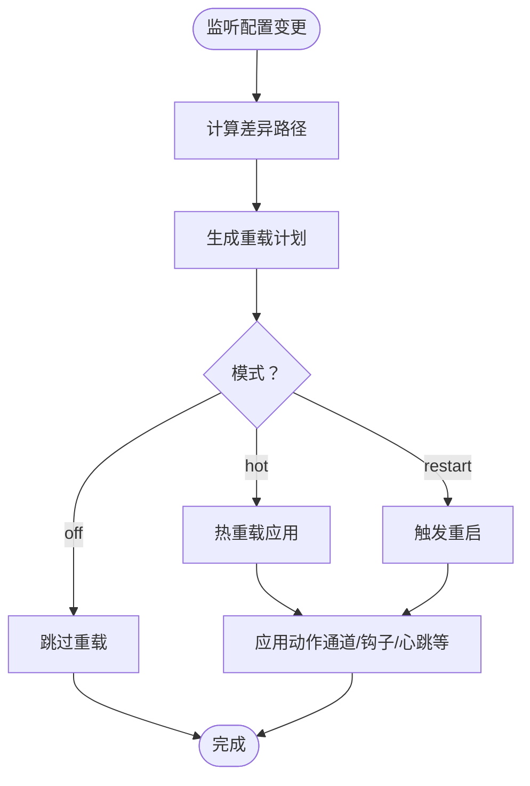
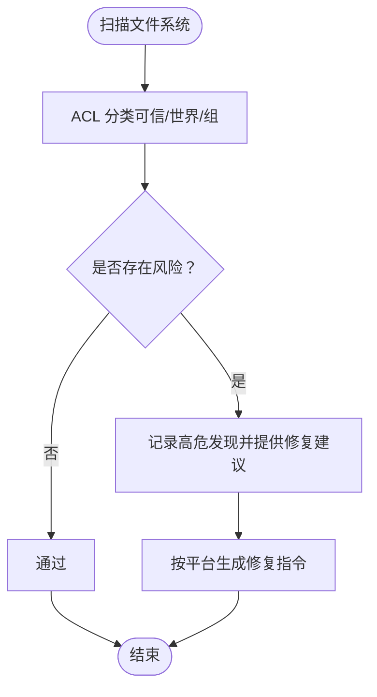
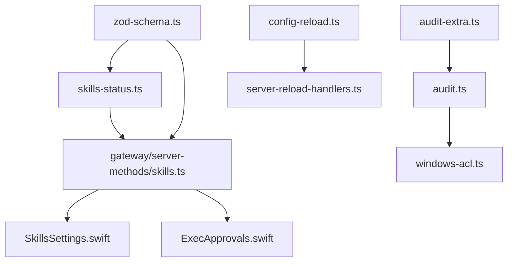

# 技能配置管理

## 目录
1. [简介](#简介)
2. [项目结构](#项目结构)
3. [核心组件](#核心组件)
4. [架构总览](#架构总览)
5. [详细组件分析](#详细组件分析)
6. [依赖关系分析](#依赖关系分析)
7. [性能考量](#性能考量)
8. [故障排查指南](#故障排查指南)
9. [结论](#结论)
10. [附录](#附录)

## 简介
本文件系统化阐述 OpenClaw 的“技能配置管理”能力，覆盖数据模型、验证规则、默认值机制、层次结构（全局/代理/工作空间）、启用/禁用控制、优先级与冲突处理、热重载与一致性、安全与权限校验、配置迁移与回滚、以及最佳实践与运维建议。目标是帮助开发者与运维人员在不深入源码的情况下，也能高效地设计、部署与维护技能配置。

## 项目结构
围绕“技能配置”的关键代码分布在以下模块：
- 配置模式与校验：src/config/zod-schema.ts 及其子模式文件
- 技能状态与安装：src/agents/skills-status.ts、src/gateway/server-methods/skills.ts
- 热重载与变更传播：src/gateway/config-reload.ts、src/gateway/server-reload-handlers.ts
- 安全审计与权限：src/security/audit.ts、src/security/windows-acl.ts、src/security/audit-extra.ts
- 跨平台 UI 与缓存：apps/macos/Sources/OpenClaw/ExecApprovals.swift、apps/macos/Sources/OpenClaw/.../SkillsSettings.swift
- 技能命令解析与去重：src/auto-reply/skill-commands.ts、src/auto-reply/skill-commands.test.ts
- 技能模板与规范：skills/skill-creator/SKILL.md、skills/skill-creator/scripts/init_skill.py

## 核心组件
- 配置模式与校验
  - 全局 skills 配置通过 Zod 模式定义，支持 entries 记录、加载与安装偏好等字段，并对未知顶层字段进行拒绝。
  - 单元测试覆盖了 entries 中允许自定义 config 字段、拒绝未知顶级字段的行为。
- 技能状态与安装
  - 构建技能状态报告，包含缺失依赖（二进制、环境变量、配置路径、操作系统）、可选安装选项、是否可用等。
  - 网关提供 `skills.status`、`skills.bins`、`skills.install`、`skills.update` 等 RPC 接口，支持动态更新技能配置并写回配置文件。
- 热重载与一致性
  - 基于变更路径匹配规则，区分“热重载”“重启通道”“无操作”等动作；支持防抖、并发保护与失败兜底。
- 安全与权限
  - 文件系统权限审计（含 Windows ACL 分类），识别可读/可写风险并给出修复建议；支持状态目录深度扫描。
- 跨平台 UI 与缓存
  - MacOS 设置界面展示技能状态与安装建议；二进制缓存定期刷新以减少重复查询。

## 架构总览
下图展示了从配置到运行时、再到 UI 与安全审计的整体流程。

## 详细组件分析

### 数据结构与验证规则
- 全局 skills 配置结构
  - 支持 entries 记录，键为技能标识，值包含 enabled、apiKey、env、config 等字段。
  - 支持 load/install 等加载与安装偏好配置。
- 验证规则
  - 仅允许在指定字段内定义，未知顶级字段会被拒绝。
  - config 下可自由添加键值，用于技能私有配置。
- 默认值机制
  - Zod 模式中多数字段为可选，未显式设置时按模式默认行为处理（如布尔字段未提供则为 undefined）。

### 层次结构：全局、代理、工作空间
- 全局配置
  - 位于根级 skills 段，影响所有代理与工作空间。
- 代理特定配置
  - 通过 agents 列表与工作空间目录关联；技能状态构建会基于当前代理的工作空间加载技能条目。
- 工作空间配置
  - 报告由当前代理的工作空间决定；不同代理可能指向不同工作空间，从而呈现不同的技能集合与状态。

### 启用/禁用控制、优先级与冲突解决
- 启用/禁用
  - 通过 entries 中的 enabled 字段控制；disabled 且总是 always 的技能仍会显示但不可用。
- 优先级与安装选择
  - 在多安装规格时，优先考虑用户偏好（如 brew 优先、包管理器选择等），否则按可用性与顺序选择。
- 冲突解决
  - 当 requiredBins 与 anyBins 同时存在时，只要满足任一 anyBins 或全部 requiredBins 即视为满足。
  - 缺失项汇总后决定 eligible 状态，避免重复提示。

### 技能命令解析与去重
- 命令解析
  - 将多个代理的工作空间合并，收集技能命令规范，统一去重与规范化命名。
- 去重策略
  - 使用保留命令名集合与标准化查找逻辑，避免同名命令重复注册。

### 热重载机制、变更传播与一致性
- 变更检测
  - 对比当前配置与新快照差异路径，生成重载计划。
- 动作分派
  - 基于前缀规则匹配“热重载/重启通道/无操作”，并执行相应动作。
- 一致性保障
  - 防抖、并发保护、失败日志记录；必要时触发重启或仅热更新。
- 传播路径
  - 配置变更经由热重载引擎传递至各子系统（心跳、通道、钩子等）。

### 安全检查、权限验证与访问控制
- 文件系统权限
  - 审计配置文件与包含文件的可读/可写权限，Windows 平台使用 ACL 分类（可信/世界/组）。
- 敏感信息保护
  - 日志脱敏策略与敏感模式开关，避免泄露密钥与令牌。
- 访问控制
  - 命令授权与访问组策略，支持“启用访问组时必须配置授权器”的强制策略。

### 配置文件编写指南、语法参考与示例模板
- 语法要点
  - `skills.entries` 为键值对，键为技能标识；值包含 enabled、apiKey、env、config 等字段。
  - config 下可自由扩展键值，用于技能私有配置。
  - 未知顶级字段将被拒绝。
- 示例模板
  - 可参考技能创建器提供的模板与脚本，组织 SKILL.md、scripts、references、assets 等资源。

### 配置迁移、版本兼容性与回滚策略
- 迁移与兼容
  - 通过 Zod 模式严格约束字段类型与结构，未知字段拒绝，有助于向后兼容与演进。
- 回滚策略
  - 热重载失败时记录错误并跳过；在“restart”模式下触发重启，确保一致性。

### 最佳实践与运维建议
- 配置管理
  - 使用最小必要字段；将敏感信息放入 env 或 apiKey；避免在 config 中硬编码密钥。
- 安全加固
  - 限制配置文件权限；Windows 平台使用 ACL 信任主体；定期运行安全审计。
- 性能优化
  - 合理设置热重载防抖；避免频繁变更；利用二进制缓存减少重复查询。
- 运维监控
  - 关注技能状态报告中的缺失项；及时安装依赖；通过网关 RPC 更新配置并验证生效。

## 依赖关系分析
- 组件耦合
  - 配置模式与运行时紧密耦合：Zod 模式决定 entries 结构，运行时据此解析与校验。
  - 网关 RPC 依赖配置加载与写入，同时驱动 UI 与缓存刷新。
- 外部依赖
  - 平台二进制检测、远程能力探测、文件系统权限检查等。

## 性能考量
- 热重载防抖与并发控制
  - 通过防抖与运行状态标记避免重复触发与竞态。
- 二进制缓存
  - MacOS 端定期刷新技能所需二进制集合，降低重复查询成本。
- 命令解析去重
  - 合并多代理工作空间，统一去重与标准化，减少冗余命令注册。

## 故障排查指南
- 配置校验失败
  - 检查是否包含未知顶级字段；确认 entries 结构与类型正确。
- 技能不可用
  - 查看缺失的二进制、环境变量、配置路径或操作系统；根据安装建议执行安装。
- 热重载无效
  - 检查重载模式与变更路径是否命中规则；查看日志中的“跳过/忽略”提示。
- 权限问题
  - Windows 平台检查 ACL 分类与修复建议；非 Windows 平台检查 POSIX 权限。

## 结论
OpenClaw 的技能配置管理以严格的 Zod 模式为基础，结合运行时状态构建、RPC 接口与热重载机制，实现了从“配置—状态—安装—传播—安全”的闭环。通过清晰的层次结构、完善的验证与默认值机制、以及跨平台 UI 与缓存优化，既保证了易用性，也兼顾了安全性与可运维性。建议在实践中遵循最小权限、最小暴露与持续审计的原则，配合热重载与自动化模板，实现稳定高效的技能配置生命周期管理。

## 附录
- 相关文件索引
  - 配置模式与校验：[zod-schema.ts](file://src/config/zod-schema.ts#L449-L484)
  - 技能状态与安装：[skills-status.ts](file://src/agents/skills-status.ts#L1-L302)、[skills.ts（网关）](file://src/gateway/server-methods/skills.ts#L1-L199)
  - 热重载与一致性：[config-reload.ts](file://src/gateway/config-reload.ts#L87-L362)、[server-reload-handlers.ts](file://src/gateway/server-reload-handlers.ts#L26-L141)
  - 安全与权限：[audit.ts](file://src/security/audit.ts#L194-L228)、[windows-acl.ts](file://src/security/windows-acl.ts#L51-L86)、[audit-extra.ts](file://src/security/audit-extra.ts#L823-L855)
  - 跨平台 UI 与缓存：[SkillsSettings.swift](file://apps/macos/Sources/OpenClaw/ExecApprovals.swift#L753-L790)
  - 技能命令解析：[skills.ts（自动回复）](file://src/auto-reply/skill-commands.ts#L38-L92)、[skills-commands.test.ts](file://src/auto-reply/skill-commands.test.ts#L1-L99)
  - 技能模板与规范：[SKILL.md（技能创建器）](file://skills/skill-creator/SKILL.md#L1-L317)、[init_skill.py](file://skills/skill-creator/scripts/init_skill.py#L43-L134)